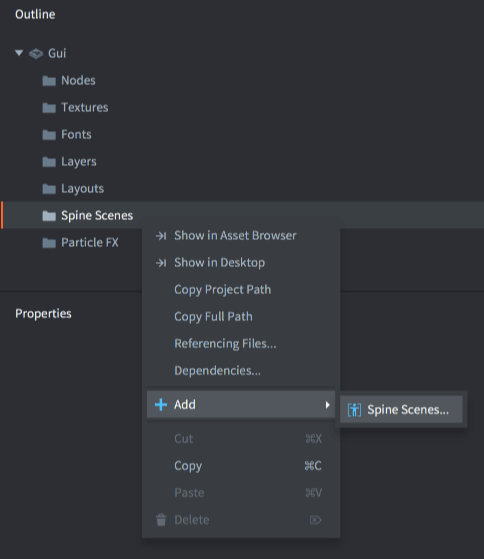
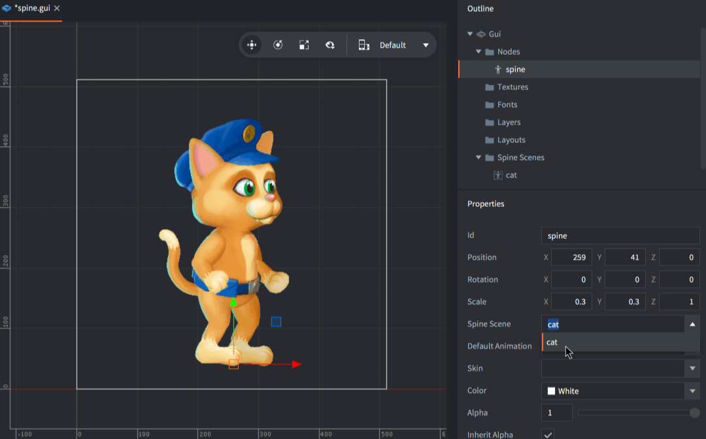
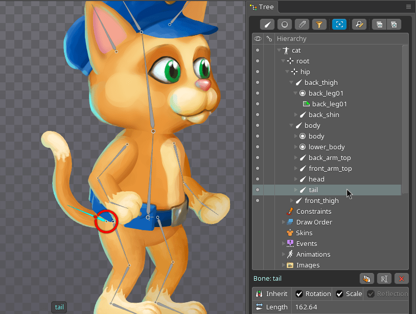

# GUI-нода Spine

Анимированные Spine-модели можно добавлять в качестве GUI-нод, а также в качестве компонентов игровых объектов. В этом руководстве объясняется, как использовать импортированные данные Spine-анимации в GUI-сценах.

## Создание ноды Spine

Во-первых, необходимо импортировать данные анимации и настроить ресурс Spine Scene.. О том, как это сделать, описано в [руководстве по Spine-анимации](/manuals/spine).

Во-вторых, содержимое ресурса Spine Scene должно быть доступно в GUI-сцене. Добавьте его, <kbd>кликнув ПКМ</kbd> в секции *Spine Scenes* сцены в *Outline* и выберите <kbd>Add ▸ Spine Scenes...</kbd>. Выберите Spine Scenes (одну или несколько), которые вы хотите использовать в сцене

{srcset="images/gui-spine/add@2x.png 2x"}

В-третьих, создайте ноду Spine, <kbd>кликнув ПКМ</kbd> на секции *Nodes* в *Outline* и выбрав <kbd>Add ▸ Spine</kbd>.

{srcset="images/gui-spine/new_node@2x.png 2x"}

Новая нода будет выделена автоматически. Убедитесь, что заданы ее свойства:

Spine Scene
: Spine Scene, которую следует использовать в качестве источника данных для данной ноды.

Spine Default Animation
: Анимация, которая автоматически начнет воспроизводиться при инициализации сцены.

Skin
: Скин, который будет использоваться для анимации при инициализации сцены.

## Управление анимацией в рантайме

Нодами Spine можно управлять в рантайме посредством скрипта. Чтобы запустить анимацию в ноде, достаточно вызвать функцию [`gui.play_spine_anim()`](/ref/gui/#gui.play_spine_anim:node-animation_id-playback-[play_properties]-[complete_function]):

```lua
local catnode = gui.get_node("cat_note")
local play_properties = { blend_time = 0.3, offset = 0, playback_rate = 1 }
gui.play_spine_anim(catnode, hash("run"), gui.PLAYBACK_ONCE_FORWARD, play_properties, function(self, node)
    print("Animation done!")
end)
```

Используйте один из следующих режимов воспроизведения анимации:

* gui.PLAYBACK_NONE
* gui.PLAYBACK_ONCE_FORWARD
* gui.PLAYBACK_ONCE_BACKWARD
* gui.PLAYBACK_ONCE_PINGPONG
* gui.PLAYBACK_LOOP_FORWARD
* gui.PLAYBACK_LOOP_BACKWARD
* gui.PLAYBACK_LOOP_PINGPONG

## Скелетная иерархия

Доступ к отдельным костям в скелете Spine можно получить в виде GUI-нод. Ноды именуются в соответствии с их именами в настройках Spine.

{srcset="images/gui-spine/bone@2x.png 2x"}

Например, чтобы присоединить другую ноду к существующей ноде кости, найдите ноду кости по имени с помощью [`gui.get_spine_bone()`](/ref/gui#gui.get_spine_bone) и присоедините к ней дочернюю ноду:

```lua
-- Attach a text node to the tail of the cat
local cat = gui.get_node("cat_node")
local textnode = gui.new_text_node(vmath.vector3(400, 0, 0), "Hello tail!")
local tail = gui.get_spine_bone(cat, "tail")
gui.set_parent(textnode, tail)
```

Кости также доступны через [`gui.get_node()`](/ref/gui#gui.get_node), по имени кости с префиксом имени ноды Spine и слэшем (`/`):

```lua
-- Прикрепить ноду Text к хвосту кошки
local textnode = gui.new_text_node(vmath.vector3(400, 0, 0), "Hello tail!")
local tail = gui.get_node("cat_node/tail")
gui.set_parent(textnode, tail)
```
