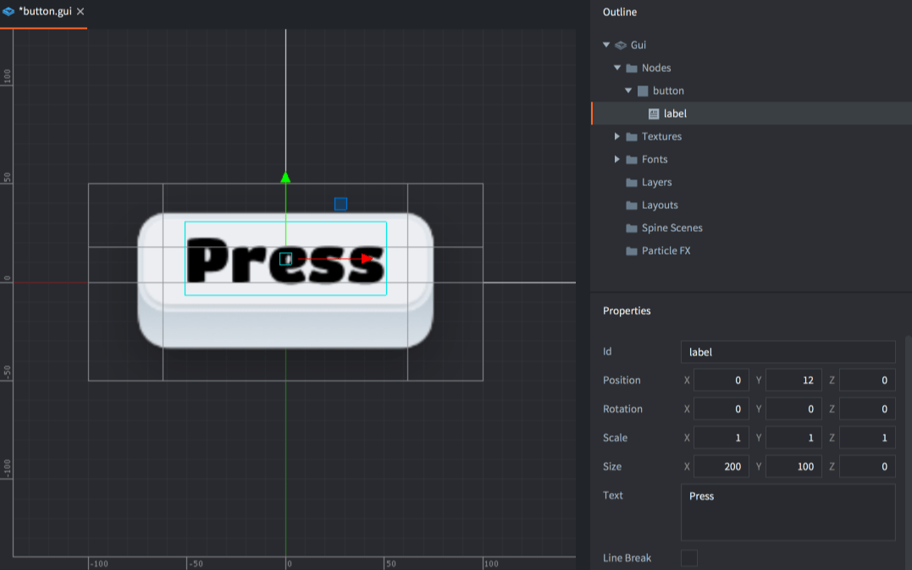
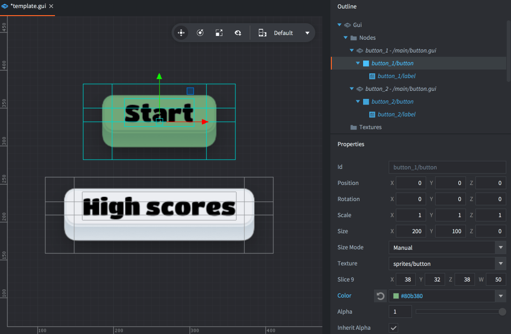
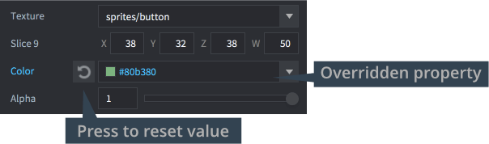
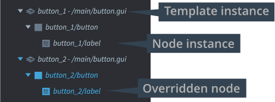

# GUI template nodes

GUI template nodes provide a powerful mechanism to create reusable GUI components based on shared templates or "prefabs". This manual explains the feature and how to use it.

A GUI template is a GUI scene that is instanciated, node for node, in another GUI scene. Any property values in the original template nodes can then be overridden.

## Creating a template

A GUI template is a plain GUI scene so it is created just like any other GUI scene. <kbd>Right click</kbd> a location in the *Assets* pane and select <kbd>New... ▸ Gui</kbd>.

{srcset="images/gui-templates/create@2x.png 2x"}

Create the template and save it. Note that the nodes of the instance will be placed relative to origin so it is a good idea to create the template at position 0, 0, 0.

## Creating instances from a template

You can create any number of instances based on the instance. Create or open the GUI scene where you want to place the template, then <kbd>right click</kbd> the *Nodes* section in the *Outline* and select <kbd>Add ▸ Template</kbd>.

{srcset="images/gui-templates/create_instance@2x.png 2x"}

Set the *Template* property to the template GUI scene file.

You can add any number of template instances, and for each instance you can override the properties of each node and change instance node's position, coloring, size, texture and so forth.

{srcset="images/gui-templates/instances@2x.png 2x"}

Any property that you change is marked blue in the editor. Press the reset button by the property to set its value to the template value:

{srcset="images/gui-templates/properties@2x.png 2x"}

Any node that has overridden properties is also colored blue in the *Outline*:

{srcset="images/gui-templates/outline@2x.png 2x"}

The template instance is listed as a collapsible entry in the *Outline* view. However, it is important to note that this item in the outline *is not a node*. The template instance does not exist in runtime either, but all nodes that are part of the instance does.

Nodes that are part of a template instance are automatically named with a prefix and a slash (`"/"`) attached to their *Id*. The prefix is the *Id* set in the template instance.

::: important
Overriding template instance node values in *Layouts* is currently not working in Editor 2. If you need to use layouts in conjunction with templates, please use Editor 1 until the issue is resolved.

See https://github.com/defold/editor2-issues/issues/1124
:::

## Modifying templates in runtime

Scripts that manipulate or query nodes added through the templating mechanism only need to consider the naming of instance nodes and include the template instance *Id* as a node name prefix:

```lua
if gui.pick_node(gui.get_node("button_1/button"), x, y) then
    -- Do something...
end
```

There is no node corresponding to the template instance itself. If you need a root node for an instance, add it to the template.

If a script is associated with a template GUI scene, the script is not part of the instance node tree. You may attach one single script to each GUI scene so your script logic needs to sit on the GUI scene where you have instanciated your templates.
