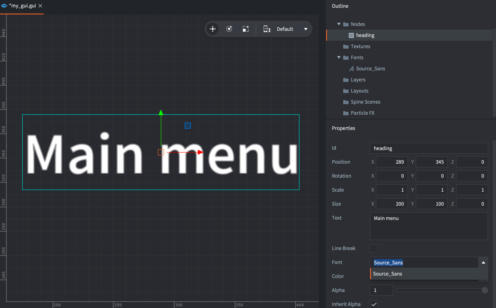
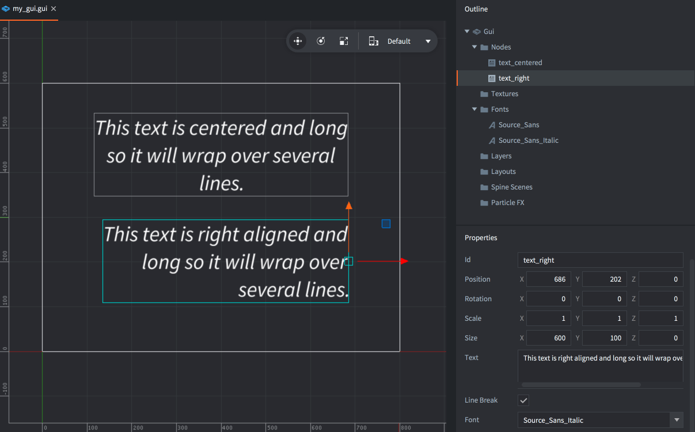

# GUI text nodes

Defold supports a specific type of GUI node that allows text to be rendered in a GUI scene. Any font resource added to a project can be used for text node rendering.

## Adding text nodes

The fonts that you wish to use in GUI text nodes must be added to the GUI component. Either right-click the *Fonts* folder, use the <kbd>GUI</kbd> top menu or press the corresponding keyboard shortcut.

{srcset="images/gui-text/fonts@2x.png 2x"}

Text nodes have a set of special properties:

*Font*
: Any text node you create must have the *Font* property set.

*Text*
: This property contains the text displayed.

*Line Break*
: Text alignment follows the pivot setting and setting this property allows the text to flow over several lines. The width of the node determines where the text will wrap.

## Alignment

By setting the node pivot you can change the alignment mode for the text.

*Center*
: If the pivot is set to `Center`, `North` or `South`, the text is center-aligned.

*Left*
: If the pivot is set to any of the `West` modes, the text is left-aligned.

*Right*
: If the pivot is set to any of the `East` modes, the text is right-aligned.

{srcset="images/gui-text/align@2x.png 2x"}

## Modifying text nodes in runtime

Text nodes respond to any generic node manipulation functions for setting size, pivot, color and so forth. A few text node only functions exist:

* To change the font of a text node, use the [`gui.set_font()`](/ref/gui/#gui.set_font) function.
* To change the line break behavior of a text node, use the [`gui.set_line_break()`](/ref/gui/#gui.set_line_break) function.
* To change the content of a text node, use the [`gui.set_text()`](/ref/gui/#gui.set_text) function.

```lua
function on_message(self, message_id, message, sender)
    if message_id == hash("set_score") then
        local s = gui.get_node("score")
        gui.set_text(s, message.score)
    end
end
```

