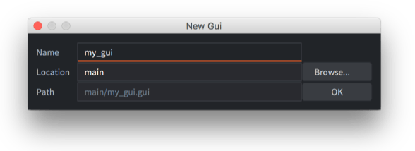
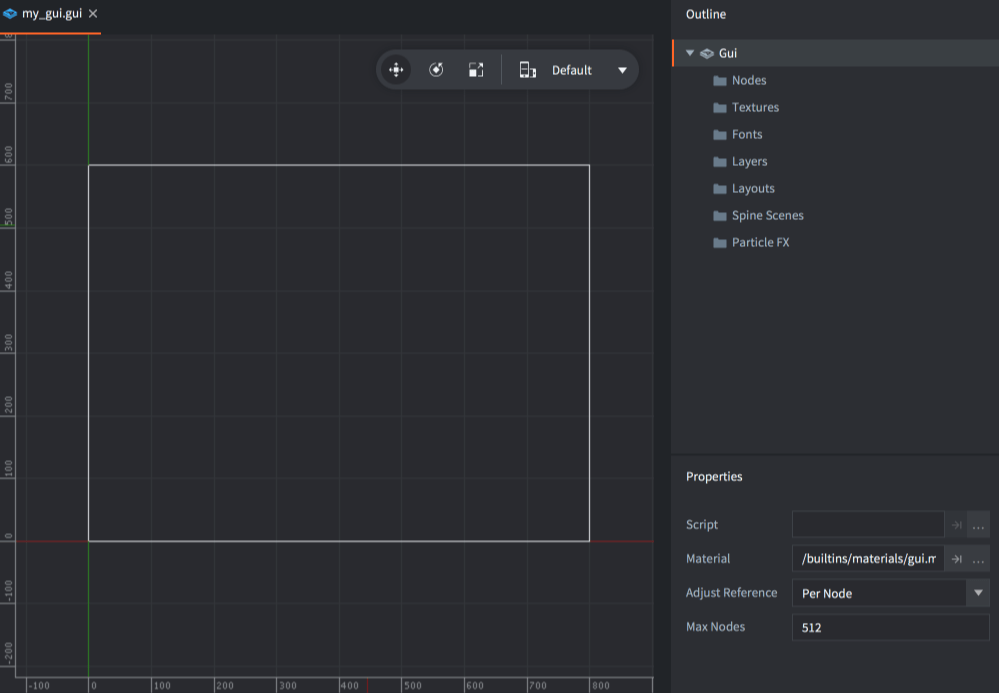
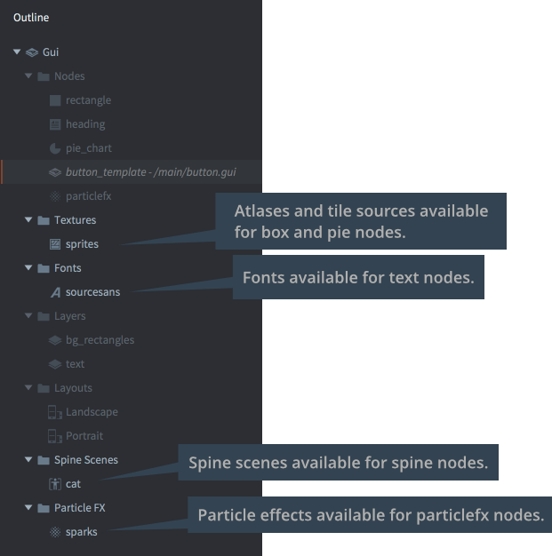
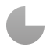
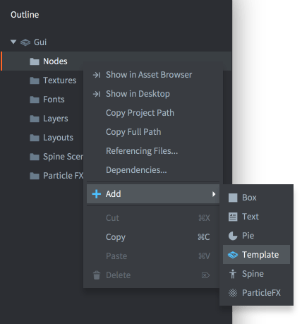
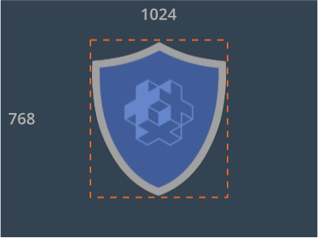
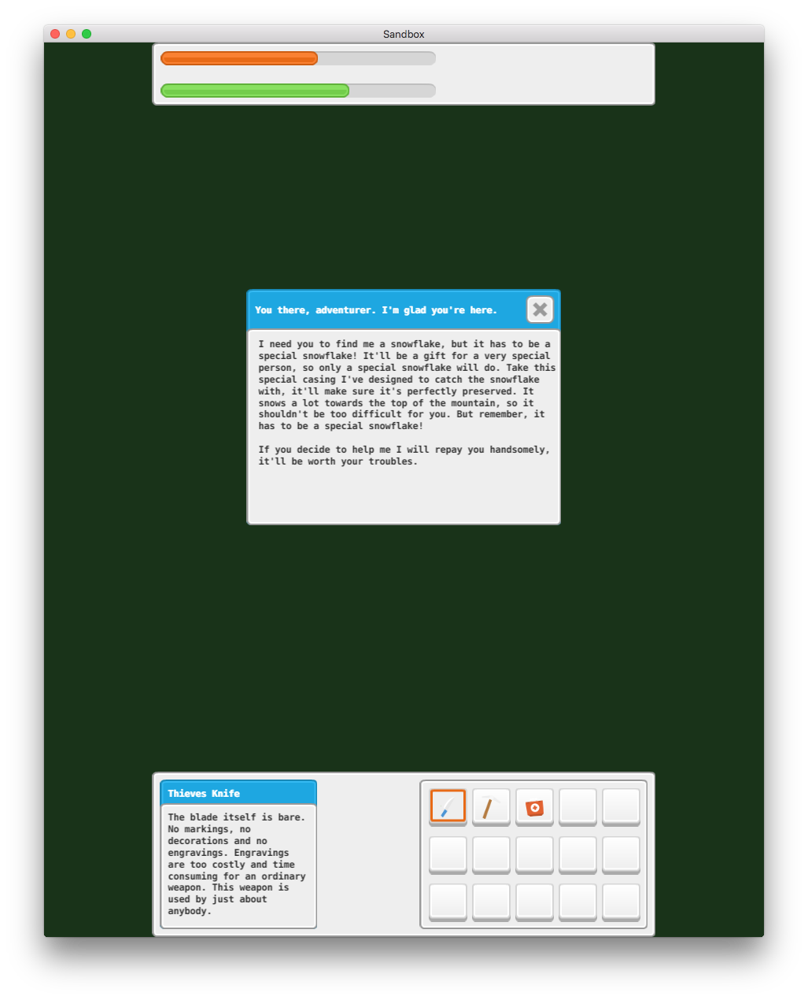
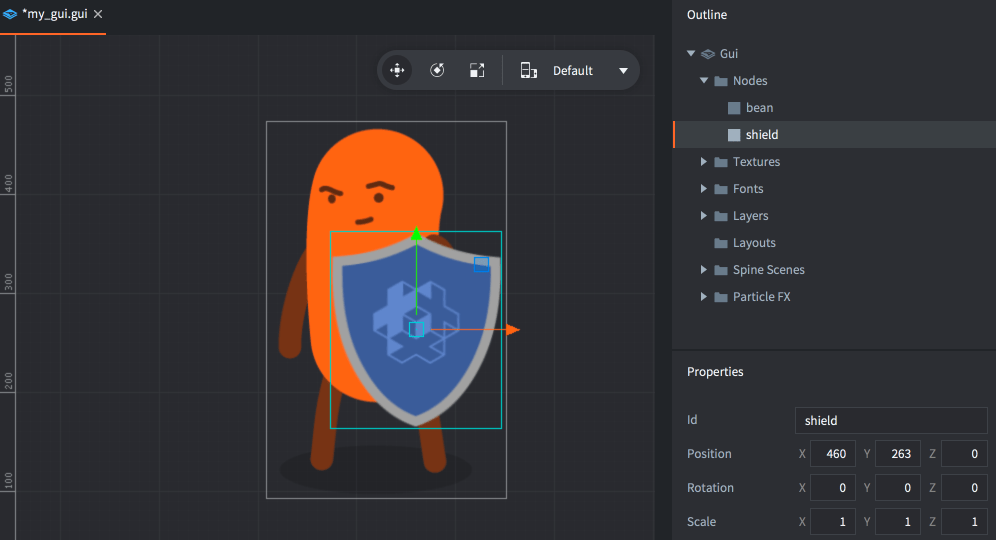
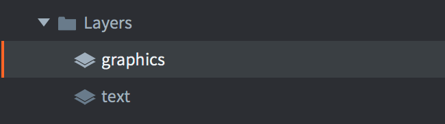

# Разработка GUI

Defold предоставляет пользовательский Gui-редактор и эффективные средства написания скриптов, которые разработаны специально для создания и реализации пользовательских интерфейсов.

В Defold GUI, или графический интерфейс пользователя --- это компонент, прикрепляемый к игровому объекту и помещаемый в коллекцию. Этому компоненту присущи следующие черты:

* Обладает простыми, но мощными средствами компоновки, которые позволяют создавать пользовательский интерфейс независимо от разрешения и соотношения сторон.
* К нему может быть привязано логическое поведение через *GUI-скрипт*.
* По умолчанию отображается поверх прочего контента, независимо от вида камеры, поэтому даже если камера движется, элементы графического интерфейса останутся на экране. Поведение рендеринга может быть подвергнуто изменениям.

Компоненты GUI рендерятся независимо от игрового представления. Поэтому они не размещаются в определенном месте и не имеют визуального представления в редакторе коллекции. Однако компоненты Gui должны находиться в игровом объекте, который имеет местоположение в коллекции. Изменение этого расположения не влияет на GUI.

## Создание компонента GUI

Компоненты GUI создаются из файла-шаблона GUI-сцены. Чтобы создать новый компонент GUI, <kbd>кликните ПКМ</kbd> в каком-либо расположении в браузере *Assets* и выберите <kbd>New ▸ Gui</kbd>. Введите имя нового файла GUI и кликните <kbd>Ok</kbd>.



Defold автоматически откроет файл в редакторе GUI-сцен.



В *Outline* перечисляется весь контент графического интерфейса: список нод и какие-либо зависимости (см. ниже).

В центральной области редактирования отображается GUI. Панель инструментов в правом верхнем углу области редактирования содержит инструменты *Move*, *Rotate* и *Scale*, а также селектор [компоновок](/manuals/gui-layouts).


Белый прямоугольник показывает границы текущей выбранной компоновки, ширину и высоту дисплея по умолчанию, установленные в настройках проекта.

## Gui свойства

Выделив корневую GUI-ноду, в *Outline* отображаются *свойства* компонента GUI:

Script
: GUI-скрипт, привязанный к данному компоненту GUI.

Material
: Материал, используемый при рендеринге этого GUI.

Adjust Reference
: Управляет способом вычисления *режима адаптации* каждой ноды:

  - `Per Node` --- подгоняет каждую ноду под измененный размер родительской ноды или измененный размер экрана.
  - `Disable` --- отключает режим адаптации нод. Заставляет все ноды сохранять заданный размер.

Current Nodes
: Текущее количество используемых нод в данном GUI.

Max Nodes
: Максимальное количество нод для данного GUI.

Max Dynamic Textures
: Максимальное количество текстур, которые можно создать с помощью [`gui.new_texture()`](/ref/stable/gui/#gui.new_texture:texture_id-width-height-type-buffer-flip)


## Работа со свойствами GUI во время выполнения

Вы можете изменять свойства GUI во время выполнения из компонента скрипта с помощью `go.get()` и `go.set()`:

Шрифты
: Получение или установка шрифта, используемого в GUI.


```lua
go.property("mybigfont", resource.font("/assets/mybig.font"))

function init(self)
  -- получаем шрифт, назначенный идентификатору 'default'
  print(go.get("#gui", "fonts", { key = "default" })) -- /builtins/fonts/default.font

  -- устанавливаем шрифт 'default' в ресурс, указанный в 'mybigfont'
  go.set("#gui", "fonts", self.mybigfont, { key = "default" })

  -- получаем новый шрифт, назначенный идентификатору 'default'
  print(go.get("#gui", "fonts", { key = "default" })) -- /assets/mybig.font
end
```

Материалы
: Получение или установка материала, используемого в GUI.


```lua
go.property("myeffect", resource.material("/assets/myeffect.material"))

function init(self)
  -- получаем материал, назначенный идентификатору 'effect'
  print(go.get("#gui", "materials", { key = "effect" })) -- /effect.material

  -- устанавливаем материал 'effect' в ресурс, указанный в 'myeffect'
  go.set("#gui", "materials", self.myeffect, { key = "effect" })

  -- получаем новый материал, назначенный идентификатору 'effect'
  print(go.get("#gui", "materials", { key = "effect" })) -- /assets/myeffect.material
end
```

Текстуры
: Получение или установка текстуры (атласа), используемой в GUI.


```lua
go.property("mytheme", resource.atlas("/assets/mytheme.atlas"))

function init(self)
  -- получаем текстуру, назначенную идентификатору 'theme'
  print(go.get("#gui", "textures", { key = "theme" })) -- /theme.atlas

  -- устанавливаем текстуру 'theme' в ресурс, указанный в 'mytheme'
  go.set("#gui", "textures", self.mytheme, { key = "theme" })

  -- получаем новую текстуру, назначенную идентификатору 'theme'
  print(go.get("#gui", "textures", { key = "theme" })) -- /assets/mytheme.atlas
end
```

## Зависимости

Дерево ресурсов в игре Defold статично, поэтому все зависимости, необходимые для GUI-нод, должны быть добавлены к компоненту. В *Outline* все зависимости группируются по типам в "папках":



Чтобы добавить новую зависимость, перетащите её из панели Assets в окно редактора.

Или же, чтобы добавить новую зависимость, <kbd>кликните ПКМ</kbd> в корне "GUI" в *Outline*, затем выберите <kbd>Add ▸ [type]</kbd> из всплывающего контекстного меню.

Также можно <kbd>кликнуть ПКМ</kbd> на иконке папки для типа, который требуется добавить, и выбрать <kbd>Add ▸ [type]</kbd>.

## Типы нод

Компонент GUI формируется из набора нод. Ноды --- это простые элементы. Они могут быть трансформированы (перемещены, масштабированы и повернуты) и упорядочены в иерархии "родительский-дочерний" либо в редакторе, либо во время выполнения с помощью скриптов. Существуют следующие типы нод:

Box
: {.left}
  Прямоугольная нода с одним цветом, текстурой или мультикадровой анимацией. См. [руководство по ноде Box](/manuals/gui-box).

<div style="clear: both;"></div>

Text
: {.left}
  Отображает тескт. См. [руководство по ноде Text](/manuals/gui-text).

<div style="clear: both;"></div>

Pie
: {.left}
  Круговая или эллипсоидная нода, которая может быть частично заполнена или инвертирована. См. [руководство по ноде Pie](/manuals/gui-pie).

<div style="clear: both;"></div>

Template
: {.left}
  Шаблоны используются для создания экземпляров на основе других файлов GUI-сцен. См. [руководство по ноде Template](/manuals/gui-template).

<div style="clear: both;"></div>

Particle FX
: {.left}
  Воспроизводит эффект частиц. См. [руководство по ноде Particle FX](/manuals/gui-particlefx).

<div style="clear: both;"></div>

Добавьте ноды, кликнув правой кнопкой мыши на папке *Nodes* и выбрав <kbd>Add ▸</kbd>, затем <kbd>Box</kbd>, <kbd>Text</kbd>, <kbd>Pie</kbd>, <kbd>Template</kbd>, <kbd>Spine</kbd> или <kbd>Particle Fx</kbd>.



Также можно нажать <kbd>A</kbd> и выбрать тип для добавления в GUI.

## Свойства нод

Каждая нода имеет богатый набор свойств, которые отвечают за ее внешний вид:

Id
: Идентификатор ноды. Это имя должно быть уникальным в рамках GUI-сцены.

Position, Rotation и Scale
: Задают расположение, ориентацию и растяжение ноды. Для изменения этих значений можно использовать инструменты *Move*, *Rotate* и *Scale*. Значения можно анимировать из скрипта ([подробнее](/manuals/property-animation)).

Size (ноды Box, Text и Pie)
: По умолчанию размер ноды задается автоматически, но, установив для параметра *Size Mode* значение `Manual`, это значение можно изменять. Размер определяет границы ноды и используется при выполнении ввода. Это значение можно анимировать из скрипта ([подробнее](/manuals/property-animation)).

Size Mode (ноды Box и Pie)
: Если установлено значение `Automatic`, редактор сам устанавливает размер узла. Если установлено значение `Manual`, размер можно задавать самостоятельно.

Enabled
: Если флажок снят, нода не отображается, не анимируется и не может быть выбрана с помощью `gui.pick_node()`. Используйте `gui.set_enabled()` и `gui.is_enabled()` для программного управления этим свойством.

Visible
: Если флажок снят, нода не отображается, но всё ещё может быть анимирована и выбрана с помощью `gui.pick_node()`. Используйте `gui.set_visible()` и `gui.get_visible()` для программного управления этим свойством.

Text (нода Text)
: Текст, отображаемый в ноде.

Line Break (нода Text)
: Устанавливается для переноса текста в соответствии с шириной ноды.

Font (нода Text)
: Шрифт, используемый при рендеринге текста.

Texture (ноды Box и Pie)
: Текстура для отрисовки в ноде. Это ссылка на изображение или анимацию в атласе или тайловом источнике.

Material (ноды Box, Pie, Text и Particle FX)
: Материал, используемый при отрисовке ноды. Можно выбрать материал, добавленный в раздел *Materials* в Outline, либо оставить поле пустым, чтобы использовать материал по умолчанию, назначенный GUI-компоненту.

Slice 9 (нода Box)
: Устанавливается для сохранения размера пикселей текстуры ноды по краям при изменении размера ноды. За подробностями обращайтесь к [руководству по ноде Box](/manuals/gui-box).

Inner Radius (нода Pie)
: Внутренний радиус ноды, выраженный вдоль оси X. За подробностями обращайтесь к [руководству по ноде Pie](/manuals/gui-pie).

Outer Bounds (нода Pie)
: Управляет поведением внешних границ. За подробностями обращайтесь к [руководству по ноде Pie](/manuals/gui-pie).

Perimeter Vertices (нода Pie)
: Количество сегментов, используемых для построения фигуры. За подробностями обращайтесь к [руководству по ноде Pie](/manuals/gui-pie).

Pie Fill Angle (нода Pie)
: Заполнение окружности. За подробностями обращайтесь к [руководству по ноде Pie](/manuals/gui-pie).

Template (нода Template)
: Файл GUIсцены, используемый в качестве шаблона для ноды. За подробностями обращайтесь к [руководству по ноде Template](/manuals/gui-template).

ParticleFX (нода Particle FX)
: Эффект частиц, который будет использоваться в данной ноде. За подробностями обращайтесь к [руководству по ноде Particle FX](/manuals/gui-particlefx).

Color
: Цвет ноды. Если нода текстурирована, цвет оттеняет текстуру. Цвет можно анимировать из скрипта ([подробнее](/manuals/property-animation)).

Alpha
: Полупрозрачность ноды. Значение Alpha можно анимировать из скрипта ([подробнее](/manuals/property-animation)).

Inherit Alpha
: Если установить эту опцию, нода унаследует значение alpha родительской ноды. Затем значение alpha ноды умножается на значение alpha родительской ноды.

Leading (нода Text)
: Значение масштабирования для межстрочного интервала. Значение `0` не оставляет межстрочного интервала. `1` (по умолчанию) --- обычный межстрочный интервал.

Tracking (нода Text)
: Значение масштабирования для интервала между символами. По умолчанию 0.

Layer
: Назначение ноде слоя отменяет обычный порядок отрисовки и вместо этого действует порядок слоев. Подробности ниже.

Blend Mode
: Отвечает за смешивание графики ноды с фоновой графикой:
  - `Alpha` --- смешивает пиксельные значения ноды с фоном. Соответствует режиму наложения "Normal" в графических программах.
  - `Add` --- добавляет пиксельные значения ноды к фону. Соответствует "Linear dodge" в некоторых графических программах.
  - `Multiply` --- перемножает значения пикселей ноды с фоном.
  - `Screen` --- инвертированное перемножение пикселей ноды с фоном. Соответствует режиму наложения "Screen" в графических программах.

Pivot
: Устанавливает пивот ноды. Это можно рассматривать как "центральную точку" ноды. Любое вращение, масштабирование или изменение размера будет происходить вокруг этой точки.

  Возможные значения: `Center`, `North`, `South`, `East`, `West`, `North West`, `North East`, `South West` и `South East`.

  

  Если изменить пивот ноды, нода будет перемещена так, чтобы новый пивот находился в позиции ноды. Нода Text выравнивается таким образом, что `Center` устанавливает выравнивание текста по центру, `West` --- по левому краю, а `East` --- по правому.

X Anchor, Y Anchor
: Анкеровка контролирует изменение вертикального и горизонтального положения ноды, когда границы сцены или границы родительской ноды растягиваются, чтобы соответствовать физическому размеру экрана.

  

  Доступны следующие режимы анкеровки:

  - `None` --- (для обоих *X Anchor* и *Y Anchor*) сохраняет положение ноды от центра родительской ноды или сцены, относительно ее *скорректированного* размера.
  - `Left` или `Right` --- (*X Anchor*) масштабирует горизонтальное положение ноды так, чтобы сохранить положение от левого и правого краев родительской ноды или сцены в одинаковом процентном соотношении.
  - `Top` or `Bottom` (*Y Anchor*) --- (*Y Anchor*) масштабирует вертикальное положение ноды так, чтобы сохранить положение от верхнего и нижнего краев родительской ноды или сцены в одинаковом процентном соотношении.

  

Adjust Mode
: Задает режим корректировки для ноды. Режим корректировки управляет поведением ноды, когда границы сцены или границы родительской ноды подгоняются под физический размер экрана.

  Нода, созданная в сцене, где логическим разрешением является типичное разрешение ландшафта:

  

  При подгонке сцены к портретному экрану сцена растягивается. Аналогично растягивается ограничивающая рамка каждой ноды. Однако, установив режим корректировки, можно сохранить соотношение сторон содержимого ноды. Доступны следующие режимы:

  - `Fit` --- масштабирует содержимое ноды так, чтобы оно было равно ширине или высоте растянутой границы, в зависимости от того, что меньше. Другими словами, содержимое будет помещаться внутри растянутой границы ноды.
  - `Zoom` --- масштабирует содержимое ноды так, чтобы оно было равно ширине или высоте растянутой границы, в зависимости от того, что больше. Другими словами, содержимое будет полностью покрывать растянутую границу ноды.
  - `Stretch` --- растягивает содержимое ноды так, чтобы оно заполняло растягиваемую границу ноды.

  

  Если свойство GUI-сцены *Adjust Reference* установлено в `Disabled`, эта настройка будет проигнорирована.

Clipping Mode (ноды Box и Pie)
: Устанавливает режим обрезки для ноды:

  - `None` --- отображает ноду как обычно.
  - `Stencil` --- заставляет границы ноды определять трафаретную маску, которая используется для обрезки дочерних нод данной ноды.

  За подробностями обращайтесь к [руководству по обрезке GUI](/manuals/gui-clipping).

Clipping Visible (ноды Box, Pie и Spine)
: Устанавливается для визуализации содержимого ноды в области трафарета. За подробностями обращайтесь к [руководству по обрезке GUI](/manuals/gui-clipping).

Clipping Inverted (ноды Box, Pie и Spine)
: Инвертирует трафаретную маску. За подробностями обращайтесь к [руководству по обрезке GUI](/manuals/gui-clipping).


## Пивот, якоря и режим корректировки

Комбинация свойств Pivot, Anchors и Adjust Mode позволяет весьма гибко конструировать графические интерфейсы, но понять, как все это работает, без конкретного примера бывает затруднительно. В качестве примера рассмотрим макет графического интерфейса, созданный для экрана 640x1136:


UI создан с X и Y Anchors, установленными на None, а Adjust Mode для каждой ноды оставлен на значении по умолчанию Fit. Пивот для верхней панели --- North, для нижней панели --- South, а для баров на верхней панели пивот установлен в значение West. Для остальных нод пивоты установлены в Center. Если мы изменим размер окна, чтобы сделать его шире, вот что произойдет:



Теперь, что если мы хотим, чтобы верхний и нижний бары всегда были такой же ширины, как экран? Мы можем изменить режим Adjust Mode для панелей с серым фоном сверху и снизу на Stretch:


Так лучше. Теперь панели с серым фоном всегда будут растягиваться по ширине окна, но бары в верхней панели, а также два бокса внизу расположены неправильно. Если мы хотим, чтобы бары в верхней части были расположены слева, нам нужно изменить X Anchor с None на Left:


Это именно то, что нам нужно для верхней панели. У баров на верхней панели Pivot уже установлены на West, что означает, что они будут позиционироваться так, чтобы левый/западный край баров (Pivot) был привязан к левому краю родительской панели (X Anchor).

Теперь, если мы установим X Anchor в Left для бокса слева и X Anchor в Right для бокса справа, получим следующий результат:


Это не совсем ожидаемый результат. Два бокса должны находиться так же близко к левому и правому краю, как два бара на верхней панели. Причина этого в том, что пивот выбран неверно:


У обоих боксов пивот установлен в Center. Это означает, что при увеличении ширины экрана центральная точка (пивот) боксов будет оставаться на одинаковом относительном расстоянии от краев. В случае левого поля она находилась на расстоянии 17% от левого края при исходном окне 640x1136:


При изменении размеров экрана центральная точка левого бокса остается на том же расстоянии 17% от левого края:


Если мы изменим Pivot с Center на West для бокса слева и на East для бокса справа и изменим положение боксов, мы получим желаемый результат даже при изменении размера экрана:


## Порядок отрисовки

Все ноды отображаются в том порядке, в котором они перечислены в папке "Nodes". Нода, находящаяся в верхней части списка, отрисовывается первой и, таким образом, будет отображаться позади всех остальных нод. Последняя нода в списке отрисовывается последней, то есть она будет отображаться перед всеми остальными нодами. Изменение Z-значения ноды не влияет на порядок отрисовки; однако, если установить Z-значение за пределами диапазона отрисовки рендер-скрипта, нода не будет отрисована на экране. Индексное упорядочивание нод можно изменить с помощью слоев (см. ниже).



Выделите ноду и нажмите <kbd>Alt + Up/Down</kbd>, чтобы переместить ноду вверх или вниз и изменить индексный порядок.

Порядок отрисовки может быть изменен в скрипте:

```lua
local bean_node = gui.get_node("bean")
local shield_node = gui.get_node("shield")

if gui.get_index(shield_node) < gui.get_index(bean_node) then
  gui.move_above(shield_node, bean_node)
end
```

## Иерархии "родительский-дочерний"

Нода становится дочерней по отношению к другой ноде путем перетаскивания ее на ноду, которая должна стать родительской. Нода с родителем наследует трансформации (положение, поворот и масштаб), примененные к родителю относительно родительского пивота.


Родительские ноды отрисовываются раньше дочерних. Используйте слои, чтобы изменить порядок отрисовки родительских и дочерних нод и оптимизировать рендеринг нод (см. ниже).


## Слои и вызовы отрисовки

Слои обеспечивают тонкий контроль над тем, как отрисовываются ноды, и могут быть использованы для уменьшения количества вызовов отрисовки, которые движок должен создать для отрисовки GUI-сцены. Когда движок собирается отрисовывать ноды GUI-сцены, он группирует их в пакеты вызовов отрисовки, руководствуясь следующими условиями:

- Ноды должны быть одного и того же типа.
- Узлы должны использовать один и тот же Atlas или Tile Source.
- Ноды должны рендериться с одинаковым режимом наложения.
- Они должны использовать один и тот же шрифт.

Если нода отличается от предыдущей по любому из этих пунктов, она нарушит пакетирование и создает новый вызов отрисовки. Ноды обрезки всегда нарушают пакетирование, каждый трафаретный участок также нарушает пакетирование.

Возможность расположения нод в иерархии позволяет легко группировать ноды в управляемые единицы. Но иерархии могут существенно нарушить пакетный рендеринг, если смешать различные типы нод:


Когда пайплайн рендеринга проходит по списку нод, он вынужден создавать пакет для каждой отдельной ноды, поскольку их типы различны. В целом для этих трех кнопок потребуется шесть вызовов отрисовки.

Назначая нодам слои, их можно упорядочить по-разному, что позволяет пайплайну рендеринга группировать ноды вместе за меньшее количество вызовов отрисовки. Начните с добавления нужных слоев в сцену. <kbd>Кликните ПКМ</kbd> на иконке папки "Layers" в *Outline* и выберите <kbd>Add ▸ Layer</kbd>. Отметьте новый слой и присвойте ему свойство *Name* в представлении *Properties*.



Затем установите свойство *Layer* каждой ноды в соответствующий слой. Порядок отрисовки слоев имеет приоритет над обычным порядком индексированных нод, поэтому установка графической кнопки ноды Box в "graphics" и кнопки ноды Text в "text" приведет к следующему порядку отрисовки:

* Сначала все ноды в слое "graphics", начиная с верхней:

  1. "button-1"
  2. "button-2"
  3. "button-3"

* Затем все ноды в слое "text", начиная с верхней:

  4. "button-text-1"
  5. "button-text-2"
  6. "button-text-3"

Теперь ноды можно объединить в два вызова рисования вместо шести. В результате --- значительный выигрыш в производительности!

Следует отметить, что дочерняя нода с неустановленным слоем неявно наследует настройку слоя своей родительской ноды. Отсутствие установки слоя у ноды неявно добавляет ее к "нулевому" слою, который отрисовывается перед каким-либо другим слоем.
