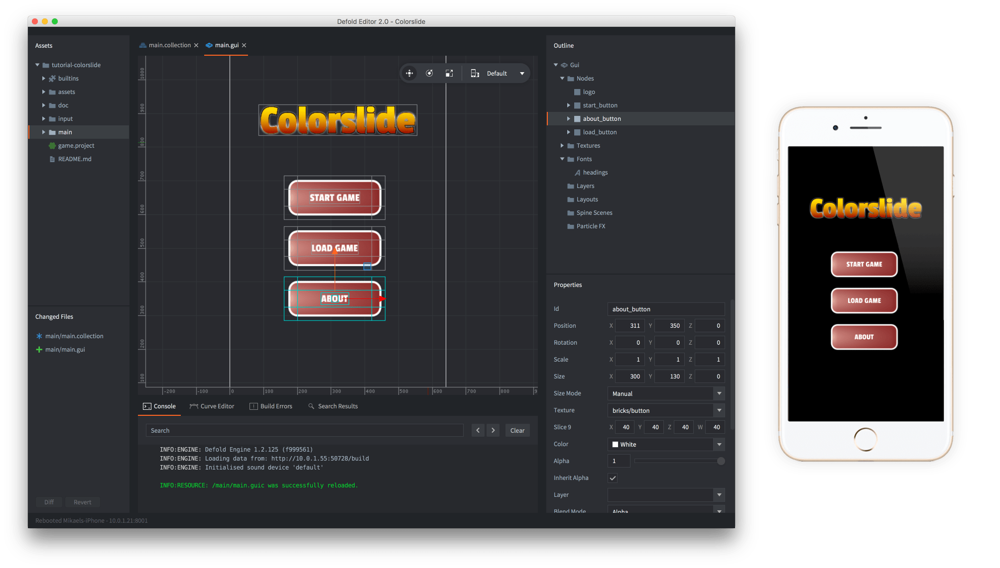

# Hot reloading resources

Defold allows you to perform hot reloading of resources. When developing a game this feature helps speed up certain task enormously. It allows you to change code and content of a game while it is running live. Common use-cases are:

- To tweak gameplay parameters in Lua scripts.
- To edit and tweak graphical elements (such as particle effects or GUI elements) and view the results in the proper context.
- To edit and tweak shader code and view the results in the proper context.
- To facilitate game testing by restarting levels, setting state and so forth---without stopping the game.

## How to hot reload

Start your game from the editor (<kbd>Project ▸ Build</kbd>).

To then reload an updated resource  simply select the menu item <kbd>File ▸ Hot Reload</kbd> or press the corresponding shortcut on the keyboard:

{srcset="images/hot-reload/menu@2x.png 2x"}

## Hot reloading on device

Hot reloading works on device as well as on desktop. To use it on device, run a debug build of your game, or the [development app](/manuals/dev-app) on your mobile device, then chose it as target in the editor:

{srcset="images/hot-reload/target@2x.png 2x"}

Now when you build and run, the editor uploads all assets to the running app on the device and starts the game. From thereon, any file you hot reload will update on the device.

For instance, to add a couple of buttons to a GUI that is being displayed in a running game on your phone, just open the GUI file:

{srcset="images/hot-reload/gui@2x.png 2x"}

Add the new buttons, save and hot reload the GUI file. You can now see the new buttons on the phone screen:

{srcset="images/hot-reload/gui-reloaded@2x.png 2x"}

When you hot reload a file, the engine will print each reloaded resource file in the console.

## Reloading scripts

Any Lua script file that is reloaded will be re-executed in the running Lua environment.

```lua
local my_value = 10

function update(self, dt)
    print(my_value)
end
```

Changing `my_value` to 11 and hot reloading the file will have immediate effect:

```text
...
DEBUG:SCRIPT: 10
DEBUG:SCRIPT: 10
DEBUG:SCRIPT: 10
INFO:RESOURCE: /main/hunter.scriptc was successfully reloaded.
DEBUG:SCRIPT: 11
DEBUG:SCRIPT: 11
DEBUG:SCRIPT: 11
...
```

Note that hot reloading does not alter the execution of the lifecycle functions. There is no call to `init()` on hot reload, for instance. If you redefine the lifecycle functions, the new versions will be used though.

## Reloading Lua modules

As long as you add variables to the global scope in a module file, reloading the file will alter these globals:

```lua
--- my_module.lua
my_module = {}
my_module.val = 10
```

```lua
-- user.script
require "my_module"

function update(self, dt)
    print(my_module.val) -- hot reload "my_module.lua" and the new value will print
end
```

A common Lua module pattern is to construct a local table, populate it and then return it:

```lua
--- my_module.lua
local M = {} -- a new table object is created here
M.val = 10
return M
```

```lua
-- user.script
local mm = require "my_module"

function update(self, dt)
    print(mm.val) -- will print 10 even if you change and hot reload "my_module.lua"
end
```

Changing and reloading "my_module.lua" will _not_ change the behavior of "user.script". See [the Modules manual](/manuals/modules) for more information on why, and how to avoid this pitfall.

## The on_reload() function

Every script component can define a `on_reload()` function. If it exists it will be called anytime the script is reloaded. This is useful for inspecting or changing data, sending messages and so forth:

```lua
function on_reload(self)
    print(self.velocity)

    msg.post("/level#controller", "setup")
end
```

## Reloading shader code

When reloading vertex and fragment shaders, the GLSL code is recompiled by the graphics driver and uploaded to the GPU. If the shader code causes a crash, which is easily done since GLSL is written at a very low level, it will take the engine down.
