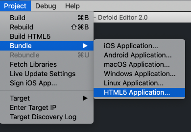
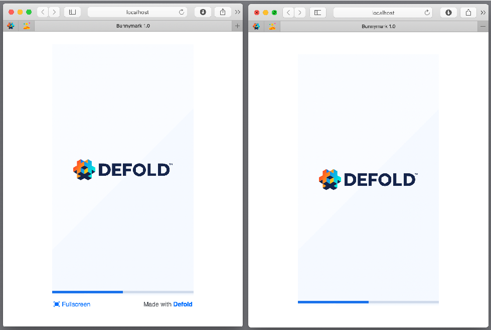
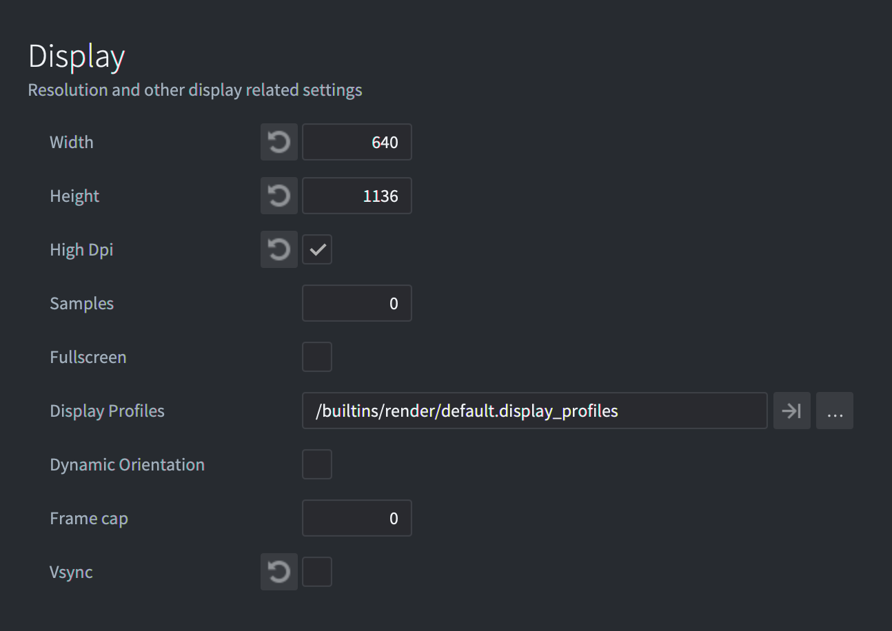
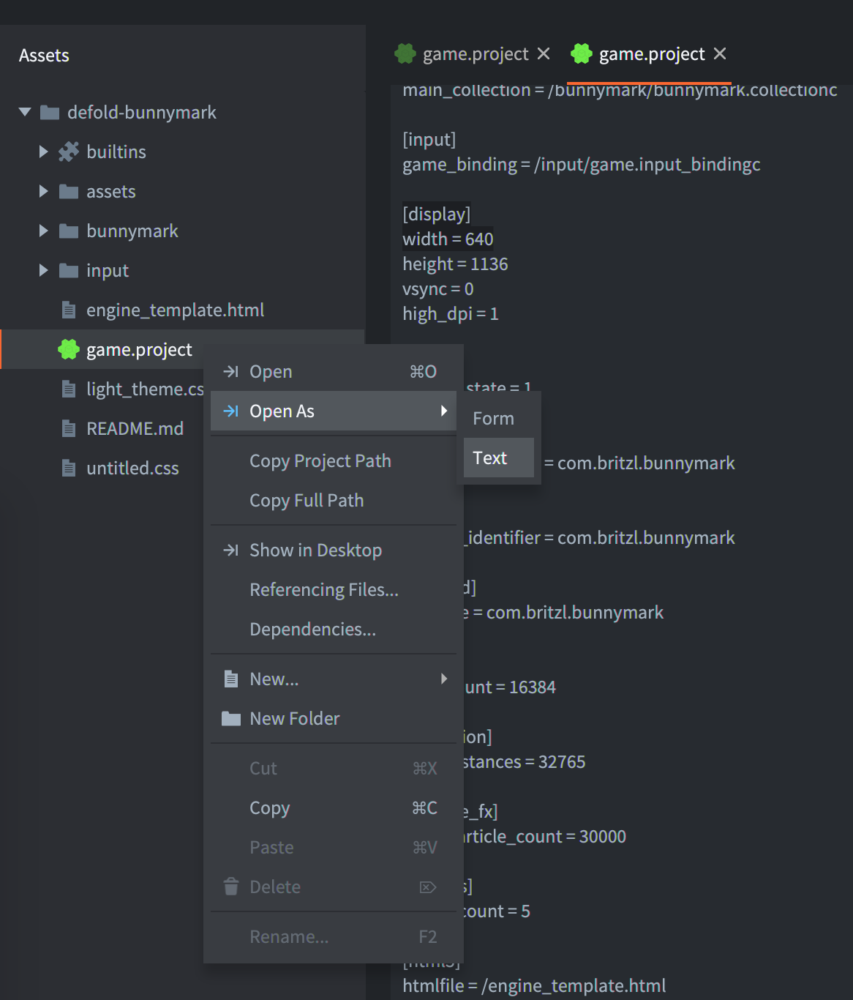

# Разработка для HTML5

Defold поддерживает сборку игр для платформы HTML5 через обычное меню бандлинга, как и для других платформ. Кроме того, итоговая игра встраивается в обычную HTML-страницу, которую можно стилизовать через простую систему шаблонов.

Файл *game.project* содержит специфичные для HTML5 настройки:


## Размер heap

Поддержка HTML5 в Defold работает на базе Emscripten (см. http://en.wikipedia.org/wiki/Emscripten). Вкратце: он создает изолированную область памяти для heap, в которой работает приложение. По умолчанию движок выделяет достаточно большой объем памяти (256 МБ). Этого более чем достаточно для типичной игры. В рамках оптимизации вы можете захотеть использовать меньшее значение. Для этого:

1. Установите *heap_size* в нужное значение. Оно задается в мегабайтах.
2. Создайте HTML5-бандл (см. ниже).

## Тестирование HTML5-сборки

Для тестирования HTML5-сборке нужен HTTP-сервер. Defold создает его за вас, если выбрать <kbd>Project ▸ Build HTML5</kbd>.


Если вы хотите протестировать свой бандл, просто загрузите его на удаленный HTTP-сервер или создайте локальный сервер, например, с помощью Python в папке бандла.
Python 2:

```sh
python -m SimpleHTTPServer
```

Python 3:

```sh
python -m http.server
```

или

```sh
python3 -m http.server
```

::: important
Нельзя тестировать HTML5-бандл, просто открыв файл `index.html` в браузере. Для этого нужен HTTP-сервер.
:::

::: important
Если в консоли появляется ошибка `"wasm streaming compile failed: TypeError: Failed to execute ‘compile’ on ‘WebAssembly’: Incorrect response MIME type. Expected ‘application/wasm’."`, нужно убедиться, что ваш сервер использует MIME-тип `application/wasm` для файлов `.wasm`.
:::

## Создание HTML5-бандла

Создание HTML5-контента в Defold устроено просто и следует той же схеме, что и для других поддерживаемых платформ: выберите в меню <kbd>Project ▸ Bundle... ▸ HTML5 Application...</kbd>:



Можно включить в HTML5-бандл и `asm.js`, и WebAssembly (`wasm`) версии движка Defold. В большинстве случаев достаточно выбрать WebAssembly, поскольку [все современные браузеры поддерживают WebAssembly](https://caniuse.com/wasm).

::: important
Даже если включены обе версии движка, `asm.js` и `wasm`, браузер при запуске игры загрузит только одну из них. Версия WebAssembly будет загружена, если браузер ее поддерживает, а `asm.js` будет использоваться как запасной вариант в редком случае отсутствия поддержки WebAssembly.
:::

Когда вы нажмете <kbd>Create bundle</kbd>, появится запрос на выбор папки, в которой будет создано приложение. После завершения экспорта в ней будут находиться все файлы, необходимые для запуска приложения.

## Известные проблемы и ограничения

* Hot Reload - Hot Reload не работает в HTML5-сборках. Чтобы принимать обновления из редактора, приложения Defold должны запускать собственный мини-веб-сервер, а в HTML5-сборке это невозможно.
* Internet Explorer 11
  * Audio - Defold обрабатывает воспроизведение звука через HTML5 _WebAudio_ (см. http://www.w3.org/TR/webaudio), а Internet Explorer 11 эту технологию сейчас не поддерживает. В этом браузере приложения будут использовать пустую реализацию аудио.
  * WebGL - Microsoft не завершила реализацию API _WebGL_ (см. https://www.khronos.org/registry/webgl/specs/latest/). Поэтому производительность там хуже, чем в других браузерах.
  * Full screen - Полноэкранный режим в этом браузере работает ненадежно.
* Chrome
  * Slow debug builds - В отладочных HTML5-сборках мы проверяем все графические вызовы WebGL, чтобы находить ошибки. К сожалению, в Chrome это очень медленно. Отключить это можно, установив в поле *Engine Arguments* файла *game.project* значение `--verify-graphics-calls=false`.
* Поддержка геймпадов - [См. документацию по геймпадам](/manuals/input-gamepads/#gamepads-in-html5), где описаны особые моменты и действия, которые могут понадобиться на HTML5.

## Кастомизация HTML5-бандла

Когда вы генерируете HTML5-версию игры, Defold предоставляет веб-страницу по умолчанию. Она ссылается на ресурсы стилей и скриптов, которые определяют, как именно будет отображаться ваша игра.

Каждый раз при экспорте приложения это содержимое создается заново. Если вы хотите изменить любой из этих элементов, необходимо внести изменения в настройки проекта. Для этого откройте *game.project* в редакторе Defold и прокрутите до раздела *html5*:


Подробнее о каждой опции см. в [руководстве по настройкам проекта](/manuals/project-settings/#html5).

::: important
Вы не можете изменять файлы стандартного HTML/CSS-шаблона в папке `builtins`. Чтобы применить свои изменения, скопируйте нужный файл из `builtins` и укажите этот файл в *game.project*.
:::

::: important
Canvas не должен быть оформлен с помощью border или padding. Если сделать это, координаты ввода мыши будут неверными.
:::

В *game.project* можно отключить кнопку `Fullscreen` и ссылку `Made with Defold`.
Defold предоставляет темную и светлую тему для `index.html`. По умолчанию установлена светлая тема, но ее можно изменить, заменив файл `Custom CSS`. Также в поле `Scale Mode` доступны четыре предустановленных режима масштабирования.

::: important
Расчеты для всех режимов масштабирования учитывают текущий DPI экрана, если в *game.project* включена опция `High Dpi` (раздел `Display`)
:::

### Downscale Fit и Fit

В режиме `Fit` размер canvas будет изменен так, чтобы на экране целиком отображался игровой canvas с сохранением исходных пропорций. В `Downscale Fit` отличие только в том, что размер меняется лишь тогда, когда внутренняя область веб-страницы меньше исходного игрового canvas, но не увеличивается, если страница больше исходного canvas игры.


### Stretch

В режиме `Stretch` размер canvas будет изменен так, чтобы полностью заполнить внутреннюю область веб-страницы.


### No Scale

В режиме `No Scale` размер canvas будет точно таким же, каким вы заранее задали его в файле *game.project*, в разделе `[display]`.



## Токены

Мы используем [язык шаблонов Mustache](https://mustache.github.io/mustache.5.html) для создания файла `index.html`. Во время сборки или бандлинга HTML- и CSS-файлы проходят через компилятор, который умеет заменять определенные токены значениями, зависящими от настроек проекта. Эти токены всегда заключены в двойные или тройные фигурные скобки (`{{TOKEN}}` или `{{{TOKEN}}}`) в зависимости от того, нужно ли экранировать последовательности символов. Эта возможность может быть полезна, если вы часто меняете настройки проекта или планируете переиспользовать материалы в других проектах.

::: sidenote
Подробнее о языке шаблонов Mustache можно прочитать в [руководстве](https://mustache.github.io/mustache.5.html).
:::

Любое значение из *game.project* может быть токеном. Например, если вы хотите использовать значение `Width` из раздела `Display`:



Откройте *game.project* как текст и посмотрите на `[section_name]` и имя нужного поля. Затем можно использовать токен вида `{{section_name.field}}` или `{{{section_name.field}}}`.



Например, в HTML-шаблоне внутри JavaScript:

```javascript
function doSomething() {
    var x = {{display.width}};
    // ...
}
```

Также доступны следующие пользовательские токены:

DEFOLD_SPLASH_IMAGE
: Записывает имя файла splash-изображения либо `false`, если `html5.splash_image` в *game.project* пуст.


```css
{{#DEFOLD_SPLASH_IMAGE}}
		background-image: url("{{DEFOLD_SPLASH_IMAGE}}");
{{/DEFOLD_SPLASH_IMAGE}}
```

exe-name
: Имя проекта без недопустимых символов.


DEFOLD_CUSTOM_CSS_INLINE
: Это место, куда встраивается содержимое CSS-файла, указанного в настройках *game.project*.


```html
<style>
{{{DEFOLD_CUSTOM_CSS_INLINE}}}
</style>
```

::: important
Важно, чтобы этот встроенный блок находился перед загрузкой основного скрипта приложения. Поскольку он включает HTML-теги, этот макрос должен использоваться в тройных фигурных скобках `{{{TOKEN}}}`, чтобы последовательности символов не экранировались.
:::

DEFOLD_SCALE_MODE_IS_DOWNSCALE_FIT
: Этот токен равен `true`, если `html5.scale_mode` имеет значение `Downscale Fit`.

DEFOLD_SCALE_MODE_IS_FIT
: Этот токен равен `true`, если `html5.scale_mode` имеет значение `Fit`.

DEFOLD_SCALE_MODE_IS_NO_SCALE
: Этот токен равен `true`, если `html5.scale_mode` имеет значение `No Scale`.

DEFOLD_SCALE_MODE_IS_STRETCH
: Этот токен равен `true`, если `html5.scale_mode` имеет значение `Stretch`.

DEFOLD_HEAP_SIZE
: Размер heap, указанный в *game.project* как `html5.heap_size`, преобразованный в байты.

DEFOLD_ENGINE_ARGUMENTS
: Аргументы движка, указанные в *game.project* как `html5.engine_arguments`, разделенные символом `,`.

build-timestamp
: Текущая временная метка сборки в секундах.


## Дополнительные параметры

Если вы создаете собственный шаблон, можно переопределить набор параметров для загрузчика движка. Для этого нужно добавить секцию `<script>` и переопределить значения внутри `CUSTOM_PARAMETERS`.
::: important
Ваш пользовательский `<script>` должен находиться после секции `<script>` со ссылкой на `dmloader.js`, но перед вызовом функции `EngineLoader.load`.
:::
Например:

```
    <script id='custom_setup' type='text/javascript'>
        CUSTOM_PARAMETERS['disable_context_menu'] = false;
        CUSTOM_PARAMETERS['unsupported_webgl_callback'] = function() {
            console.log("Oh-oh. WebGL not supported...");
        }
    </script>
```

`CUSTOM_PARAMETERS` может содержать следующие поля:

```
'archive_location_filter':
    Функция-фильтр, которая будет вызываться для каждого пути архива.

'unsupported_webgl_callback':
    Функция, вызываемая, если WebGL не поддерживается.

'engine_arguments':
    Список аргументов (строк), которые будут переданы движку.

'custom_heap_size':
    Число байт, задающее размер heap-памяти.

'disable_context_menu':
    Отключает контекстное меню по правому клику на элементе canvas, если имеет значение true.

'retry_time':
    Пауза в секундах перед повторной попыткой загрузки файла после ошибки.

'retry_count':
    Количество попыток загрузки файла.

'can_not_download_file_callback':
    Функция, вызываемая, если файл не удалось скачать после 'retry_count' попыток.

'resize_window_callback':
    Функция, вызываемая, когда происходят события resize/orientationchanges/focus.

'start_success':
    Функция, вызываемая непосредственно перед вызовом main после успешной загрузки.

'update_progress':
    Функция, вызываемая при обновлении прогресса. Параметр progress имеет значение 0-100.
```

## Файловые операции в HTML5

HTML5-сборки поддерживают файловые операции, такие как `sys.save()`, `sys.load()` и `io.open()`, но внутренне они работают иначе, чем на других платформах. Когда JavaScript выполняется в браузере, понятия реальной файловой системы не существует, а локальный доступ к файлам блокируется из соображений безопасности. Вместо этого Emscripten (а значит и Defold) использует [IndexedDB](https://developer.mozilla.org/en-US/docs/Web/API/IndexedDB_API/Using_IndexedDB) — встроенную в браузер базу данных для постоянного хранения данных — чтобы создать виртуальную файловую систему в браузере. Важное отличие от файловых операций на других платформах в том, что между записью в файл и фактическим сохранением данных в базе может быть небольшая задержка. Обычно содержимое IndexedDB можно посмотреть через консоль разработчика браузера.


## Передача аргументов HTML5-игре

Иногда нужно передать игре дополнительные аргументы до запуска или в момент запуска. Это может быть, например, id пользователя, session token или указание, какой уровень загружать при старте. Сделать это можно несколькими способами, некоторые из которых описаны ниже.

### Аргументы движка

Можно указать дополнительные аргументы движка во время его настройки и загрузки. Эти дополнительные аргументы потом можно получить во время выполнения через `sys.get_config()`. Чтобы добавить пары ключ-значение, нужно изменить поле `engine_arguments` объекта `extra_params`, который передается движку при загрузке в `index.html`:


```
    <script id='engine-setup' type='text/javascript'>
    var extra_params = {
        ...,
        engine_arguments: ["--config=foo1=bar1","--config=foo2=bar2"],
        ...
    }
```

Также можно добавить `--config=foo1=bar1, --config=foo2=bar2` в поле аргументов движка в HTML5-разделе *game.project*, и оно будет внедрено в сгенерированный `index.html`.

Во время выполнения значения можно получить так:

```lua
local foo1 = sys.get_config("foo1")
local foo2 = sys.get_config("foo2")
print(foo1) -- bar1
print(foo2) -- bar2
```


### Параметры запроса в URL

Вы можете передавать аргументы как часть query-параметров в URL страницы и считывать их во время выполнения:

```
https://www.mygame.com/index.html?foo1=bar1&foo2=bar2
```

```lua
local url = html5.run("window.location")
print(url)
```

Полная вспомогательная функция, которая получает все query-параметры в виде Lua-таблицы:

```lua
local function get_query_parameters()
    local url = html5.run("window.location")
    -- get the query part of the url (the bit after ?)
    local query = url:match(".*?(.*)")
    if not query then
        return {}
    end

    local params = {}
    -- iterate over all key value pairs
    for kvp in query:gmatch("([^&]+)") do
        local key, value = kvp:match("(.+)=(.+)")
        params[key] = value
    end
    return params
end

function init(self)
    local params = get_query_parameters()
    print(params.foo1) -- bar1
end
```

## Оптимизация

HTML5-игры обычно предъявляют строгие требования к начальному размеру загрузки, времени запуска и потреблению памяти, чтобы игра быстро загружалась и хорошо работала на слабых устройствах и при медленном интернете. При оптимизации HTML5-игры рекомендуется сосредоточиться на следующих областях:

* [Использование памяти](/manuals/optimization-memory)
* [Размер движка](/manuals/optimization-size)
* [Размер игры](/manuals/optimization-size)

## FAQ
:[HTML5 FAQ](../shared/html5-faq.md)
