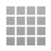
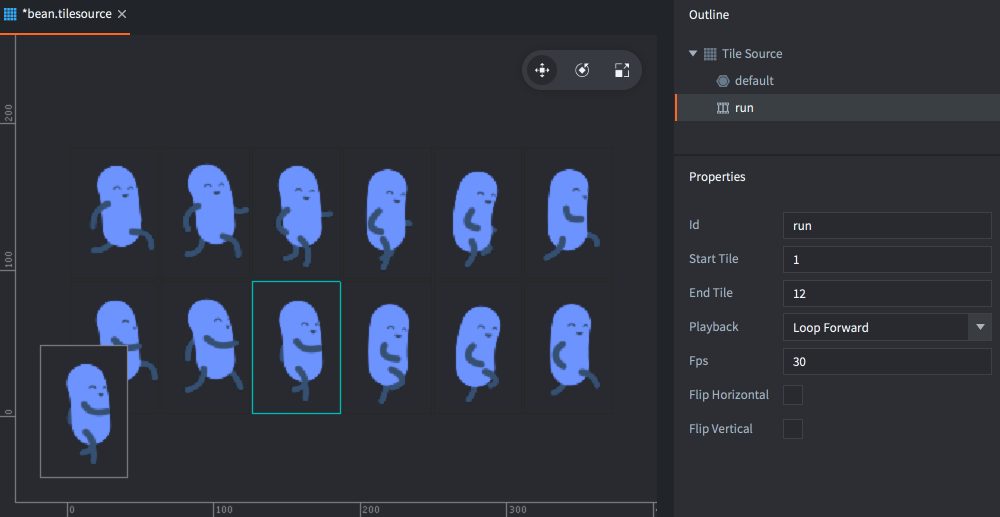

# Импортирование 2D-графики

Defold поддерживает множество видов визуальных компонентов, часто используемых в 2D-играх. В Defold можно создавать статичные и анимированные спрайты, UI-компоненты, эффекты частиц, тайловые карты, растровые шрифты и Spine-анимацию. Прежде чем создавать любой из этих визуальных компонентов, необходимо импортировать подходящие файлы графических изображений. Чтобы это сделать, достаточно перетащить их из файловой системы компьютера в соответствующее расположение в панели *Assets* редактора Defold.

::: sidenote
Defold поддерживает изображения в форматах PNG и JPEG. Другие форматы изображений необходимо конвертировать перед использованием.
:::

## Создание ассетов Defold

После импорта изображений в Defold их можно использовать для создания ассетов, специфичных для движка:

{.icon} Atlas
: Атлас содержит список отдельных файлов изображений, которые автоматически объединяются в более крупную текстуру. Атласы могут содержать неподвижные изображения и *группы анимаций* --- наборы изображений, которые вместе образуют мултикадровую анимацию.

  

За подробностями обращайтесь к [руководству по атласам](/manuals/atlas).

{.icon} Tile Source
: Тайловый источник представляет собой файл изображения, которое уже сформировано из более мелких суб-изображений, упорядоченных по равномерной сетке. Другой термин, часто используемый для обозначения этого типа составного изображения --- _спрайт-лист_. Тайловые источники могут содержать мултикадровую анимацию в виде последовательности тайлов. Кроме того, есть возможность использовать изображение для автоматического прикрепления форм столкновения к тайлам.

  

За подробностями об этом типе ресурса обращайтесь к [руководству по тайловым источникам](/manuals/tilesource).

{.icon} Bitmap Font
: Растровый шрифт имеет глифы, размещенные на изображении формата PNG. Эти типы шрифтов не обеспечивают повышения производительности по сравнению со шрифтами, генерируемыми из файлов TrueType или OpenType, но могут включать произвольную графику, цвет и тени непосредственно в изображении.

За подробностями об этом типе ресурса обращайтесь к [руководству по шрифтам](/manuals/font/#bitmap-bmfonts).

  

## Использование ассетов Defold

После конвертирования изображений в ресурсы Atlas и Tile Source их можно использовать для создания нескольких различных видов визуальных компонентов:

{.icon}
: Спрайт --- это статичное изображение или мултикадровая анимация, отображаемая на экране.

  

За подробностями обращайтесь к [руководству по спрайтам](/manuals/sprite).

{.icon} Tile Map
: Компонент Tile Map образует карту из тайлов (изображений и форм столкновений), взятых из источника тайлов. Тайловые карты не могут использовать ресурс типа Atlas.

  

За подробностями обращайтесь к [руководству по тайловым картам](/manuals/tilemap).

{.icon} Particle FX
: Частицы, испускаемые эмиттером, состоят из неподвижного изображения или мултикадровой анимации, взятых из атласа или источника тайлов.

  

За подробностями обращайтесь к [руководству по эффектам частиц](/manuals/particlefx).

{.icon} GUI
: GUI-ноды Box и Pie могут использовать неподвижные изображения и мултикадровую анимацию, взятые из атласов и источников тайлов.

  

За подробностями обращайтесь к [руководству по GUI](/manuals/gui).
