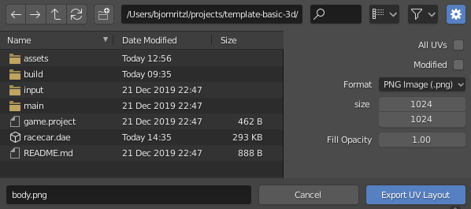

# Импортирование 3D-моделей
В настоящее время Defold поддерживает модели, скелеты и анимацию в формате GL Transmission Format *.glTF* и Collada *.dae*. С помощью таких инструментов, как Maya, 3D Max, Sketchup и Blender, можно создавать и/или конвертировать 3D-модели в формат Collada. Blender --- это мощная и популярная программа для 3D-моделирования, анимации и рендеринга. Она работает под Windows, macOS и Linux и доступна для свободного скачивания на сайте http://www.blender.org.

## Импортирование в Defold
Чтобы импортировать модель, просто перетащите файл *.gltf* или *.dae* и соответствующее изображение текстуры в панель *Assets*.

## Использование модели
После того как модель импортирована в Defold, вы можете использовать её в [компоненте Model](/manuals/model).

## Экспорт в glTF и Collada
Экспортированные файлы *.gltf* или *.dae* содержат все вершины, рёбра и грани, из которых состоит модель, а также _UV координаты_ (какая часть текстуры сопоставляется с определённой частью сетки), если они были определены, кости скелета и данные анимации.

* Подробное описание полигональных сеток можно найти по ссылке: http://en.wikipedia.org/wiki/Polygon_mesh.

* О UV координатах и UV развёртке можно прочитать здесь: http://en.wikipedia.org/wiki/UV_mapping.

Defold накладывает некоторые ограничения на экспортированные анимационные данные:

* В настоящее время поддерживаются только запечённые анимации. Анимации должны содержать матрицы для каждой анимированной кости на каждом ключевом кадре, а не отдельные ключи для позиции, вращения и масштаба.

* Анимации интерполируются линейно. Если вы используете более сложную кривую интерполяции, анимации нужно предварительно запечь в экспортёре.

* Клип-анимации (animation clips) в формате Collada не поддерживаются. Чтобы использовать несколько анимаций для одной модели, экспортируйте их в отдельные *.dae* файлы и объедините их в файл *.animationset* в Defold.

### Требования
При экспорте модели важно учитывать, что пока поддерживаются не все функции.
В настоящее время Defold не поддерживает следующие функции формата glTF:

* Анимации с морфингом (Morph target animations)
* Свойства материалов
* Встроенные текстуры

Хотя наша цель — полная поддержка формата glTF, это ещё не реализовано полностью.
Если какой-либо функции не хватает, пожалуйста, отправьте запрос на добавление в [наш репозиторий](https://github.com/defold/defold/issues)

### Экспорт текстуры
Если у вас ещё нет текстуры для вашей модели, вы можете сгенерировать её с помощью Blender. Сделайте это до того, как удалите лишние материалы с модели. Начните с выбора меша и всех его вершин:

Когда все вершины выбраны, выполните развёртку (unwrap) меша, чтобы получить UV-развёртку:

Затем можно экспортировать UV-развёртку в изображение, которое будет использоваться в качестве текстуры:

### Экспорт из Blender
Вы можете экспортировать модель с помощью пункта меню Export. Выберите модель перед тем, как вызвать меню Export, и обязательно отметьте опцию "Selection Only", чтобы экспортировать только выбранный объект.

