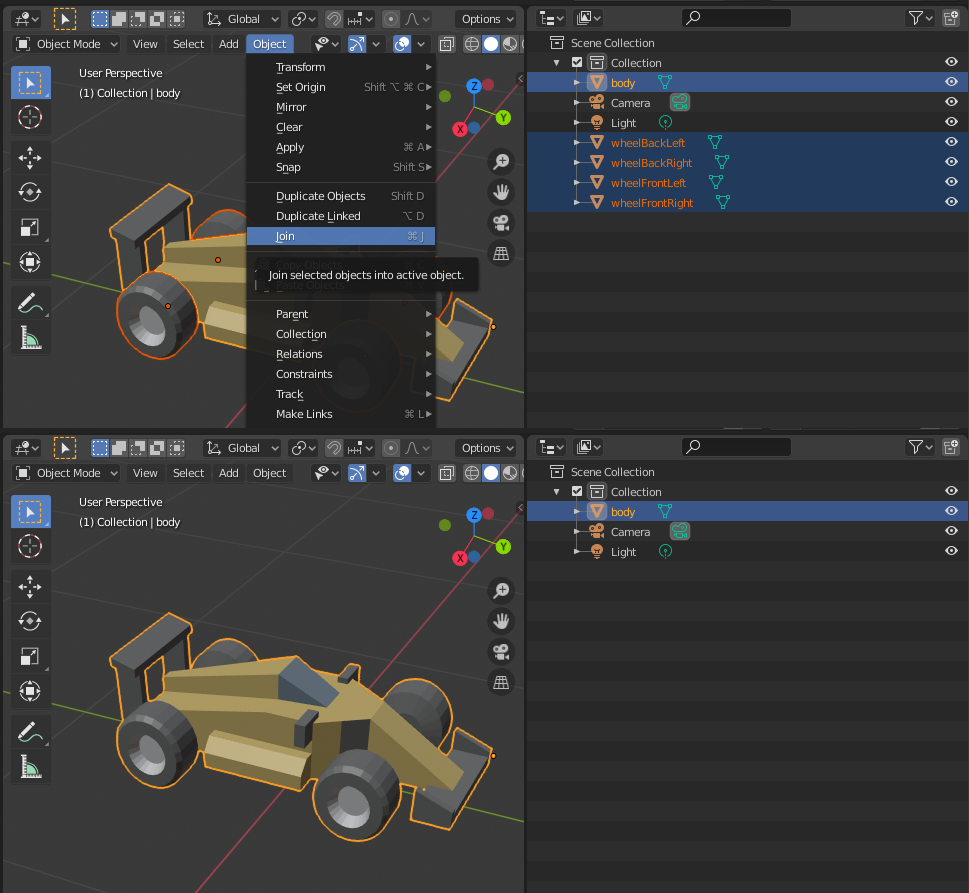

# Импортирование 3D-моделей
В настоящее время Defold поддерживает модели, скелеты и анимацию только в формате *.dae* (Collada). С помощью таких инструментов, как Maya, 3D Max, Sketchup и Blender, можно создавать и/или конвертировать 3D-модели в формат Collada. Blender --- это мощная и популярная программа для 3D-моделирования, анимации и рендеринга. Она работает под Windows, macOS и Linux и доступна для свободного скачивания на сайте http://www.blender.org.

{srcset="images/model/blender@2x.png 2x"}

## Экспортирование в формат Collada
При экспорте модели в формат Collada создается файл с расширением *.dae*. Этот файл содержит все вершины, ребра и грани, составляющие модель, а также _UV координаты_ (информация о том, какая часть текстуры сопоставляется с определенной частью сетки), если они определены, а также кости скелета и данные анимации.

* Подробное описание полигональных сеток можно найти на http://en.wikipedia.org/wiki/Polygon_mesh.

* UV-координаты и UV-мапинг описаны на http://en.wikipedia.org/wiki/UV_mapping.

Defold накладывает некоторые ограничения на экспортируемые данные анимации:

* В настоящее время Defold поддерживает только запеченную анимацию. Это означает, что анимация должна иметь матрицы трансформации (уже вычисленные координаты) для каждой анимированной кости в каждом ключевом кадре, а не положение, вращение и масштаб как в отдельных ключах.

* Анимация интерполируется линейно. Если требуется более сложная интерполяция кривых, анимацию необходимо предварительно запечь в программе-экспортере.

* Формат Collada не поддерживает анимационные клипы. Чтобы использовать несколько анимаций в одной модели, необходимо экспортировать их в отдельные *.dae*-файлы и собрать их в единый *.animationset*-файл в Defold.

### Требования
При экспорте модели в формат Collada необходимо убедиться, что она соответствует следующим требованиям:

* Модель должна представлять собой единую сетку
* Модель должна использовать лишь один материал

#### Объединение нескольких полигональных сеток
Для объединения нескольких сеток можно использовать Blender. Выделите все сетки и нажмите `CTRL`/`CMD` + `J` чтобы объединить их.

#### Удаление материалов
Для удаления лишних материалов из модели также подойдет Blender. Выберите материал для удаления и нажмите кнопку `-`.

#### Экспортирование текстуры
Если для модели еще не существует текстуры, ее можно сгенерировать с помощью Blender. Это следует сделать перед удалением лишних материалов с модели. Начните с выделения сетки и всех ее вершин:

Как только все вершины выделены, необходимо развернуть сетку, чтобы получить UV-макет:

Затем можно приступать к экспорту UV-макета в изображение для использования его в качестве текстуры:

## Экспортирование с помощью Blender
Экспорт модели в формат Collada выполняется с помощью пункта меню "Export". Следует выделить модель перед выбором пункта меню File > Export > Collada. В открывшемся диалоге установите флажок "Selection Only", чтобы экспортировать только выделенную модель.

## Импортирование в Defold
Чтобы импортировать модель, просто перетащите *.dae*-файл и соответствующую текстуру в панель *Assets*.

{srcset="images/model/assets@2x.png 2x"}

## Использование модели
После импорта модели в Defold ее можно использовать в [компоненте Model](/manuals/model).
