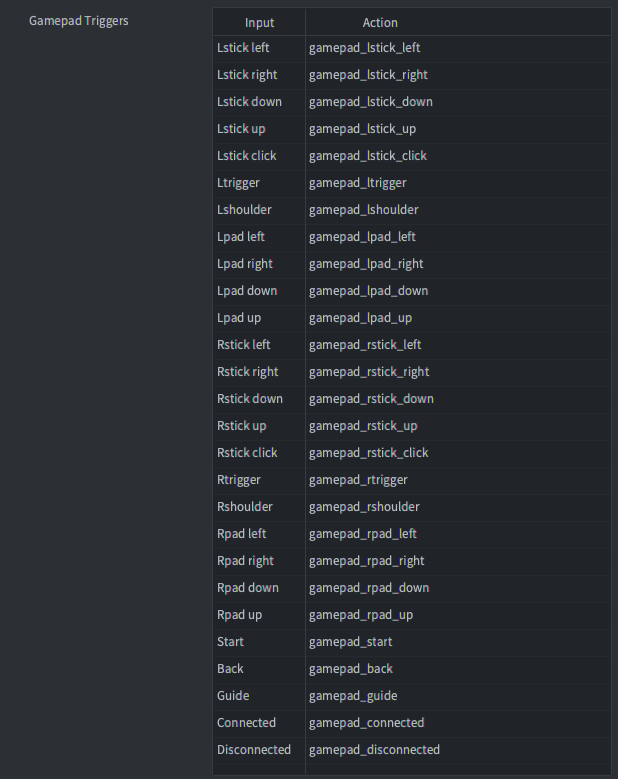
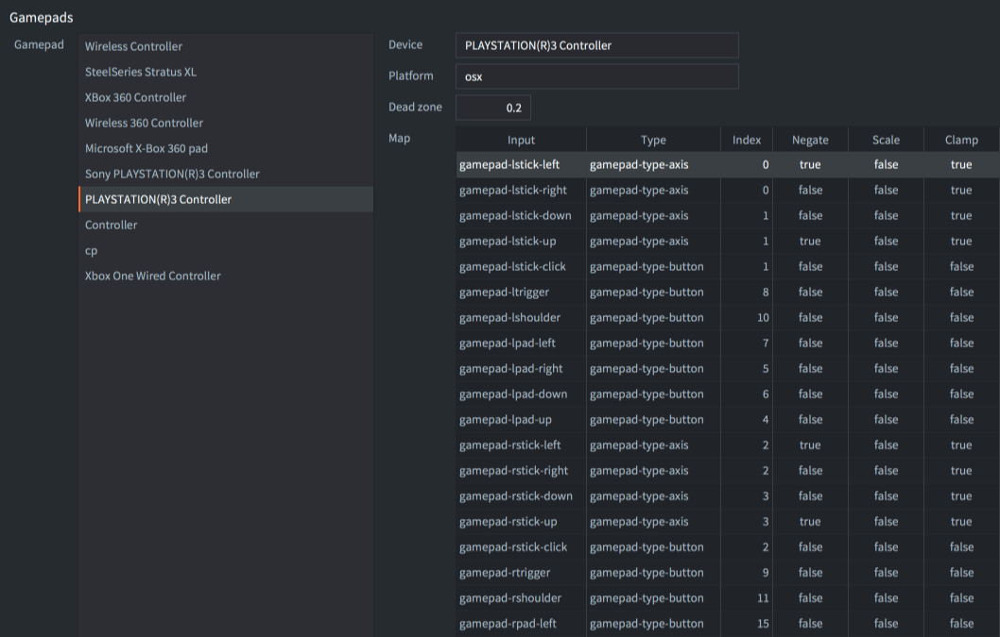
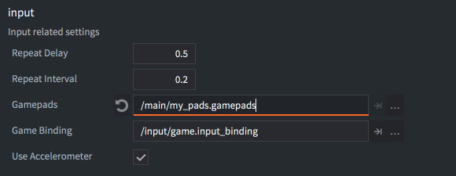

::: sidenote
Рекомендуется ознакомиться с общим принципом работы ввода в Defold, способами получения ввода и порядком получения ввода в файлах скрипта. Узнайте больше о системе ввода в [руководстве](/manuals/input).
:::

# Геймпады
Триггеры геймпада позволяют связать стандартный ввод геймпада с функциями игры. Для ввода данных с геймпада предусмотрены привязки для:

- Левый и правый стики (направление и щелчки)
Левый и правый цифровые пэды. Правый пэд обычно переводится как кнопки "A", "B", "X" и "Y" на контроллере Xbox и кнопки "квадрат", "круг", "треугольник" и "крест" на контроллере Playstation соответственно.
- Левый и правый триггеры
- Левая и правая плечевые кнопки
- Кнопки "Start", "Back" и другие Кнопки управления



::: important
В приведенных ниже примерах используются действия, показанные на изображении выше. Как и в случае с любым другим вводом, вы можете называть свои действия по своему усмотрению.
:::

## Цифровые кнопки
Цифровые кнопки генерируют события нажатия, отпускания и повтора. Пример обнаружения для цифровой кнопки (нажата или отпущена):

```lua
function on_input(self, action_id, action)
    if action_id == hash("gamepad_lpad_left") then
        if action.pressed then
            -- start moving left
        elseif action.released then
            -- stop moving left
        end
    end
end
```

## Аналоговые стики
Аналоговые стики генерируют непрерывные события ввода, даже, когда стик перемещается за пределы мертвой зоны, заданной в файле настроек геймпада (см. ниже). Пример определения ввода для аналогового стика:

```lua
function on_input(self, action_id, action)
    if action_id == hash("gamepad_lstick_down") then
        -- left stick was moved down
        print(action.value) -- a value between 0.0 an -1.0
    end
end
```

Аналоговые стики также генерируют события нажатия и отпускания при перемещении в кардинальных направлениях выше определенного порогового значения. Это позволяет использовать аналоговый стик в качестве цифрового ввода направления:

```lua
function on_input(self, action_id, action)
    if action_id == hash("gamepad_lstick_down") and action.pressed then
        -- left stick was moved to its extreme down position
    end
end
```

## Несколько геймпадов
Defold поддерживает несколько геймпадов через операционную систему хоста, действия устанавливают поле `gamepad` в таблице действий на номер геймпада, с которого был осуществлен ввод:

```lua
function on_input(self, action_id, action)
    if action_id == hash("gamepad_start") then
        if action.gamepad == 0 then
          -- gamepad 0 wants to join the game
        end
    end
end
```

## Соеденение и разоедининение
Привязки ввода геймпада также предоставляют две отдельные привязки с именами `Connected` и `Disconnected` для определения того, когда геймпад подключен (даже подключенный с самого начала) или отключен.

```lua
function on_input(self, action_id, action)
    if action_id == hash("gamepad_connected") then
        if action.gamepad == 0 then
          -- gamepad 0 was connected
        end
    elseif action_id == hash("gamepad_dicconnected") then
        if action.gamepad == 0 then
          -- gamepad 0 was dicconnected
        end
    end
end
```

## Нефильтрованые данные с геймпада
(Начиная с версии 1.2.183)

Привязки ввода геймпада также предоставляют отдельную привязку с именем `Raw` для передачи нефильтрованного (без примененной мертвой зоны) ввода кнопок, осей и шляп любого подключенного геймпада.

```lua
function on_input(self, action_id, action)
    if action_id == hash("raw") then
        pprint(action.gamepad_buttons)
        pprint(action.gamepad_axis)
        pprint(action.gamepad_hats)
    end
end
```

## Файл настроек геймпадов
Для настройки входа геймпада используется отдельный файл отображения для каждого типа аппаратного геймпада. Сопоставления геймпадов для конкретных аппаратных геймпадов задаются в файле *gamepads*. Defold поставляется со встроенным файлом gamepads с настройками для обычных геймпадов:



Если вам нужно создать новый файл настроек геймпада, у нас есть простой инструмент, который поможет вам в этом:

[Скачать gdc.zip](https://forum.defold.com/t/big-thread-of-gamepad-testing/56032).

Он включает двоичные файлы для Windows, Linux и macOS. Запустите его из командной строки:

```sh
./gdc
```

Инструмент попросит вас нажать различные кнопки на подключенном контроллере. Затем он выведет новый файл gamepads с правильными отображениями для вашего контроллера. Сохраните новый файл или объедините его с существующим файлом gamepads, затем обновите настройки в *game.project*:



### Неопознанные геймпады
(Начиная с версии 1.2.186)

Если геймпад подключен и для него не существует отображения, геймпад будет генерировать только действия "подключен", "отключен" и "сырой". В этом случае вам необходимо вручную сопоставить необработанные данные геймпада с действиями в вашей игре.

(Начиная с версии 1.4.8)

Можно проверить, поступает ли входное действие от неопознанного геймпада, прочитав значение `gamepad_unknown` из действия:

```lua
function on_input(self, action_id, action)
    if action_id == hash("connected") then
        if action.gamepad_unknown then
            print("Подключённый геймпад не распознан и будет генерировать только сырой ввод")
        else
            print("Подключённый геймпад распознан и будет генерировать действия ввода для кнопок и стиков")
        end
    end
end
```

## Геймпады в HTML5
Геймпады поддерживаются в сборках HTML5 и генерируют те же события ввода, что и на других платформах. Поддержка геймпадов основана на [Gamepad API](https://www.w3.org/TR/gamepad/), который поддерживается в большинстве браузеров (см. таблицу поддержки](https://caniuse.com/?search=gamepad)). Если браузер не поддерживает Gamepad API, Defold будет молча игнорировать любые триггеры геймпада в вашем проекте. Вы можете проверить, поддерживает ли браузер Gamepad API, проверив, существует ли функция `getGamepads` для объекта `navigator`:

```lua
local function supports_gamepads()
    return not html5 or (html5.run('typeof navigator.getGamepads === "function"') == "true")
end

if supports_gamepads() then
    print("Platform supports gamepads")
end
```

Если ваша игра запускается внутри `iframe`, вы также должны убедиться, что в `iframe` добавлено разрешение `gamepad`:

```html
<iframe allow="gamepad"></iframe>
```

### Стандартный геймпад
(Начиная с версии 1.4.1)

Если подключённый геймпад определяется браузером как стандартный геймпад, будет использоваться отображение для "Standard Gamepad" из [файла настроек геймпадов](/manuals/input-gamepads/#gamepads-settings-file) (отображение Standard Gamepad включено в файл `default.gamepads` в каталоге `/builtins`). Стандартный геймпад определяется как устройство с 16 кнопками и 2 аналоговыми стиками с раскладкой кнопок, аналогичной контроллерам PlayStation или Xbox (см. [определение и раскладку кнопок от W3C](https://w3c.github.io/gamepad/#dfn-standard-gamepad) для получения дополнительной информации). Если подключённый геймпад не определяется как стандартный, Defold будет искать отображение, соответствующее типу аппаратного геймпада в файле настроек геймпада.

## Геймпады в Windows
В Windows в настоящее время поддерживаются только контроллеры XBox 360. Чтобы подключить контроллер 360 к компьютеру с Windows, [убедитесь, что он правильно настроен](http://www.wikihow.com/Use-Your-Xbox-360-Controller-for-Windows).

## Геймпады на Android
(Начиная с версии 1.2.183)

Геймпады поддерживаются в сборках Android и генерируют те же события ввода, что и на других платформах. Поддержка геймпадов основана на [Android input system for key and motion events](https://developer.android.com/training/game-controllers/controller-input). Входные события Android будут переведены в события геймпада Defold с помощью того же файла *gamepad*, как описано выше.

При добавлении дополнительных привязок для геймпада на Android вы можете использовать следующие таблицы поиска для перевода событий ввода Android в значения файлов *gamepad*:

| Событие клавиши с кнопки    | Индекс | Версия  |
|-----------------------------|--------|---------|
| AKEYCODE_BUTTON_A           | 0      | 1.2.183 |
| AKEYCODE_BUTTON_B           | 1      | 1.2.183 |
| AKEYCODE_BUTTON_C           | 2      | 1.2.183 |
| AKEYCODE_BUTTON_X           | 3      | 1.2.183 |
| AKEYCODE_BUTTON_L1          | 4      | 1.2.183 |
| AKEYCODE_BUTTON_R1          | 5      | 1.2.183 |
| AKEYCODE_BUTTON_Y           | 6      | 1.2.183 |
| AKEYCODE_BUTTON_Z           | 7      | 1.2.183 |
| AKEYCODE_BUTTON_L2          | 8      | 1.2.183 |
| AKEYCODE_BUTTON_R2          | 9      | 1.2.183 |
| AKEYCODE_DPAD_CENTER        | 10     | 1.2.183 |
| AKEYCODE_DPAD_DOWN          | 11     | 1.2.183 |
| AKEYCODE_DPAD_LEFT          | 12     | 1.2.183 |
| AKEYCODE_DPAD_RIGHT         | 13     | 1.2.183 |
| AKEYCODE_DPAD_UP            | 14     | 1.2.183 |
| AKEYCODE_BUTTON_START       | 15     | 1.2.183 |
| AKEYCODE_BUTTON_SELECT      | 16     | 1.2.183 |
| AKEYCODE_BUTTON_THUMBL      | 17     | 1.2.183 |
| AKEYCODE_BUTTON_THUMBR      | 18     | 1.2.183 |
| AKEYCODE_BUTTON_MODE        | 19     | 1.2.183 |
| AKEYCODE_BUTTON_1           | 20     | 1.2.186 |
| AKEYCODE_BUTTON_2           | 21     | 1.2.186 |
| AKEYCODE_BUTTON_3           | 22     | 1.2.186 |
| AKEYCODE_BUTTON_4           | 23     | 1.2.186 |
| AKEYCODE_BUTTON_5           | 24     | 1.2.186 |
| AKEYCODE_BUTTON_6           | 25     | 1.2.186 |
| AKEYCODE_BUTTON_7           | 26     | 1.2.186 |
| AKEYCODE_BUTTON_8           | 27     | 1.2.186 |
| AKEYCODE_BUTTON_9           | 28     | 1.2.186 |
| AKEYCODE_BUTTON_10          | 29     | 1.2.186 |
| AKEYCODE_BUTTON_11          | 30     | 1.2.186 |
| AKEYCODE_BUTTON_12          | 31     | 1.2.186 |
| AKEYCODE_BUTTON_13          | 32     | 1.2.186 |
| AKEYCODE_BUTTON_14          | 33     | 1.2.186 |
| AKEYCODE_BUTTON_15          | 34     | 1.2.186 |
| AKEYCODE_BUTTON_16          | 35     | 1.2.186 |

([Определения клавишных событий Android](https://developer.android.com/ndk/reference/group/input#group___input_1gafccd240f973cf154952fb917c9209719))

| Событие движения с оси      | Индекс |
|-----------------------------|--------|
| AMOTION_EVENT_AXIS_X        | 0      |
| AMOTION_EVENT_AXIS_Y        | 1      |
| AMOTION_EVENT_AXIS_Z        | 2      |
| AMOTION_EVENT_AXIS_RZ       | 3      |
| AMOTION_EVENT_AXIS_LTRIGGER | 4      |
| AMOTION_EVENT_AXIS_RTRIGGER | 5      |
| AMOTION_EVENT_AXIS_HAT_X    | 6      |
| AMOTION_EVENT_AXIS_HAT_Y    | 7      |

([Определения событий движения Android](https://developer.android.com/ndk/reference/group/input#group___input_1ga157d5577a5b2f5986037d0d09c7dc77d))

Используйте эту таблицу поиска в сочетании с приложением для тестирования геймпада из Google Play Store, чтобы выяснить, к какому событию привязана каждая кнопка на вашем геймпаде.
