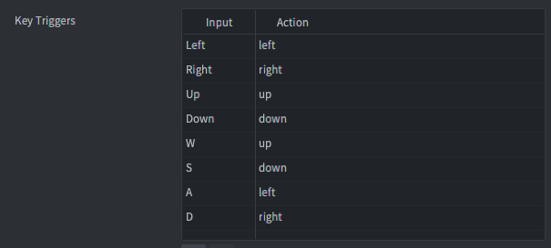
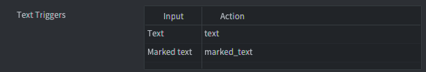
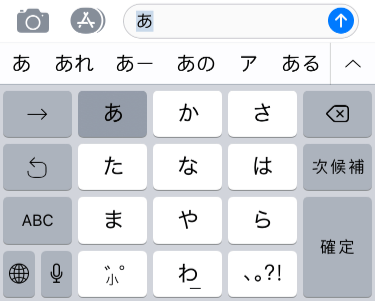

::: sidenote
Рекомендуется ознакомиться с общим принципом работы ввода в Defold, способами получения ввода и порядком получения ввода в файлах сценария. Узнайте больше о системе ввода в [руководстве](/manuals/input).
:::

# Клавишные триггеры
Клавишные триггеры позволяют привязать ввод одной клавиши клавиатуры к игровым действиям. Каждая клавиша отдельно привязывается к соответствующему действию. Клавишные триггеры используются для привязки определенных кнопок к определенным функциям, например, для перемещения персонажа с помощью стрелок или клавиш WASD. Если вам нужно считать произвольный ввод с клавиатуры, используйте текстовые триггеры (см. ниже).



```lua
function on_input(self, action_id, action)
    if action_id == hash("left") then
        if action.pressed then
            -- start moving left
        elseif action.released then
            -- stop moving left
        end
    end
end
```

# Текстовые триггеры
Текстовые триггеры используются для считывания произвольного текстового ввода. Существует два типа текстовых триггеров: текст и маркированный текст.



## Функция Text
Функция `text` захватывает обычный текстовый ввод. Он устанавливает поле `text` таблицы действий в строку, содержащую введенный символ. Действие выполняется только при нажатии кнопки, никаких действий `отпустить` или `повторить` не посылается.

```lua
function on_input(self, action_id, action)
    if action_id == hash("text") then
        -- Concatenate the typed character to the "user" node...
        local node = gui.get_node("user")
        local name = gui.get_text(node)
        name = name .. action.text
        gui.set_text(node, name)
    end
end
```

## Маркированный текст
Функция `marked-text` используется в основном для азиатских клавиатур, где несколько нажатий клавиш могут соответствовать одному вводу. Например, в клавиатуре iOS "Japanese-Kana" пользователь может набирать комбинации, и в верхней части клавиатуры будут отображаться доступные символы или последовательности символов, которые можно ввести.



- Каждое нажатие клавиши генерирует отдельное действие и устанавливает поле действия `text` в текущую введенную последовательность символов ("маркированный текст").
- Когда пользователь выбирает символ или комбинацию символов, отправляется отдельное триггерное действие типа `text` (при условии, что оно установлено в списке привязки ввода). Отдельное действие устанавливает поле действия `text` в конечную последовательность символов.
