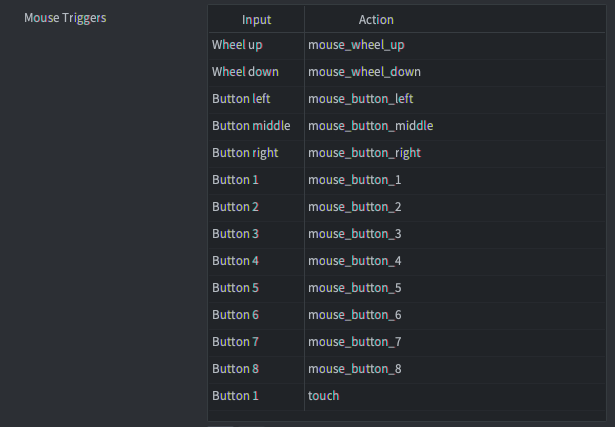
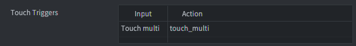

::: sidenote
Рекомендуется ознакомиться с общими принципами работы ввода в Defold, тем, как получать ввод, и в каком порядке он поступает в файлы скриптов. Подробнее о системе ввода читайте в [руководстве по обзору ввода](/manuals/input).
:::

# Триггеры мыши
Триггеры мыши позволяют привязать ввод от кнопок мыши и колеса прокрутки к игровым действиям.



::: sidenote
Вводы кнопок мыши `MOUSE_BUTTON_LEFT`, `MOUSE_BUTTON_RIGHT` и `MOUSE_BUTTON_MIDDLE` эквивалентны `MOUSE_BUTTON_1`, `MOUSE_BUTTON_2` и `MOUSE_BUTTON_3`.
:::

::: important
В приведенных ниже примерах используются действия, показанные на изображении выше. Как и в случае с любым другим вводом, вы можете называть свои действия по своему усмотрению.
:::

## Кнопки мыши
Кнопки мыши генерируют события нажатия, отпускания и повтора. Пример, показывающий, как обнаружить ввод для левой кнопки мыши (нажата или отпущена):

```lua
function on_input(self, action_id, action)
    if action_id == hash("mouse_button_left") then
        if action.pressed then
            -- left mouse button pressed
        elseif action.released then
            -- left mouse button released
        end
    end
end
```

::: important
Действия ввода `MOUSE_BUTTON_LEFT` (или `MOUSE_BUTTON_1`) также отправляются и для одиночных касаний.
:::

## Колесико мыши
Вводы колесика мыши определяют действия прокрутки. Поле `action.value` равно `1`, если колесико прокручено, и `0` в противном случае. (Действия прокрутки обрабатываются так же, как нажатия кнопок. В настоящее время Defold не поддерживает тонкий ввод прокрутки на тачпадах).

```lua
function on_input(self, action_id, action)
    if action_id == hash("mouse_wheel_up") then
        if action.value == 1 then
            -- mouse wheel is scrolled up
        end
    end
end
```

## Движение мыши
Движение мыши обрабатывается отдельно. События движения мыши не принимаются, если в привязках ввода не установлен хотя бы один триггер мыши.

Движение мыши не привязано к input bindings, но `action_id` устанавливается в `nil`, а таблица `action` заполняется координатами и дельтой перемещения позиции мыши.

```lua
function on_input(self, action_id, action)
    if action.x and action.y then
        -- let game object follow mouse/touch movement
        local pos = vmath.vector3(action.x, action.y, 0)
        go.set_position(pos)
    end
end
```

# Сенсорные триггеры
Триггеры типа Single-touch и Multi-touch доступны на устройствах iOS и Android в нативных приложениях и в пакетах HTML5.



## Single-touch
Триггеры типа single-touch не настраиваются в разделе Touch Triggers в input bindings. Вместо этого **single-touch триггеры автоматически настраиваются, когда у вас настроен ввод кнопки мыши для `MOUSE_BUTTON_LEFT` или `MOUSE_BUTTON_1`**.

## Multi-touch
Триггеры типа multi-touch заполняют таблицу `touch` внутри таблицы действий. Элементы этой таблицы индексируются целыми числами `1`--`N`, где `N` — количество точек касания. Каждый элемент таблицы содержит поля с входными данными:

```lua
function on_input(self, action_id, action)
    if action_id == hash("touch_multi") then
        -- Spawn at each touch point
        for i, touchdata in ipairs(action.touch) do
            local pos = vmath.vector3(touchdata.x, touchdata.y, 0)
            factory.create("#factory", pos)
        end
    end
end
```

::: important
Multi-touch не должен быть назначен на то же действие, что и ввод кнопки мыши для `MOUSE_BUTTON_LEFT` или `MOUSE_BUTTON_1`. Назначение одного и того же действия фактически переопределит single-touch и не позволит получать события одиночного касания.
:::

::: sidenote
С помощью [Defold-Input asset](https://defold.com/assets/defoldinput/) можно легко настроить виртуальные экранные элементы управления, такие как кнопки и аналоговые стики с поддержкой мультитач.
:::


## Обнаружение клика или касания на объектах
Определение момента, когда пользователь кликнул или коснулся визуального компонента, является очень распространённой задачей, необходимой во многих играх. Это может быть взаимодействие пользователя с кнопкой или другим элементом интерфейса либо взаимодействие с игровым объектом, например с управляемым юнитом в стратегической игре, сокровищем на уровне в dungeon crawler или квестодателем в RPG. Подход зависит от типа визуального компонента.

### Обнаружение взаимодействия с GUI-узлами
Для элементов интерфейса существует функция `gui.pick_node(node, x, y)`, которая возвращает `true` или `false` в зависимости от того, находится ли указанная координата в границах GUI-узла. Подробнее см. в [документации API](/ref/gui/#gui.pick_node:node-x-y), примере [pointer over](/examples/gui/pointer_over/) или примере [button](/examples/gui/button/).

### Обнаружение взаимодействия с игровыми объектами
Для игровых объектов обнаружить взаимодействие сложнее, поскольку на необходимые вычисления влияют такие вещи, как смещение камеры и проекция render script. Существует два основных подхода к обнаружению взаимодействия с игровыми объектами:

  1. Отслеживать положение и размер игровых объектов, с которыми может взаимодействовать пользователь, и проверять, находится ли координата мыши или касания в границах одного из объектов.
  2. Прикрепить collision object к игровым объектам, с которыми пользователь может взаимодействовать, а также один collision object, следующий за мышью или пальцем, и проверять столкновения между ними.

::: sidenote
Готовое решение для использования объектов столкновения для обнаружения пользовательского ввода с поддержкой перетаскивания и щелчка можно найти в [Defold-Input asset](https://defold.com/assets/defoldinput/).
:::

В обоих случаях нужно преобразовать координаты мыши или события касания из экранного пространства в мировые координаты игровых объектов. Это можно сделать несколькими способами:

  * Вручную отслеживать, какие view и projection используются render script, и применять их для преобразования в мировое пространство и обратно. Пример см. в [руководстве по камере](/manuals/camera/#converting-mouse-to-world-coordinates).
  * Использовать [стороннее решение камеры](/manuals/camera/#third-party-camera-solutions) и воспользоваться предоставляемыми им функциями преобразования из экранных координат в мировые.
