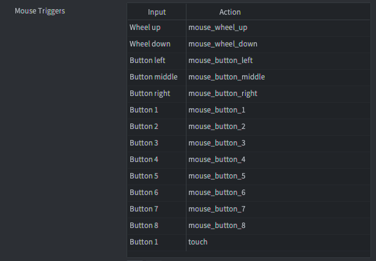

::: sidenote
Рекомендуется ознакомиться с общим принципом работы ввода в Defold, способами получения ввода и порядком получения ввода в файлах сценария. Узнайте больше о системе ввода в [руководстве](/manuals/input).
:::

# Триггеры мыши
Триггеры мыши позволяют привязать ввод от кнопок мыши и колеса прокрутки к игровым действиям.



::: sidenote
Вводы кнопок мыши `MOUSE_BUTTON_LEFT`, `MOUSE_BUTTON_RIGHT` м `MOUSE_BUTTON_MIDDLE` эквивалентно `MOUSE_BUTTON_1`, `MOUSE_BUTTON_2` м `MOUSE_BUTTON_3`.
:::

::: important
В приведенных ниже примерах используются действия, показанные на изображении выше. Как и в случае с любым другим вводом, вы можете называть свои действия по своему усмотрению.
:::

## Кнопки мыши
Кнопки мыши генерируют события нажатия, отпускания и повтора. Пример, показывающий, как обнаружить ввод для левой кнопки мыши (нажата или отпущена):

```lua
function on_input(self, action_id, action)
    if action_id == hash("mouse_button_left") then
        if action.pressed then
            -- left mouse button pressed
        elseif action.released then
            -- left mouse button released
        end
    end
end
```

::: important
`MOUSE_BUTTON_LEFT` (или `MOUSE_BUTTON_1`) действия ввода отправляются и для одиночных сенсорных вводов.
:::

## Колесико мыши
Входы колесика мыши определяют действия прокрутки. Поле `action.value` имеет значение `1`, если колесо прокручивается, и `0` в противном случае. (Действия прокрутки обрабатываются так же, как и нажатие кнопки. В настоящее время Defold не поддерживает мелкозернистый ввод прокрутки на сенсорных панелях).

```lua
function on_input(self, action_id, action)
    if action_id == hash("mouse_wheel_up") then
        if action.value == 1 then
            -- mouse wheel is scrolled up
        end
    end
end
```

## Движение мыши
Движение мыши обрабатывается отдельно. События движения мыши не принимаются, если в привязках ввода не установлен хотя бы один триггер мыши.

Движения мыши не привязаны к привязкам ввода, но `action_id` устанавливается в `nil`, а таблица `action` заполняется местоположением и дельта-перемещением позиции мыши.

```lua
function on_input(self, action_id, action)
    if action.x and action.y then
        -- let game object follow mouse/touch movement
        local pos = vmath.vector3(action.x, action.y, 0)
        go.set_position(pos)
    end
end
```

# Сенсорные триггеры
Триггеры типа Single-touch и Multi-touch доступны на устройствах iOS и Android в нативных приложениях и в пакетах HTML5.


## Single-touch
Триггеры типа "одиночное касание" не устанавливаются в разделе "Триггеры касания" в привязках ввода. Вместо этого **триггеры одиночного касания автоматически устанавливаются, когда вы настроили ввод кнопок мыши для `MOUSE_BUTTON_LEFT` или `MOUSE_BUTTON_1`**.

## Multi-touch
Триггеры типа мультитач заполняют таблицу в таблице действий под названием `touch`. Элементы таблицы индексируются целыми числами `1`--`N`, где `N` - количество точек касания. Каждый элемент таблицы содержит поля с входными данными:

```lua
function on_input(self, action_id, action)
    if action_id == hash("touch_multi") then
        -- Spawn at each touch point
        for i, touchdata in ipairs(action.touch) do
            local pos = vmath.vector3(touchdata.x, touchdata.y, 0)
            factory.create("#factory", pos)
        end
    end
end
```

::: important
Мультитач не должен назначаться на то же действие, что и ввод кнопки мыши для `MOUSE_BUTTON_LEFT` или `MOUSE_BUTTON_1`. Назначение того же действия будет эффективно отменять одно касание и не позволит вам получать события от "одиночного касания".
:::

::: sidenote
С помощью [Defold-Input asset](https://defold.com/assets/defoldinput/) можно легко настроить виртуальные экранные элементы управления, такие как кнопки и аналоговые стики с поддержкой мультитач.
:::


## Обнаружение нажатия или касания на объектах
Определение того, когда пользователь нажал или коснулся визуального компонента, является очень распространенной операцией, которая необходима во многих играх. Это может быть взаимодействие пользователя с кнопкой или другим элементом пользовательского интерфейса или взаимодействие с игровым объектом, таким как управляемый игроком юнит в стратегической игре, некоторое сокровище на уровне в dungeon crawler или quest giver в RPG. Подход к использованию варьируется в зависимости от типа визуального компонента.

### Обнаружение взаимодействия с узлами графического интерфейса пользователя
Для элементов пользовательского интерфейса существует функция `gui.pick_node(node, x, y)`, которая возвращает true или false в зависимости от того, находится ли указанная координата в границах узла пользовательского интерфейса или нет. Для получения дополнительной информации обратитесь к [документации API](/ref/gui/#gui.pick_node:node-x-y), примеру [указателя](/examples/gui/pointer_over/) или примеру [кнопки](/examples/gui/button/).

### Обнаружение взаимодействия с игровыми объектами
Для игровых объектов обнаружить взаимодействие сложнее, поскольку такие вещи, как перевод камеры и скрипт рендеринга, влияют на необходимые вычисления. Существует два общих подхода к обнаружению взаимодействия с игровыми объектами:

  1. Отслеживание положения и размера игровых объектов, с которыми может взаимодействовать пользователь, и проверяет, находится ли координата мыши или касания в границах любого из объектов.
  2. Прикрепление объекта столкновения к игровым объектам, с которыми пользователь может взаимодействовать, и один объект столкновения, который следует за мышью или пальцем, и проверяет столкновения между ними.

::: sidenote
Готовое решение для использования объектов столкновения для обнаружения пользовательского ввода с поддержкой перетаскивания и щелчка можно найти в [Defold-Input asset](https://defold.com/assets/defoldinput/).
:::

В обоих случаях необходимо преобразовать координаты мыши или сенсорного события из координат экранного пространства в координаты игровых объектов в мировом пространстве. Это можно сделать несколькими различными способами:

  * Вручную отслеживайте, какой вид и проекция используется скриптом рендеринга, и используйте это для преобразования в мировое пространство и обратно. Пример этого см. в [руководстве по работе с камерой](/manuals/camera/#converting-mouse-to-world-coordinates).
  * Используйте [стороннее решение для камеры](/manuals/camera/#third-party-camera-solutions) и воспользуйтесь предоставленными функциями преобразования экрана в мир.
