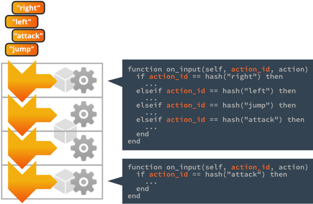
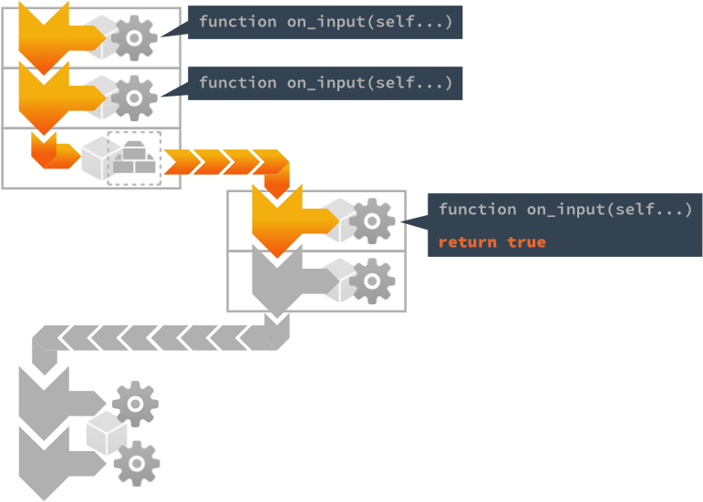

# Устройтво ввода

Весь пользовательский ввод перехватывается движком и передается в виде действий скпритам и GUI-скриптам в игровых объектах, которые получили фокус ввода и реализуют функцию `on_input()`. В этом руководстве объясняется, как настроить привязки для перехвата ввода и как создать код, реагирующий на него.

Система ввода использует набор простых и мощных концепций, позволяя вам управлять вводом так, как вы считаете нужным для вашей игры.


Устройства
: Устройства ввода, которые являются частью компьютера или мобильного устройства или подключены к нему, обеспечивают необработанный ввод данных на системном уровне в среду выполнения Defold. Поддерживаются следующие типы устройств:

  1. Клавиатура (отдельные клавиши, а также ввод текста)
  2. Мышь (положение, нажатия на кнопки и действия колесиком мыши)
  3. Касание сенсора (на устройствах iOS и Android и HTML5 на мобильных устройствах)
  4. Геймпады (поддерживаемые операционной системой и отображаемые в [файле](#gamepads-settings-file))

Привязка ввода
: Перед отправкой ввода в скрипт необработанный ввод от устройства преобразуется в осмысленные *actions* с помощью таблицы привязки ввода.

Действия
: Действия идентифицируются по (хешированным) именам, которые вы перечисляете в файле привязки ввода. Каждое действие также содержит соответствующие данные о вводе: нажатие или отпускание кнопки, координаты мыши и касания и т.д.

Слушатели ввода
: Любой компонент скрипта или GUI-скрипт может получать действия ввода и *фокус ввода*. Одновременно могут быть активны несколько слушателей.

стек ввода
: Список слушателей ввода. С первым получателем фокуса в нижней части  и последним получателем в верхней части соответсвенно.

Выбор получаемых входных данных
: Скрипт может выбрать получаемые входные данных, которые он получил, не позволяя слушателям, расположенным ниже по стеку, получить их.

## Настройка привязок ввода

Привязки ввода - это таблица в масштабе проекта, которая позволяет указать, как ввод устройства должен преобразовываться в именованные *actions*, прежде чем они будут отправлены компонентам скрипта и GUI-скрипта. Вы можете создать новый файл привязки ввода, <kbd>щелкнув правой кнопкой</kbd> в *Assets* и выбрав <kbd>New... ▸ Input Binding</kbd>. Чтобы движок использовал новый файл, измените запись *Game Binding* в *game.project*.


Файл привязки ввода по умолчанию автоматически создается во всех новых шаблонах проектов, поэтому обычно нет необходимости создавать новый файл привязки. Файл по умолчанию называется "game.input_binding" и находится в папке "input" в корне проекта. <kbd>Двойной щелчок</kbd> на файле откроет его в редакторе:


Чтобы создать новую привязку, нажмите кнопку <kbd>+</kbd> в нижней части соответствующего раздела типа триггера. Каждая запись имеет два поля:

*Input*
: Необработанный ввод для прослушивания, выбирается из прокручиваемого списка доступного ввода.

*Action*
: Действия, присваиваемое входным действиям имя при их создании и отправке в ваши скрипты. Одно и то же имя действия может быть присвоено нескольким входам. Например, вы можете связать клавишу <kbd>Space</kbd> и кнопку геймпада "A" с действием `jump`. Обратите внимание, что существует известная ошибка, когда сенсорный ввод, к сожалению, не могут иметь те же имена действий, что и другой ввод.

## Типы триггеров

Существует пять типов триггеров, которые можно создать для конкретного устройства:

Клавишные триггеры
: Одноклавишный ввод с клавиатуры. Каждая клавиша отдельно отображается на соответствующее действие. Подробнее в [руководстве](/manuals/input-key-and-text).

Текстовые триггеры
: Текстовые триггеры используются для чтения произвольного текстового ввода. Узнайте больше в [руководстве](/manuals/input-key-and-text)

Триггеры мыши
: Ввод с помощью кнопок мыши и колес прокрутки. Подробнее в [руководстве](/manuals/input-mouse-and-touch).

Сенсорные триггеры
: Single-touch и триггеры типа Multi-touch доступны на устройствах iOS и Android в нативных приложениях и в связках HTML5. Узнайте больше в [руководстве](/manuals/input-mouse-and-touch).

Триггеры геймпада
: Триггеры геймпада позволяют привязать стандартный ввод геймпада к игровым функциям. Узнайте больше в [руководстве](/manuals/input-gamepads).

### Ввод с акселерометра

В дополнение к пяти различным типам триггеров, перечисленным выше, Defold также поддерживает ввод данных с помощью акселерометра в собственных приложениях для Android и iOS. Установите флажок Use Accelerometer в разделе "Input" файла *game.project*.

```lua
function on_input(self, action_id, action)
    if action.acc_x and action.acc_y and action.acc_z then
        -- реагируем на данные акселерометра
    end
end
```

## Фокус ввода

Чтобы прослушивать действия ввода в компоненте скрипта или GUI-скрипта, сообщение `acquire_input_focus` должно быть отправлено игровому объекту, содержащему компонент:

```lua
-- сообщаем текущему игровому объекту ("."), чтобы он получил фокус ввода
msg.post(".", "acquire_input_focus")
```

Это сообщение инструктирует движок добавить компоненты с возможностью ввода (компоненты сценария, компоненты GUI и прокси коллекции) в игровых объектах в стек *ввода*. Компоненты игрового объекта помещаются на вершину стека ввода; компонент, добавленный последним, будет находиться на вершине стека. Обратите внимание, что если игровой объект содержит более одного компонента с возможностью ввода, все компоненты будут добавлены в стек:


IЕсли игровой объект, который уже получил фокус ввода, делает это снова, его компонент(ы) перемещается(ются) на вершину стека.


## Отправка ввода и on_input()

Действия ввода отправляются в соответствии со стеком ввода данных, сверху вниз.



У любого компонента, который находится в стеке, содержащем функцию `on_input()`, эта функция будет вызываться, один раз для каждого действия ввода в течение кадра, со следующими аргументами:

`self`
: Текущий скрипт.

`action_id`
: Хешированное имя действия, заданное в привязках ввода.

`action`
: Таблица, содержащая полезные данные о действии, такие как значение ввода, его местоположение (абсолютная и дельта-позиция), была ли кнопка ввода `нажата` и т.д. Подробности о доступных полях действия см. в [on_input()](/ref/go#on_input).

```lua
function on_input(self, action_id, action)
  if action_id == hash("left") and action.pressed then
    -- сдвигаемся влево
    local pos = go.get_position()
    pos.x = pos.x - 100
    go.set_position(pos)
  elseif action_id == hash("right") and action.pressed then
    -- сдвигаемся вправо
    local pos = go.get_position()
    pos.x = pos.x + 100
    go.set_position(pos)
  end
end
```


### Фокус ввода и компоненты прокси-коллекций

Каждый игровой мир, динамически загружаемый через прокси-коллекцию, имеет свой собственный стек ввода. Чтобы отправка действий достигла стека ввода загруженного мира, доверенный компонент должен находиться в стеке ввода основного мира. Все компоненты в стеке загруженного мира обрабатываются до того, как отправка продолжится в главном стеке:


::: important
Частая ошибка - забыть отправить `acquire_input_focus` игровому объекту, содержащему компонент прокси-коллекции. Пропуск этого шага не позволяет вводу достичь любого из компонентов в стеке ввода загруженного мира.
:::


### Освобождение ввода

Чтобы прекратить прослушивание действий ввода, отправьте игровому объекту сообщение `release_input_focus`. Это сообщение удалит все компоненты игрового объекта из стека ввода:

```lua
-- сообщим текущему игровому объекту ("."), чтобы он освободил фокус ввода.
msg.post(".", "release_input_focus")
```


## Обработка ввода

Компонент `on_input()` может активно контролировать, следует ли передавать действия дальше по стеку или нет:

- Если `on_input()` возвращает `false`, или возврат пропущен (это подразумевает возврат `nil`, который является ложным значением в Lua), действия ввода будут переданы следующему компоненту на стеке ввода.
- Если `on_input()` возвращает `true`, ввод обрабатывается. Ни один компонент, расположенный ниже по стеку ввода, не получит данные ввода. Обратите внимание, что это относится ко *всем* стекам ввода. Компонент на стеке прокси-загруженного мира может обрабатывать ввод, не позволяя компонентам на основном стеке получать ввод:



Есть много хороших примеров использования, когда обработка ввода обеспечивает простой и мощный способ переключения ввода между различными частями игры. Например, если вам нужно всплывающее меню, которое временно является единственной частью игры, которая прослушивает ввод:


Меню паузы изначально скрыто (отключено), а когда игрок касается элемента HUD "PAUSE", оно включается:

```lua
function on_input(self, action_id, action)
    if action_id == hash("mouse_press") and action.pressed then
        -- Проверяем, нажал ли игрок кнопку PAUSE?
        local pausenode = gui.get_node("pause")
        if gui.pick_node(pausenode, action.x, action.y) then
            -- Отображаем меню паузы
            msg.post("pause_menu", "show")
        end
    end
end
```


Меню паузы получает фокус ввода и ввод, предотвращая любой другой ввод, кроме того, который относится к всплывающему меню:

```lua
function on_message(self, message_id, message, sender)
  if message_id == hash("show") then
    -- Отображаем меню паузы.
    local node = gui.get_node("pause_menu")
    gui.set_enabled(node, true)

    -- Получаем данные ввода.
    msg.post(".", "acquire_input_focus")
  end
end

function on_input(self, action_id, action)
  if action_id == hash("mouse_press") and action.pressed then

    -- делаем что-нибудь...

    local resumenode = gui.get_node("resume")
    if gui.pick_node(resumenode, action.x, action.y) then
        -- Скрываем меню паузы
        local node = gui.get_node("pause_menu")
        gui.set_enabled(node, false)

        -- Освобождаем ввод.
        msg.post(".", "release_input_focus")
    end
  end

  -- Обрабатывеам все входные данные. Все, что находится ниже в стеке ввода
  -- никогда не увидит данные ввода, пока мы не освободим фокус ввода.
  return true
end
```
