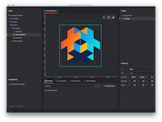
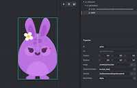
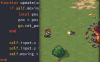
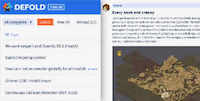

# Добро пожаловать в Defold

Defold --- это решение "под ключ", предоставляющее весь необходимый инструментарий для проектирования, разработки и выпуска игр. С полным списком поддерживаемых возможностей можно ознакомиться в нашем [обзоре продукта](/product).

Мы потратили много времени и усилий, ради того, чтобы ключевые элементы процесса разработки игр были как можно более плавными и непринужденными, и мы считаем, что за счет этого Defold выделяется из массы существующих решений. Узнайте [почему мы считаем, что вам стоит использовать именно Defold](/why).

## С чего начать?

Мы призываем вас экспериментировать, следовать урокам, читать наши руководства и документацию по API, а также принимать активное участие на форуме, чтобы учиться у других пользователей и следить за развитием Defold. Существует достаточно много документации в виде руководств, справочника по API, примеров и уроков. Если вы не знаете с чего начать, предлагаем некоторые указания:

#### Редактор
{.left} [Обзор редактора](/manuals/editor/) является отличным введением, помогающим сориентироваться в редакторе Defold, начать использовать визуальные инструменты и писать код. Если вы знакомы с программами 3D моделирования и программированием в IDE, сюрпризов должно быть немного, тем не менее всегда есть вещи, которые будут отличаться от привычного вам программного обеспечения.

#### Простые примеры
{.left} [Наша коллекция простых примеров](/examples/) является хорошим введением в процесс соединения частей вместе в нечто работающее. В Defold вы найдете минимальные примеры того, как справляться с различными повседневными задачами.

#### Язык Lua
{.left} [Defold использует Lua](/manuals/lua/) для всего своего контроля над логикой. Сам движок написан на C++ с акцентом на производительности, но управляется программами высокого уровня, написанными на Lua. Если вы программировали на Python, Javascript или любом другом языке высокого уровня, то Lua окажется не сложным для понимания и вы, вероятно, сможете просто следовать инструкциям. В противном случае, прочтите наше руководство по Lua для ознакомления с этим языком.

#### Уроки по созданию игр
{.left} Мы считаем, что вы можете учиться лучше, выполняя какие-либо задачи. Поэтому у нас есть подборка уроков различного уровня квалификации и сложности, доступных непосредственно из [редактора](/manuals/editor/). Запустите редактор и попробуйте выполнить один-два урока, чтобы узнать, как что-либо создавать и как работает Defold.

#### Структурные элементы Defold
{.left} [В Defold игры строятся посредством составления композиции из простых элементов](/manuals/building-blocks/), некоторые из которых окажутся знакомыми, если вы использовали другие движки. Из-за некоторых архитектурных решений, принятых в дизайне движка, ряд базовых концепций Defold отличаются своей специфичностью, и для достижения комфорта в работе с ними потребуется потратить некоторое время. Наше руководство по структурным элементам является хорошим началом, если вы чувствуете, что вам нужно тщательно разобраться в том, как это работает.

#### Форум
{.left} [Учиться у других](//forum.defold.com/) часто является лучшим способом обучения. Наше сообщество весьма дружелюбно и знает много о создании игр вообще и посредством Defold в частности. Если у вас когда-нибудь возникнут проблемы, не стесняйтесь и отправляйтесь на форум за помощью!

Помните, что независимо от того, по какому пути вы будете изучать Defold, вы всегда можете вернуться сюда за подробным объяснением различных функций и концепций, которые предоставляет Defold. И не стесняйтесь указывать на вещи, которые вы не понимаете или считаете неправильными. Эти страницы предназначены для вас, и мы хотим сделать их как можно доступнее.

Мы надеемся, что вы останетесь довольны процессом создания своей следующей потрясающей игры в Defold!
