# Разработка для iOS

::: sidenote
Бандлинг игры для iOS доступен только в версии редактора Defold для Mac.
:::

iOS требует, чтобы _любое_ приложение, которое вы собираете и хотите запускать на телефоне или планшете, _обязательно_ было подписано сертификатом и provisioning profile, выданными Apple. В этом руководстве описаны шаги, необходимые для создания iOS-бандла вашей игры. Во время разработки часто предпочтительнее запускать игру через [development app](/manuals/dev-app), поскольку это позволяет использовать hot reload контента и кода прямо на устройстве.

## Процесс подписи кода у Apple

Безопасность, связанная с iOS-приложениями, состоит из нескольких компонентов. Доступ к необходимым инструментам можно получить, зарегистрировавшись в [Apple iOS Developer Program](https://developer.apple.com/programs/). После регистрации перейдите в [Apple Developer Member Center](https://developer.apple.com/membercenter/index.action).


Раздел *Certificates, Identifiers & Profiles* содержит все инструменты, которые вам нужны. Здесь можно создавать, удалять и редактировать:

Certificates
: Выданные Apple криптографические сертификаты, идентифицирующие вас как разработчика. Можно создавать сертификаты для разработки или для продакшна. Сертификаты разработчика позволяют тестировать некоторые функции, например механизм встроенных покупок, в sandbox-среде. Продакшн-сертификаты используются для подписи финального приложения перед загрузкой в App Store. Сертификат нужен для подписи приложений до того, как их можно будет установить на устройство для тестирования.

Identifiers
: Идентификаторы для различных целей. Можно регистрировать wildcard-идентификаторы (например, `some.prefix.*`), которые могут использоваться несколькими приложениями. App ID могут содержать информацию о сервисах приложения, например о включенной интеграции с Passbook, Game Center и т.д. Такие App ID не могут быть wildcard-идентификаторами. Чтобы сервисы приложения работали, *bundle identifier* вашего приложения должен совпадать с идентификатором App ID.

Devices
: Каждое устройство для разработки должно быть зарегистрировано по своему UDID (Unique Device IDentifier, см. ниже).

Provisioning Profiles
: Provisioning profile связывают сертификаты с App ID и списком устройств. Они определяют, какое приложение, какого разработчика и на каких устройствах может быть установлено.

При подписи игр и приложений в Defold вам нужны действительный сертификат и действительный provisioning profile.

::: sidenote
Часть действий, которые доступны на странице Member Center, можно выполнять и из среды разработки Xcode, если она у вас установлена.
:::

Device identifier (UDID)
: UDID устройства iOS можно узнать, подключив устройство к компьютеру по Wi-Fi или кабелю. Откройте Xcode и выберите <kbd>Window ▸ Devices and Simulators</kbd>. Серийный номер и идентификатор будут показаны после выбора устройства.

  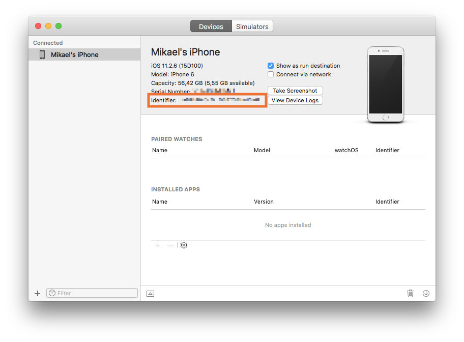

  Если Xcode не установлен, идентификатор можно найти в iTunes. Нажмите на значок устройств и выберите свое устройство.

  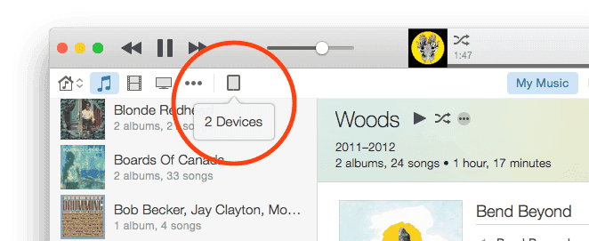

  1. На странице *Summary* найдите *Serial Number*.
  2. Нажмите на *Serial Number* один раз, чтобы поле изменилось на *UDID*. Если нажимать дальше, будут отображаться разные сведения об устройстве. Просто продолжайте нажимать, пока не появится *UDID*.
  3. Щелкните правой кнопкой мыши по длинной строке UDID и выберите <kbd>Copy</kbd>, чтобы скопировать идентификатор в буфер обмена и затем легко вставить его в поле UDID при регистрации устройства в Apple Developer Member Center.

## Разработка с использованием бесплатного аккаунта Apple developer

Начиная с Xcode 7 любой может установить Xcode и бесплатно разрабатывать под реальные устройства. Регистрироваться в iOS Developer Program не обязательно. Вместо этого Xcode автоматически выдаст вам сертификат разработчика (действует 1 год) и provisioning profile для вашего приложения (действует 1 неделю) на конкретном устройстве.

1. Подключите устройство.
2. Установите Xcode.
3. Добавьте в Xcode новую учетную запись и войдите с помощью Apple ID.
4. Создайте новый проект. Самый простой вариант "Single View App" подойдет.
5. Выберите свою "Team" (она будет создана автоматически) и задайте bundle identifier приложения.

::: important
Запишите bundle identifier, так как в проекте Defold нужно использовать точно такой же bundle identifier.
:::

6. Убедитесь, что Xcode создал для приложения *Provisioning Profile* и *Signing Certificate*.

   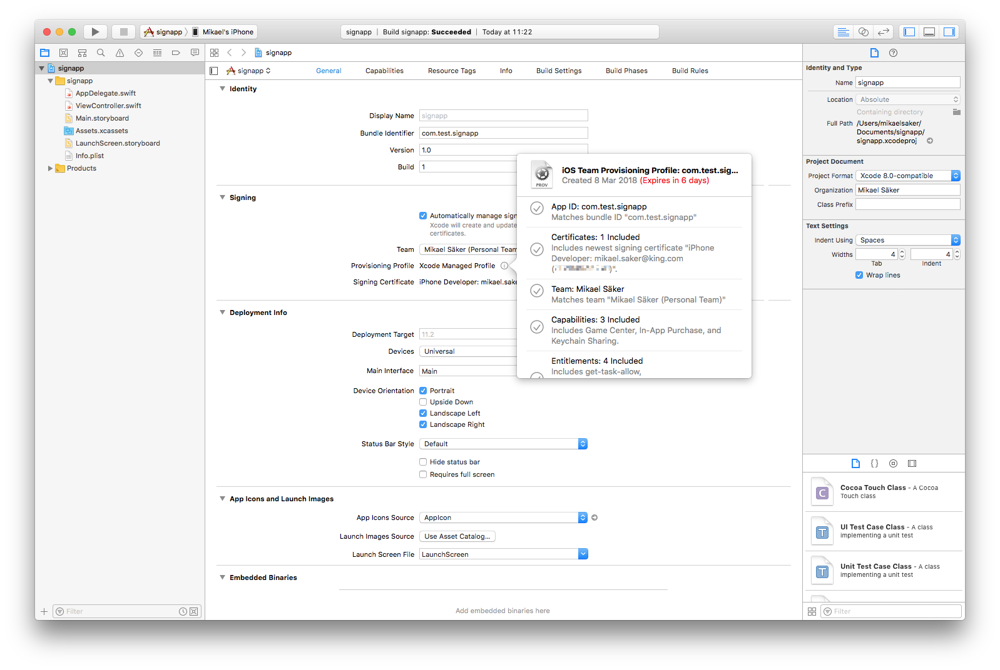

7. Соберите приложение на устройстве. При первом запуске Xcode попросит включить Developer mode и подготовит устройство для отладки. Это может занять некоторое время.
8. Когда вы убедитесь, что приложение работает, найдите его на диске. Путь к сборке можно увидеть в Build report в "Report Navigator".

   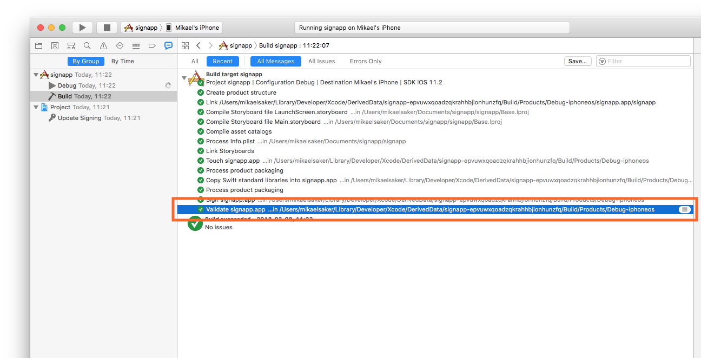

9. Найдите приложение, щелкните по нему правой кнопкой мыши и выберите <kbd>Show Package Contents</kbd>.

   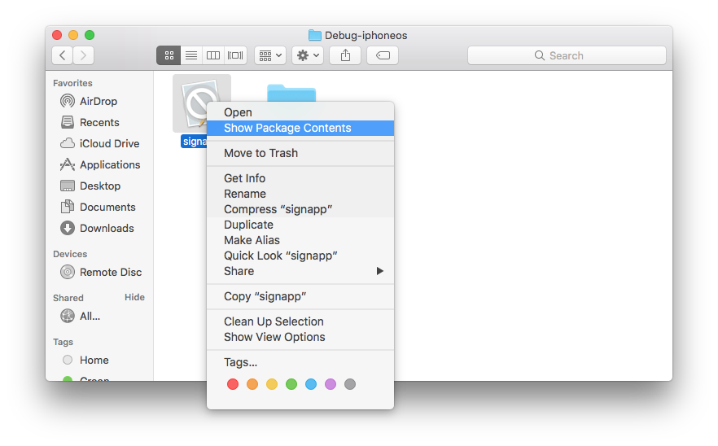

10. Скопируйте файл "embedded.mobileprovision" в удобное место на диске.

   

Этот provisioning-файл можно использовать вместе с вашей code signing identity для подписи приложений в Defold в течение одной недели.

Когда срок действия provisioning profile истечет, нужно снова собрать приложение в Xcode и получить новый временный provisioning-файл, как описано выше.

## Создание iOS application bundle

Когда у вас есть code signing identity и provisioning profile, можно создавать самостоятельный application bundle для игры из редактора. Просто выберите в меню <kbd>Project ▸ Bundle... ▸ iOS Application...</kbd>.


Выберите свою code signing identity и укажите mobile provisioning file. Также выберите архитектуры (32-bit, 64-bit и iOS simulator), для которых нужно создать бандл, а также вариант сборки (Debug или Release). При необходимости можно снять флажок `Sign application`, чтобы пропустить процесс подписи и выполнить его вручную позже.

::: important
При тестировании игры на iOS simulator флажок `Sign application` **обязательно** нужно снять. Приложение установится, но не запустится, если оставить подпись включенной.
:::

Нажмите *Create Bundle*, после чего будет предложено выбрать место на компьютере, куда будет сохранен бандл.

{.left}

Иконку приложения, launch screen storyboard и другие параметры вы задаете в файле настроек проекта *game.project* в [разделе iOS](/manuals/project-settings/#ios).

:[Build Variants](../shared/build-variants.md)

## Установка и запуск бандла на подключенном iPhone

Можно установить и запустить собранный бандл, используя флажки редактора "Install on connected device" и "Launch installed app" в диалоге Bundle:

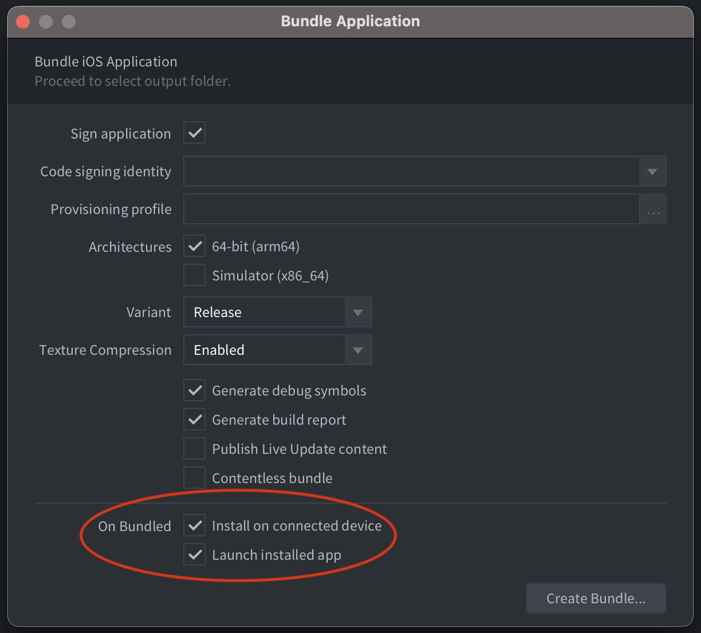

Для работы этой функции должен быть установлен консольный инструмент [ios-deploy](https://github.com/ios-control/ios-deploy). Проще всего установить его через Homebrew:
```
$ brew install ios-deploy
```

Если редактор не может определить путь установки инструмента ios-deploy, его нужно указать вручную в [Preferences](/manuals/editor-preferences/#tools).

### Создание storyboard

Файл storyboard создается в Xcode. Запустите Xcode и создайте новый проект. Выберите iOS и Single View App:

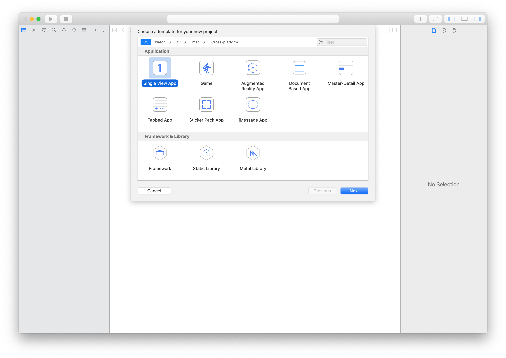

Нажмите Next и перейдите к настройке проекта. Укажите Product Name:

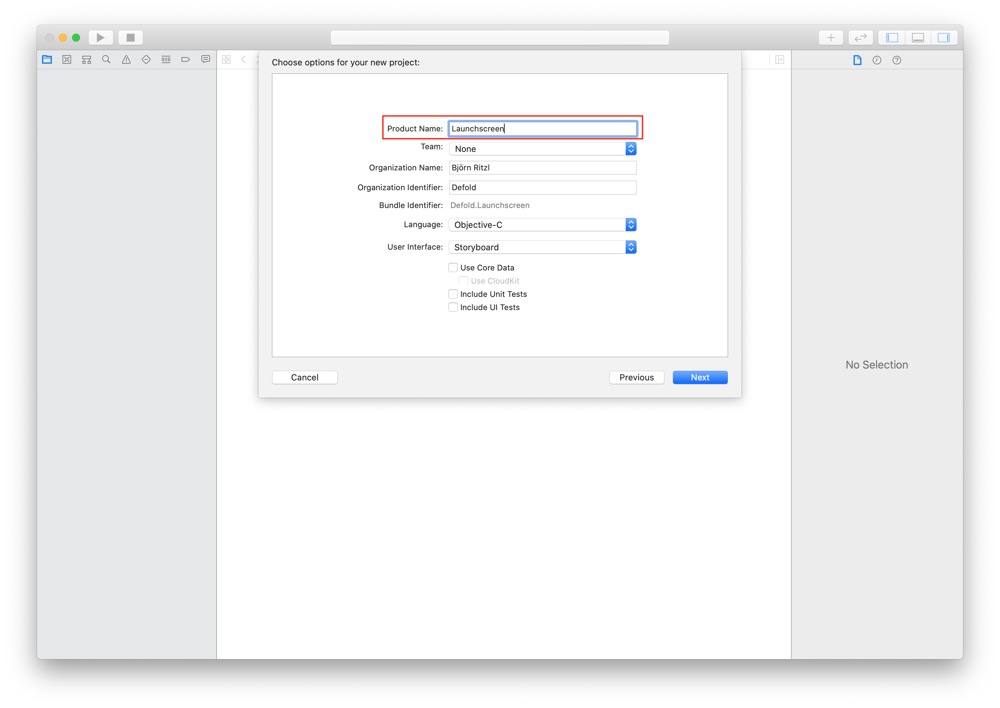

Нажмите Create для завершения. Проект создан, и можно переходить к созданию storyboard:

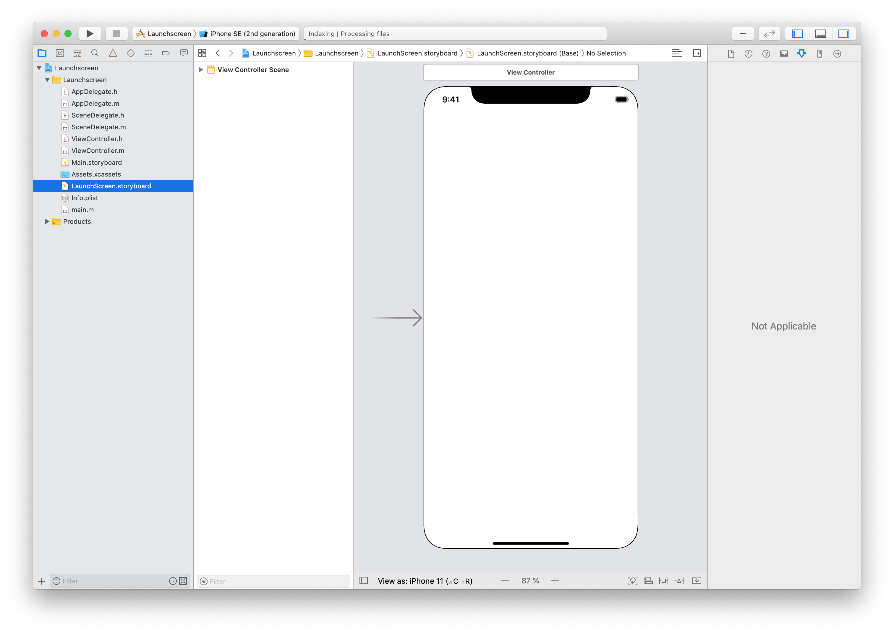

Перетащите изображение, чтобы импортировать его в проект. Затем выберите `Assets.xcassets` и поместите изображение в `Assets.xcassets`:

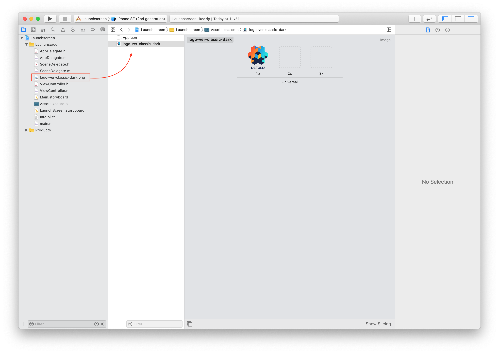

Откройте `LaunchScreen.storyboard` и нажмите кнопку плюс (<kbd>+</kbd>). Введите "imageview", чтобы найти компонент ImageView.

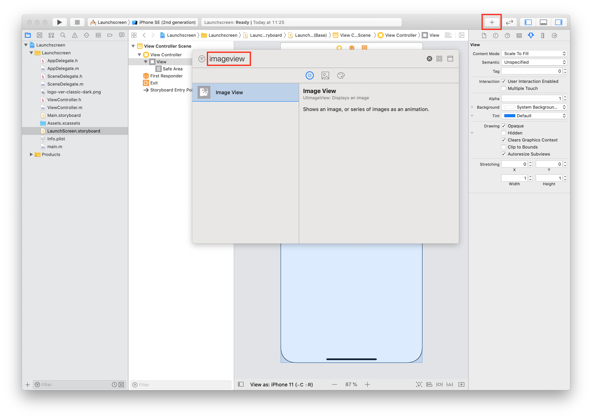

Перетащите компонент Image View на storyboard:

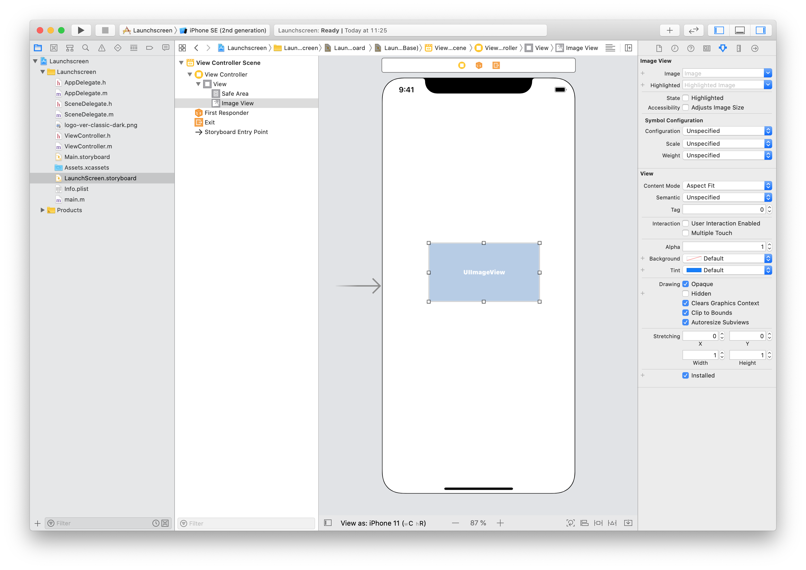

Выберите изображение, которое вы ранее добавили в `Assets.xcassets`, в выпадающем списке Image:

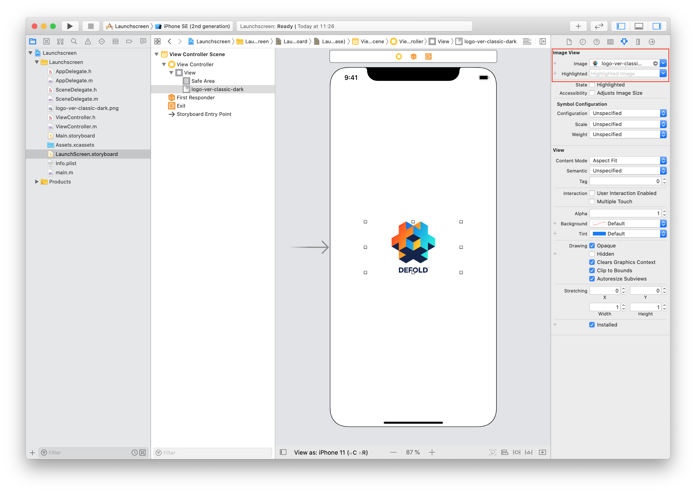

Разместите изображение и внесите любые другие нужные изменения, например добавьте Label или другой UI-элемент. Когда все будет готово, установите активную схему "Build -> Any iOS Device (`arm64`, `armv7`)" (или "Generic iOS Device") и выберите Product -> Build. Дождитесь окончания сборки.

::: sidenote
Если у вас доступен только вариант "Any iOS Device (`arm64`)", измените `iOS Deployment target` на 10.3 в настройках "Project -> Basic -> Deployment". Это сделает ваш storyboard совместимым с устройствами `armv7` (например, iPhone5c).
:::

Если вы используете изображения в storyboard, они не будут автоматически включены в `LaunchScreen.storyboardc`. Используйте поле `Bundle Resources` в *game.project*, чтобы включить эти ресурсы.
Например, создайте в проекте Defold папку `LaunchScreen` и внутри нее папку `ios` (`ios` нужна, чтобы включать эти файлы только в iOS-бандлы), затем положите файлы в `LaunchScreen/ios/`. Добавьте этот путь в `Bundle Resources`.

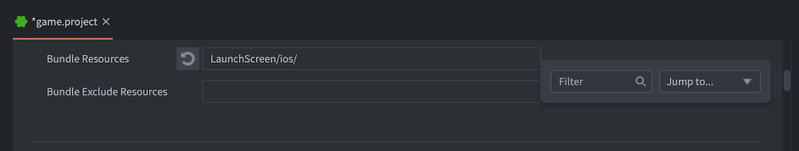

Последний шаг — скопировать скомпилированный файл `LaunchScreen.storyboardc` в ваш проект Defold. Откройте Finder по следующему пути и скопируйте `LaunchScreen.storyboardc` в проект Defold:

    /Library/Developer/Xcode/DerivedData/YOUR-PRODUCT-NAME-cbqnwzfisotwygbybxohrhambkjy/Build/Intermediates.noindex/YOUR-PRODUCT-NAME.build/Debug-iphonesimulator/YOUR-PRODUCT-NAME.build/Base.lproj/LaunchScreen.storyboardc

::: sidenote
Пользователь форума Sergey Lerg подготовил [видеоруководство, показывающее этот процесс](https://www.youtube.com/watch?v=6jU8wGp3OwA&feature=emb_logo).
:::

Когда у вас будет файл storyboard, вы сможете указать его в *game.project*.


### Создание icon asset catalog

::: sidenote
Это обязательно начиная с Defold 1.2.175.
:::

Использование asset catalog — предпочтительный для Apple способ управления иконками приложения. Фактически только так можно предоставить иконку, используемую в листинге App Store. Asset catalog создается так же, как storyboard, через Xcode. Запустите Xcode и создайте новый проект. Выберите iOS и Single View App:


Нажмите Next и перейдите к настройке проекта. Укажите Product Name:

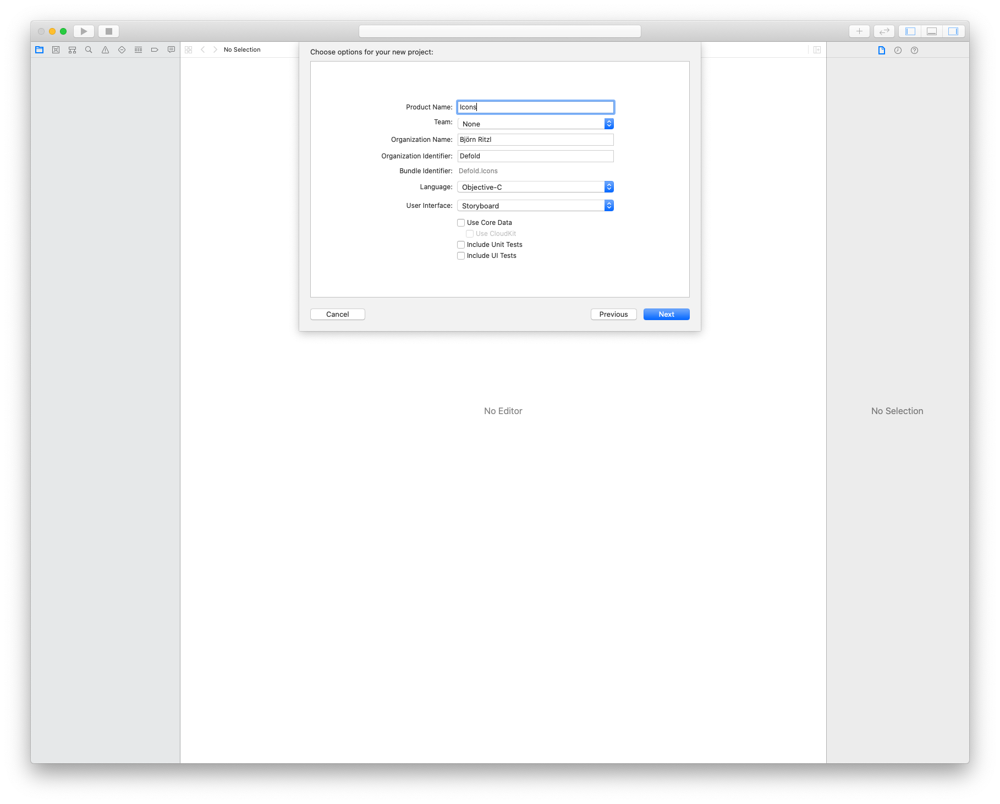

Нажмите Create для завершения. Проект создан, и можно переходить к созданию asset catalog:

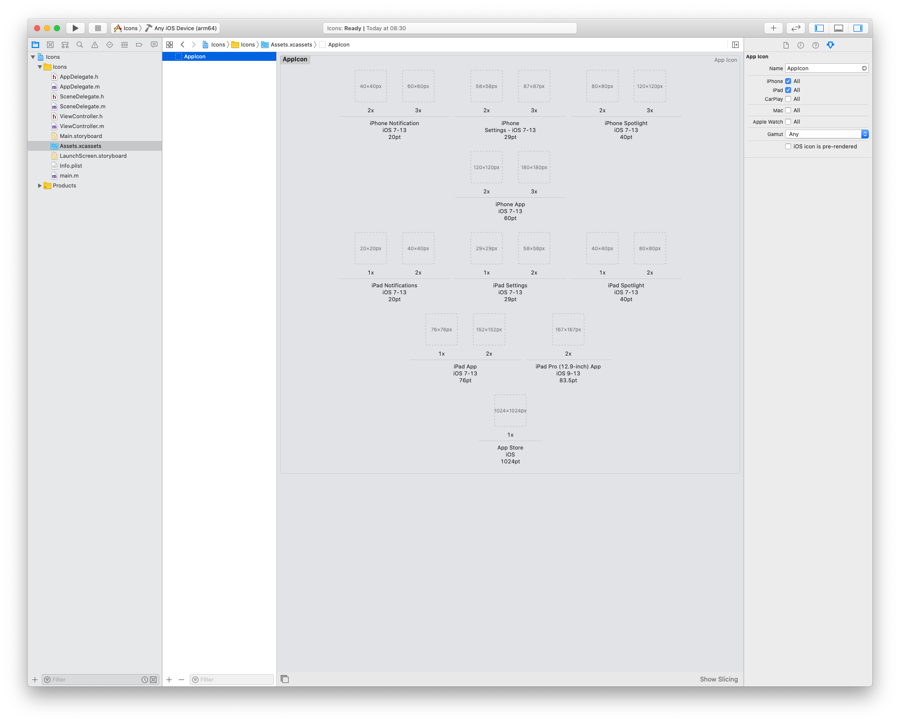

Перетащите изображения в пустые ячейки, соответствующие различным поддерживаемым размерам иконок:

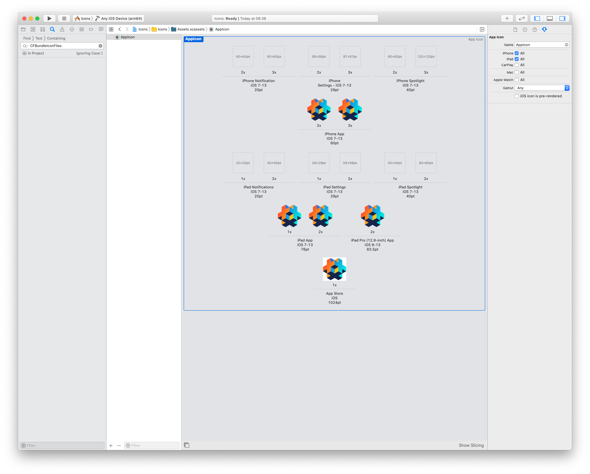

::: sidenote
Не добавляйте иконки для Notifications, Settings или Spotlight.
:::

Когда все будет готово, установите активную схему "Build -> Any iOS Device (arm64)" (или "Generic iOS Device") и выберите <kbd>Product</kbd> -> <kbd>Build</kbd>. Дождитесь окончания сборки.

::: sidenote
Убедитесь, что сборка выполняется для "Any iOS Device (arm64)" или "Generic iOS Device", иначе при загрузке билда вы получите ошибку `ERROR ITMS-90704`.
:::

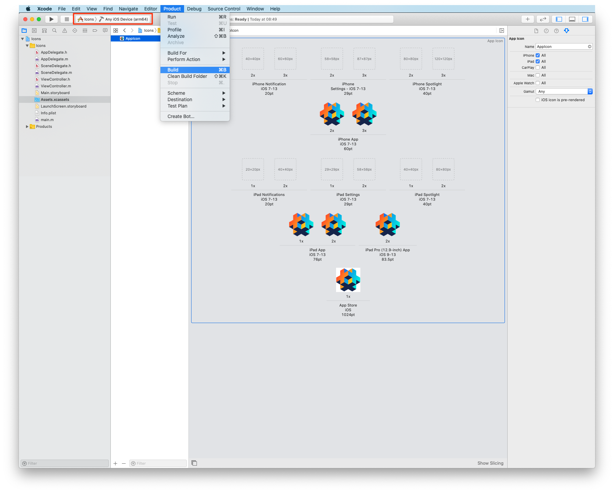

Последний шаг — скопировать скомпилированный файл `Assets.car` в проект Defold. Откройте Finder по следующему пути и скопируйте `Assets.car` в проект Defold:

    /Library/Developer/Xcode/DerivedData/YOUR-PRODUCT-NAME-cbqnwzfisotwygbybxohrhambkjy/Build/Products/Debug-iphoneos/Icons.app/Assets.car

Когда у вас будет файл asset catalog, его и иконки можно будет указать в *game.project*:

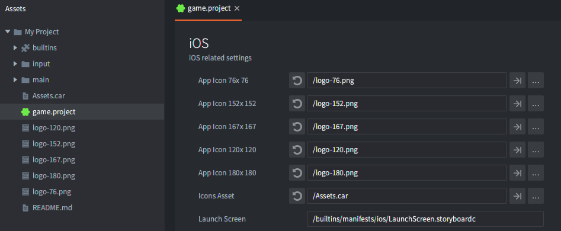

::: sidenote
Иконку App Store не нужно указывать в *game.project*. Она автоматически извлекается из файла `Assets.car` при загрузке в iTunes Connect.
:::


## Установка iOS application bundle

Редактор создает файл *.ipa*, который является iOS application bundle. Чтобы установить его на устройство, можно использовать один из следующих инструментов:

* Xcode через окно "Devices and Simulators"
* консольный инструмент [`ios-deploy`](https://github.com/ios-control/ios-deploy)
* [`Apple Configurator 2`](https://apps.apple.com/us/app/apple-configurator-2/) из macOS App Store
* iTunes

Также можно использовать консольный инструмент `xcrun simctl` для работы с iOS simulator, доступными через Xcode:

```
# show a list of available devices
xcrun simctl list

# boot an iPhone X simulator
xcrun simctl boot "iPhone X"

# install your.app to a booted simulator
xcrun simctl install booted your.app

# launch the simulator
open /Applications/Xcode.app/Contents/Developer/Applications/Simulator.app
```

:[Apple Privacy Manifest](../shared/apple-privacy-manifest.md)


## Информация Export Compliance

Когда вы отправляете игру в App Store, вам будет предложено указать информацию Export Compliance относительно использования шифрования в приложении. [Apple объясняет, почему это требуется](https://developer.apple.com/documentation/security/complying_with_encryption_export_regulations):

"When you submit your app to TestFlight or the App Store, you upload your app to a server in the United States. If you distribute your app outside the U.S. or Canada, your app is subject to U.S. export laws, regardless of where your legal entity is based. If your app uses, accesses, contains, implements, or incorporates encryption, this is considered an export of encryption software, which means your app is subject to U.S. export compliance requirements, as well as the import compliance requirements of the countries where you distribute your app."

Игровой движок Defold использует шифрование для следующих целей:

* Выполнение запросов по защищенным каналам (например, HTTPS и SSL)
* Защита Lua-кода авторским правом (чтобы предотвратить копирование)

Эти варианты использования шифрования в движке Defold освобождены от требований по предоставлению документов Export Compliance в соответствии с законодательством США и Европейского союза. Большинство проектов на Defold останутся освобожденными от этих требований, но добавление других криптографических методов может изменить этот статус. Вы обязаны самостоятельно убедиться, что проект соответствует требованиям этих законов и правилам App Store. Дополнительную информацию см. в документе Apple [Export Compliance Overview](https://help.apple.com/app-store-connect/#/dev88f5c7bf9).

Если вы считаете, что ваш проект освобожден от этих требований, установите ключ [`ITSAppUsesNonExemptEncryption`](https://developer.apple.com/documentation/bundleresources/information-property-list/itsappusesnonexemptencryption) в `False` в `Info.plist` проекта. Подробнее см. в [Application Manifests](/manuals/extensions-manifest-merge-tool).

## FAQ
:[iOS FAQ](../shared/ios-faq.md)
