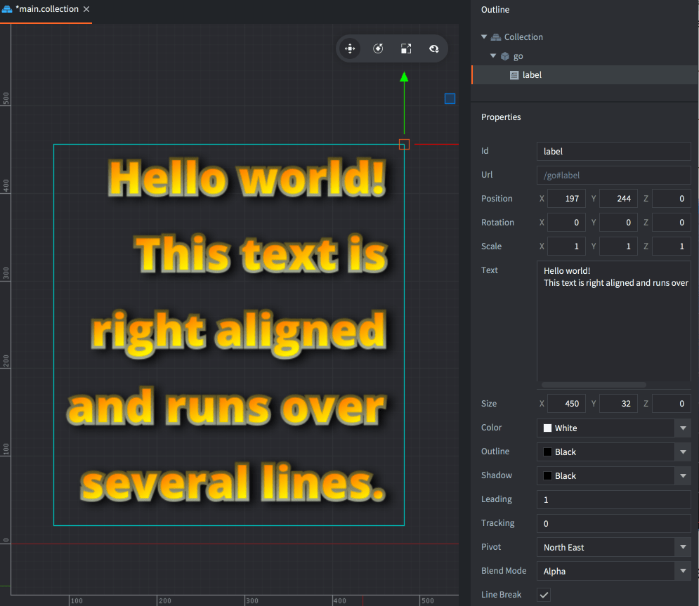

# Компонент Label

Компонент *Label* визуализирует фрагмент текста на экране в игровом пространстве. По умолчанию он упорядочивается и отрисовывается вместе со всей графикой спрайтов и тайлов. Компонент имеет набор свойств, определяющих способ визуализации текста. В Defold GUI поддерживает текст, но размещение элементов GUI в пространстве игры может оказаться сложной задачей. Текстовые метки эту задачу облегчают.

## Создание текстовой метки

Чтобы создать компонент Label, <kbd>кликните ПКМ</kbd> на игровом объекте и выберите <kbd>Add Component ▸ Label</kbd>.


(Если необходимо создать несколько текстовых меток из одного шаблона, лучше создать новый файл компонента Label: <kbd>кликните ПКМ</kbd> в папке в браузере *Assets* и выберите <kbd>New... ▸ Label</kbd>, затем добавьте этот файл в качестве компонента к любым игровым объектам.)


В свойстве *Font* укажите необходимый шрифт и убедитесь, что в свойстве *Material* установлен материал, соответствующий типу шрифта:


## Свойства текстовой метки

Помимо свойств *Id*, *Position*, *Rotation* и *Scale* существуют следующие специфичные для компонента свойства:

*Text*
: Текстовое содержимое метки.

*Size*
: Размер ограничивающей рамки текста. Если опция *Line Break* включена, ширина задает границу прерывания текста.

*Color*
: Цвет текста.

*Outline*
: Цвет обводки.

*Shadow*
: Цвет тени.

::: sidenote
Следует отметить, что в материале по умолчанию рендеринг теней отключен по соображениям производительности.
:::

*Leading*
: Коэффициент масштаба для межстрочного интервала. Значение 0 отменяет межстрочный интервал. По умолчанию 1.

*Tracking*
: Коэффициент масштаба для межбуквенного интервала. По умолчанию 0.

*Pivot*
: Опорная точка. Используется при изменении способа выравнивания текста (см. ниже).

*Blend Mode*
: Режим наложения, используемый при рендеринге текстовой метки.

*Line Break*
: Выравнивание текста происходит в соответствии с настройками опорной точки (пивота), а включение данной опции позволяет тексту перетекать в несколько строк. Ширина компонента определяет, в каком месте текст будет разрываться. Следует учитывать, что в тексте должен быть пробел, чтобы он мог прерываться.

*Font*
: Ресурс шрифта, используемый для этой метки.

*Material*
: Материал, используемый для рендеринга этой метки. Убедитесь, что выбран материал, созданный для используемого типа шрифта (bitmap, Distance Field или BMFont).

### Режимы наложения
:[blend-modes](../shared/blend-modes.md)

### Опорная точка и выравнивание

Настроив свойство *Pivot*, можно изменять режим выравнивания текста.

*Center*
: Если пивот установлен в значение `Center`, `North` или `South`, текст выравнивается по центру.

*Left*
: Если пивот установлен в какой-либо режим `West`, текст выравнивается по левому краю.

*Right*
: Если пивот установлен в какой-либо режим `East`, текст выравнивается по правому краю.



## Манипулирование при выполнении

Текстовыми метками можно манипулировать во время выполнения, получая и устанавливая текст метки, а также изменяя другие свойства.

`color`
: Цвет метки (`vector4`)

`outline`
: Цвет обводки (`vector4`)

`shadow`
: Цвет тени (`vector4`)

`scale`
: Масштаб метки, либо `number` для равномерного масштабирования, либо `vector3` для масштабирования индивидуально по каждой из осей.

`size`
: Размер метки (`vector3`)

```lua
function init(self)
    -- Задать текст компоненту "my_label" в том же игровом объекте,
    -- что и этот скрипт.
    label.set_text("#my_label", "New text")
end
```

```lua
function init(self)
    -- Задать цвет компоненту "my_label" в том же игровом объекте,
    -- что и этот скрипт. Цвет представляется значением RGBA, хранящимся как тип vector4.
    local grey = vmath.vector4(0.5, 0.5, 0.5, 1.0)
    go.set("#my_label", "color", grey)

    -- ...и убрать обводку, установив ее альфу в 0...
    go.set("#my_label", "outline.w", 0)

    -- ...и увеличить масштаб в два раза по оси X.
    local scale_x = go.get("#my_label", "scale.x")
    go.set("#my_label", "scale.x", scale_x * 2)
end
```

## Конфигурация проекта

В файле *game.project* имеются несколько [проектных настроек](/manuals/project-settings#label), относящихся к текстовым меткам.
