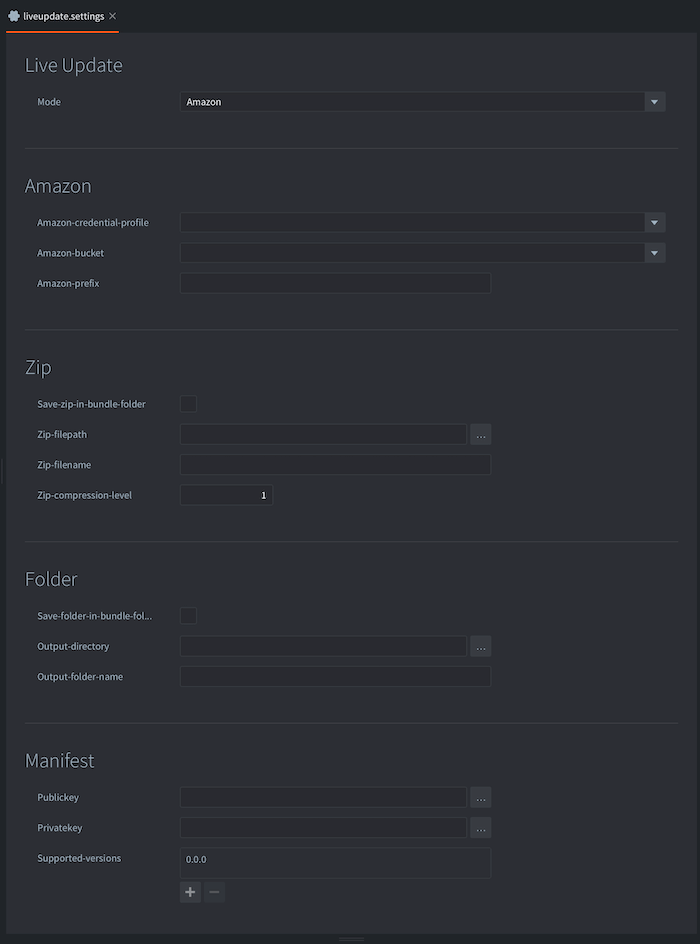
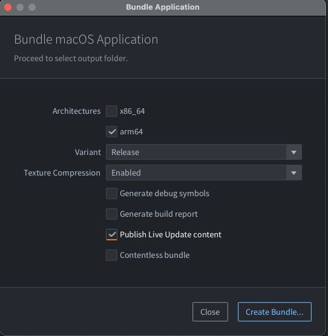
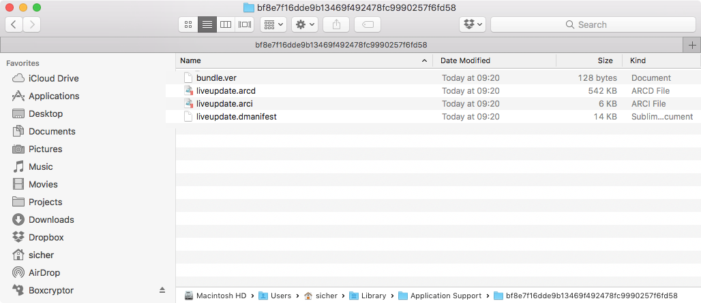

# Live Update

При бандлинге игры Defold упаковывает все игровые ресурсы в итоговый платформо-зависимый пакет. В большинстве случаев это предпочтительно, поскольку запущенный движок получает мгновенный доступ ко всем ресурсам и может быстро загружать их из хранилища. Однако бывают ситуации, когда загрузку ресурсов нужно отложить до более позднего этапа. Например:

- В вашей игре есть серия эпизодов, и вы хотите включить только первый, чтобы игроки могли попробовать игру, прежде чем решат, хотят ли они продолжить остальные.
- Ваша игра нацелена на HTML5. В браузере загрузка приложения из хранилища означает, что весь пакет приложения должен быть скачан до запуска. На такой платформе может быть разумно отправить минимальный стартовый пакет, быстро запустить приложение, а остальную часть ресурсов игры догрузить позже.
- Игра содержит очень большие ресурсы (изображения, видео и т.д.), загрузку которых вы хотите отложить до момента, когда они действительно понадобятся в игре. Это помогает уменьшить размер установки.

Функциональность Live Update расширяет концепцию collection proxy механизмом, который позволяет во время выполнения загружать и сохранять в бандл приложения ресурсы, намеренно исключенные из него при сборке.

Она позволяет разделить контент на несколько архивов:

* _Base Archive_
* Общие файлы уровня
* Набор уровней 1
* Набор уровней 2
* ...

## Подготовка контента для Live Update

Предположим, мы делаем игру, содержащую большие изображения высокого разрешения. Игра хранит эти изображения в коллекциях, содержащих game object и sprite с изображением:


Чтобы движок загружал такую коллекцию динамически, достаточно добавить компонент collection proxy и указать в нем *`monalisa.collection`*. После этого игра сможет сама решать, когда загружать контент коллекции из хранилища в память, отправляя collection proxy сообщение `load`. Однако мы хотим пойти дальше и самостоятельно управлять загрузкой ресурсов, содержащихся в коллекции.

Это делается очень просто: установите флажок *Exclude* в свойствах collection proxy, тем самым указав Defold исключить весь контент из *`monalisa.collection`* при создании бандла приложения.

::: important
Любые ресурсы, на которые ссылается базовый пакет игры, исключены не будут.
:::


## Настройки Live Update

Когда Defold создает бандл приложения, ему нужно где-то сохранить все исключенные ресурсы. Настройки проекта для Live Update определяют местоположение этих ресурсов. Они находятся в <kbd>Project ▸ Live update Settings...</kbd>. Если файл настроек еще не существует, он будет создан. Затем в *game.project* выберите, какой файл настроек Live Update использовать при бандлинге. Это позволяет применять разные настройки Live Update для разных окружений, например production, QA, development и т.д.



Сейчас Defold может хранить ресурсы двумя способами. Выберите способ в выпадающем списке *Mode* в окне настроек:

`Zip`
: Эта опция указывает Defold создать Zip-архив со всеми исключенными ресурсами. Архив сохраняется в месте, указанном в настройке *Export path*.

`Folder`
: Эта опция указывает Defold создать папку со всеми исключенными ресурсами. Она работает точно так же, как Zip, но использует директорию вместо архива. Это может быть полезно, если вам нужно дополнительно обработать файлы перед загрузкой и вы планируете самостоятельно упаковать их в архив.

`Amazon`
: Эта опция указывает Defold автоматически загружать исключенные ресурсы в Amazon Web Service (AWS) S3 bucket. Укажите имя профиля AWS в *Credential profile*, выберите подходящий *Bucket* и задайте имя *Prefix*. Подробнее о настройке учетной записи AWS можно прочитать в этом [руководстве по AWS](/manuals/live-update-aws).

## Бандлинг с Live Update

::: important
Сборка и запуск из редактора (<kbd>Project ▸ Build</kbd>) не поддерживают Live Update. Чтобы протестировать Live Update, необходимо собрать бандл проекта.
:::

Собрать приложение с Live Update просто. Выберите <kbd>Project ▸ Bundle ▸ ...</kbd>, а затем платформу, для которой хотите создать бандл приложения. Откроется диалог сборки:



При бандлинге любой исключенный ресурс будет оставлен вне бандла приложения. Если установить флажок *Publish Live update content*, Defold либо загрузит исключенные ресурсы в Amazon, либо создаст Zip-архив, в зависимости от того, как настроен Live Update (см. выше). Файл manifest для бандла также будет включен в состав исключенных ресурсов.

Нажмите *Package* и выберите расположение для бандла приложения. После этого можно запустить приложение и убедиться, что все работает как ожидается.

## Архивы .zip

Файл .zip для Live Update содержит файлы, которые были исключены из базового пакета игры.

Хотя текущий пайплайн поддерживает создание только одного .zip-файла, на практике этот zip можно разделить на несколько более мелких .zip-файлов. Это позволяет уменьшить размер загрузок для игры: наборы уровней, сезонный контент и т.д. Каждый .zip-файл также содержит manifest-файл, описывающий метаданные для каждого ресурса внутри архива.

## Разделение архивов .zip

Часто бывает полезно разделить исключенный контент на несколько небольших архивов для более точного управления использованием ресурсов. Один из примеров — разбить игру с уровнями на несколько наборов уровней. Другой пример — вынести разные праздничные UI-декорации в отдельные архивы и загружать и монтировать только тему, которая сейчас актуальна по календарю.

Граф ресурсов хранится в `build/default/game.graph.json` и автоматически создается каждый раз при бандлинге проекта. Сгенерированный файл содержит список всех ресурсов проекта и зависимости каждого ресурса. Пример записи:

```json
{
  "path" : "/game/player.goc",
  "hexDigest" : "caa342ec99794de45b63735b203e83ba60d7e5a1",
  "children" : [ "/game/ship.spritec", "/game/player.scriptc" ]
}
```

Каждая запись имеет `path`, представляющий уникальный путь ресурса внутри проекта. Поле `hexDigest` представляет криптографический отпечаток ресурса и именно оно будет использоваться как имя файла внутри liveupdate .zip-архива. Наконец, поле `children` содержит список других зависимостей, от которых зависит этот ресурс. В примере выше `/game/player.goc` зависит от sprite и script-компонента.

Можно разобрать файл `game.graph.json` и использовать эту информацию, чтобы находить группы записей в графе ресурсов и сохранять соответствующие им ресурсы в отдельных архивах вместе с исходным manifest-файлом (во время выполнения manifest-файл будет усечен так, чтобы содержать только файлы, находящиеся в архиве).

## Live Update на Android

Для загрузки и монтирования контента Live Update можно использовать Play Asset Delivery. Подробнее [в официальном руководстве](https://defold.com/extension-pad/).

## Проверка контента

Одна из ключевых возможностей системы Live Update состоит в том, что теперь можно использовать множество контентных архивов, потенциально даже из разных версий Defold.

Стандартное поведение `liveupdate.add_mount()` состоит в том, чтобы проверять версию движка при подключении mount.
Это означает, что и базовый архив игры, и архив(ы) live update должны быть созданы одновременно, с использованием одной и той же версии движка, через опцию bundle. Иначе это сделает все ранее загруженные клиентом архивы недействительными и вынудит его скачать контент заново.

Это поведение можно отключить с помощью флага в options.
Если его отключить, ответственность за проверку совместимости контента полностью ложится на разработчика: именно он должен гарантировать, что каждый архив live update будет работать с текущим движком.

Мы рекомендуем хранить для каждого mount некоторую метаинформацию, чтобы _сразу после запуска_ разработчик мог решить, следует ли удалить mount/архив.
Один из способов — добавить дополнительный файл в zip-архив после того, как игра была собрана. Например, вставить `metadata.json` с любой информацией, необходимой игре. Затем при запуске игра сможет получить этот файл через `sys.load_resource("/metadata.json")`. _Обратите внимание: для пользовательских данных каждого mount потребуется уникальное имя, иначе mounts будут возвращать файл с наивысшим приоритетом._

Если этого не сделать, можно попасть в ситуацию, когда контент вообще несовместим с движком и приложению придется завершиться.

## Mounts

Система Live Update может одновременно использовать несколько контентных архивов.
Каждый архив "монтируется" в ресурсную систему движка с именем и приоритетом.

Если два архива содержат один и тот же файл `sprite.texturec`, движок загрузит файл из mount с более высоким приоритетом.

Движок не хранит ссылку на какой-либо ресурс внутри mount. Как только ресурс загружен в память, архив можно размонтировать. Ресурс останется в памяти до тех пор, пока не будет выгружен.

Mounts автоматически добавляются снова после перезапуска движка.

::: sidenote
Монтирование архива не копирует и не перемещает его. Движок просто сохраняет путь к архиву. Поэтому разработчик может удалить архив в любой момент, и mount тоже будет удален при следующем запуске.
:::

## Скриптование с Live Update

Чтобы действительно использовать контент Live Update, нужно скачать и смонтировать данные в игру.
Подробнее о том, как [использовать Live Update в скриптах, читайте здесь](/manuals/live-update-scripting).

## Особенности разработки

Отладка
: Когда вы запускаете собранную версию игры, прямого доступа к консоли у вас нет. Это создает сложности для отладки. Однако приложение можно запустить из командной строки или двойным щелчком непосредственно по исполняемому файлу в бандле:

  

  Тогда игра стартует с окном shell, в которое будут выводиться все вызовы `print()`:

  

Принудительная повторная загрузка ресурсов
: Разработчик может скачивать контент в любой файл/папку по своему выбору, но часто они располагаются внутри директории приложения. Расположение папки поддержки приложения зависит от операционной системы. Его можно узнать с помощью `print(sys.get_save_file("", ""))`.

  Файл liveupdate.mounts находится в "локальном хранилище", а путь к нему выводится в консоль при запуске: "INFO:LIVEUPDATE: Live update folder located at: ..."

  
