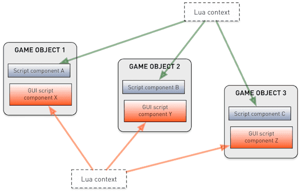
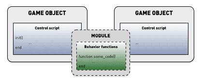

# Lua в Defold

В движок Defold встроен язык Lua для написания скриптов. Lua --- это легкий динамический язык, мощный, быстрый и простой для встраивания. Он широко используется в качестве скриптового языка для видеоигр. Программы на Lua написаны с применением простого процедурного синтаксиса. Язык динамически типизирован и запускается интерпретатором байткода. В нем реализовано автоматическое управление памятью с инкрементальной сборкой мусора.

Это руководство вкратце знакомит с основами программирования на Lua в целом и с тем, что необходимо учитывать при работе с Lua в Defold. Если у вас уже есть некоторый опыт работы с Python, Perl, Ruby, JavaScript или аналогичным динамическим языком, вы быстро освоитесь. Если вы совсем новичок в программировании, вам лучше начать с книги по Lua, предназначенной для начинающих. Существует множество книг на выбор.

## Версии Lua

Defold использует [LuaJIT](https://luajit.org/) — высокооптимизированную версию Lua, подходящую для игр и другого производительно-критичного программного обеспечения. Она полностью совместима с Lua 5.1 и поддерживает все стандартные функции библиотек Lua, а также полный набор функций API Lua/C.

LuaJIT также добавляет несколько [расширений языка](https://luajit.org/extensions.html), а также некоторые возможности Lua 5.2 и 5.3.

Мы стремимся к тому, чтобы поведение Defold оставалось одинаковым на всех платформах, но в настоящее время существуют некоторые незначительные различия в версии Lua между платформами:
* iOS не допускает JIT-компиляцию.
* Nintendo Switch не допускает JIT-компиляцию.
* HTML5 использует Lua 5.1.4 вместо LuaJIT.

::: important
Чтобы гарантировать работоспособность игры на всех поддерживаемых платформах, мы настоятельно рекомендуем использовать ТОЛЬКО языковые возможности из Lua 5.1.
:::

### Стандартные библиотеки и расширения
Defold включает все [стандартные библиотеки Lua 5.1](http://www.lua.org/manual/5.1/manual.html#5), а также сокеты и библиотеку битовых операций:

  - base (`assert()`, `error()`, `print()`, `ipairs()`, `require()` etc)
  - coroutine
  - package
  - string
  - table
  - math
  - io
  - os
  - debug
  - socket (из [LuaSocket](https://github.com/diegonehab/luasocket))
  - bitop (из [BitOp](http://bitop.luajit.org/api.html))

Все библиотеки документированы в [справочнике по API](/ref/go).

## Книги по Lua и ресурсы

### Онлайн ресурсы
* [Programming in Lua (first edition)](http://www.lua.org/pil/contents.html) Later editions are available in print.
* [Lua 5.1 reference manual](http://www.lua.org/manual/5.1/)
* [Learn Lua in 15 Minutes](http://tylerneylon.com/a/learn-lua/)
* [Awesome Lua - tutorial section](https://github.com/LewisJEllis/awesome-lua#tutorials)

### Книги
* [Programming in Lua](https://www.amazon.com/gp/product/8590379868/ref=dbs_a_def_rwt_hsch_vapi_taft_p1_i0) --- "Programming in Lua" является официальной книгой о языке, обеспечивающей прочную основу для любого программиста, желающего использовать Lua. Автор --- Roberto Ierusalimschy, главный архитектор языка.
* [Lua programming gems](https://www.amazon.com/Programming-Gems-Luiz-Henrique-Figueiredo/dp/8590379841) --- В этом сборнике статей собраны некоторые из существующих наработок и рекомендаций по программированию на языке Lua.
* [Lua 5.1 reference manual](https://www.amazon.com/gp/product/8590379833/ref=dbs_a_def_rwt_hsch_vapi_taft_p1_i4) --- Также доступно онлайн (см. выше)
* [Beginning Lua Programming](https://www.amazon.com/Beginning-Lua-Programming-Kurt-Jung/dp/0470069171)

### Видео
* [Learn Lua in one video](https://www.youtube.com/watch?v=iMacxZQMPXs)

## Синтаксис

Программы имеют простой, легко читаемый синтаксис. Выражения записываются по одному на каждой строке, и нет необходимости отмечать их конец. По желанию можно использовать точки с запятой `;` для разделения выражений. Блоки кода разделены ключевыми словами и заканчиваются ключевым словом `end`. Комментарии могут быть как блочными, так и до конца строки:

```lua
--[[
Вот блок комментариев, который может занимать
несколько строк в исходном файле.
--]]

a = 10
b = 20 ; c = 30 -- Два выражения в одной строке

if my_variable == 3 then
    call_some_function(true) -- Здесь приведен строчный комментарий
else
    call_another_function(false)
end
```

## Переменные и типы данных

Lua является динамически типизированным языком, что означает, что переменные не имеют типов, а их значения имеют.
В отличие от типизированных языков, любой переменной можно присвоить любое значение.

В Lua существует восемь основных типов данных:

`nil`
: Этот тип имеет только одно значение `nil`. Обычно он обозначает отсутствие полезного значения, например, неприсвоенные переменные.

  ```lua
  print(my_var) -- Выведет 'nil', поскольку переменной 'my_var' еще не присвоено значение
  ```

boolean
: Имеет значение `true` или `false`. Условия, имеющие значение `false` или `nil`, становятся ложными. Любое другое значение делает условие истинным.

  ```lua
  flag = true
  if flag then
      print("flag is true")
  else
      print("flag is false")
  end

  if my_var then
      print("my_var is not nil nor false!")
  end

  if not my_var then
      print("my_var is either nil or false!")
  end
  ```

number
: Числа внутренне представлены как 64-битные _целые_ или 64-битные _с плавающей точкой_. Lua автоматически осуществляет преобразование между этими представлениями по мере необходимости, поэтому, как правило, беспокоиться об этом не нужно.

  ```lua
  print(10) --> выведет '10'
  print(10.0) --> '10'
  print(10.000000000001) --> '10.000000000001'

  a = 5 -- целое число (integer)
  b = 7/3 -- число с плавающей точкой (float)
  print(a - b) --> '2.6666666666667'
  ```

string
: Строки --- это неизменяемые последовательности байтов, которые могут содержать любое 8-битное значение, включая встроенные нули (`\0`). Lua не делает никаких предположений о содержимом строки, поэтому в ней можно хранить любые данные. Строковые литералы записываются в одинарных или двойных кавычках. Lua выполняет конвертацию между числами и строками во время выполнения программы. Строки можно конкатенировать (объединять) с помощью оператора `..`.

  Строки могут содержать следующие управляющие последовательности в стиле языка C:

  | Последовательность | Character                                      |
  | ------------------ | ---------------------------------------------- |
  | `\a`               | bell - звуковой стгнал                         |
  | `\b`               | back space - забой                             |
  | `\f`               | form feed                                      |
  | `\n`               | newline - новая строка                         |
  | `\r`               | carriage return                                |
  | `\t`               | horizontal tab - горизонтальная табуляция      |
  | `\v`               | vertical tab - вертикальная табуляция          |
  | `\\`               | backslash - обратный слеш                      |
  | `\"`               | double quote - двойная кавычка                 |
  | `\'`               | single quote - одниарная кавычка               |
  | `\[`               | left square bracket - левая квадратная скобка  |
  | `\]`               | right square bracket - левая квадратная скобка |
  | `\ddd`             | символ, обозначаемый его числовым значением, где ddd - последовательность до трех _десятичных_ цифр |

  ```lua
  my_string = "hello"
  another_string = 'world'
  print(my_string .. another_string) --> "helloworld"

  print("10.2" + 1) --> 11.2
  print(my_string + 1) -- ошибка, не удается преобразовать "hello"
  print(my_string .. 1) --> "hello1"

  print("one\nstring") --> one
                       --> string

  print("\097bc") --> "abc"

  multi_line_string = [[
  Здесь представлен фрагмент текста, занимающий несколько строк.Все это помещается
  в строку что иногда бывает очень удобно.
  ]]
  ```

function
: Функции являются значениями первого класса в Lua, что означает, что их можно передавать как параметры в функции и возвращать как значения. Переменные, которым присваивается функция, содержат ссылку на функцию. Переменным можно присваивать анонимные функции, но для удобства Lua предоставляет синтаксический сахар (`function name(param1, param2) ... end`).

  ```lua
  -- Присвоить переменной 'my_plus' функцию
  my_plus = function(p, q)
      return p + q
  end

  print(my_plus(4, 5)) --> 9

  -- Удобный синтаксис для присвоения функции переменной 'my_mult'
  function my_mult(p, q)
      return p * q
  end

  print(my_mult(4, 5)) --> 20

  -- Принимает функцию в качестве параметра 'func'
  function operate(func, p, q)
      return func(p, q) -- Вызывает предоставленную функцию с параметрами 'p' и 'q'
  end

  print(operate(my_plus, 4, 5)) --> 9
  print(operate(my_mult, 4, 5)) --> 20

  -- Создать функцию суммирования и вернуть ее
  function create_adder(n)
      return function(a)
          return a + n
      end
  end

  adder = create_adder(2)
  print(adder(3)) --> 5
  print(adder(10)) --> 12
  ```

table
: Таблицы --- единственный тип структурирования данных в Lua. Это ассоциативные массивы _объектов_, которые используются для представления списков, массивов, последовательностей, символьных таблиц, множеств, записей, графов, деревьев и т.д. Таблицы всегда анонимны, и переменные, которым присваивается таблица, содержат не саму таблицу, а ссылку на нее. При инициализации таблицы как последовательности первым индексом является `1`, а не `0`.

  ```lua
  -- Инициализировать таблицу как последовательность
  weekdays = {"Sunday", "Monday", "Tuesday", "Wednesday",
              "Thursday", "Friday", "Saturday"}
  print(weekdays[1]) --> "Sunday"
  print(weekdays[5]) --> "Thursday"

  -- Инициализировать таблицу как запись со значениями последовательности
  moons = { Earth = { "Moon" },
            Uranus = { "Puck", "Miranda", "Ariel", "Umbriel", "Titania", "Oberon" } }
  print(moons.Uranus[3]) --> "Ariel"

  -- Построить таблицу из пустого конструктора {}
  a = 1
  t = {}
  t[1] = "first"
  t[a + 1] = "second"
  t.x = 1 -- тоже самое, что и t["x"] = 1

  -- Итерация по парам ключ-значение таблицы
  for key, value in pairs(t) do
      print(key, value)
  end
  --> 1   first
  --> 2   second
  --> x   1

  u = t -- u теперь ссылается на ту же таблицу, что и t
  u[1] = "changed"

  for key, value in pairs(t) do -- продолжает итерацию над t!
      print(key, value)
  end
  --> 1   changed
  --> 2   second
  --> x   1
  ```

userdata
: Userdata предоставляются для того, чтобы произвольные C-данные можно было хранить в переменных Lua. Defold использует Lua-объекты userdata для хранения Hash значений (hash), URL объектов (url), математических объектов (vector3, vector4, matrix4, quaternion), игровых объектов, GUI-нод (node), предикатов рендеринга (predicate), целей рендеринга (render_target) и константных буферов рендеринга (constant_buffer).

thread
: Трейды представляют собой независимые потоки выполнения и используются для реализации корутин. Подробнее см. ниже.

## Операторы

Арифметические операторы
: Математические операторы `+`, `-`, `*`, `/`, унарный `-` (отрицание) и экспоненциальный `^`.

  ```lua
  a = -1
  print(a * 2 + 3 / 4^5) --> -1.9970703125
  ```

  Lua обеспечивает автоматические преобразования между числами и строками во время выполнения. Любая числовая операция, применяемая к строке, пытается преобразовать строку в число:

  ```lua
  print("10" + 1) --> 11
  ```

Операторы отношения/сравнения
: `<` (меньше чем), `>` (больше чем), `<=` (меньше или равно), `>=` (больше или равно), `==` (равно), `~=` (не равно). Эти операторы всегда возвращают `true` или `false`. Значения разных типов считаются разными. Если типы одинаковы, они сравниваются в соответствии с их значениями. Lua сравнивает таблицы, userdata и функции по ссылке. Два таких значения считаются равными, только если они ссылаются на один и тот же объект.

  ```lua
  a = 5
  b = 6

  if a <= b then
      print("a меньше или равно b")
  end

  print("A" < "a") --> true
  print("aa" < "ab") --> true
  print(10 == "10") --> false
  print(tostring(10) == "10") --> true
  ```

Логические операторы
: `and`, `or` и `not`. `and` возвращает первый аргумент, если он равен `false`, иначе возвращает второй аргумент. `or` возвращает первый аргумент, если он не является `false`, иначе возвращает второй аргумент.

  ```lua
  print(true or false) --> true
  print(true and false) --> false
  print(not false) --> true

  if a == 5 and b == 6 then
      print("a равно 5 и b равно 6")
  end
  ```

Конкатенация
: Строки можно объединять с помощью оператора `..`. Числа при конкатенации преобразуются в строки.

  ```lua
  print("donkey" .. "kong") --> "donkeykong"
  print(1 .. 2) --> "12"
  ```

Длина
: Унарный оператор длины `#`. Длина строки --- это количество байт. Длина таблицы --- это длина ее последовательности, количество индексов, пронумерованных от `1` и выше, в которых значение не равно `nil`. Примечание: Если в последовательности есть "дыры" со значением `nil`, то длиной может быть любой индекс, предшествующий значению `nil`.

  ```lua
  s = "donkey"
  print(#s) --> 6

  t = { "a", "b", "c", "d" }
  print(#t) --> 4

  u = { a = 1, b = 2, c = 3 }
  print(#u) --> 0

  v = { "a", "b", nil }
  print(#v) --> 2
  ```

## Управление потоком

Lua предоставляет традиционный набор конструкций для контроля над потоком выполнения.

if---then---else
: Проверяет условие и выполняет часть `then`, если условие истинно, в противном случае выполняет необязательную часть `else`. Вместо вложенных операторов `if` можно использовать `elseif`. Это заменяет оператор switch, которого в Lua нет.

  ```lua
  a = 5
  b = 4

  if a < b then
      print("a is smaller than b")
  end

  if a == '1' then
      print("a is 1")
  elseif a == '2' then
      print("a is 2")
  elseif a == '3' then
      print("a is 3")
  else
      print("I have no idea what a is...")
  end
  ```

while
: Проверяет условие и выполняет блок до тех пор, пока оно истинно.

  ```lua
  weekdays = {"Sunday", "Monday", "Tuesday", "Wednesday",
              "Thursday", "Friday", "Saturday"}

  -- Напечатать каждый день недели
  i = 1
  while weekdays[i] do
      print(weekdays[i])
      i = i + 1
  end
  ```

repeat---until
: Повторяет блок до тех пор, пока условие не станет истинным. Условие проверяется после тела, поэтому оно будет выполнено по крайней мере один раз.

  ```lua
  weekdays = {"Sunday", "Monday", "Tuesday", "Wednesday",
              "Thursday", "Friday", "Saturday"}

  -- Напечатать каждый день недели
  i = 0
  repeat
      i = i + 1
      print(weekdays[i])
  until weekdays[i] == "Saturday"
  ```

for
: В Lua есть два типа цикла `for`: числовой и общий. Числовой `for` принимает 2 или 3 числовых значения, а общий `for` перебирает все значения, возвращаемые функцией _iterator_.

  ```lua
  -- Печатать числа от 1 до 10
  for i = 1, 10 do
      print(i)
  end

  -- Печатать числа от 1 до 10 и каждый раз увеличивать на 2
  for i = 1, 10, 2 do
      print(i)
  end

  -- Печатать числа от 10 до 1
  for i=10, 1, -1 do
      print(i)
  end

  t = { "a", "b", "c", "d" }
  -- Итерировать последовательность и вывести значения
  for i, v in ipairs(t) do
      print(v)
  end
  ```

break и return
: Оператор `break` используется для выхода из внутреннего блока цикла `for`, `while` или `repeat`. Оператор `return` используется для возврата значения из функции или для завершения выполнения функции и возврата к вызывающей стороне. `break` или `return` могут появляться только в качестве последнего оператора блока.

  ```lua
  a = 1
  while true do
      a = a + 1
      if a >= 100 then
          break
      end
  end

  function my_add(a, b)
      return a + b
  end

  print(my_add(10, 12)) --> 22
  ```

## Локальные, глобальные и лексические области видимости

Все объявляемые переменные по умолчанию являются глобальными, то есть они доступны во всех частях контекста среды выполнения Lua. Переменные можно явно объявить `локальными`, что означает, что переменная будет существовать только в текущей области видимости.

Каждый исходный файл Lua задает отдельную область видимости. Локальные объявления на самом верхнем уровне файла означают, что переменная является локальной для файла Lua-скрипта. Каждая функция создает еще одну вложенную область видимости, а каждый блок управляющей структуры создает дополнительные области видимости. Область видимости можно явно создать с помощью ключевых слов `do` и `end`. Lua представляет собой лексическую область видимости, то есть область видимости, которая имеет полный доступ к _локальным_ переменным из объемлющей области видимости. Следует помнить, что локальные переменные должны быть объявлены до их использования.

```lua
function my_func(a, b)
    -- 'a' и 'b' являются локальными для этой функции и доступны из ее области видимости

    do
        local x = 1
    end

    print(x) --> nil. 'x' недоступна за пределами области видимости do-end
    print(foo) --> nil. 'foo' объявлена после 'my_func'
    print(foo_global) --> "value 2"
end

local foo = "value 1"
foo_global = "value 2"

print(foo) --> "value 1". 'foo' доступна в самой верхней области видимости после объявления.
```

Стоит заметить, что если объявить функции `локальными` в файле скрипта (что, как правило, является хорошей идеей), необходимо следить за упорядочиванием кода. Можно использовать предварительное объявление, если у есть функции, которые взаимно вызывают друг друга.

```lua
local func2 -- Предварительно объявить 'func2'

local function func1(a)
    print("func1")
    func2(a)
end

function func2(a) -- или func2 = function(a)
    print("func2")
    if a < 10 then
        func1(a + 1)
    end
end

function init(self)
    func1(1)
end
```

В случае когда пишется функция, вложенная в другую функцию, она (вложенная) также имеет полный доступ к локальным переменным объемлющей функции. Это весьма эффективная конструкция.

```lua
function create_counter(x)
    -- 'x' является локальной переменной в 'create_counter'
    return function()
        x = x + 1
        return x
    end
end

count1 = create_counter(10)
count2 = create_counter(20)
print(count1()) --> 11
print(count2()) --> 21
print(count1()) --> 12
```

## Затенение переменной

Локальные переменные, объявленные в блоке, будут затенять переменные с тем же именем из соседнего блока.

```lua
my_global = "global"
print(my_global) -->"global"

local v = "local"
print(v) --> "local"

local function test(v)
    print(v)
end

function init(self)
    v = "apple"
    print(v) --> "apple"
    test("banana") --> "banana"
end
```

## Корутины

Функции выполняются от начала до конца, и нет возможности остановить их на полпути. Корутины позволяют это сделать, что может быть очень удобно в некоторых случаях. Предположим, мы хотим создать весьма специфическую покадровую анимацию, в которой мы перемещаем игровой объект из позиции `0` по оси Y в некоторые определенные позиции по Y с кадра 1 по кадр 5. Мы могли бы решить эту задачу с помощью счетчика в функции `update()` (см. ниже) и списка позиций. Однако с помощью корутины мы получаем очень чистую реализацию, которую легко расширять и работать с ней. Все состояние содержится в самой корутине.

Когда корутина завершает работу, она возвращает управление вызывающей стороне, но запоминает точку выполнения, чтобы в дальнейшем продолжить работу с этого места.

```lua
-- Это наша корутина
local function sequence(self)
    coroutine.yield(120)
    coroutine.yield(320)
    coroutine.yield(510)
    coroutine.yield(240)
    return 440 -- вернуть окончательное значение
end

function init(self)
    self.co = coroutine.create(sequence) -- Создать корутину. 'self.co' is a thread object
    go.set_position(vmath.vector3(100, 0, 0)) -- Задать начальную позицию
end

function update(self, dt)
    local status, y_pos = coroutine.resume(self.co, self) -- Продолжить выполнение корутины
    if status then
        -- Если корутина все еще не завершена/мертва, используйте ее возвращаемое значение в качестве новой позиции
        go.set_position(vmath.vector3(100, y_pos, 0))
    end
end
```


## Lua-контексты в Defold

Все объявляемые переменные по умолчанию являются глобальными, что означает, что они доступны во всех частях контекста среды выполнения Lua. В Defold есть параметр *shared_state* в *game.project*, который управляет этим контекстом. Если опция включена, все скрипты, GUI-крипты и рендер-скрипт оцениваются в едином Lua-контексте, и глобальные переменные доступны повсюду. Если опция не установлена, движок выполняет скрипты, GUI-скрипты и рендер-скрипт в отдельных контекстах.



Defold позволяет использовать один и тот же файл скрипта в нескольких отдельных компонентах игрового объекта. Все локально объявленные переменные совместно используются компонентами, в которых запущен один и тот же скрипт.

```lua
-- 'my_global_value' будет доступно из всех скриптов, GUI-скриптов, рендер-скрипта и модулей (Lua-файлы)
my_global_value = "global scope"

-- Это значение будет общим для всех экземпляров компонентов, которые используют этот конкретный файл скрипта
local script_value = "script scope"

function init(self, dt)
    -- Это значение будет доступно для данного экземпляра компонента скрипта
    self.foo = "self scope"

    -- Это значение будет доступно внутри init() и после его объявления
    local local_foo = "local scope"
    print(local_foo)
end

function update(self, dt)
    print(self.foo)
    print(my_global_value)
    print(script_value)
    print(local_foo) -- выведет nil, так как local_foo виден лишь в init()
end
```

## Советы производительности

В высокопроизводительной игре, которая должна работать на плавной скорости 60 FPS, небольшие просчеты в производительности могут сильно повлиять на впечатления от игры. Есть несколько простых общих аспектов, на которые следует обратить внимание, и некоторые нюансы, которые могут показаться незначительными.

Начинайте с простых вещей. Как правило, хорошей идеей является написание простого кода, без лишних циклов. Иногда возникает необходимость итерации над списками элементов, но следует быть осторожным, если список элементов достаточно велик. Этот пример выполняется за чуть более 1 миллисекунду на довольно приличном ноутбуке, что может иметь значение, если каждый кадр длится всего 16 миллисекунд (при 60 FPS), при этом движок, рендер-скрипт, симуляция физики и пр. съедают часть этого времени.

```lua
local t = socket.gettime()
local table = {}
for i=1,2000 do
    table[i] = vmath.vector3(i, i, i)
end
print((socket.gettime() - t) * 1000)

-- DEBUG:SCRIPT: 0.40388
```

Используйте значение, возвращаемое из `socket.gettime()` (seconds since system epoch) для проверки подозрительного кода.

## Память и сборка мусора

По умолчанию сборка мусора в Lua выполняется автоматически в фоновом режиме и возвращает память, которую выделила среда выполнения Lua. Сборка мусора может оказаться трудоемкой задачей, поэтому целесообразно сократить количество объектов, подлежащих уборке:

* Локальные переменные сами по себе свободны и не генерируют мусор. (то есть `local v = 42`)
* Каждая _новая уникальная_ строка создает новый объект. Запись `local s = "some_string"` создаст новый объект и присвоит ему `s`. Сама локальная `s` не будет генерировать мусор, но объект строки будет. Использование одной и той же строки несколько раз не требует дополнительных затрат памяти.
* Каждый раз при выполнении конструктора таблицы (`{ ... }`) создается новая таблица.
* Выполнение _оператора функции_ создает объект замыкания. (т.е. выполнение оператора `function () ... end`, а не вызов определенной функции)
* Вариативные функции (`function(v, ...) end`) создают таблицу для символов замещения (ellipsis) каждый раз, когда функция _вызывается_ (в Lua до версии 5.2, или если не используется LuaJIT).
* `dofile()` и `dostring()`
* Объекты userdata

Существует множество случаев, когда можно избежать создания новых объектов и вместо этого повторно использовать уже имеющиеся. Например, в конце каждого `update()` обычно выполняется следующее:

```lua
-- Сбросить скорость
self.velocity = vmath.vector3()
```

Легко забыть, что каждый вызов `vmath.vector3()` создает новый объект. Давайте узнаем, сколько памяти использует один `vector3`:

```lua
print(collectgarbage("count") * 1024)       -- 88634
local v = vmath.vector3()
print(collectgarbage("count") * 1024)       -- 88704. 70 байт было выделено всего
```

70 байт было добавлено между вызовами `collectgarbage()`, но это включает выделения для большего, чем объект `vector3`. Каждая печать результата из `collectgarbage()` строит строку, которая сама по себе добавляет 22 байта мусора:

```lua
print(collectgarbage("count") * 1024)       -- 88611
print(collectgarbage("count") * 1024)       -- 88633. 22 байта выделено
```

Таким образом, `vector3` весит 70-22=48 байт. Это не много, но если создавать _по одному_ в каждом кадре в игре с частотой 60 FPS, то внезапно возникают 2.8 кБ мусора в секунду. С 360 компонентами скрипта, которые создают по одному `vector3` каждый кадр, мы получим 1 МБ мусора в секунду. Цифры могут складываться очень быстро. Когда среда выполнения Lua собирает мусор, это может съесть много драгоценных миллисекунд --- особенно на мобильных платформах.

Один из способов избежать выделения --- создать `vector3` и затем продолжать работать с этим же объектом. Например, для сброса `vector3` мы можем использовать следующую конструкцию:

```lua
-- Вместо того чтобы делать self.velocity = vmath.vector3(), который создает новый объект,
-- мы обнуляем существующий вектор скорости компонента объекта
self.velocity.x = 0
self.velocity.y = 0
self.velocity.z = 0
```

Схема сбора мусора по умолчанию может быть неоптимальной для некоторых критически важных приложений. Если в игре или приложении наблюдаются зависания, возможно, вы стоит настроить сбор мусора в Lua с помощью функции [`collectgarbage()`](/ref/base/#collectgarbage) Lua function. Например, можно запускать сборщик на короткое время каждый кадр с низким значением `шага`. Чтобы получить представление о том, сколько памяти потребляет игра или приложение, можно вывести текущее количество мусорных байтов с помощью функции:

```lua
print(collectgarbage("count") * 1024)
```

## Лучшие методы работы

Общим соображением в дизайне реализации является вопрос о том, как структурировать код для совместного поведения. Возможны несколько подходов.

Поведение в модуле
: Инкапсуляция поведения в модуль позволяет легко обмениваться кодом между различными скриптами игровых объектов (и GUI-скриптами). При написании функций модуля, как правило, лучше всего писать строго функциональный код. Бывают случаи, когда хранимое состояние или побочные эффекты являются необходимостью (или ведут к более чистому дизайну). Если необходимо хранить внутреннее состояние в модуле, следует помнить, что компоненты используют общие Lua-контексты. За подробностями обращайтесь к [руководству по модулям](/manuals/modules).

  

  Кроме того, даже если возможно, чтобы код модуля напрямую изменял внутренности игрового объекта (посредством передачи `self` в функцию модуля), настоятельно не рекомендуется делать это, так как это создаст очень тесную связь.

Вспомогательный игровой объект с инкапсулированным поведением
: Точно так же, как можно содержать код скрипта в Lua-модуле, можно содержать его в игровом объекте с помощью компонента Script. Разница в том, что если поместить его в игровой объект, то с ним можно взаимодействовать строго через передачу сообщений.

  

Группировка игрового объекта с вспомогательным объектом поведения внутри коллекции
: В этой конструкции можно создать игровой объект поведения, который автоматически действует на другой целевой игровой объект, либо по предопределенному имени (пользователь должен переименовать целевой игровой объект для соответствия), либо через URL `go.property()`, который указывает на целевой игровой объект.

  

  Преимущество такой настройки заключается в том, что можно бросить игровой объект поведения в коллекцию, содержащую целевой объект. При этом дополнительный код не требуется.

  В ситуациях, когда необходимо управлять большим количеством игровых объектов, такая конструкция не является предпочтительной, поскольку объект поведения дублируется для каждого экземпляра, и каждый объект будет занимать память.
