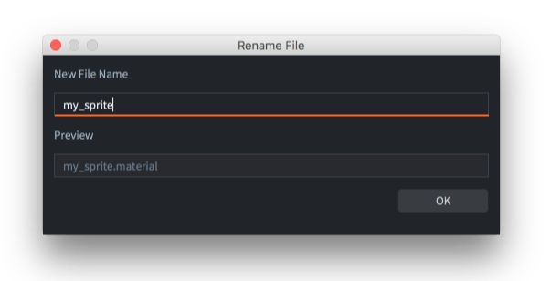
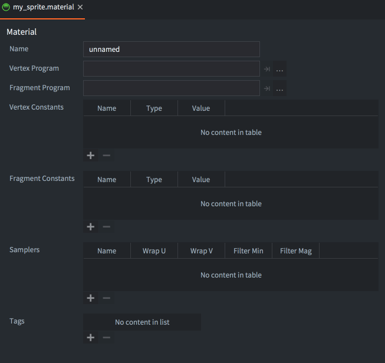
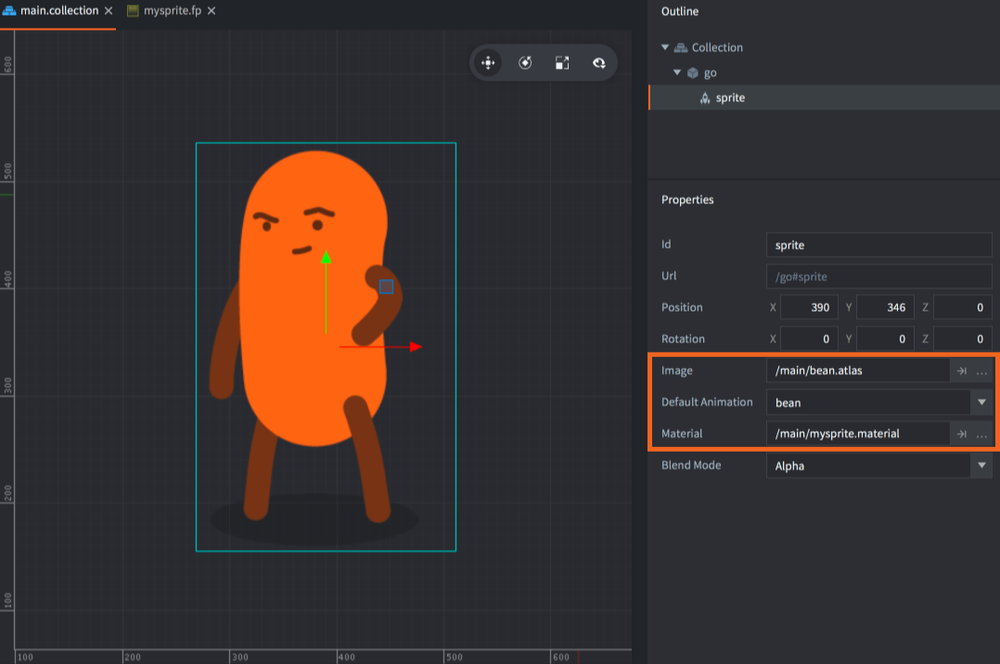
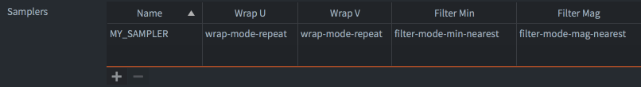
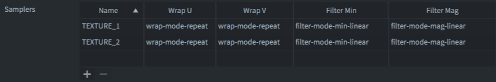
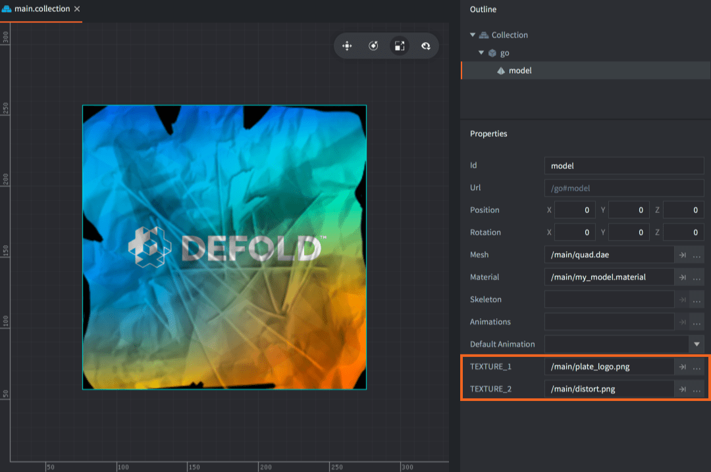

# Материалы

Материалы используются для выражения того, как графический компонент (спрайт, тайловая карта, шрифт, GUI-нода, модель и т.д.) должны быть отрендерены.

Метариал содержит _теги_, информацию, которая применяется конвейером рендеринга для отбора объектов для рендера. Также он содержит ссылку на _шейдерные программы_, которые компилируются через доступные графические драйверы и загружаются на графическое аппаратное обеспечение и запускаются в каждом кадре, когда компонент рендерится.

* Для большей информации по конвейеру рендеринга, смотрите [Документацию по рендеру](/manuals/render).
* Для глубого погружения в шейдерные программы, смотрите [Документацию по шейдерам](/manuals/shader).

## Создание материала

Чтобы создать материал, <kbd>кликните правой кнопкой мыши</kbd> по нужной папке в обозревателе *Assets* и выберите <kbd>New... ▸ Material</kbd>. (Вы также можете выбрать <kbd>File ▸ New...</kbd> в меню, а затем выбрать <kbd>Material</kbd>). Укажите имя нового файла материала и нажмите <kbd>Ok</kbd>.



Новый материал откроется в *Material Editor*.



Файл материала содержит следующую информацию:

Name
: Уникальное имя материала. Оно используется для включения материала в сборку через ресурс *Render* и также используется в функции API рендеринга `render.enable_material()`. Имя должно быть уникальным.

Vertex Program
: Файл программы вершинного шейдера (*.vp*), используемый при рендеринге с этим материалом. Программа выполняется на GPU для каждой вершины примитива компонента. Она вычисляет положение вершины на экране и может также передавать "изменяемые" переменные, которые интерполируются и подаются на вход фрагментной программе.

Fragment Program
: Файл программы фрагментного шейдера (*.fp*), используемый при рендеринге с этим материалом. Программа запускается на GPU для каждого фрагмента (пикселя) примитива и определяет цвет этого фрагмента. Обычно это достигается путем выборки из текстуры и вычислений на основе входящих данных (переменные или константы).

Vertex Constants
: Константы (uniform), передаваемые в вершинную программу шейдера. См. ниже список доступных констант.

Fragment Constants
: Константы (uniform), передаваемые в фрагментную программу шейдера. См. ниже список доступных констант.

Samplers
: При необходимости вы можете настроить конкретные сэмплеры в файле материала. Добавьте сэмплер, укажите имя, соответствующее использованному в шейдере, и задайте параметры обертки и фильтрации по своему усмотрению.

Tags
: Теги, ассоциированные с материалом. В движке они представлены в виде _битовой маски_, используемой в [`render.predicate()`](/ref/render#render.predicate) для выбора компонентов, которые нужно отрисовать вместе. Подробнее см. [Документацию по рендеру](/manuals/render). Максимальное количество тегов в проекте — 32.

## Атрибуты

Атрибуты шейдера (также называемые потоками вершин или вершинными атрибутами) — это механизм, с помощью которого GPU получает вершины из памяти для рендеринга геометрии. Вершинный шейдер задает набор потоков через ключевое слово `attribute`, и в большинстве случаев Defold автоматически создает и привязывает эти данные на основе имени потока. Однако в некоторых случаях вы можете захотеть передавать больше данных на вершину для реализации специфических эффектов, которые движок по умолчанию не предоставляет. Атрибут вершины можно настроить с помощью следующих полей:

Name
: Имя атрибута. Аналогично шейдерным константам, конфигурация атрибута будет использоваться только в случае совпадения с атрибутом, указанным в программе вершинного шейдера.

Semantic type
: Семантический тип указывает смысл того, *что* представляет атрибут и/или *как* он должен отображаться в редакторе. Например, указание `SEMANTIC_TYPE_COLOR` отобразит виджет выбора цвета, хотя данные по-прежнему передаются как есть из движка в шейдер.

  - `SEMANTIC_TYPE_NONE` — значение по умолчанию, просто передает данные в буфер вершин
  - `SEMANTIC_TYPE_POSITION` — координаты вершины; можно использовать вместе с пространством координат
  - `SEMANTIC_TYPE_TEXCOORD` — текстурные координаты
  - `SEMANTIC_TYPE_PAGE_INDEX` — индекс страницы
  - `SEMANTIC_TYPE_COLOR` — вызывает отображение цветового виджета в инспекторе
  - `SEMANTIC_TYPE_NORMAL` — нормаль вершины
  - `SEMANTIC_TYPE_TANGENT` — касательная вершины
  - `SEMANTIC_TYPE_WORLD_MATRIX` — мировая матрица вершины
  - `SEMANTIC_TYPE_NORMAL_MATRIX` — матрица нормалей вершины

Data type
: Тип данных, используемый для хранения атрибута.

  - `TYPE_BYTE` — знаковый 8-битный байт
  - `TYPE_UNSIGNED_BYTE` — беззнаковый 8-битный байт
  - `TYPE_SHORT` — знаковое 16-битное значение
  - `TYPE_UNSIGNED_SHORT` — беззнаковое 16-битное значение
  - `TYPE_INT` — знаковое целое число
  - `TYPE_UNSIGNED_INT` — беззнаковое целое число
  - `TYPE_FLOAT` — число с плавающей точкой (по умолчанию)

Normalize
: Если включено, драйвер GPU нормализует значение. Это полезно, если не требуется полная точность — например, цвет часто задается байтами 0..255, но в шейдере работает как 0..1.

Coordinate space
: Некоторые семантические типы поддерживают задание координат в разных пространствах. Например, для реализации "билбординга" можно использовать как локальные, так и мировые координаты.

Vector type
: Тип векторного значения атрибута.

  - `VECTOR_TYPE_SCALAR` — скаляр
  - `VECTOR_TYPE_VEC2` — вектор из 2 элементов
  - `VECTOR_TYPE_VEC3` — вектор из 3 элементов
  - `VECTOR_TYPE_VEC4` — вектор из 4 элементов (по умолчанию)
  - `VECTOR_TYPE_MAT2` — матрица 2x2
  - `VECTOR_TYPE_MAT3` — матрица 3x3
  - `VECTOR_TYPE_MAT4` — матрица 4x4

Step function
: Указывает, как атрибут должен передаваться в вершинный шейдер. Используется в основном для инстансинга.

  - `Vertex` — один раз на вершину (по умолчанию)
  - `Instance` — один раз на экземпляр, например для мировых матриц

Value
: Значение атрибута. Может быть переопределено для каждого компонента, в противном случае используется значение по умолчанию. Внимание: для атрибутов по умолчанию (`position`, `texcoord` и др.) это значение игнорируется.

::: sidenote
Переопределение конфигурации атрибутов позволяет уменьшить объем данных и снизить нагрузку на память CPU и GPU.
:::

### Семантика атрибутов по умолчанию

Система материалов автоматически присваивает семантику атрибутам по их именам во время исполнения:

  - `position` - semantic type: `SEMANTIC_TYPE_POSITION`
  - `texcoord0` - semantic type: `SEMANTIC_TYPE_TEXCOORD`
  - `texcoord1` - semantic type: `SEMANTIC_TYPE_TEXCOORD`
  - `page_index` - semantic type: `SEMANTIC_TYPE_PAGE_INDEX`
  - `color` - semantic type: `SEMANTIC_TYPE_COLOR`
  - `normal` - semantic type: `SEMANTIC_TYPE_NORMAL`
  - `tangent` - semantic type: `SEMANTIC_TYPE_TANGENT`
  - `mtx_world` - semantic type: `SEMANTIC_TYPE_WORLD_MATRIX`
  - `mtx_normal` - semantic type: `SEMANTIC_TYPE_NORMAL_MATRIX`

Если вы указываете эти атрибуты в редакторе материалов, их поведение будет определяться вашей конфигурацией.

### Задание пользовательских атрибутов во время исполнения

Как и в случае с пользовательскими шейдерными константами, вы можете изменять значения вершинных атрибутов во время исполнения через `go.get`, `go.set` и `go.animate`:


```lua
go.set("#sprite", "tint", vmath.vector4(1,0,0,1))

go.animate("#sprite", "tint", go.PLAYBACK_LOOP_PINGPONG, vmath.vector4(1,0,0,1), go.EASING_LINEAR, 2)
```

Однако при обновлении вершинных атрибутов есть особенности: возможность использовать новое значение зависит от семантики атрибута. Например, компонент спрайта поддерживает `SEMANTIC_TYPE_POSITION`, и если вы попытаетесь переопределить атрибут с этой семантикой, то компонент проигнорирует новое значение, поскольку семантика требует, чтобы данные всегда исходили от позиции спрайта.

::: sidenote
Изменение пользовательских вершинных атрибутов во время исполнения в настоящее время поддерживается только для компонентов типа спрайт.
:::

### Инстансинг

Инстансинг — это техника, используемая для эффективной отрисовки множества копий одного и того же объекта на сцене. Вместо создания отдельной копии объекта каждый раз, инстансинг позволяет движку использовать одну модель и переиспользовать её многократно. Например, в игре с большим лесом вместо того, чтобы создавать отдельную модель дерева для каждого дерева, можно создать одну модель и размещать её сотни или тысячи раз с разными позициями и масштабом. Таким образом, весь лес может быть отрисован одним вызовом отрисовки, а не отдельными вызовами для каждого дерева.

::: sidenote
Инстансинг на данный момент доступен только для компонентов типа Model.
:::

Инстансинг включается автоматически, если соблюдены необходимые условия. Defold активно использует пакетирование состояния отрисовки — чтобы инстансинг работал, необходимо соблюдение следующих требований:

- Один и тот же материал используется во всех экземплярах. Инстансинг работает даже если материал был задан через `render.enable_material()`
- Материал должен быть сконфигурирован для использования вершин в локальном пространстве
- В материале должен быть хотя бы один атрибут, повторяющийся на каждый экземпляр
- Значения констант должны быть одинаковыми у всех экземпляров. Их можно передавать через пользовательские вершинные атрибуты или иными способами (например, через текстуру)
- Все экземпляры должны использовать одни и те же ресурсы шейдера, такие как текстуры или буферы хранения

Чтобы указать, что атрибут должен повторяться на каждый экземпляр, установите для него `Step function = Instance`. Это делается автоматически для некоторых семантик по имени (см. таблицу `Семантика атрибутов по умолчанию`), но также может быть установлено вручную в редакторе материалов.

Простой пример: сцена с четырьмя игровыми объектами, у каждого из которых есть компонент-модель:


Материал настроен с одним пользовательским атрибутом, повторяющимся на каждый экземпляр:


Вершинный шейдер использует несколько атрибутов, повторяющихся на каждый экземпляр:

```glsl
// Атрибуты на вершину
attribute highp vec4 position;
attribute mediump vec2 texcoord0;
attribute mediump vec3 normal;

// Атрибуты на экземпляр
attribute mediump mat4 mtx_world;
attribute mediump mat4 mtx_normal;
attribute mediump vec4 instance_color;
```

Обратите внимание, что `mtx_world` и `mtx_normal` по умолчанию будут использовать `Step function = Instance`. Это можно изменить в редакторе материалов, добавив соответствующие записи и установив `Step function = Vertex`, чтобы атрибут повторялся на вершину.

Чтобы убедиться, что инстансинг работает, можно воспользоваться веб-профайлером. В приведённом примере, так как единственное различие между экземплярами куба — это атрибуты на экземпляр, отрисовка осуществляется одним вызовом:


#### Обратная совместимость

Для использования инстансинга на графических адаптерах с OpenGL требуется как минимум OpenGL 3.1 (на десктопе) или OpenGL ES 3.0 (на мобильных устройствах). Это означает, что на очень старых устройствах с OpenGL ES2 или более старыми версиями инстансинг может быть недоступен. В таком случае отрисовка всё равно будет работать по умолчанию, без дополнительных действий со стороны разработчика, но производительность будет ниже. В настоящее время нет способа определить, поддерживается ли инстансинг, но в будущем планируется добавить такую возможность — чтобы можно было, например, использовать более дешёвый материал или полностью отключить элементы вроде листвы, которые обычно отрисовываются с использованием инстансинга.

## Вершинные и фрагментные константы

Шейдерные константы или "uniform"-ы --- это значения, которые передаются из движка в вершинные или фрагментные программы шейдеров. Для использования константы вы задаете ее в файле материала либо через свойство  *Vertex Constant* либо через свойство *Fragment Constant*. Соответствующие `uniform` переменные должны быть определены в программе шейдера. Следующие константы могут быть установлены в материале:

CONSTANT_TYPE_WORLD
: Мировая матрица. Используйте ее для преобразования вершин в пространство мира. Для некоторых типов компонентов, вершины уже расположены в пространстве мира, когда они отправляются вершинной программе (в виду пакетирования). В таких случаях, умножение на мировую матрицу в шейдере выдаст некорректные результаты.

CONSTANT_TYPE_VIEW
: Матрица вида. Используйте ее для преобразования вершин в пространство отображения (камеры).

CONSTANT_TYPE_PROJECTION
: Проекционная матрица. Используйте ее для преобразования вершин в пространство экрана.

CONSTANT_TYPE_VIEWPROJ
: Матрица с уже перемноженными матрицей вида и проекционной матрицы.

CONSTANT_TYPE_WORLDVIEW
: Матрица с уже перемноженными матрицей мира и предыдущей матрицы (перемножение матрицы вида на проекционную).

`CONSTANT_TYPE_WORLDVIEWPROJ`
: Матрица с уже перемноженными матрицами мира, вида и проекционной.

CONSTANT_TYPE_NORMAL
: Матрица для вычисления ориентации по нормали. Мировое преобразование может включать не-нормированное (non-uniform) масштабирование, которое ломает ортогональность скомбинированного мир-на-отображение преобразования. Матрица нормалей используется, чтобы избежать проблем с направлениями когда преобразовываются нормали. (Нормальная матрица --- это транспонированная инверсия матрицы мир-на-отображение.)  

CONSTANT_TYPE_USER
: Константа типа vector4, которую вы можете использовать для любых собственных данных, которые вы хотите передать в программу шейдера. Вы можете установить начальное значение константы в месте ее определения, но она изменяема через функции [go.set()](/ref/stable/go/#go.set) / [go.animate()](/ref/stable/go/#go.animate). Также вы можете получить ее значение через [go.get()](/ref/stable/go/#go.get). Изменение константы материала одного экземпляра компонента [ломает пакетирование для рендеринга и приведет к дополнительным вызовам отрисовки](/manuals/render/#draw-calls-and-batching).

Пример:

```lua
go.set("#sprite", "tint", vmath.vector4(1,0,0,1))

go.animate("#sprite", "tint", go.PLAYBACK_LOOP_PINGPONG, vmath.vector4(1,0,0,1), go.EASING_LINEAR, 2)
```

CONSTANT_TYPE_USER_MATRIX4
: Константа типа matrix4, которую можно использовать для передачи любых пользовательских данных в программу шейдера. Вы можете задать начальное значение при определении, но она доступна для изменения через функции [go.set()](/ref/stable/go/#go.set) / [go.animate()](/ref/stable/go/#go.animate), а также получить текущее значение через [go.get()](/ref/stable/go/#go.get). Изменение значения константы у отдельного экземпляра компонента [ломает пакетирование и приводит к дополнительным вызовам отрисовки](/manuals/render/#draw-calls-and-batching).

Пример:

```lua
go.set("#sprite", "m", vmath.matrix4())
```

::: sidenote
Чтобы константа `CONSTANT_TYPE_USER` или `CONSTANT_TYPE_MATRIX4` была доступна через `go.get()` и `go.set()`, она должна использоваться в шейдере. Если она определена в материале, но не используется, она будет удалена и станет недоступной в рантайме.
:::

## Сэмплеры

Сэмплеры используются для отбора цветовой информации из текстуры (тайловый источник или атлас). Цветовая информация может далее быть использована для вычислений в программе шейдера.

Компоненты типа спрайт, тайловая карта, GUI или эффект частиц автоматически получают набор `sampler2D`. Первый объявленный `sampler2D` в программе шейдера автоматически привязывается к изображению, на которое ссылается графический компонент. Поэтому сейчас нет необходимости указывать какие-либо сэмплеры в файле материалов для этих компонентов. Более того, эти типы компонентов сейчас поддерживают только одну текстуру. (Если вам нужно множество текстур в шейдере, вы можете использовать вызов [`render.enable_texture()`](/ref/render/#render.enable_texture) и устанавливать текстурные сэмплеры вручную из своего рендер скрипта.)



```glsl
-- mysprite.fp
varying mediump vec2 var_texcoord0;
uniform lowp sampler2D MY_SAMPLER;
void main()
{
    gl_FragColor = texture2D(MY_SAMPLER, var_texcoord0.xy);
}
```

Вы можете задать настройки сэмплера для компонента добавив сэмплер по имени в файле материалов. Если вы не устанавливаете свой сэмплер в файле материалов, будут использованы глобальные настройки *graphics* проекта. 



Для компонентов типа модель, вам необходимо задать ваши сэмплеры в файле материала с теми настройками, которые вы хотите. Далее после этих действий редактор позволит вам выставить текстуры для любого модельного компонента, который использует этот материал:



```glsl
-- mymodel.fp
varying mediump vec2 var_texcoord0;
uniform lowp sampler2D TEXTURE_1;
uniform lowp sampler2D TEXTURE_2;
void main()
{
    lowp vec4 color1 = texture2D(TEXTURE_1, var_texcoord0.xy);
    lowp vec4 color2 = texture2D(TEXTURE_2, var_texcoord0.xy);
    gl_FragColor = color1 * color2;
}
```



## Настройки сэмплера

Name
: Имя сэмплера. Это имя должно совпадать с заданной в фрагментном шейдере `sampler2D` переменной.

Wrap U/W
: Режим развертки для осей U и V:

  - `WRAP_MODE_REPEAT` -- повторит данные текстуры вне диапазона [0,1].
  - `WRAP_MODE_MIRRORED_REPEAT` -- повторит данные текстуры вне диапазона [0,1], но каждое второе повторение будет зеркально отражено.
  - `WRAP_MODE_CLAMP_TO_EDGE` --- будет приводить данные текстуры со значениями больше 1.0 к значению 1.0, а любые значения меньше 0.0 будут приводиться к значению 0.0 --- то есть крайние пиксели будут повторяться до края.

Filter Min/Mag
: Фильтрация для увеличения и уменьшения. Ближайшая фильтрация требует меньше вычислений, чем линейная интерполяция, но может привести к артефактам алиасинга. Линейная интерполяция часто дает более плавные результаты :

  - `Default` — использует параметр фильтрации по умолчанию, указанный в файле `game.project` в секции `Graphics`, как `Default Texture Min Filter` и `Default Texture Mag Filter`.
  - `FILTER_MODE_NEAREST` -- использует тексель с координатами ближайшими к центру пикселя.
  - `FILTER_MODE_LINEAR` -- устанавливает взвешенное линейное среднее для массива текселей 2x2, которые лежат ближе всего к центру пикселя .
  - `FILTER_MODE_NEAREST_MIPMAP_NEAREST` -- выбирает ближайшее значение текселя в отдельной MIP-карте.
  - `FILTER_MODE_NEAREST_MIPMAP_LINEAR` -- выбирает ближайший тексель из двух ближайших лучших вариантов MIP-карт и затем линейно интерполирует между этими двумя значениями.
  - `FILTER_MODE_LINEAR_MIPMAP_NEAREST` -- линейное интерполирование в пределах отдельной MIP-карты. 
  - `FILTER_MODE_LINEAR_MIPMAP_LINEAR` -- использует линейную интерполяцию для вычисления значения на каждой из двух карт, а затем выполняет линейную интерполяцию между этими двумя значениями.

Max Anisotropy
: Анизотропная фильтрация — это продвинутая техника фильтрации, при которой берется несколько выборок и их результаты смешиваются. Этот параметр управляет уровнем анизотропии для сэмплеров текстур. Если анизотропная фильтрация не поддерживается GPU, параметр не будет иметь эффекта и по умолчанию будет установлен в значение 1.

## Буферы констант

Когда конвейер рендеринга отрисовывает, он берет значения констант из буфера по-умолчанию --- системного буфера констант. Вы можете создать собственный буфер констант, чтобы перекрыть константы по-умолчанию и вместо этого выставить uniform-ы для программы шейдера программно в рендер скрипте:

```lua
self.constants = render.constant_buffer() -- <1>
self.constants.tint = vmath.vector4(1, 0, 0, 1) -- <2>
...
render.draw(self.my_pred, self.constants) -- <3>
```
1. Создаем новый буфер констант
2. Устанавливаем константу `tint` в ярко-красный
3. Рисуем предикат используя наши собственные константы

Учтите, что элементы констант буфера ссылаются как обычная Lua таблица, но вы не можете итерироваться по буферу с помощью вызовов `pairs()` или `ipairs()`.
