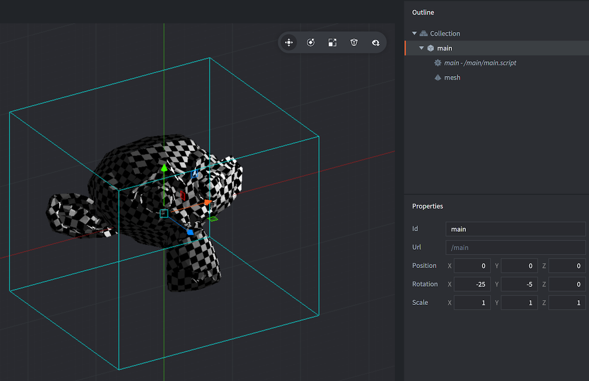

# Компонент Mesh

Defold по сути является 3D движком. Даже когда работа ведется только с 2D-материалом, весь рендеринг выполняется в 3D, но проецируется на экран ортографически. Defold позволяет полноценно использовать 3D-контент, добавляя и создавая 3D-сетки во время выполнения в коллекциях. Игры могут быть созданы исключительно в 3D с использованием только 3D ассетов, или же 3D и 2D контент может совмещаться в соответствии с целями разработчика.

## Создание компонента Mesh

Компоненты сетки создаются так же, как и любой другой компонент игрового объекта. Это можно сделать двумя способами:

- Создайте *файл Mesh*, <kbd>кликнув ПКМ</kbd> в нужном расположении в браузере *Assets* и выберите <kbd>New... ▸ Mesh</kbd>.
- Создайте компонент, встроенный непосредственно в игровой объект, <kbd>кликнув ПКМ</kbd> по игровому объекту в представлении *Outline* и выберите <kbd>Add Component ▸ Mesh</kbd>.



После создания сетки необходимо определить ряд свойств.

### Свойства сетки

Помимо свойств *Id*, *Position* и *Rotation* существуют следующие специфичные для компонента свойства:

*Material*
: Материал, используемый для рендеринга сетки.

*Vertices*
: Файл буфера, описывающий данные сетки для каждого потока.

*Primitive Type*
: Lines, Triangles или Triangle Strip.

*Position Stream*
: This property should be the name of the *position* stream. The stream is automatically provided as input to the vertex shader.

*Normal Stream*
: This property should be the name of the *normal* stream. The stream is automatically provided as input to the vertex shader.

*tex0*
: Задает текстуру, используемую для сетки.

## Манипулирование в редакторе

With the mesh component in place you are free to edit and manipulate the component and/or the encapsulating game object with the regular *Scene Editor* tools to move, rotate and scale the mesh to your liking.

## Runtime manipulation

You can manipulate meshes at runtime using Defold buffers.

## Material constants



`tint`
: The color tint of the mesh (`vector4`). The vector4 is used to represent the tint with x, y, z, and w corresponding to the red, green, blue and alpha tint.

## Vertex local vs world space
If the Vertex Space setting of the mesh material is set to Local Space the data will be provided as-is to you in your shader, and you will have to transform vertices/normals as usual on the GPU.

If the Vertex Space setting of the mesh material is set to World Space you have to either provide a default “position” and “normal”, stream, or you can select it from the dropdown, when editing the mesh. This is so that the engine can transform the data to world space for batching with other objects.

## Examples
Refer to the [forum announcement post for more information](https://forum.defold.com/t/mesh-component-in-defold-1-2-169-beta/65137) on how to use the Mesh component, including sample projects and code snippets.

Example of creating a cube from triangle strips:

```Lua

-- cube
local vertices = {
	0, 0, 0,
	0, 1, 0,
	1, 0, 0,
	1, 1, 0,
	1, 1, 1,
	0, 1, 0,
	0, 1, 1,
	0, 0, 1,
	1, 1, 1,
	1, 0, 1,
	1, 0, 0,
	0, 0, 1,
	0, 0, 0,
	0, 1, 0
}

-- create a buffer with a position stream
local buf = buffer.create(#vertices / 3, {
	{ name = hash("position"), type=buffer.VALUE_TYPE_FLOAT32, count = 3 }
})

-- get the position stream and write the vertices
local positions = buffer.get_stream(buf, "position")
for i, value in ipairs(vertices) do
	positions[i] = vertices[i]
end

-- set the buffer with the vertices on the mesh
local res = go.get("#mesh", "vertices")
resource.set_buffer(res, buf)
```
