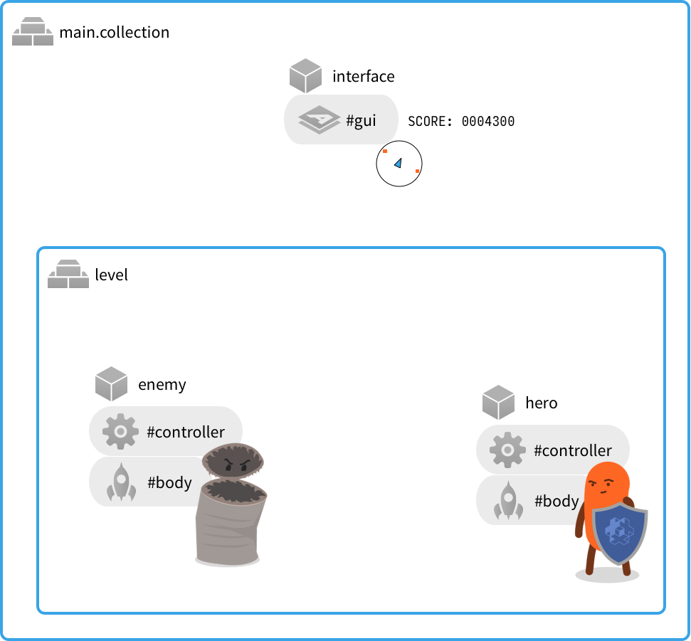
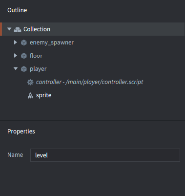

# Передача сообщений

Передача сообщений --- это механизм, с помощью которого игровые объекты Defold взаимодействуют друг с другом. Предполагается, что пользователь уже имеет базовое понимание [принципов адресации](/manuals/addressing) и [основных структурных элементов](/manuals/building-blocks) Defold.

Defold не придерживается объектно-ориентированной парадигмы в том смысле, что пользователь определяет свое приложение, выстраивая иерархию классов с наследованием и функциями-членами в объектах (как в Java, C++ или C#). Вместо этого Defold расширяет Lua простым и мощным объектно-ориентированным дизайном, при котором состояние объекта хранится внутри компонентов скрипта и доступно через ссылку `self`. Кроме того, объекты могут быть полностью изолированы друг от друга с возможностью асинхронной передачи сообщений в качестве средства связи между собой.


## Примеры использования

Давайте сначала рассмотрим несколько простых примеров использования. Предположим, вы разрабатываете игру, в составе которой:

1. Основная загрузочная коллекция, содержащая игровой объект с компонентом GUI (GUI состоит из мини карты и счетчика очков). Имеется также коллекция с идентификатором "level".
2. Коллекция с именем "level" содержит два игровых объекта: один игровой персонаж-герой и один враг.



::: sidenote
Содержимое этого примера находится в двух отдельных файлах. Один файл для основной загрузочной коллекции и один для коллекции с идентификатором "level". Однако в Defold имена файлов _не имеют значения_. Значение имеет идентификатор, который присваивается экземплярам.
:::

Игра содержит несколько простых механик, которые подразумевают взаимодействие между объектами:


① Герой наносит удар врагу
: Как часть этой механики, сообщение `"punch"` отправляется из скрипта объекта "hero" в скрипт объекта "enemy". Поскольку оба объекта находятся в одном и том же месте в иерархии коллекции, предпочтительна относительная адресация:

  ```lua
  -- Отправить `"punch"` из скрипта объекта "hero" в скрипт объекта "enemy"
  msg.post("enemy#controller", "punch")
  ```

  В игре есть только один сильный удар, поэтому сообщение не должно содержать лишнюю информацию, лишь название --- "punch".

  В скрипте объекта-врага необходимо создать функцию для получения сообщения:

  ```lua
  function on_message(self, message_id, message, sender)
    if message_id == hash("punch") then
      self.health = self.health - 100
    end
  end
  ```

  В этом случае код рассматривает только имя сообщения (переданное в виде хэшированной строки в параметре `message_id`). Для кода не важны ни данные сообщения, ни отправитель --- *каждый*, кто посылает сообщение "punch", наносит урон несчастному врагу.

② Герой получает очки
: Каждый раз, когда игрок наносит поражение врагу, его счет увеличивается. Сообщение `"update_score"` также отправляется из скрипта игрового объекта "hero" в компонент "gui" игрового объекта "interface".

  ```lua
  -- Враг поражен. Увеличить счетчик очков на 100.
  self.score = self.score + 100
  msg.post("/interface#gui", "update_score", { score = self.score })
  ```

  В данном случае невозможно написать относительный адрес, поскольку "interface" находится в корне иерархии именования, а "hero" --- нет. Сообщение отправляется компоненту GUI, к которому прикреплен скрипт, чтобы он мог соответствующим образом отреагировать на сообщение. Сообщения могут свободно передаваться между скриптами, GUI-скриптами и рендер-скриптами.

  Сообщение `"update_score"` связано с данными о счете. Данные передаются в виде Lua-таблицы в параметре `message`:

  ```lua
  function on_message(self, message_id, message, sender)
    if message_id == hash("update_score") then
      -- выставить счетчик очков в новое значение
      local score_node = gui.get_node("score")
      gui.set_text(score_node, "SCORE: " .. message.score)
    end
  end
  ```

③ Позиция противника на миникарте
: У игрока есть миникарта на экране, которая помогает обнаруживать и отслеживать врагов. Каждый враг обязан сообщать о своем местоположении, посылая сообщение `"update_minimap"` компоненту "gui" в игровом объекте "interface":

  ```lua
  -- Отправить текущую позицию для обновления интерфейса миникарты
  local pos = go.get_position()
  msg.post("/interface#gui", "update_minimap", { position = pos })
  ```

  Код GUI-скрипта должен отслеживать позицию каждого врага, и если тот же враг посылает новую позицию, старая должна быть заменена. Отправитель сообщения (передается в параметре `sender`) может быть использован в качестве ключа Lua-таблицы со значениями позиций:

  ```lua
  function init(self)
    self.minimap_positions = {}
  end

  local function update_minimap(self)
    for url, pos in pairs(self.minimap_positions) do
      -- обновить положение на карте
      ...
    end
  end

  function on_message(self, message_id, message, sender)
    if message_id == hash("update_score") then
      -- выставить счетчик очков в новое значение
      local score_node = gui.get_node("score")
      gui.set_text(score_node, "SCORE: " .. message.score)
    elseif message_id == hash("update_minimap") then
      -- обновить карту с учетом новых позиций
      self.minimap_positions[sender] = message.position
      update_minimap(self)
    end
  end
  ```

## Отправка сообщений

Как мы раннее убедились, техника отправки сообщения очень проста. Нужно вызвать функцию `msg.post()`, которая помещает сообщение в очередь. Затем, в каждом кадре, движок просматривает очередь и доставляет каждое сообщение по целевому адресу. Некоторые системные сообщения (такие как `"enable"`, `"disable"`, `"set_parent"` и др.) обрабатываются кодом движка. Движок также выдает некоторые системные сообщения (например, `"collision_response"` при физических столкновениях), которые доставляются к объектам. Для пользовательских сообщений, посылаемых скриптам, движок просто вызывает специфичную для Defold Lua-функцию `on_message()`.

Пользователь может посылать произвольные сообщения любому существующему объекту или компоненту, при этом ответ на сообщение зависит от кода на стороне получателя. Считается нормой ситуация, когда код скрипта игнорирует посланное ему сообщение. Ответственность за работу с сообщениями полностью лежит на принимающей стороне.

Движок проверит целевой адрес сообщения. Если попытаться отправить сообщение неизвестному получателю, Defold выведет в консоль сигнал об ошибке:

```lua
-- Попытаться отправить сообщение несуществующему объекту
msg.post("dont_exist#script", "hello")
```

```txt
ERROR:GAMEOBJECT: Instance '/dont_exists' could not be found when dispatching message 'hello' sent from main:/my_object#script
```

Полная запись вызова `msg.post()` выглядит следующим образом:

`msg.post(receiver, message_id, [message])`

receiver
: Идентификатор целевого компонента или игрового объекта. Следует иметь в виду, что если целью является игровой объект, сообщение будет передано всем компонентам этого объекта.

message_id
: Строка или хэшированная строка с именем сообщения.

[message]
: Опциональная Lua-таблица с данными сообщения в виде пар ключ-значение. Практически любой тип данных может быть включен в Lua-таблицу сообщения. Передавать можно числа, строки, булевы значения, URL, хэши и вложенные таблицы. Функции передавать нельзя.

  ```lua
  -- Отправить табличные данные, содержащие вложенную таблицу
  local inventory_table = { sword = true, shield = true, bow = true, arrows = 9 }
  local stats = { score = 100, stars = 2, health = 4, inventory = inventory_table }
  msg.post("other_object#script", "set_stats", stats)
  ```

::: sidenote
Существует строгое ограничение на размер таблицы параметров `message`. Это ограничение установлено в значение 2 килобайта. В настоящее время не существует простого способа выяснить точный объем памяти, потребляемой таблицей, хотя можно использовать `collectgarbage("count")` до и после вставки таблицы с целью мониторинга использования памяти.
:::

### Сокращения

Defold предлагает два полезных сокращения, которые можно использовать для отправки сообщений без указания полного URL:

:[Shorthands](../shared/url-shorthands.md)


## Получение сообщений

Для получения сообщений необходимо убедиться, что целевой скрипт содержит функцию `on_message()`. Функция принимает четыре параметра:

`function on_message(self, message_id, message, sender)`

`self`
: Ссылка на собственно компонент сценария.

`message_id`
: Содержит имя сообщения. Это имя _хэшировано_.

`message`
: Содержит данные сообщения. Это Lua-таблица. Если данных нет, значит таблица пуста.

`sender`
: Содержит полный URL отправителя.

```lua
function on_message(self, message_id, message, sender)
    print(message_id) --> hash: [my_message_name]

    pprint(message) --> {
                    -->   score = 100,
                    -->   value = "some string"
                    --> }

    print(sender) --> url: [main:/my_object#script]
end
```

## Обмен сообщениями между игровыми пространствами

При использовании компонента Collection Proxy для загрузки нового игрового пространства в среду выполнения, возникает необходимость в передаче сообщений между игровыми пространствами. Предположим, что загружается коллекция посредством прокси и что свойство *Name* коллекции имеет значение "level":



Как только коллекция будет загружена, инициирована и активирована, появляется возможность отправлять сообщения любому компоненту или объекту в новом игровом пространстве, указав имя этого пространства в поле "socket" адреса получателя:

```lua
-- Отправить сообщение игроку в новом игровом мире
msg.post("level:/player#controller", "wake_up")
```
Более подробное описание работы прокси можно найти в [документации по прокси-коллекциям](/manuals/collection-proxy).

## Цепочки сообщений

Когда в конечном счете происходит отправка сообщения, вызывается функция`on_message()` получателя. Часто код реакции посылает новые сообщения, добавляемые в очередь.

Когда движок запускает процедуру диспетчеризации (рассылки сообщений), он обрабатывает очередь сообщений и вызывает функцию `on_message()` каждого получателя сообщения, и так до тех пор, пока очередь сообщений не станет пустой. Если в процессе диспетчеризации в очередь добавляются новые сообщения, то выполняется еще один проход. Однако существует жесткий предел количества попыток движка очистить очередь, что ограничивает длину цепочек сообщений, которые можно было бы ожидать как полностью обработанные в кадре. Есть простой способ проверить, сколько проходов диспетчеризации выполняет движок между каждым вызовом `update()` с помощью следующего скрипта:

```lua
function init(self)
    -- Запускаем длинную цепочку сообщений во время инициализации объекта
    -- and keeps it running through a number of update() steps.
    print("INIT")
    msg.post("#", "msg")
    self.updates = 0
    self.count = 0
end

function update(self, dt)
    if self.updates < 5 then
        self.updates = self.updates + 1
        print("UPDATE " .. self.updates)
        print(self.count .. " dispatch passes before this update.")
        self.count = 0
    end
end

function on_message(self, message_id, message, sender)
    if message_id == hash("msg") then
        self.count = self.count + 1
        msg.post("#", "msg")
    end
end
```

Запуск этого сценария выведет что-то вроде следующего:

```txt
DEBUG:SCRIPT: INIT
INFO:ENGINE: Defold Engine 1.2.36 (5b5af21)
DEBUG:SCRIPT: UPDATE 1
DEBUG:SCRIPT: 10 dispatch passes before this update.
DEBUG:SCRIPT: UPDATE 2
DEBUG:SCRIPT: 75 dispatch passes before this update.
DEBUG:SCRIPT: UPDATE 3
DEBUG:SCRIPT: 75 dispatch passes before this update.
DEBUG:SCRIPT: UPDATE 4
DEBUG:SCRIPT: 75 dispatch passes before this update.
DEBUG:SCRIPT: UPDATE 5
DEBUG:SCRIPT: 75 dispatch passes before this update.
```

Мы видим, что эта конкретная версия движка Defold выполняет 10 проходов диспетчеризации очереди сообщений между `init()` и первым вызовом `update()`. Затем он выполняет 75 проходов во время каждого последующего цикла обновления.
