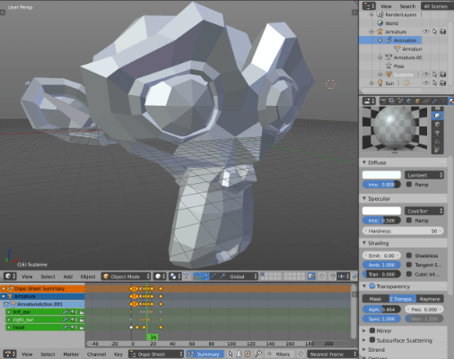
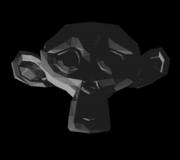

# Анимация 3D-моделей

Скелетная анимация 3D-моделей схожа со [Spine-анимацией](/manuals/spine-animation), но работает по законам 3D вместо 2D. Трехмерная модель не разрезается на отдельные части и не привязывается к скелету как в перекладной анимации. Вместо этого, кости воздействуют на вершины деформируя их в модели, с возможностью гибкого контроля над тем, как сильно конкретная кость влияет на вершины.

Подробнее о том, как импортируются трехмерные данные в 3D модель для анимации, см. в [документация по моделям](/manuals/model).

  {.inline}
  {.inline}


## Воспроизведение анимации

Модели анимируются вызовом функции [`model.play_anim()`](/ref/model#model.play_anim):

```lua
function init(self)
    -- Начать анимацию "wiggle" вперед и назад для #model
    model.play_anim("#model", "wiggle", go.PLAYBACK_LOOP_PINGPONG)
end
```

::: important
В данный момент Defold поддерживает лишь "запеченную" (предварительно заготовленную) анимацию. Анимация должна иметь матрицы трансформации для каждой анимированной кости в каждом кадре, а не позицию, поворот и масштаб в виде отдельных ключей анимации.

Помимо этого, анимация интерполируется линейно. Если требуются более совершенные кривые интерполяции нежели линейные, анимация должна быть предварительно запечена в экспортере.

Анимационные клипы из Collada не поддерживаются. Чтобы воспользоваться несколькими анимациями для одной модели, экспортируйте их в отдельные файлы с расширением *.dae*, затем соберите все файлы в единый файл *.animationset* в Defold.
:::

### Иерархия костей

Кости в скелете модели внутри движка представлены как игровые объекты.

Можно получить идентификатор конкретного экземпляра игрового объекта-кости во время выполнения игры. Функция [`model.get_go()`](/ref/model#model.get_go) возвращает идентификатор игрового объекта для заданной кости.

```lua
-- Получить среднюю кость игрового объекта модели wiggler
local bone_go = model.get_go("#wiggler", "Bone_002")

-- Теперь производим некую полезную работу с игровым объектом кости...
```

### Анимация курсора

В дополнении к использованию метода `model.play_anim()` для более продвинутой анимации модели компоненты типа *Model* предоставляют свойство "cursor", которым можно управлять с помощью вызова `go.animate()` (подробнее в [руководстве по анимации свойств](/manuals/property-animation)):

```lua
-- Выставить анимацию для #model, но не запускать ее
model.play_anim("#model", "wiggle", go.PLAYBACK_NONE)
-- Выставить курсор в начало анимации
go.set("#model", "cursor", 0)
-- Произвести твининг курсора между 0 и 1 в режиме воспроизведения Ping Pong со смягчением InOutQuad.
go.animate("#model", "cursor", go.PLAYBACK_LOOP_PINGPONG, 1, go.EASING_INOUTQUAD, 3)
```

## Завершающие функции обратного вызова

Анимация моделей поддерживает опциональные функции обратного вызова в качестве последнего переданного аргумента. Такие переданные функции будут вызваны когда анимация проиграется до конца. Функции никогда не будут вызваны для зацикленных анимаций, а также для анимаций, которые были отменены вручную вызовом `go.cancel_animations()`. Функция обратного вызова может быть использована для активации других событий по завершению анимации или для склеивания нескольких анимаций в одну цепочку.

```lua
local function wiggle_done(self, message_id, message, sender)
    -- Анимация завершилась на этом этапе
end

function init(self)
    model.play_anim("#model", "wiggle", go.PLAYBACK_ONCE_FORWARD, nil, wiggle_done)
end
```

## Режимы воспроизведения

Анимация может быть воспроизведена либо однократно либо зациклено. Как именно это происходит, определяется режимом воспроизведения:

* go.PLAYBACK_NONE
* go.PLAYBACK_ONCE_FORWARD
* go.PLAYBACK_ONCE_BACKWARD
* go.PLAYBACK_ONCE_PINGPONG
* go.PLAYBACK_LOOP_FORWARD
* go.PLAYBACK_LOOP_BACKWARD
* go.PLAYBACK_LOOP_PINGPONG
