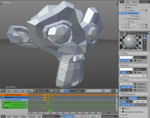
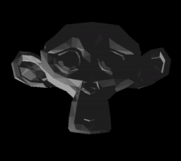

# Анимация 3D-моделей

Компоненты Model могут воспроизводить скелетную анимацию и анимацию морф-таргетов, импортированные из файлов glTF. Скелетная анимация использует кости модели для деформации ее вершин. Анимация морф-таргетов, также известная как blend shape-анимация, изменяет форму модели, анимируя веса альтернативных положений вершин.

Подробнее о том, как импортировать трехмерные данные в модель для анимации, см. в [документации по моделям](/manuals/model).

  
  {.inline}


## Воспроизведение анимации

Модели анимируются вызовом функции [`model.play_anim()`](/ref/model#model.play_anim):

```lua
function init(self)
    -- Начать анимацию "wiggle" вперед и назад для #model
    model.play_anim("#model", "wiggle", go.PLAYBACK_LOOP_PINGPONG)
end
```

::: important
В данный момент Defold поддерживает лишь "запеченную" (предварительно заготовленную) скелетную анимацию. Скелетная анимация должна иметь матрицы трансформации для каждой анимированной кости в каждом кадре, а не позицию, поворот и масштаб в виде отдельных ключей анимации.

Помимо этого, анимация интерполируется линейно. Если требуются более совершенные кривые интерполяции нежели линейные, анимация должна быть предварительно запечена в экспортере.
:::

### Морф-таргеты {#morph-targets}

Морф-таргеты — это альтернативные формы одной и той же сетки. Каждый таргет хранит дельты позиции, нормали и касательной, а также имеет вес смешивания, который управляет тем, насколько сильно применяется эта форма. Вес `0` означает, что таргет не влияет на модель, а вес `1` применяет полную форму таргета. Значения вне этого диапазона также могут быть полезны для преувеличенных эффектов, если шейдер и ассет подготовлены для этого.

Defold импортирует морф-таргеты и начальные веса морфинга из данных модели glTF. glTF-анимации, которые анимируют веса морфинга, импортируются в набор анимаций модели и могут воспроизводиться с помощью [`model.play_anim()`](/ref/model#model.play_anim), так же как скелетные анимации:

```lua
function init(self)
    model.play_anim("#model", "smile", go.PLAYBACK_LOOP_FORWARD)
end
```

Данные морф-таргетов можно использовать отдельно или вместе со скелетной анимацией, но компонент модели может воспроизводить только одну модельную анимацию за раз. Это означает, что нельзя одновременно воспроизвести одну скелетную анимацию и одну отдельную анимацию морф-таргетов с помощью `model.play_anim()`. Если у модели есть данные анимации, но нет скелета, будут использоваться только данные анимации морф-таргетов.

Тем не менее можно совмещать воспроизведение скелетной анимации с изменениями морф-таргетов из других источников, например задавая веса морф-таргетов из скрипта с помощью `model.set_blend_weights()`.

Также можно читать и переопределять веса морф-таргетов из скрипта. [`model.get_blend_weights()`](/ref/model#model.get_blend_weights) возвращает текущие веса для первой сетки модели, у которой есть морф-таргеты. [`model.set_blend_weights()`](/ref/model#model.set_blend_weights) применяет скриптовое переопределение ко всем морфируемым сеткам модели:

```lua
function init(self)
    local weights = model.get_blend_weights("#model")
    weights[1] = 0.75
    weights[2] = 0.25
    model.set_blend_weights("#model", weights)
end
```

Таблица весов использует индексы Lua, начинающиеся с единицы, в том же порядке, что и морф-таргеты в сетке. Лишние значения игнорируются, а отсутствующие значения считаются нулевыми для сеток, у которых морф-таргетов больше, чем значений в таблице. Скриптовое переопределение применяется после анимации каждый кадр, пока не будет очищено:

```lua
model.set_blend_weights("#model")     -- clear the override
model.set_blend_weights("#model", nil) -- also clears the override
```

### Поддержка шейдеров

Чтобы отрисовать морф-таргеты, вершинный шейдер материала модели должен сэмплировать сгенерированную текстуру `morph_targets` и применять взвешенные дельты к данным вершин. Текстура морф-таргетов — это 2D array texture, где каждый морф-таргет использует три слоя массива: дельту позиции, дельту нормали и дельту касательной.

Движок передает текущие веса морфинга в uniform вершинного шейдера с именем `morph_targets_weights`. Каждый `vec4` хранит четыре веса, поэтому `morph_targets_weights[2]` вмещает восемь морф-таргетов.

В следующем примере показаны соответствующие части вершинного шейдера для неинстансируемого материала модели:

```glsl
#version 140

in highp vec4 position;
in mediump vec2 texcoord0;
in mediump vec3 normal;
in mediump vec4 tangent;

out mediump vec2 var_texcoord0;
out mediump vec3 var_normal;
out mediump vec4 var_tangent;

uniform vs_uniforms
{
    mediump mat4 mtx_worldview;
    mediump mat4 mtx_proj;
    mediump mat4 mtx_normal;
    // Each vec4 stores four blend weights. Use morph_targets_weights[1]
    // for up to 4 morph targets, [2] for up to 8, [3] for up to 12, etc.
    mediump vec4 morph_targets_weights[2];
};

uniform sampler2DArray morph_targets;

vec2 get_morph_uv(int vertex_index, int width, int height)
{
    int x = vertex_index % width;
    int y = vertex_index / width;
    return vec2(
        (float(x) + 0.5) / float(width),
        (float(y) + 0.5) / float(height)
    );
}

void apply_morph_target(vec2 uv, float weight, int target,
    inout vec3 position_delta, inout vec3 normal_delta, inout vec3 tangent_delta)
{
    if (weight == 0.0) {
        return;
    }

    int position_layer = target * 3 + 0;
    int normal_layer = target * 3 + 1;
    int tangent_layer = target * 3 + 2;

    position_delta += weight * texture(morph_targets, vec3(uv, position_layer)).xyz;
    normal_delta += weight * texture(morph_targets, vec3(uv, normal_layer)).xyz;
    tangent_delta += weight * texture(morph_targets, vec3(uv, tangent_layer)).xyz;
}

void get_morph_target_data(int vertex_index,
    out vec3 position_delta, out vec3 normal_delta, out vec3 tangent_delta)
{
    position_delta = vec3(0.0);
    normal_delta = vec3(0.0);
    tangent_delta = vec3(0.0);

#ifndef EDITOR
    ivec3 texture_size = textureSize(morph_targets, 0);
    vec2 uv = get_morph_uv(vertex_index, texture_size.x, texture_size.y);

    apply_morph_target(uv, morph_targets_weights[0].x, 0, position_delta, normal_delta, tangent_delta);
    apply_morph_target(uv, morph_targets_weights[0].y, 1, position_delta, normal_delta, tangent_delta);
    apply_morph_target(uv, morph_targets_weights[0].z, 2, position_delta, normal_delta, tangent_delta);
    apply_morph_target(uv, morph_targets_weights[0].w, 3, position_delta, normal_delta, tangent_delta);
    apply_morph_target(uv, morph_targets_weights[1].x, 4, position_delta, normal_delta, tangent_delta);
    apply_morph_target(uv, morph_targets_weights[1].y, 5, position_delta, normal_delta, tangent_delta);
    apply_morph_target(uv, morph_targets_weights[1].z, 6, position_delta, normal_delta, tangent_delta);
    apply_morph_target(uv, morph_targets_weights[1].w, 7, position_delta, normal_delta, tangent_delta);
#endif
}

void main()
{
    vec3 position_delta;
    vec3 normal_delta;
    vec3 tangent_delta;
    get_morph_target_data(gl_VertexIndex, position_delta, normal_delta, tangent_delta);

    vec3 morphed_position = position.xyz + position_delta;
    vec3 morphed_normal = normalize(normal + normal_delta);
    vec3 morphed_tangent = normalize(tangent.xyz + tangent_delta);

    var_texcoord0 = texcoord0;
    var_normal = normalize((mtx_normal * vec4(morphed_normal, 0.0)).xyz);
    var_tangent = vec4(normalize((mtx_normal * vec4(morphed_tangent, 0.0)).xyz), tangent.w);

    gl_Position = mtx_proj * mtx_worldview * vec4(morphed_position, 1.0);
}
```

Обертка `#ifndef EDITOR` нужна, потому что предпросмотр модельной анимации пока недоступен в редакторе, поэтому сгенерированные данные текстуры морф-таргетов доступны только во время выполнения. Увеличьте размер массива `morph_targets_weights` и добавьте больше вызовов `apply_morph_target()`, если в сетке больше морф-таргетов.

::: important
Пример шейдера выше использует `textureSize()` и не работает в OpenGL ES 2.0.
:::

### Иерархия костей

Кости в скелете модели внутри движка представлены как игровые объекты.

Можно получить идентификатор конкретного экземпляра игрового объекта-кости во время выполнения игры. Функция [`model.get_go()`](/ref/model#model.get_go) возвращает идентификатор игрового объекта для заданной кости.

```lua
-- Получить среднюю кость игрового объекта модели wiggler
local bone_go = model.get_go("#wiggler", "Bone_002")

-- Теперь производим некую полезную работу с игровым объектом кости...
```

### Анимация курсора

В дополнении к использованию метода `model.play_anim()` для более продвинутой анимации модели компоненты типа *Model* предоставляют свойство "cursor", которым можно управлять с помощью вызова `go.animate()` (подробнее в [руководстве по анимации свойств](/manuals/property-animation)):

```lua
-- Выставить анимацию для #model, но не запускать ее
model.play_anim("#model", "wiggle", go.PLAYBACK_NONE)
-- Выставить курсор в начало анимации
go.set("#model", "cursor", 0)
-- Произвести твининг курсора между 0 и 1 в режиме воспроизведения Ping Pong со смягчением InOutQuad.
go.animate("#model", "cursor", go.PLAYBACK_LOOP_PINGPONG, 1, go.EASING_INOUTQUAD, 3)
```

## Завершающие функции обратного вызова

Анимация моделей `model.play_anim()` поддерживает опциональные функции обратного вызова в качестве последнего переданного аргумента. Такие переданные функции будут вызваны когда анимация проиграется до конца. Функции никогда не будут вызваны для зацикленных анимаций, а также для анимаций, которые были отменены вручную вызовом `go.cancel_animations()`. Функция обратного вызова может быть использована для активации других событий по завершению анимации или для склеивания нескольких анимаций в одну цепочку.

```lua
local function wiggle_done(self, message_id, message, sender)
    -- Анимация завершилась на этом этапе
end

function init(self)
    model.play_anim("#model", "wiggle", go.PLAYBACK_ONCE_FORWARD, nil, wiggle_done)
end
```

## Режимы воспроизведения

Анимация может быть воспроизведена либо однократно либо зациклено. Как именно это происходит, определяется режимом воспроизведения:

* `go.PLAYBACK_NONE`
* `go.PLAYBACK_ONCE_FORWARD`
* `go.PLAYBACK_ONCE_BACKWARD`
* `go.PLAYBACK_ONCE_PINGPONG`
* `go.PLAYBACK_LOOP_FORWARD`
* `go.PLAYBACK_LOOP_BACKWARD`
* `go.PLAYBACK_LOOP_PINGPONG`
