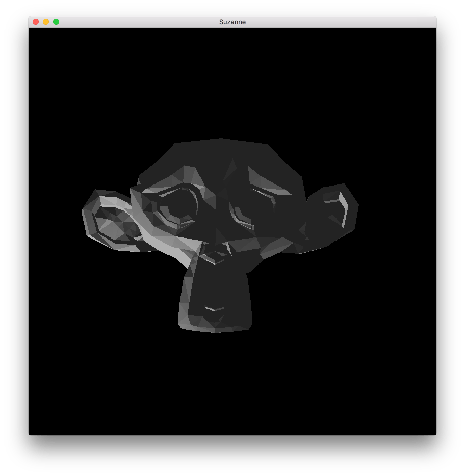

# Компонент Model

Defold по сути является 3D движком. Даже когда работа ведется только с 2D-материалом, весь рендеринг выполняется в 3D, но проецируется на экран ортографически. Defold позволяет полноценно использовать 3D-контент, включая 3D-ассеты, или _модели_ в коллекции. Игры могут быть созданы исключительно в 3D с использованием лишь 3D-ассетов, или же 3D и 2D контент может совмещаться в соответствии с целями разработчика.

## Создание компонента Model

Модели создаются так же, как и любой другой компонент игрового объекта. Это можно сделать двумя способами:

- Создайте *файл модели*, <kbd>кликнув ПКМ</kbd> в подходящем расположении в браузере *Assets* и выберите <kbd>New... ▸ Model</kbd>.
- Создайте компонент, встроенный непосредственно в игровой объект, <kbd>кликнув ПКМ</kbd> по игровому объекту в представлении *Outline* и выбрав <kbd>Add Component ▸ Model</kbd>.


После того как модель создана, необходимо определить ряд ее свойств.

### Свойства модели

Помимо свойств *Id*, *Position* и *Rotation* существуют следующие специфичные для данного компонента свойства:

*Mesh*
: Данное свойство должно ссылаться на файл *.dae* (Collada), содержащий используемую сетку. Если файл содержит несколько сеток, считана будет только первая.

*Material*
: Укажите в этом свойстве материал, подходящий для текстурированного 3D-объекта. Существует встроенный файл *model.material*, который можно использовать в качестве отправной точки.

*Texture*
: Данное свойство должно указывать на файл текстуры, которую необходимо применить к объекту.

*Skeleton*
: Данное свойство должно ссылаться на файл *.dae* (Collada), содержащий скелет, используемый для анимации. Следует иметь в виду, что Defold требует наличия одной корневой кости в иерархии.

*Animations*
: Укажите в этом свойстве файл *Animation Set*, содержащий анимацию, требуемую для модели.

*Default Animation*
: Это анимация (из набора анимаций), которая будет автоматически воспроизводиться в модели.

## Манипулирование в редакторе

После того, как модель размещена, можно свободно редактировать и манипулировать этим компонентом и/или объемлющим игровым объектом с помощью обычных инструментов *Scene Editor*, перемещая, вращая и масштабируя модель по своему усмотрению.



## Манипулирование во время выполнения

Манипулировать моделями во время выполнения можно с помощью ряда различных функций и свойств (обращайтесь к [документации по API](/ref/model/)).

### Анимация во время выполнения

Defold предоставляет мощную поддержку для управления анимацией во время выполнения. За подробностями обращайтесь к [руководству по модельной анимации](/manuals/model-animation):

```lua
local play_properties = { blend_duration = 0.1 }
model.play_anim("#model", "jump", go.PLAYBACK_ONCE_FORWARD, play_properties)
```

Курсор воспроизведения анимации может быть анимирован как вручную, так и с помощью механизма анимации свойств:

```lua
-- set the run animation
model.play_anim("#model", "run", go.PLAYBACK_NONE)
-- animate the cursor
go.animate("#model", "cursor", go.PLAYBACK_LOOP_PINGPONG, 1, go.EASING_LINEAR, 10)
```

### Изменение свойств

Модель также имеет ряд различных свойств, которыми можно манипулировать с помощью `go.get()` и `go.set()`:

`animation`
: Текущая анимация модели (`hash`, только для чтения). Анимация изменяется с помощью `model.play_anim()` (см. выше).

`cursor`
: Нормализованный курсор анимации (`number`).

`material`
: Материал модели (`hash`). Это свойство можно изменить с помощью свойства ресурса Material и `go.set()`. За примером обращайтесь к [справочнику по API](/ref/model/#material).

`playback_rate`
: Скорость воспроизведения анимации (`number`).

`textureN`
: Текстуры модели, где N --- 0-7 (`hash`). Может быть изменено с помощью свойства ресурса текстуры и `go.set()`. За примером обращайтесь к [справочнику по API](/ref/model/#textureN).


## Материал

3D-программы обычно позволяют задавать свойства вершин объекта, такие как цвет и текстурирование. Эта информация попадает в файл Collada *.dae*, который экспортируется из 3D-программы. В зависимости от требований игры потребуется выбрать и/или создать подходящие и _эффективные_ материалы для объектов. Материал сочетает в себе _шейдерные программы_ с набором параметров для рендеринга объекта.

В папке встроенных материалов имеется простой материал для 3D-модели. Если необходимо создавать пользовательские материалы для моделей, обращайтесь к [документации по материалам](/manuals/material). [Руководство по шейдерам](/manuals/shader) содержит информацию о работе шейдерных программ.


### Константы материала



`tint`
: Цветовой оттенок модели (`vector4`). Для представления оттенка с компонентами x, y, z и w, соответствующими красному, зеленому, синему и альфа оттенкам, используется тип vector4.


## Рендеринг

Рендер-скрипт по умолчанию создан для 2D-игр и не работает с 3D-моделями. Но, скопировав этот стандартный рендер-скрипт и добавив в него несколько строк кода, можно включить рендеринг моделей. Например:

  ```lua

  function init(self)
    self.model_pred = render.predicate({"model"})
    ...
  end

  function update()
    ...
    render.set_depth_mask(true)
    render.enable_state(render.STATE_DEPTH_TEST)
    render.set_projection(stretch_projection(-1000, 1000))  -- orthographic
    render.draw(self.model_pred)
    render.set_depth_mask(false)
    ...
  end
  ```

Обращайтесь к [документации по рендеру](/manuals/render) за информацией о работе рендер-скриптов.
