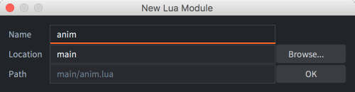

# Lua modules

Lua modules allow you to structure your project and create reusable library code. It is generally a good idea to avoid duplication in your projects. Defold allows you to use Lua's module functionality to include script files into other script files. This allows you to encapsulate functionality (and data) in an external script file for reuse in game object and GUI script files.

## Requiring Lua files

Lua code stored in files with file ending ".lua" somewhere in your game project structure can be required into script and gui script files. To create a new Lua module file, right click the folder you want to create it in in the *Assets* view, then select <kbd>New... ▸ Lua Module</kbd>. Give the file a unique name and press <kbd>Ok</kbd>:

{srcset="images/modules/new_name@2x.png 2x"}

Suppose the following code is added to the file "main/anim.lua":

```lua
function direction_animation(direction, char)
    local d = ""
    if direction.x > 0 then
        d = "right"
    elseif direction.x < 0 then
        d = "left"
    elseif direction.y > 0 then
        d = "up"
    elseif direction.y < 0 then
        d = "down"
    end
    return hash(char .. "-" .. d)
end
```

Then it's possible for any script to require this file and use the function:

```lua
require "main.anim"

function update(self, dt)
    -- update position, set direction etc
    ...

    -- set animation
    local anim = direction_animation(self.dir, "player")
    if anim ~= self.current_anim then
        msg.post("#sprite", "play_animation", { id = anim })
        self.current_anim = anim
    end
end
```

The function `require` loads the given module. It starts by looking into the `package.loaded` table to determine whether the module is already loaded. If it is, then `require` returns the value stored at `package.loaded[module_name]`. Otherwise, it loads and evaluates the file via a loader.

The syntax of the filename string provided to `require` is a bit special. Lua replaces '.' characters in the filename string with path separators: '/' on macOS and Linux and '\\' on Windows.

Note that it is usually a bad idea to use the global scope to store state and define functions like we did above. You risk naming collisions, exposing the state of the module or introduce coupling between users of the module.

## Modules

To encapsulate data and functions, Lua uses _modules_. A Lua module is a regular Lua table that is used to contain functions and data. The table is declared local not to pollute the global scope:

```lua
local M = {}

-- private
local message = "Hello world!"

function M.hello()
    print(message)
end

return M
```

The module can then be used. Again, it is prefered to assign it to a local variable:

```lua
local m = require "mymodule"
m.hello() --> "Hello world!"
```

## Hot reloading modules

Consider a simple module:

```lua
-- module.lua
local M = {} -- creates a new table in the local scope
M.value = 4711
return M
```

And a user of the module: 

```lua
local m = require "module"
print(m.value) --> "4711" (even if "module.lua" is changed and hot reloaded)
```

If you hot reload the module file the code is run again, but nothing happens with `m.value`. Why is that?

First, the table created in "module.lua" is created in local scope and a _reference_ to that table is returned to the user. Reloading "module.lua" evaluates the module code again but that creates a new table in the local scope instead of updating the table `m` refers to.

Secondly, Lua caches required files. The first time a file is required, it is put in the table [`package.loaded`](/ref/package/#package.loaded) so it can be read faster on subsequent requires. You can force a file to be re-read from disk by setting the file's entry to nil: `package.loaded["my_module"] = nil`.

To properly hot reload a module, you need to reload the module, reset the cache and then reload all files that uses the module. This is far from optimal.

Instead, you might consider a workaround to use _during development_: put the module table in the global scope and have `M` refer to the global table instead of creating a new table each time the file evaluates. Reloading the module then changes the contents of the global table:

```lua
--- module.lua

-- Replace with local M = {} when done
uniquevariable12345 = uniquevariable12345 or {}
local M = uniquevariable12345

M.value = 4711
return M
```

## Modules and state

Stateful modules keep an internal state that is shared between all users of the module and can be compared to singletons:

```lua
local M = {}

-- all users of the module will share this table
local state = {}

function M.do_something(foobar)
    table.insert(state, foobar)
end

return M
```

A stateless module on the other hand doesn’t keep any internal state. Instead it provides a mechanism to externalize the state into a separate table that is local to the module user. Here are a few different ways to implement this:

Using a state table
: Perhaps the easiest approach is to use a constructor function that returns a new table containing only state. The state is explicitly passed to the module as the first parameter of every function that manipulates the state table.

  ```lua
  local M = {}
  
  function M.alter_state(the_state, v)
      the_state.value = the_state.value + v
  end
  
  function M.get_state(the_state)
      return the_state.value
  end
  
  function M.new(v)
      local state = {
          value = v
      }
      return state
  end
  
  return M
  ```
  
  Use the module like this:
  
  ```lua
  local m = require "main.mymodule"
  local my_state = m.new(42)
  m.alter_state(my_state, 1)
  print(m.get_state(my_state)) --> 43
  ```

Using metatables
: Another approach is to use a constructor function that returns a new table with state and the public functions of the module each time it’s called:

  ```lua
  local M = {}
  
  function M:alter_state(v)
      -- self is added as first argument when using : notation
      self.value = self.value + v
  end
  
  function M:get_state()
      return self.value
  end
  
  function M.new(v)
      local state = {
          value = v
      }
      return setmetatable(state, { __index = M })
  end
  
  return M
  ```

  Use the module like this:

  ```lua
  local m = require "main.mymodule"
  local my_state = m.new(42)
  my_state:alter_state(1) -- "my_state" is added as first argument when using : notation
  print(my_state:get_state()) --> 43
  ```

Using closures
:  A third way is to return a closure containing all state and functions. There is no need to pass the instance as an argument (either explicitly or implicitly using the colon operator) like when using metatables. This method is also somewhat faster than using metatables since function calls does not need to go through the `__index` metamethods but each closure contains its own copy of the methods so memory consumption is higher.

  ```lua
  local M = {}
  
  function M.new(v)
      local state = {
          value = v
      }
  
      state.alter_state = function(v)
          state.value = state.value + v
      end
  
      state.get_state = function()
          return state.value
      end
  
      return state
  end
  
  return M
  ```

  Use the module like this:

  ```lua
  local m = require "main.mymodule"
  local my_state = m.new(42)
  my_state.alter_state(1)
  print(my_state.get_state()) 
  ```
