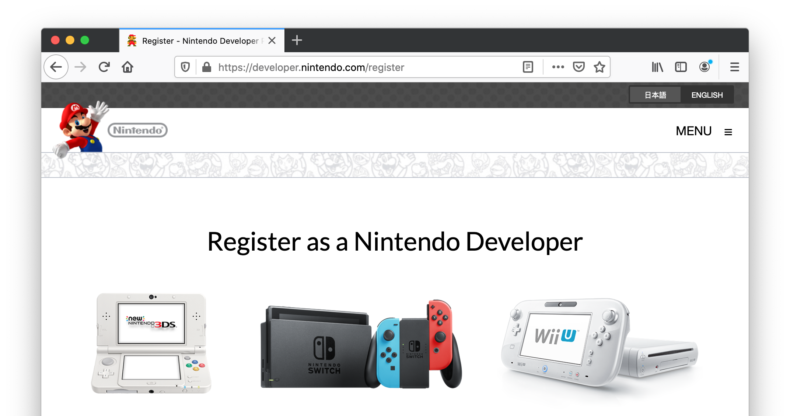

# Разработка для Nintendo Switch

Из-за лицензионных ограничений Nintendo доступ к версиям Defold с поддержкой платформы Nintendo Switch не входит в стандартную версию Defold. Чтобы получить доступ к таким версиям, необходимо стать одобренным разработчиком игр для Nintendo Switch.

## Регистрация в качестве разработчика для Nintendo Switch

Вы можете зарегистрироваться как разработчик игр для Nintendo Switch на [портале разработчиков Nintendo](https://developer.nintendo.com/register):

После того как вы будете одобрены Nintendo, вы получите доступ к разделу Tools and Middleware на портале разработчиков Nintendo, где сможете запросить доступ к Defold. После вашей регистрации мы получим от Nintendo письмо с подтверждением того, что вы являетесь зарегистрированным разработчиком Nintendo.

## Доступ к поддержке Nintendo Switch в Defold

После подтверждения вашего статуса одобренного разработчика Nintendo Switch мы предоставим вам доступ к следующему:

* Доступ к исходному коду расширения Nintendo Switch с интеграцией API, специфичных для консоли.
* Доступ к исходному коду версии игрового движка Defold с поддержкой Nintendo Switch. Обратите внимание, что доступ к исходному коду не требуется для сборки игр под Nintendo Switch, но он предоставляется в случае, если вы хотите внести изменения в ядро движка.
* [Утилита командной строки](/manuals/bob) с поддержкой сборки под платформу Nintendo Switch. Сборка из редактора Defold не поддерживается.
* Форум, где вы сможете получить поддержку, связанную с Nintendo Switch.

## FAQ
:[Consoles FAQ](../shared/consoles-faq.md)