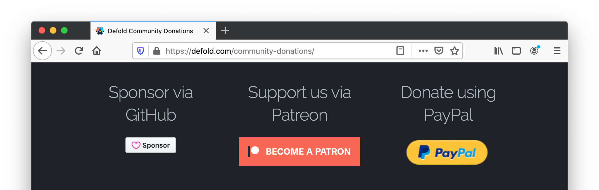

# Зарегиструйтесь в Nintendo Switch как разработчик

Поддержка платформы Nintendo Switch не включена в стандартную версию Defold. Чтобы получить доступ к поддержке Nintendo Switch в Defold, вам необходимо:

1. Стать спонсором сообщества Defold и получите доступ к Nintendo Switch, включенный в ваш уровень членства, и
2. Стать зарегистрированным разработчиком игр для платформ Nintendo.

## Станьте спонсором сообщества Defold и получите доступ к Nintendo Switch

Вы можете стать спонсором сообщества Defold на [странице пожертвований сообщества Defold](/community-donations/). Также вы можете стать спонсором с доступом к Nintendo Switch, используя GitHub Sponsors или Patreon. Обратите внимание на доступные уровни и выберите тот, который включает доступ к Nintendo Switch.

## Зарегистрируйтесь в качестве разработчика игр для платформ Nintendo

Регистрируетесь в качестве разработчика игр для платформ Nintendo на [портале разработчиков Nintendo](https://developer.nintendo.com/register):

Пройдя регистрирацию, вы получите доступ к инструментам и ресурсам разработчиков Nintendo для создания и публикации игр и приложений для современных платформ Nintendo.

### Запрос доступа в Defold

После получения одобрения от Nintendo вам необходимо войти на портал Nintendo для разработчиков, перейти на страницу Tools and Middleware и зарегистрироваться для доступа в Defold. Когда вы зарегистрируетесь для доступа в Defold, мы получим электронное письмо от Nintendo, подтверждающее, что вы являетесь зарегистрированным разработчиком Nintendo. Затем мы проверим вас как спонсора сообщества, и доступ к Nintendo Switch будет включен в ваш уровень членства.

Когда мы подтвердим, что вы являетесь спонсором с доступом к Nintendo Switch, мы предоставим вам доступ к следующему:

* Версии редактора Defold и инструментов командной строки Defold (bob.jar) с поддержкой комплектации для платформы Nintendo Switch.
* К частной группе форума, где вы можете получить поддержку по вопросам Nintendo Switch.
* Документации для Nintendo Switch
* API к функциональности движка, специфичной для Nintendo Switch.

## Часто задаваемые вопросы
:[Nintendo Switch](../shared/nintendo-switch-faq.md)
