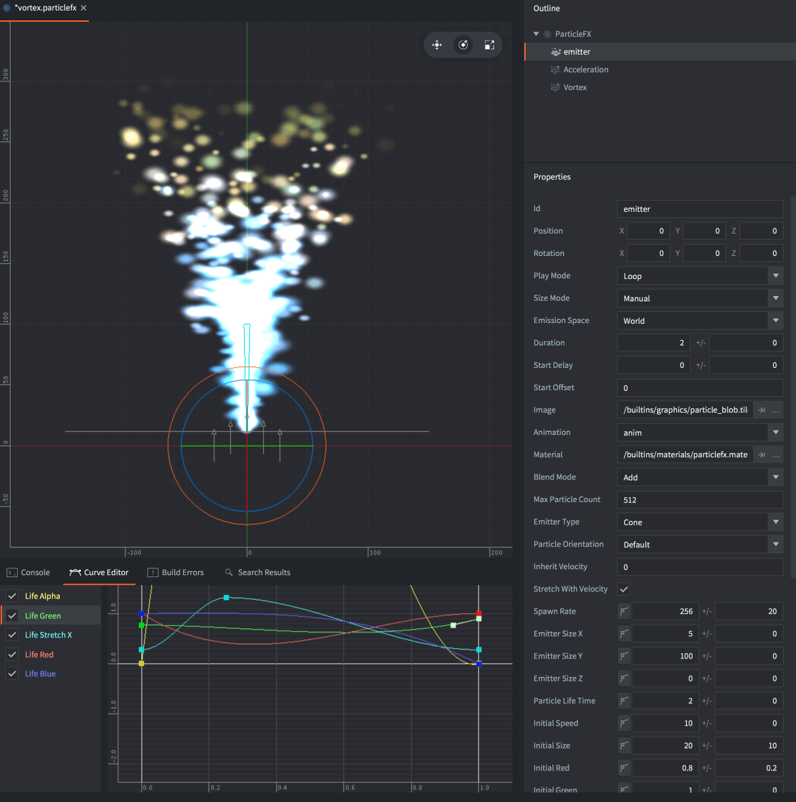
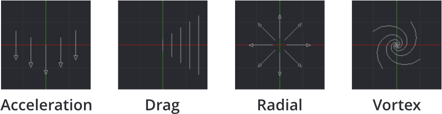

# Компонент Particle FX

Эффекты частиц используются для визуального обогащения игр. С их помощью можно создавать взрывы, брызги крови, следы, погодные условия или любые другие эффекты.



Эффекты частиц состоят из нескольких эмиттеров и, опционально, модификаторов:

Эмиттер
: Эмиттер --- это форма с позицией, которая испускает частицы, равномерно распределенные по форме. Эмиттер имеет свойства, управляющие порождением частиц, а также изображением или анимацией, продолжительностью жизни, цветом, формой и скоростью отдельных частиц.

Модификатор
: Модификатор влияет на скорость порожденных частиц, заставляя их ускоряться или замедляться в определенном направлении, двигаться радиально или закручиваться вокруг точки. Модификаторы могут влиять на отдельные частицы эмиттера или на конкретный эмиттер.

## Создание эффекта

Выберите <kbd>New... ▸ Particle FX</kbd> из контекстного меню в браузере *Assets*. Присвойте имя новому файлу эффекта частиц. Редактор откроет файл в [Scene Editor](/manuals/editor/#the-scene-editor).

Представление *Outline* отобразит эмиттер по умолчанию. Выделите эмиттер, чтобы отобразить его свойства в панели *Properties* ниже.


Чтобы добавить новый эмиттер к эффекту, <kbd>кликните ПКМ</kbd> в корне компонента в *Outline* и выберите <kbd>Add Emitter ▸ [type]</kbd> из контекстного меню. Следует отметить, что тип эмиттера можно изменить в его свойствах.

Чтобы добавить новый модификатор, <kbd>кликните ПКМ</kbd> в расположении модификатора в *Outline* (корень компонента или конкретный излучатель) и выберите <kbd>Add Modifier</kbd>, затем выберите тип модификатора.


Модификатор в корне эффекта (не дочерний по отношению к эмиттеру), влияет на все частицы в этом эффекте.

Модификатор, добавленный к эмиттеру в качестве дочернего, влияет только на этот эмиттер.

## Предпросмотр эффекта

* Выберите <kbd>View ▸ Play</kbd> из меню для предпросмотра эффекта. Возможно, придется уменьшить масштаб камеры, чтобы увидеть эффект должным образом.
* Выберите <kbd>View ▸ Play</kbd> снова чтобы приостановить эффект.
* Выберите <kbd>View ▸ Stop</kbd> чтобы полностью остановить эффект. Повторное воспроизведение перезапускает его с изначального состояния.

При редактировании эмиттера или модификатора результат сразу же виден в редакторе, даже если эффект приостановлен:


## Свойства эмиттера

Id
: Идентификатор эмиттера (используется при установке рендер-констант для определенных эмиттеров).

Position/Rotation
: Трансформации эмиттера относительно компонента Particle FX.

Play Mode
: Управляет процессом воспроизведения эмиттера:
  - `Once` --- останавливает эмиттер по истечении его длительности.
  - `Loop` --- перезапускает эмиттер по истечении его длительности.

Size Mode
: Управляет изменением размера мултикадровой анимации:
  - `Auto` --- сохраняет размер каждого кадра мултикадровой анимации в соответствии с исходным изображением.
  - `Manual` --- устанавливает размер частиц в соответствии со свойством размера.

Emission Space
: Геометрическое пространство, в котором будут существовать порожденные частицы:
  - `World` --- перемещает частицы независимо от эмиттера.
  - `Emitter` --- перемещает частицы относительно эмиттера.

Duration
: Количество секунд, в течение которых эмиттер должен испускать частицы.

Start Delay
: Количество секунд, которое эмиттер должен подождать прежде, чем начнет испускать частицы.

Start Offset
: Количество секунд, через которое должен произойти запуск эмиттера, или, другими словами, как долго эмиттер должен подготавливаться для эффекта.

Image
: Файл изображения (Tile Source или Atlas), используемый для текстурирования и анимации частиц.

Animation
: Анимация из файла свойства *Image*, используемая в частицах.

Material
: Материал, используемый для шейдинга частиц.

Blend Mode
: Доступные режимы наложения: `Alpha`, `Add` и `Multiply`.

Max Particle Count
: Количество частиц, исходящих от данного эмиттера, способных существовать одновременно.

Emitter Type
: Форма эмиттера
  - `Circle` --- испускает частицы из случайного места внутри окружности. Частицы направлены наружу от центра. Диаметр окружности определяется свойством *Emitter Size X*.

  - `2D Cone` --- испускает частицы из случайного места внутри плоского конуса (треугольника). Частицы направлены из вершины конуса. Свойство *Emitter Size X* определяет ширину вершины, *Y* --- высоту.

  - `Box` --- испускает частицы из случайного места внутри бокса. Частицы направлены вверх вдоль локальной оси Y бокса. Свойства *Emitter Size X*, *Y* и *Z* определяют ширину, высоту и глубину соответственно. Для 2D прямоугольника размер Z должен быть равен нулю.

  - `Sphere` --- испускает частицы из случайного места внутри сферы. Частицы направлены наружу от центра. Диаметр сферы определяется свойством *Emitter Size X*.

  - `Cone` --- испускает частицы из случайного места внутри трехмерного конуса. Частицы направляются наружу через верхний диск конуса. Свойство *Emitter Size X* определяет диаметр верхнего диска, *Y* --- высоту конуса.

  

Particle Orientation
: Ориентация испускаемых частиц:
  - `Default` --- sets the orientation to unit orientation
  - `Initial Direction` --- сохраняет начальную ориентацию испускаемых частиц.
  - `Movement Direction` --- корректирует ориентацию частиц в зависимости от их скорости.

Inherit Velocity
: Масштабное значение определяющее, какую часть скорости эмиттера должны унаследовать частицы. Это значение доступно, только если *Space* установлено в `World`. Скорость эмиттера рассчитывается каждый кадр.

Stretch With Velocity
: Если опция отмечена, будет выполняться масштабирование любых растяжений частиц в направлении движения.

### Режимы наложения
:[blend-modes](../shared/blend-modes.md)

## Программируемые свойства эмиттера

Эти свойства имеют два поля: значение и разброс. Разброс --- это вариация, которая применяется случайным образом для каждой порожденной частицы. Например, если значение равно 50, а разброс равен 3, каждая порожденная частица получит значение между 47 и 53 (50 +/- 3).


Если активировать ключ-кнопку, значение свойства будет контролироваться посредством кривой в течение длительности действия эмиттера. Чтобы сбросить запрограммированное свойство, кликните ключ-кнопку снова.


Редактор *Curve Editor* (доступен среди вкладок в нижнем представлении) используется для изменения кривой. Запрограммированные свойства нельзя редактировать в представлении *Properties*, только в *Curve Editor*. <kbd>Кликните и перетащите</kbd> поинты и тангенты для изменения формы кривой. <kbd>Двойным кликом</kbd> на кривой добавляйте управляющие поинты. Чтобы удалить управляющий поинт, сделайте <kbd>двойной клик</kbd> по нему.


Чтобы автоматически масштабировать Curve Editor для отображения всех кривых, нажмите <kbd>F</kbd>.

Следующие свойства могут быть запрограммированы в течение времени воспроизведения эмиттера:

Spawn Rate
: Количество частиц, испускаемых в секунду.

Emitter Size X/Y/Z
: Размеры формы эмиттера, см. выше *Emitter Type*.

Particle Life Time
: Время жизни каждой порожденной частицы в секундах.

Initial Speed
: Начальная скорость каждой порожденной частицы.

Initial Size
: Начальный размер каждой порожденной частицы. Если *Size Mode* установлено в `Automatic`, а в качестве источника изображения используется мултикадровая анимация, это свойство игнорируется.

Initial Red/Green/Blue/Alpha
: Начальные значения оттенка компонентов цвета для частиц.

Initial Rotation
: Начальные значения вращения (в градусах) для частиц.

Initial Stretch X/Y
: Начальные значения растяжения (в юнитах) для частиц.

Initial Angular Velocity
: Начальная угловая скорость (в градусах/секунду) каждой порожденной частицы.

Следующие свойства могут быть запрограммированы в течение времени жизни частиц:

Life Scale
: Значение масштаба в течение жизни каждой частицы.

Life Red/Green/Blue/Alpha
: Значение оттенка компонента цвета в течение жизни каждой частицы.

Life Rotation
: Значение вращения (в градусах) в течение жизни каждой частицы.

Life Stretch X/Y
: Величина растяжения (в юнитах) в течение жизни каждой частицы.

Life Angular Velocity
: Угловая скорость (в градусах/секунду) в течение жизни каждой частицы.

## Модификаторы

Существует четыре типа модификаторов, которые влияют на скорость частиц:

`Acceleration`
: Ускоряет в общем направлении.

`Drag`
: Уменьшает ускорение частиц пропорционально их скорости.

`Radial`
: Притягивает или отталкивает частицы к/от позиции.

`Vortex`
: Воздействует на частицы в круговом или спиралевидном направлении вокруг своей позиции.

  

## Свойства модификатора

Position/Rotation
: Трансформация модификатора относительно своего родителя.

Magnitude
: Степень влияния модификатора на частицы.

Max Distance
: Максимальное расстояние, в пределах которого частицы вообще подвержены влиянию этого модификатора. Используется только для Radial и Vortex.

## Управление эффектом частиц

Чтобы запустить и остановить эффект частиц из скрипта:

```lua
-- запустить эффект частиц в текущем игровом объекте
particlefx.play("#particles")

-- остановить эффект частиц в текущем игровом объекте
particlefx.stop("#particles")
```

Чтобы запускать и останавливать эффект частиц из GUI-скрипта, см. [руководство по GUI Particle FX](/manuals/gui-particlefx#controlling-the-effect).

::: sidenote
Эффект частиц будет продолжать испускать частицы, даже если игровой объект, к которому принадлежал этот компонент эффекта частиц, будет удален.
:::
За подробностями обращайтесь к [справочнику по Particle FX](/ref/particlefx).

## Константы материала

Материал эффекта частиц по умолчанию имеет следующие константы, которые можно изменить с помощью `particlefx.set_constant()` и восстановить с помощью `particlefx.reset_constant()` (за подробностями обращайтесь к [руководству по материалам](/manuals/material/#vertex-and-fragment-constants)):

`tint`
: Цветовой оттенок эффекта частиц (`vector4`). Для представления оттенка с компонентами x, y, z и w, соответствующими красному, зеленому, синему и альфа оттенкам, используется тип vector4. За примером обращайтесь к [справочнику по API](/ref/particlefx/#particlefx.set_constant:url-constant-value).


## Конфигурация проекта

В файле *game.project* имеются несколько [настроек проекта](/manuals/project-settings#particle-fx), относящихся к частицам.
