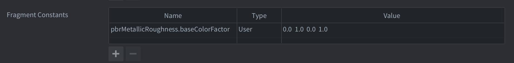

# Physically Based Rendering (PBR)

Physically Based Rendering (PBR) - это подход к затенению, моделирующий взаимодействие света с поверхностями на основе физических принципов реального мира. Он обеспечивает согласованное, реалистичное освещение в разных окружениях и позволяет ассетам корректно выглядеть при самых разных условиях освещения.

Реализация PBR в Defold следует спецификации материалов glTF 2.0 и связанным с ней расширениям Khronos. Когда вы импортируете glTF-ассеты в Defold, свойства материалов автоматически разбираются и сохраняются как структурированные данные материала, к которым можно обращаться в шейдерах во время выполнения.

PBR-материалы могут включать такие эффекты, как металлические отражения, шероховатость поверхности, пропускание света, clearcoat, подповерхностное рассеивание, иридесценцию и многое другое.

::: sidenote
В настоящее время Defold предоставляет шейдерам доступ к данным PBR-материалов, но не содержит встроенной PBR-модели освещения. Вы можете использовать эти данные в собственных шейдерах освещения и отражений, чтобы добиться physically based rendering. Стандартная PBR-модель освещения будет добавлена в Defold позднее.
:::

::: sidenote
Встроенные текстуры из glTF-файлов в настоящее время не назначаются в Defold автоматически. Шейдерам передаются только параметры материала. Тем не менее вы можете вручную назначить текстуры компонентам model и использовать их в своём шейдере.
:::

## Обзор свойств материалов

Свойства материалов извлекаются из исходных файлов glTF 2.0, назначенных компоненту model. Не все свойства являются стандартными. Некоторые предоставляются через необязательные расширения glTF, которые могут присутствовать или отсутствовать в зависимости от инструмента, использованного для экспорта glTF-файла. Соответствующее расширение указано в скобках после имени свойства ниже.

Metallic roughness
: Описывает, как свет взаимодействует с материалом. Это стандартная PBR-модель по умолчанию.

Specular glossiness (KHR_materials_pbrSpecularGlossiness)
: Альтернатива metallic roughness. Часто используется в более старых ассетах.

Clearcoat (KHR_materials_clearcoat)
: Добавляет прозрачный слой покрытия с собственной шероховатостью и normal map.

Ior (KHR_materials_ior)
: Добавляет показатель преломления.

Specular (KHR_materials_specular)
: Добавляет отдельный канал интенсивности и цвета specular.

Iridescence (KHR_materials_iridescence)
: Имитирует интерференцию в тонкой плёнке для материалов вроде мыльных пузырей или перламутра.

Sheen (KHR_materials_sheen)
: Моделирует микроповерхностные отражения, характерные для ткани.

Transmission (KHR_materials_transmission)
: Моделирует прохождение света через прозрачные или стеклоподобные материалы.

Volume (KHR_materials_volume)
: Поддерживает объёмные эффекты, такие как толщина и attenuation.

Emissive strength (KHR_materials_emissive_strength)
: Управляет яркостью свечения независимо от базового цвета.

Normal map
: Карта нормалей для поверхностных деталей.

Occlusion map
: Карта ambient occlusion.

Emissive map
: Текстура самосвечения для светящихся поверхностей.

Emissive factor
: RGB-множитель интенсивности свечения.

Alpha cutoff
: Порог для маскированной прозрачности.

Alpha mode
: Режим прозрачности: Opaque, Masked или Blended.

Double sided
: Если `true`, будут рендериться обе стороны поверхности.

Unlit
: Если `true`, материал не участвует в вычислениях освещения.

::: sidenote
Некоторые из этих свойств дают подсказки о том, как именно должен рендериться материал. Данные для этих свойств (`alpha cutoff`, `alpha mode`, `double sided` и `unlit`) доступны в шейдерах, но сами по себе не влияют на способ рендеринга материала в Defold.
:::

## Интеграция с шейдерами

Данные PBR-материала передаются в шейдеры на основе типов и соглашения об именовании. Система PBR-материалов предоставляет все разобранные параметры материала в шейдеры через структурированный uniform block с именем `PbrMaterial`. Каждому поддерживаемому расширению glTF соответствует структура внутри этого блока, которую можно условно компилировать с помощью флагов `#define`.

```glsl
uniform PbrMaterial
{
	// Material properties
};
```

Различные особенности материала задаются как фиксированные структуры в шейдере. Данные максимально упакованы в `vec4`, поскольку именно так константы внутренне задаются в Defold. В тех случаях, когда данные упакованы, это отмечено комментариями в приведённых ниже фрагментах шейдера для каждой функции:

```glsl
struct PbrMetallicRoughness
{
    vec4 baseColorFactor;
    // R: metallic (Default=1.0), G: roughness (Default=1.0)
    vec4 metallicAndRoughnessFactor;
    // R: use baseColorTexture, G: use metallicRoughnessTexture
    vec4 metallicRoughnessTextures;
};

struct PbrSpecularGlossiness
{
	vec4 diffuseFactor;
	// RGB: specular (Default=1.0), A: glossiness (Default=1.0)
	vec4 specularAndSpecularGlossinessFactor;
	// R: use diffuseTexture, G: use specularGlossinessTexture
	vec4 specularGlossinessTextures;
};

struct PbrClearCoat
{
	// R: clearCoat (Default=0.0), G: clearCoatRoughness (Default=0.0)
	vec4 clearCoatAndClearCoatRoughnessFactor;
	// R: use clearCoatTexture, G: use clearCoatRoughnessTexture, B: use clearCoatNormalTexture
	vec4 clearCoatTextures;
};

struct PbrTransmission
{
	// R: transmission (Default=0.0)
	vec4 transmissionFactor;
	// R: use transmissionTexture
	vec4 transmissionTextures;
};

struct PbrIor
{
	// R: ior (Default=0.0)
	vec4 ior;
};

struct PbrSpecular
{
	// RGB: specularColor, A: specularFactor (Default=1.0);
	vec4 specularColorAndSpecularFactor;
	// R: use specularTexture, G: use specularColorTexture
	vec4 specularTextures;
};

struct PbrVolume
{
	// R: thicknessFactor (Default=0.0), RGB: attenuationColor
	vec4 thicknessFactorAndAttenuationColor;
	// R: attentuationDistance (Default=-1.0)
	vec4 attenuationDistance;
	// R: use thicknessTexture
	vec4 volumeTextures;
};

struct PbrSheen
{
	// RGB: sheenColor, A: sheenRoughnessFactor (Default=0.0)
	vec4 sheenColorAndRoughnessFactor;
	// R: use sheenColorTexture, G: use sheenRoughnessTexture
	vec4 sheenTextures;
};

struct PbrEmissiveStrength
{
	// R: emissiveStrength (Default=1.0)
	vec4 emissiveStrength;
};

struct PbrIridescence
{
	// R: iridescenceFactor (Default=0.0), G: iridescenceIor (Default=1.3), B: iridescenceThicknessMin (Default=100.0), A: iridescenceThicknessMax (Default=400.0)
	vec4 iridescenceFactorAndIorAndThicknessMinMax;
	// R: use iridescenceTexture, G: use iridescenceThicknessTexture
	vec4 iridescenceTextures;
};
```

Общие свойства задаются непосредственно в uniform самого материала. Ещё раз обратите внимание на упаковку данных в `vec4`.

```glsl
// Common textures
uniform sampler2D PbrMaterial_normalTexture;
uniform sampler2D PbrMaterial_occlusionTexture;
uniform sampler2D PbrMaterial_emissiveTexture;

uniform PbrMaterial
{
	// Common properties:

	// R: alphaCutoff (Default=0.5), G: doubleSided (Default=false), B: unlit (Default=false)
	vec4 pbrAlphaCutoffAndDoubleSidedAndIsUnlit;
	// R: use normalTexture, G: use occlusionTexture, B: use emissiveTexture
	vec4 pbrCommonTextures;

	// Other properties...
};
```

### Пример шейдера

Ниже приведён пример шейдера, содержащего все возможности, а также предлагаемую схему именования для привязок текстур. Обратите внимание, что отключать функции можно просто с помощью `define` вокруг каждого члена самого `PbrMaterial`, как показано в примере ниже:

```glsl
// Feature flags, comment or remove these to slim down the shader.
#define PBR_METALLIC_ROUGHNESS
#define PBR_SPECULAR_GLOSSINESS
#define PBR_CLEARCOAT
#define PBR_TRANSMISSION
#define PBR_IOR
#define PBR_SPECULAR
#define PBR_VOLUME
#define PBR_SHEEN
#define PBR_EMISSIVE_STRENGTH
#define PBR_IRIDESCENCE

// Common
uniform sampler2D PbrMaterial_normalTexture;
uniform sampler2D PbrMaterial_occlusionTexture;
uniform sampler2D PbrMaterial_emissiveTexture;

// PbrMetallicRoughness
uniform sampler2D PbrMetallicRoughness_baseColorTexture;
uniform sampler2D PbrMetallicRoughness_metallicRoughnessTexture;

struct PbrMetallicRoughness
{
    vec4 baseColorFactor;
    // R: metallic (Default=1.0), G: roughness (Default=1.0)
    vec4 metallicAndRoughnessFactor;
    // R: use baseColorTexture, G: use metallicRoughnessTexture
    vec4 metallicRoughnessTextures;
};

// PbrSpecularGlossiness
uniform sampler2D PbrSpecularGlossiness_diffuseTexture;
uniform sampler2D PbrSpecularGlossiness_specularGlossinessTexture;

struct PbrSpecularGlossiness
{
	vec4 diffuseFactor;
	// RGB: specular (Default=1.0), A: glossiness (Default=1.0)
	vec4 specularAndSpecularGlossinessFactor;
	// R: use diffuseTexture, G: use specularGlossinessTexture
	vec4 specularGlossinessTextures;
};

// PbrClearCoat
uniform sampler2D PbrClearCoat_clearcoatTexture;
uniform sampler2D PbrClearCoat_clearcoatRoughnessTexture;
uniform sampler2D PbrClearCoat_clearcoatNormalTexture;

struct PbrClearCoat
{
	// R: clearCoat (Default=0.0), G: clearCoatRoughness (Default=0.0)
	vec4 clearCoatAndClearCoatRoughnessFactor;
	// R: use clearCoatTexture, G: use clearCoatRoughnessTexture, B: use clearCoatNormalTexture
	vec4 clearCoatTextures;
};

// PbrTransmission
uniform sampler2D PbrTransmission_transmissionTexture;

struct PbrTransmission
{
	// R: transmission (Default=0.0)
	vec4 transmissionFactor;
	// R: use transmissionTexture
	vec4 transmissionTextures;
};

struct PbrIor
{
	// R: ior (Default=0.0)
	vec4 ior;
};

// PbrSpecular
uniform sampler2D PbrSpecular_specularTexture;
uniform sampler2D PbrSpecular_specularColorTexture;

struct PbrSpecular
{
	// RGB: specularColor, A: specularFactor (Default=1.0);
	vec4 specularColorAndSpecularFactor;
	// R: use specularTexture, G: use specularColorTexture
	vec4 specularTextures;
};

// PbrVolume
uniform sampler2D PbrVolume_thicknessTexture;

struct PbrVolume
{
	// R: thicknessFactor (Default=0.0), RGB: attenuationColor
	vec4 thicknessFactorAndAttenuationColor;
	// R: attentuationDistance (Default=-1.0)
	vec4 attenuationDistance;
	// R: use thicknessTexture
	vec4 volumeTextures;
};

// PbrSheen
uniform sampler2D PbrSheen_sheenColorTexture;
uniform sampler2D PbrSheen_sheenRoughnessTexture;

struct PbrSheen
{
	// RGB: sheenColor, A: sheenRoughnessFactor (Default=0.0)
	vec4 sheenColorAndRoughnessFactor;
	// R: use sheenColorTexture, G: use sheenRoughnessTexture
	vec4 sheenTextures;
};

struct PbrEmissiveStrength
{
	// R: emissiveStrength (Default=1.0)
	vec4 emissiveStrength;
};

// PbrIridescence
uniform sampler2D PbrEmissive_iridescenceTexture;
uniform sampler2D PbrEmissive_iridescenceThicknessTexture;

struct PbrIridescence
{
	// R: iridescenceFactor (Default=0.0), G: iridescenceIor (Default=1.3), B: iridescenceThicknessMin (Default=100.0), A: iridescenceThicknessMax (Default=400.0)
	vec4 iridescenceFactorAndIorAndThicknessMinMax;
	// R: use iridescenceTexture, G: use iridescenceThicknessTexture
	vec4 iridescenceTextures;
};

uniform PbrMaterial
{
	// Common properties
	// R: alphaCutoff (Default=0.5), G: doubleSided (Default=false), B: unlit (Default=false)
	vec4 pbrAlphaCutoffAndDoubleSidedAndIsUnlit;
	// R: use normalTexture, G: use occlusionTexture, B: use emissiveTexture
	vec4 pbrCommonTextures;

	// Features
#ifdef PBR_METALLIC_ROUGHNESS
	PbrMetallicRoughness  pbrMetallicRoughness;
#endif
#ifdef PBR_SPECULAR_GLOSSINESS
	PbrSpecularGlossiness pbrSpecularGlossiness;
#endif
#ifdef PBR_CLEARCOAT
	PbrClearCoat pbrClearCoat;
#endif
#ifdef PBR_TRANSMISSION
	PbrTransmission pbrTransmission;
#endif
#ifdef PBR_IOR
	PbrIor pbrIor;
#endif
#ifdef PBR_SPECULAR
	PbrSpecular pbrSpecular;
#endif
#ifdef PBR_VOLUME
	PbrVolume pbrVolume;
#endif
#ifdef PBR_SHEEN
	PbrSheen pbrSheen;
#endif
#ifdef PBR_EMISSIVE_STRENGTH
	PbrEmissiveStrength pbrEmissiveStrength;
#endif
#ifdef PBR_IRIDESCENCE
	PbrIridescence pbrIridescence;
#endif
};
```

::: sidenote
Если отдельные точки данных в структуре материала не найдены, данные для этих возможностей не будут установлены. Например, если в структуре материала отсутствует `pbrClearCoat`, данные clear coat задаваться не будут. Если uniform block не найден, то во время рендеринга вообще не будет задано никаких данных.
:::

### Константы

Каждое свойство материала соответствует внутренней render-константе в Defold. Вы можете переопределить значения по умолчанию, определив константы прямо в ресурсе материала по шаблону именования `pbrFeature.structMember`. Эти значения будут автоматически применяться, если соответствующие данные отсутствуют в glTF-материале.



## Что делать дальше

Чтобы использовать данные материала для physically based lighting, реализуйте BRDF во фрагментном шейдере, используя параметры, передаваемые в блоке `PbrMaterial`.
См. также:

* [Руководство по шейдерам](/manuals/shader)
* [Руководство по render](/manuals/render)
* [Спецификацию glTF 2.0](https://registry.khronos.org/glTF/specs/2.0/glTF-2.0.html)
