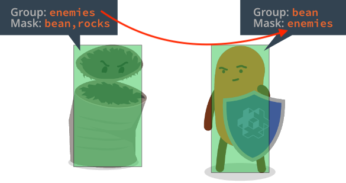

# Группы и маски столкновения

Физический движок позволяет группировать физические объекты и избирательно задавать то, как они будут сталкиваться. Это реализуется посредством именованных _групп столкновения_. Для каждого создаваемого объекта столкновения два свойства управляют тем, как объект сталкивается с другими объектами --- *Group* и *Mask*.

Для регистрации факта столкновения между двумя объектами, оба объекта должны взаимоисключающим образом включать группы друг друга в своем поле *Mask*.

Поле *Mask* может содержать множество имен групп, допуская сложные сценарии взаимодействия.

## Определение столкновений
Когда два объекта столкновения с совпадающими группами и масками сталкиваются, физический движок генерирует [сообщение о столкновении](/manuals/physics-messages), которое может быть использовано в игре для реагирования на эти столкновения.
