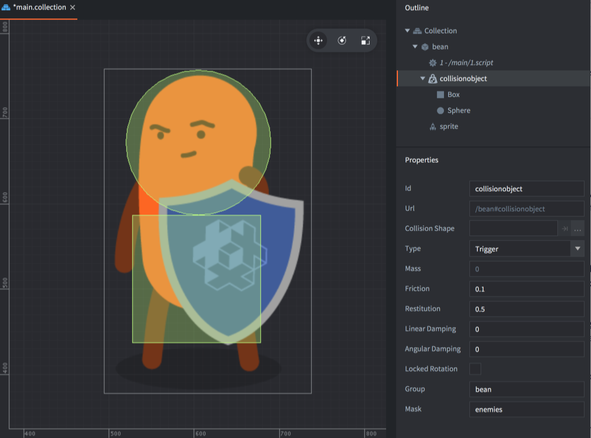

# Объекты столкновений

Объект столкновения это компонент который применяется для придания игровому объекту физического поведения. Объект столкновения обладает физическими свойствами, такими, как вес, трение и форма и его пространственные пределы задаются одной или несколькими _формами_ которые присоединяются к компоненту. Defold поддерживает следующие типы объектов столкновений:

Статические объекты
: Статические объекты никогда не двигаются, однако динамический объект, столкнувшийся со статическим объектом отреагирует отпрыгиванием и/или проскальзыванием. Статические объекты весьма полезны для выстраивания недвижимой геометрии уровней (т.е. земля и стены). Также они дешевле с точки зрения производительности чем динамические объекты. Вы не можете двигать или как-либо менять статические объекты.

Динамические объекты
: Динамические объекты симулируются физическим движком. Движок определяет все столкновения и применяет результирующие силы. Динамические объекты хороши для объектов, которые должны вести себя реалистично, но вы *не можете* напрямую управлять позицией и ориентаций динамического объекта. Единственный способ влиять на них косвенно - [применяя силы](/ref/physics/#apply_force) или меняя [угловое затухание](/ref/stable/physics/#angular_damping) и [скорость](/ref/stable/physics/#linear_velocity), а также [линейное затухание](/ref/stable/physics/#linear_damping) и [угловую скорость](/ref/stable/physics/#angular_velocity).

Кинематические объекты
: Кинематические объекты только регистрируют столкновения с другими физическими объектами, но физический движок не производит никаких автоматических симуляций. Решение о разрешении столкновений, либо их игнорировании, остаётся за вами ([узнайте больше здесь])(/manuals/physics-resolving-collisions). Кинематические объекты весьма хороши для игрового персонажа или для объектов управляемых скриптами, которые требуют тонкого контроля над физическими реакциями, как например игровой персонаж.

Триггеры
: Триггеры - это объекты, которые регистрируют простые столкновения. Триггеры - это облегченные версии объектов столкновения. Они схожи с [ray cast лучами](/manuals/physics-ray-cast) тем, что они считывают физический мир в противовес взаимодействия с ним. Они хороши для объектов, которые просто регистрируют попадание (как например пуля) или как часть игровой логики, где вы хотите активировать особые действия, когда объект достигает специальной точки. Триггеры вычислительно дешевле, чем кинематические объекты и предпочтительнее применять их вместо кинематических объектов если это возможно.

## Добавление компонента объекта столкновений

Объект столкновений обладает набором *Свойств* которые определяют его тип и физические параметры. Также он содержит одну или более *Форм* которые всецело задают форму физического объекта. 

Для добавления объекта столкновений в игровой объект:

1. В секции *Outline* , нажмите <kbd>правый клик</kbd> на игровом объекте и выберите <kbd>Add Component ▸ Collision Object</kbd> из контекстного меню. Это создаст новый компонент без какой-либо формы.
2. Нажмите <kbd>правый клик</kbd> на новом компонент и выберите <kbd>Add Shape ▸ Box / Capsule / Sphere</kbd>. Это добавит новую форму к компоненту объекта столкновения. Вы можете добавить любое количество форм компоненту. Также вы можете использовать тайловую карту или выпуклую оболочку (convex hull) для задания формы физического объекта.
3. Используйте инструменты перемещения, поворота и масштабирования для редактирования форм.
4. Выберите компонент в секции *Outline* и отредактируйте *Свойства* объекта столкновения.

{srcset="images/physics/collision_object@2x.png 2x"}

## Добавление формы столкновений

Объект столкновений может либо использовать несколько геометрических примитивов в качестве формы или одну сложную форму. Узнайте больше про различные формы и как их добавлять к объекту столкновения в [Руководстве по формам столкновений](/manuals/physics-shapes).

## Свойства объекта столкновений

Id
: Идентификатор компонента.

Collision Shape
: Это свойство используется для геометрии посредством тайловой карты или выпуклых форм (convex shapes), которые не задействуют геометрические примитивы. Смотрите [Формы столкновений для развернутой информации](/manuals/physics-shapes).

Type
: Тип объекта столкновений: `Dynamic`, `Kinematic`, `Static` или `Trigger`. Если объект выставлен как динамический, вы _должны_ установить свойство *Mass* в ненулевое значение. Для динамических или статических объектов вы также должны проверить, что значения *Friction* и *Restitution* также выставлены в приемлемые значения под ваш сценарий использования.

Friction
: Трение позволяет объектам скользить реалистично относительно друг друга. Значение трения обычно выставляется между `0` (совсем нет трения---очень скользящий объект) и `1` (сильное трение---абразивный объект). Однако, любое положительное значение будет валидным.

  Сила трения пропорциональна нормальной силе (normal force; это называется Кулоновское трение). Когда сила трения вычисляется между двумя формами (`A`m и `B`), значения трения обоих объектов комбинируются в геометрическое среднее: 

  $$
  F = sqrt( F_A * F_B )
  $$

  Это означает, что если один из объектов имеет нулевое трение, то контакт между ними будет иметь нулевое трение.

Restitution
: Значение Восстановления задает "прыгучесть" объекта. Значение варьируется как правило между 0 (неэластичное столкновение-объект вообще не отскакивает) и 1 (идеальное эластичное столкновение---скорость объекта будет целиком отражена в отскакивании)

  Значения восстановления между двумя формами (`A` и `B`) комбинируются в следующую формулу:

  $$
  R = max( R_A, R_B )
  $$

  Когда форма имеет множественные контакты, восстановление симулируется апроксимированно, потому что Box2D использует пошаговый решатель. Также Box2D использует неэластичные столкновения когда скорость столкновения мала, чтобы исключить дребезг отскока.

Linear damping
: Линейное затухание сокращает линейную скорость тела. Оно отличается от трения, которое возникает только во время контакта, и может применяться, чтобы придать объектам плавное поведение, такое, будто они движутся через что-то более плотное чем просто воздух. Валидные значения находятся в диапазоне от 0 до 1.

  Box2D апрроксимирует затухание для стабильности и производительности. На маленьких значениях, эффект затухания не зависит от временного шага, в то время, как на больших значениях затухания, эффект затухания варьируется с временным шагом. Если вы запускаете свою игру с фиксированным временным шагом, никаких проблем возникнуть не должно.

Angular damping
: Угловое затухание работает также как и линейное затухание, но оно сокращает угловую скорость тела. Валидные значения находятся в диапазоне от 0 до 1.

Locked rotation
: Выставление этого свойства полностью выключает вращение на объекте столкновения, не важно, какие силы применяются к нему.

Group
: Имя группы столкновения, к которому должен принадлежать объект. Можно иметь 16 разных групп и можно именовать их под свои нужды в игре. К примеру,  "players", "bullets", "enemies" и "world". Если для *Формы Столкновения* выставлена тайловая карта, это поле не используется, а имена групп берутся из источника тайлов. [Больше про группы столкновений здесь](/manuals/physics-groups).

Mask
: Другие _группы_, с которыми должен сталкиваться данный объект. Вы можете назвать одну группу или задать множество групп, разделяя их в список запятой. Если вы оставите поле Mask пустым, объект не будет ни с чем иметь столкновений. [Больше про группы столкновений здесь](/manuals/physics-groups).

## Свойства времени исполнения

Физический объект имеет различные свойства, которые могут быть считаны и изменены посредством `go.get()` и `go.set()`:

`angular_damping`
: Значение углового затухания для объекта столкновения (`number`). [Справочник API](/ref/physics/#angular_damping).

`angular_velocity`
: Текущая угловая скорость объекта столкновения (`vector3`). [Справочник API](/ref/physics/#angular_velocity).

`linear_damping`
: Значение линейного затухания для объекта столкновения (`number`). [Справочник API](/ref/physics/#linear_damping).

`linear_velocity`
: Текущая линейная скорость объекта столкновения (`vector3`). [Справочник API](/ref/physics/#linear_velocity).

`mass`
: Определённая физическая масса объекта столкновения (`number`). [Справочник API](/ref/physics/#mass).
