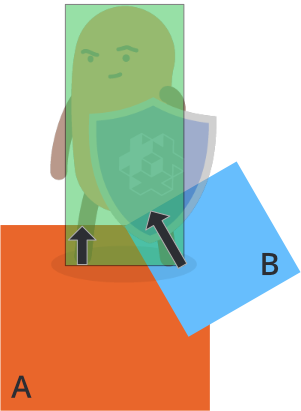
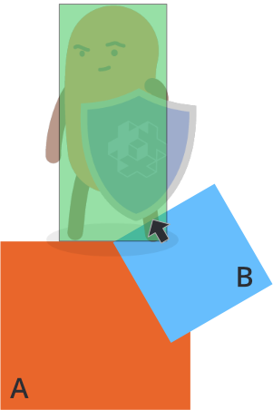
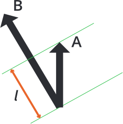

# Разрешение кинематических столкновений

Использование кинематических объектов столкновений требует от вас самостоятельно принимать решения на основе столкновений и двигать объекты в качестве реакции. Простейшая реализация разделения двух сталкивающихся объектов выглядит следующим образом:

```lua
function on_message(self, message_id, message, sender)
  -- Обработать столкновение
  if message_id == hash("contact_point_response") then
    local newpos = go.get_position() + message.normal * message.distance
    go.set_position(newpos)
  end
end
```

Данный код отделяет кинематический объект от другого объекта, в который тот проникает, но такое разделение часто промахивается и вы можете увидеть дребезг во многих случаях. Чтобы лучше понять суть проблемы, представьте следующий сценарий, где игровой персонаж столкнулся с двумя объектами, *A* и *B*:



Физический движок пошлет несколько сообщений `"contact_point_response"`, одно для объекта *A* и одно для объекта *B*, в том кадре, где произошло столкновение. Если вы подвинете персонажа в ответ на каждое проникновение, как в коде выше, результирующее разделение будет следующим:

- Подвинуть персонажа вне объекта *A* согласно его расстоянию проникновения (черная стрелка)
- Подвинуть персонажа вне объекта *B* согласно его расстоянию проникновения (черная стрелка)

Порядок этих действий случаен, но результат будет одинаковым в обоих случаях: итоговое разделение, которое является *суммой отдельных векторов проникновения*:


Чтобы надлежащим образом отделить персонажа от объектов *A* и *B*, вам нужно обработать расстояние проникновения для каждой точки контакта и проверить, не привели ли уже предыдущие действия, полностью или частично, к нужному разделению.

Предположим, что первое сообщение контакта приходит от объекта *A* и вы двигаете персонажа наружу из *A* по его вектору проникновения:



Далее персонаж уже был частично отделен от *B*. Необходимое окончательное компенсирование, которое нужно применить для полного отделения от объекта *B*, обозначено черной стрелкой выше. Длина компенсирующего вектора может быть вычислена проекцией вектора проекции *A* на вектор проекции *B*:



```
l = vmath.project(A, B) * vmath.length(B)
```

Компенсирующий вектор может быть найден сокращением длины *B* на *l*. Для таких вычислений для произвольного количества проникновений, вы можете накапливать необходимую коррекцию в векторе, для каждой точки контакта, начав с вектора коррекции нулевой длины:

1. Спроецируйте текущую коррекцию на вектор проникновения контакта.
2. Вычислите, сколько компенсации еще осталось от вектора проникновения (согласно формуле выше)
3. Сдвиньте объект по вектору компенсации.
4. Добавьте компенсацию к накопленной коррекции.

Окончательная реализация выглядит следующим образом:

```lua
function init(self)
  -- корректирующий вектор
  self.correction = vmath.vector3()
end

function update(self, dt)
  -- сброс корректирующего вектора
  self.correction = vmath.vector3()
end

function on_message(self, message_id, message, sender)
  -- Обработка столкновения
  if message_id == hash("contact_point_response") then
    -- Получить информацию, необходимую для убирания из столкновения. Мы можем
    -- получить несколько точек соприкосновения и должны вычислить
    -- как выбраться из всех них накапливая
    -- корректирующий вектор в этом кадре:
    if message.distance > 0 then
      -- Во-первых, получим проекцию накопленной коррекции на
      -- вектор проникновения
      local proj = vmath.project(self.correction, message.normal * message.distance)
      if proj < 1 then
        -- Заботимся только о проекциях, которые не выходят за пределы диапазона.
        local comp = (message.distance - message.distance * proj) * message.normal
        -- Применяем компенсацию
        go.set_position(go.get_position() + comp)
        -- Прибавляем проделанную коррекцию
        self.correction = self.correction + comp
      end
    end
  end
end
```
