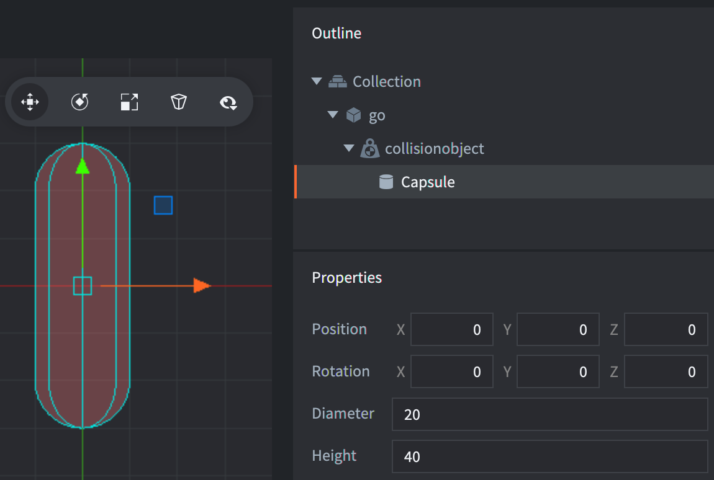

# Формы столкновения

Объект столкновения может использовать несколько геометрических примитивов в качестве формы или одну сложную форму.

### Примитивные формы
Примитивные формы --- это *Box*, *Sphere* и *Capsule*. Добавить примитивную форму можно выполнив <kbd>клик ПКМ</kbd> на объекте столкновения и выбрав <kbd>Add Shape</kbd>:


## Форма Box
У бокса есть позиция, вращение и размеры (ширина, высота и глубина):


## Форма Sphere
У сферы есть позиция, вращение и диаметр:


## Форма Capsule
У капсулы есть позиция, вращение, диаметр и высота:



::: important
Форма капсулы поддерживается только при использовании 3D физики (настраивается в секции Physics файла *game.project*).
:::

### Комплексные формы
Сложная форма может быть создана либо из компонента тайловой карты либо из выпуклой формы.

## Форма столкновения из тайловой карты
В Defold встроена функция, позволяющая легко генерировать физические формы для источника тайлов, используемого тайловой картой. [Руководство по источникам тайлов](/manuals/tilesource/#tile-source-collision-shapes) объясняет как добавлять группы столкновений в источник тайлов и назначать тайлы группе столкновений ([пример](/examples/tilemap/collisions/)).

Чтобы добавить столкновение к тайловой карте:

1. Добавьте тайловую карту игровому объекту <kbd>кликнув ПКМ</kbd> на игровом объекте и выбрав <kbd>Add Component File</kbd>. Выберите файл тайловой карты.
2. Добавьте объект столкновения <kbd>кликнув ПКМ</kbd> на игровом объекте и выбрав <kbd>Add Component ▸ Collision Object</kbd>.
3. Вместо добавления форм компоненту столкновений, задайте в качестве значения свойства *Collision Shape* файл *тайловой карты*
4. Как обычно, задайте *свойства* объекта столкновения.


::: important
Учтите, что свойство *Group* **не** учитывается в таком случае, так как группы столкновений задаются в источнике тайлов соответствующей тайловой карты.
:::

## Выпуклые формы
Defold предоставляет возможность создавать выпуклую форму (convex hull shape) из трёх или более точек.

1. Создайте файл выпуклой формы (расширение файла — `.convexshape`) с помощью внешнего редактора.
2. Отредактируйте файл вручную, используя текстовый редактор или внешний инструмент (см. ниже).
3. Вместо добавления форм в компонент столкновений, укажите файл *выпуклой формы* в свойстве *Collision Shape*.

### Формат файла
Формат выпуклой формы использует тот же формат данных, что и все другие файлы Defold — protobuf в текстовом виде. Выпуклая форма задаётся набором точек. В 2D физике точки должны быть указаны в порядке против часовой стрелки. В 3D режиме используется абстрактное облако точек. Пример для 2D:

```
shape_type: TYPE_HULL
data: 200.000
data: 100.000
data: 0.0
data: 400.000
data: 100.000
data: 0.0
data: 400.000
data: 300.000
data: 0.0
data: 200.000
data: 300.000
data: 0.0
```

Пример выше описывает четыре угла прямоугольника:

```
 200x300   400x300
    4---------3
    |         |
    |         |
    |         |
    |         |
    1---------2
 200x100   400x100
```

## Внешние инструменты

Существует несколько внешних инструментов, которые можно использовать для создания форм столкновения:

* [Physics Editor](https://www.codeandweb.com/physicseditor/tutorials/how-to-create-physics-shapes-for-defold) от CodeAndWeb позволяет создавать игровые объекты со спрайтами и соответствующими формами столкновения.
* [Defold Polygon Editor](https://rossgrams.itch.io/defold-polygon-editor) позволяет создавать выпуклые формы.
* [Physics Body Editor](https://selimanac.github.io/physics-body-editor/) также может использоваться для создания выпуклых форм.


# Масштабирование форм столкновения
Объект столкновения и его формы наследуют масштаб игрового объекта. Чтобы отключить это поведение, отключите опция [Allow Dynamic Transforms](/manuals/project-settings/#allow-dynamic-transforms) в секции Physics файла *game.project*. Учтите, что поддерживается только равномерное масштабирование, а также то, что будет применено наименьшее значение масштабирования, если было задано не равномерное масштабирование.

# Изменение размеров форм столкновения
Формы объекта столкновения можно изменять во время выполнения с помощью функции `physics.set_shape()`. Пример:

```lua
-- установка параметров капсулы
local capsule_data = {
  type = physics.SHAPE_TYPE_CAPSULE,
  diameter = 10,
  height = 20,
}
physics.set_shape("#collisionobject", "my_capsule_shape", capsule_data)

-- установка параметров сферы
local sphere_data = {
  type = physics.SHAPE_TYPE_SPHERE,
  diameter = 10,
}
physics.set_shape("#collisionobject", "my_sphere_shape", sphere_data)

-- установка параметров коробки
local box_data = {
  type = physics.SHAPE_TYPE_BOX,
  dimensions = vmath.vector3(10, 10, 5),
}
physics.set_shape("#collisionobject", "my_box_shape", box_data)
```

::: sidenote
Форма нужного типа с указанным идентификатором должна уже существовать на объекте столкновения.
:::

# Вращение форм столкновения

## Вращение форм столкновения в 3D физике
Формы столкновения в 3D-физике могут поворачиваться вокруг всех осей.


## Вращение форм столкновения в 2D физике
Формы столкновения в 2D физике могут поворачиваться только вокруг оси z. Вращение вокруг осей X или Y выльется в некорректные результаты и его стоит избегать, даже когда происходит вращение на 180 градусов для фактически переворота формы вокруг оси X или Y. Для переворота физической формы рекомендуется использовать [`physics.set_hlip(url, flip)`](/ref/stable/physics/?#physics.set_hflip:url-flip) и [`physics.set_vlip(url, flip)`](/ref/stable/physics/?#physics.set_vflip:url-flip).


# Отладка
Вы можете [включить отладку физики](/manuals/debugging/#debugging-problems-with-physics), чтобы видеть формы столкновений во время выполнения.
