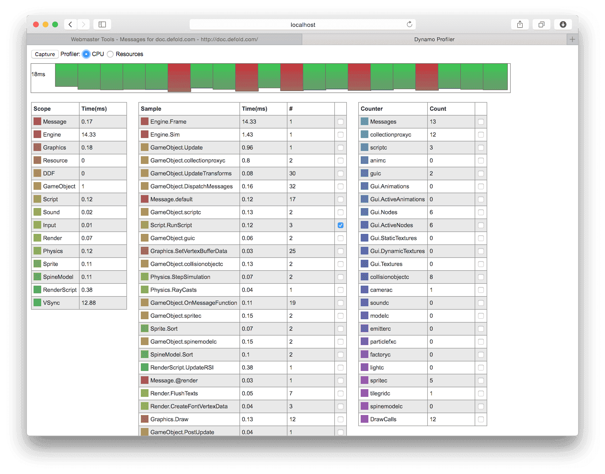
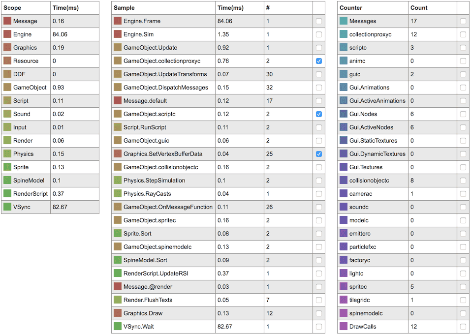
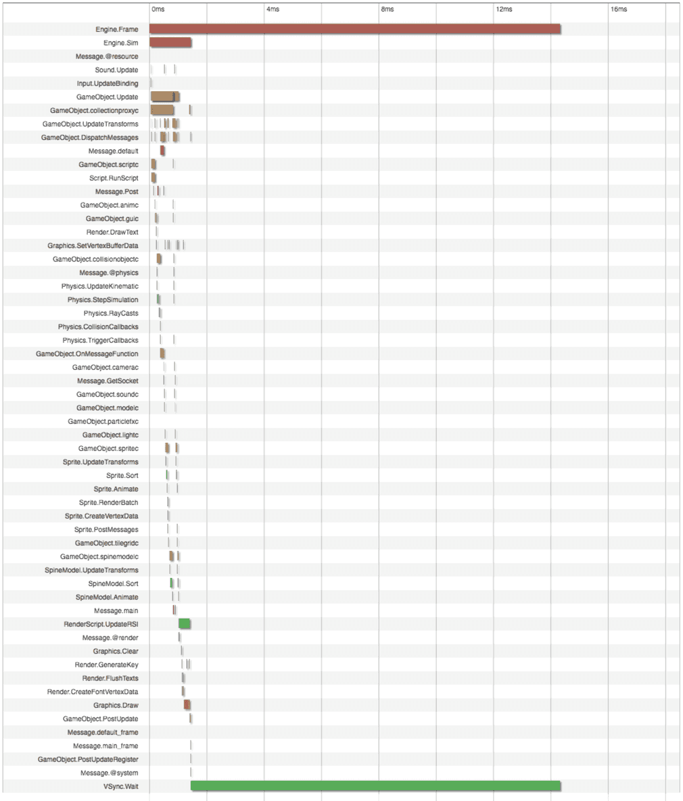

# Профилирование

Defold включает набор инструментов профилирования, интегрированных с движком и конвейером сборки. Они предназначены для поиска проблем с производительностью и использованием памяти. Встроенные профилировщики доступны только в отладочных сборках. 

## Визуальный профилировщик среды выполнения

Отладочные сборки включают визуальный профилировщик среды выполнения, который оперативно показывает информацию, отображаемую поверх работающего приложения: 

```lua
function on_reload(self)
    -- Toggle the visual profiler on hot reload.
    profiler.enable_ui(true)
end
```


Визуальный профилировщик предоставляет ряд различных функций, которые можно использовать для изменения способа отображения данных: 

```lua

profiler.set_ui_mode()
profiler.set_ui_view_mode()
profiler.view_recorded_frame()
```

Обратитесь к [справочнику по API профилировщика](/ref/stable/profiler/) для получения дополнительной информации о функциях профилировщика. 

## Веб-профилировщик

При запуске отладочной сборки игры интерактивный веб-профилировщик может быть доступен через браузер. Это позволяет вам замерить вашу игру на серии кадров, а затем детально анализировать каждый кадр. 

Чтобы получить доступ к профилировщику:

1. Запустите игру на целевом устройстве. 
2. Выберите меню <kbd> Debug ▸ Open Web Profiler</kbd>. В качестве альтернативы, например, когда вы используете несколько платформ одновременно, вы можете открыть веб-браузер и указать в нем `http://<device IP>:8002`, где `<device IP>` - это IP-адрес устройства. Вы можете найти IP-адреса ваших целевых устройств в меню <kbd>Project ▸ Target</kbd>. Если вы запускаете игру на настольном компьютере, http://localhost:8002 ведет на профилировщик. 


Вверху, рядом с кнопкой *Capture*, есть переключатели для переключения между *CPU/Frame profiler* и *Resource Profiler*. 

### CPU/Frame profiler
CPU profiler разделен на 4 раздела, каждый из которых дает разные представления о текущих данных выборки. Чтобы обновить образцы данных, нажмите кнопку *Capture* вверху.



Обзор фреймов
: Обзор фреймов отображает 20 выбранных в настоящий момент кадров один за другим. Высота каждой полосы показывает время, проведенное в кадре. Число с левой стороны показывает максимальное время, проведенное в кадре в текущих данных выборки. 

  

  Под обзором фреймов находится подробное представление данных фрейма.
  
  Щелкните полосу фрейма в обзоре, чтобы отобразить данные для этого конкретного фрейма в окне просмотра данных. 

Данные кадра
: Представление данных кадра является таблицей, в которой все данные для текущего выбранного кадра разбиты на детали. Вы можете посмотреть, сколько миллисекунд потрачено в каждой области действия движка (слева), а также увидеть точки выборки в пределах областей (средний столбец). Справа - таблица счетчиков. Они упрощают, например, отслеживание количества вызовов отрисовки, необходимых для каждого кадра в выборке данных.

  

  Установка флажка, связанного с точкой выборки или счетчиком, добавляет эти данные на график ниже.

График кадров
: Представление графика кадров отображает график по всем выбранным кадрам с данными, которые вы выбрали в таблице данных кадра над графиком. График показывает номер кадра по оси X и время (в миллисекундах) или количество по оси Y. Каждая выбранная точка данных отображается в цвете, указанном в таблице данных фрейма.

  

Временная диаграмма кадра
: Временная диаграмма кадра визуально разбивает кадр, что упрощает анализ того, где движок проводит свое время в течение выбранного кадра. 

  

### Профилировщик ресурсов
Профилировщик ресурсов поделен на 2 раздела, один из которых показывает иерархическое представление коллекций, игровых объектов и компонентов, инстанцированных в текущий момент в вашей игре, а другой показывает все загруженные в данный момент ресурсы. 


Collection view
: В Collection view отображается иерархический список всех игровых объектов и компонентов, созданных в данный момент в игре, и из какой коллекции они происходят. Это очень полезный инструмент, когда вам нужно вникнуть и понять, что вы использовали в своей игре в любой момент времени и откуда берутся объекты.

Resources view
: В Resources view отображаются все ресурсы, загруженные в память в настоящий момент, их размер и количество ссылок на каждый ресурс. Это полезно при оптимизации использования памяти в вашем приложении, когда вам нужно понять, что загружается в память в любой момент времени.

## Отчеты о сборке

При бандлинге вашей игры есть возможность создать отчет о сборке. Это очень полезно, чтобы получить представление о размере всех ассетов, входящих в бандл вашей игры. Просто установите флажок *Generate build report* при бандлинге игры. 

{srcset="images/profiling/build_report@2x.png 2x"}

Сборщик создаст файл с именем «report.html» рядом с бандлом игры. Откройте файл в веб-браузере, чтобы изучить отчет: 

{srcset="images/profiling/build_report_html@2x.png 2x"}

Раздел *Overview* дает общую визуальную разбивку размера проекта в зависимости от типа ресурса.

Раздел *Resources* показывает подробный список ресурсов, которые вы можете отсортировать по размеру, степени сжатия, шифрованию, типу и имени каталога. Используйте поле «search» для фильтрации отображаемых записей ресурсов. 

Раздел *Structure* показывает размеры в зависимости от того, как ресурсы организованы в файловой структуре проекта. Записи имеют цветовую кодировку от зеленого (легкий) до синего (тяжелый) в зависимости от относительного размера файла и содержимого каталога. 

## Внешние инструменты

В дополнение к встроенным инструментам доступен широкий спектр бесплатных высококачественных инструментов трассировки и профилирования. Ниже приведена их подборка:

ProFi (Lua)
: Мы не поставляем никаких встроенных профилировщиков Lua, но есть внешние библиотеки, которые достаточно просты в использовании. Чтобы узнать, на что ваши скрипты тратят время, либо вставьте замеры времени в свой код самостоятельно, либо используйте библиотеку профилирования Lua, такую как ProFi. 

  https://github.com/jgrahamc/ProFi

  Обратите внимание, что профилировщики на чистом Lua добавляют довольно много накладных расходов с каждым устанавливаемым хуком. По этой причине вам следует немного опасаться временных профилей, которые вы получаете такими инструментами. Однако профили подсчета (Counting profiles) достаточно точны. 

Instruments (macOS и iOS) 
: Это анализатор производительности и визуализатор, который является частью Xcode. Он позволяет отслеживать и проверять поведение одного или нескольких приложений или процессов, изучать определенные функции устройства (например, Wi-Fi и Bluetooth) и многое другое. 

  {srcset="images/profiling/instruments@2x.png 2x"}

OpenGL profiler (macOS)
: Часть пакета "Additional Tools for Xcode", который можно загрузить из Apple (выберите <kbd>Xcode ▸ Open Developer Tool ▸ More Developer Tools...</kbd> в меню Xcode).

   Этот инструмент позволяет вам анализировать работающее Defold приложение и увидеть, как оно использует OpenGL. Он позволяет вам отслеживать вызовы функций OpenGL, устанавливать точки останова для функций OpenGL, исследовать ресурсы приложения (текстуры, программы, шейдеры и т. д.), просматривать содержимое буфера и проверять другие аспекты состояния OpenGL. 

  {srcset="images/profiling/opengl@2x.png 2x"}

Android Profiler (Android)
: https://developer.android.com/studio/profile/android-profiler.html

  Набор инструментов профилирования, который в реальном времени собирает данные о процессоре, памяти и сетевой активности вашей игры. Вы можете выполнять отслеживание выполнения кода методов на основе семплирования, захватывать heap дампы, просматривать выделение памяти и изучать детали файлов, передаваемых по сети. Для использования этого инструмента необходимо установить `android:debuggable="true"` в файле "AndroidManifest.xml". 

  

  Примечание. Начиная с Android Studio 4.1, также можно [запускать инструменты профилирования без запуска самой Android Studio](https://developer.android.com/studio/profile/android-profiler.html#standalone-profilers). 

Graphics API Debugger (Android)
: https://github.com/google/gapid

  Это набор инструментов, который позволяет вам проверять, настраивать и воспроизводить вызовы от приложения к графическому драйверу. Для использования этого инструмента необходимо установить `android:debuggable="true"` в "AndroidManifest.xml". 

  
