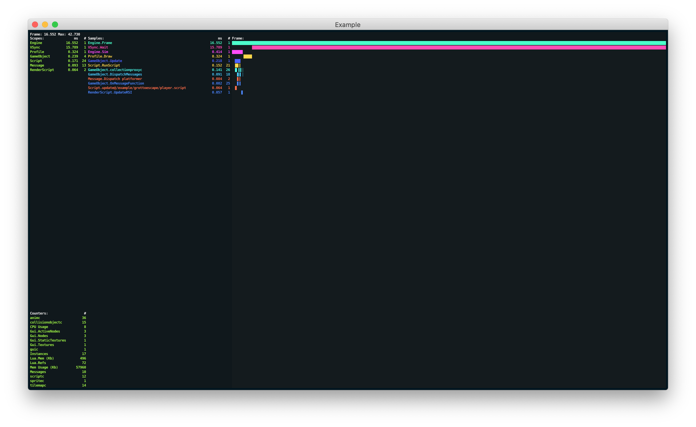
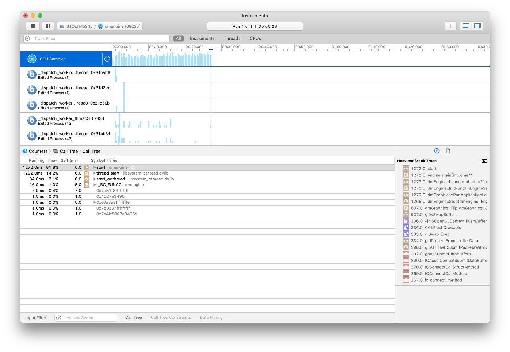

# Профилирование

Defold включает набор инструментов профилирования, интегрированных с движком и конвейером сборки. Они предназначены для поиска проблем с производительностью и использованием памяти. Встроенные профилировщики доступны только в отладочных сборках. Профилировщик кадров, используемый в Defold — это [Remotery profiler от Celtoys](https://github.com/Celtoys/Remotery).

## Визуальный профилировщик среды выполнения

Отладочные сборки включают визуальный профилировщик среды выполнения, который оперативно показывает информацию, отображаемую поверх работающего приложения: 

```lua
function on_reload(self)
    -- Toggle the visual profiler on hot reload.
    profiler.enable_ui(true)
end
```



Визуальный профилировщик предоставляет ряд различных функций, которые можно использовать для изменения способа отображения данных: 

```lua

profiler.set_ui_mode()
profiler.set_ui_view_mode()
profiler.view_recorded_frame()
```

Обратитесь к [справочнику по API профилировщика](/ref/stable/profiler/) для получения дополнительной информации о функциях профилировщика. 

## Веб-профилировщик
Во время запуска отладочной сборки игры можно получить доступ к интерактивному веб-профайлеру через браузер.

### Профилировщик кадров
Профилировщик кадров позволяет выполнять выборку данных вашей игры во время выполнения и анализировать отдельные кадры в деталях. Чтобы получить доступ к профайлеру:

1. Запустите игру на целевом устройстве.
2. Выберите пункт меню <kbd> Debug ▸ Open Web Profiler</kbd>.

Профилировщик кадров разделён на несколько секций, каждая из которых предоставляет различные представления выполняемой игры. Нажмите кнопку Pause в правом верхнем углу, чтобы временно остановить обновление данных профайлера.


::: sidenote
Когда вы используете несколько целевых устройств одновременно, вы можете вручную переключаться между ними, изменив поле Connection Address в верхней части страницы, чтобы оно соответствовало URL-адресу Remotery профайлера, который отображается в консоли при запуске устройства:

```
INFO:ENGINE: Defold Engine 1.3.4 (80b1b73)
INFO:DLIB: Initialized Remotery (ws://127.0.0.1:17815/rmt)
INFO:ENGINE: Loading data from: build/default
```
:::

Временная шкала выборки (Sample Timeline)
: Временная шкала показывает кадры, захваченные в движке, одна горизонтальная шкала на каждый поток. Main — основной поток, где выполняется вся логика игры и большая часть кода движка. Remotery — поток самого профайлера, а Sound — поток микширования и воспроизведения звука. Вы можете масштабировать шкалу (колесиком мыши) и выбирать отдельные кадры, чтобы изучить их детали во представлении Frame Data.

  


Данные кадра (Frame Data)
: Представление Frame Data отображает таблицу с детальной разбивкой всех данных для выбранного кадра. Вы можете видеть, сколько миллисекунд затрачено на каждый участок движка.

  


Глобальные свойства (Global Properties)
: Представление Global Properties показывает таблицу счётчиков. Это облегчает, например, отслеживание количества вызовов отрисовки или количества компонентов определённого типа.

  


### Профилировщик ресурсов
Профилировщик ресурсов позволяет инспектировать вашу игру во время её выполнения и детально анализировать использование ресурсов. Чтобы получить доступ к профайлеру:

1. Запустите игру на целевом устройстве.
2. Откройте браузер и перейдите по адресу http://localhost:8002

Профилировщик ресурсов разделён на 2 секции: одна показывает иерархическое представление коллекций, игровых объектов и компонентов, созданных в данный момент в игре, а другая — все загруженные в память ресурсы.


Представление коллекций (Collection view)
: Показывает иерархический список всех игровых объектов и компонентов, созданных в данный момент в игре, и из какой коллекции они происходят. Это полезный инструмент, когда вам нужно понять, что и откуда создано в вашей игре.

Представление ресурсов (Resources view)
: Показывает все ресурсы, загруженные в память, их размер и количество ссылок на каждый ресурс. Это полезно при оптимизации использования памяти в вашем приложении.


## Отчеты о сборке
При бандлинге вашей игры есть возможность создать отчет о сборке. Это очень полезно, чтобы получить представление о размере всех ассетов, входящих в бандл вашей игры. Просто установите флажок *Generate build report* при бандлинге игры. 


Сборщик создаст файл с именем «report.html» рядом с бандлом игры. Откройте файл в веб-браузере, чтобы изучить отчет: 


Раздел *Overview* дает общую визуальную разбивку размера проекта в зависимости от типа ресурса.

Раздел *Resources* показывает подробный список ресурсов, которые вы можете отсортировать по размеру, степени сжатия, шифрованию, типу и имени каталога. Используйте поле «search» для фильтрации отображаемых записей ресурсов. 

Раздел *Structure* показывает размеры в зависимости от того, как ресурсы организованы в файловой структуре проекта. Записи имеют цветовую кодировку от зеленого (легкий) до синего (тяжелый) в зависимости от относительного размера файла и содержимого каталога. 


## Внешние инструменты
В дополнение к встроенным инструментам доступен широкий спектр бесплатных высококачественных инструментов трассировки и профилирования. Ниже приведена их подборка:

ProFi (Lua)
: Мы не поставляем никаких встроенных профилировщиков Lua, но есть внешние библиотеки, которые достаточно просты в использовании. Чтобы узнать, на что ваши скрипты тратят время, либо вставьте замеры времени в свой код самостоятельно, либо используйте библиотеку профилирования Lua, такую как [ProFi](https://github.com/jgrahamc/ProFi).

  Обратите внимание, что профилировщики на чистом Lua добавляют довольно много накладных расходов с каждым устанавливаемым хуком. По этой причине вам следует немного опасаться временных профилей, которые вы получаете такими инструментами. Однако профили подсчета (Counting profiles) достаточно точны. 

Instruments (macOS и iOS) 
: Это анализатор производительности и визуализатор, который является частью Xcode. Он позволяет отслеживать и проверять поведение одного или нескольких приложений или процессов, изучать определенные функции устройства (например, Wi-Fi и Bluetooth) и многое другое. 

  

OpenGL profiler (macOS)
: Часть пакета "Additional Tools for Xcode", который можно загрузить из Apple (выберите <kbd>Xcode ▸ Open Developer Tool ▸ More Developer Tools...</kbd> в меню Xcode).

   Этот инструмент позволяет вам анализировать работающее Defold приложение и увидеть, как оно использует OpenGL. Он позволяет вам отслеживать вызовы функций OpenGL, устанавливать точки останова для функций OpenGL, исследовать ресурсы приложения (текстуры, программы, шейдеры и т. д.), просматривать содержимое буфера и проверять другие аспекты состояния OpenGL. 

  

Android Profiler (Android)
: https://developer.android.com/studio/profile/android-profiler.html

  Набор инструментов профилирования, который в реальном времени собирает данные о процессоре, памяти и сетевой активности вашей игры. Вы можете выполнять отслеживание выполнения кода методов на основе семплирования, захватывать heap дампы, просматривать выделение памяти и изучать детали файлов, передаваемых по сети. Для использования этого инструмента необходимо установить `android:debuggable="true"` в файле "AndroidManifest.xml". 

  

  Примечание. Начиная с Android Studio 4.1, также можно [запускать инструменты профилирования без запуска самой Android Studio](https://developer.android.com/studio/profile/android-profiler.html#standalone-profilers). 

Graphics API Debugger (Android)
: https://github.com/google/gapid

  Это набор инструментов, который позволяет вам проверять, настраивать и воспроизводить вызовы от приложения к графическому драйверу. Для использования этого инструмента необходимо установить `android:debuggable="true"` в "AndroidManifest.xml". 

  
