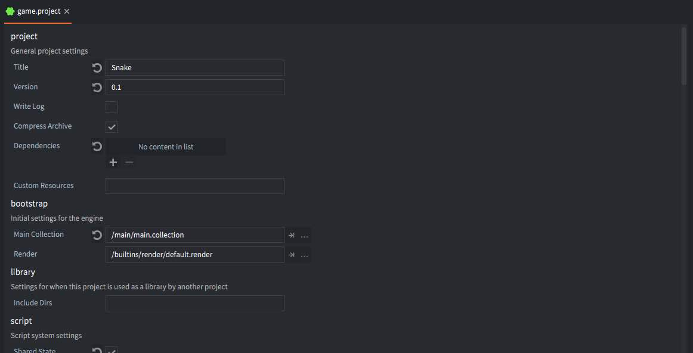

# Настройки проекта

Файл *game.project* содержит все настройки проекта. Он должен находиться в корневой папке проекта и называться *game.project*. Первое, что делает движок при старте и запуске игры, это ищет данный файл.

Каждая настройка в файле относится к определенной категории. При открытии файла Defold представляет все настройки, сгруппированные по категориям.




## Формат файла

Формат файла настроек представляет собой простой текст (формат INI) и может быть отредактирован любым стандартным текстовым редактором. Формат выглядит следующим образом:

```ini
[category1]
setting1 = value
setting2 = value
[category2]
...
```

Наглядный пример:

```ini
[bootstrap]
main_collection = /main/main.collectionc
```

что означает, что настройка *main_collection* относится к категории *bootstrap*. Во всех случаях, когда используется ссылка на файл, как в примере выше, путь должен быть дополнен символом 'c'. Это означает, что вы ссылаетесь на скомпилированную версию файла. Также следует учитывать, что папка, содержащая файл *game.project*, будет корнем проекта, поэтому в пути установки присутствует начальный символ '/'.


## Доступ к значениям во время выполнения

Возможно получить доступ к значениям из *game.project* во время выполнения с помощью [`sys.get_config_string(key)`](/ref/sys/#sys.get_config_string), [`sys.get_config_number(key)`](/ref/sys/#sys.get_config_number) и [`sys.get_config_int(key)`](/ref/sys/#sys.get_config_int). Примеры:

```lua
local title = sys.get_config_string("project.title")
local gravity_y = sys.get_config_number("physics.gravity_y")
```

::: sidenote
Ключ — это комбинация названия категории и имени настройки, разделённые точкой, записанные строчными буквами с заменой всех пробелов на подчёркивания. Примеры: поле "Title" из категории "Project" превращается в `project.title`, а поле "Gravity Y" из категории "Physics" — в `physics.gravity_y`.
:::


## Разделы и настройки

Ниже перечислены все доступные настройки, сгруппированные по категориям.

## Project

#### Title
Название приложения.

#### Version
Версия приложения.

#### Write Log
Если опция отмечена, движок будет записывать файл журнала. Если запущено несколько экземпляров из редактора, файл будет называться *instance_2_log.txt*, где `2` — индекс экземпляра. Если запущен один экземпляр или используется сборка, файл будет называться *log.txt*. Файл журнала будет сохранён в одном из следующих путей (в порядке приоритета):

1. Путь, указанный в *project.log_dir* (скрытая настройка)
2. Системный путь к журналам:
   * macOS/iOS: `NSDocumentDirectory`
   * Android: `Context.getExternalFilesDir()`
   * Прочие платформы: корень приложения
3. Путь к поддержке приложения:
   * macOS/iOS: `NSApplicationSupportDirectory`
   * Windows: `CSIDL_APPDATA` (например, `C:\Users\<username>\AppData\Roaming`)
   * Android: `Context.getFilesDir()`
   * Linux: переменная окружения `HOME`

#### Minimum Log Level
Минимальный уровень логирования. Будут отображаться только логи с этим уровнем или выше.

#### Compress Archive
Включает сжатие архивов при упаковке в бандл. Стоит отметить, что в настоящее время это относится ко всем платформам, кроме Android, где apk содержит все данные в уже сжатом виде.

#### Dependencies
Список URL на *Library URL* проекта. За подробностями обращайтесь к [руководству по библиотекам](/manuals/libraries/).

#### Custom Resources
`custom_resources`
:[Custom Resources](../shared/custom-resources.md)

Дополнительную информацию о пользовательских ресурсах см. в разделе [Файловый доступ](/manuals/file-access/#how-to-access-files-bundled-with-the-application).

#### Bundle Resources
`bundle_resources`
:[Bundle Resources](../shared/bundle-resources.md)

Дополнительную информацию о включаемых в бандл ресурсах см. в разделе [Файловый доступ](/manuals/file-access/#how-to-access-files-bundled-with-the-application).

#### Bundle Exclude Resources
`bundle_exclude_resources`
Список ресурсов, разделённых запятыми, которые не должны включаться в бандл. Эти ресурсы будут исключены из результата сбора шага `bundle_resources`.

---

#### Bootstrap

#### Main Collection
Ссылка на файл коллекции, используемой для запуска приложения. По умолчанию: `/logic/main.collection`.

#### Render
Файл настройки рендера, определяющий пайплайн рендеринга. По умолчанию: `/builtins/render/default.render`.

---

### Library

#### Include Dirs
Список директорий, разделённых пробелами, которые должны быть доступны из проекта через общий доступ к библиотеке. Подробнее см. в [руководстве по библиотекам](/manuals/libraries/).

---

### Script

#### Shared State
Если опция отмечена, все типы скриптов будут использовать единое состояние Lua.

---

### Engine

#### Run While Iconified
Позволяет движку продолжать выполнение, пока окно приложения свернуто (только для настольных платформ).

#### Fixed Update Frequency
Частота обновления функции `fixed_update(self, dt)` в герцах.

#### Max Time Step
Максимальный шаг времени (в секундах), если за один кадр прошло слишком много времени. Превышение этого значения будет ограничено.

---

### Display

#### Width
Ширина окна приложения в пикселях.

#### Height
Высота окна приложения в пикселях.

#### High Dpi
Создаёт back buffer высокого разрешения на дисплеях с поддержкой High DPI. Как правило, игра будет рендериться в двойном разрешении относительно значений *Width* и *Height*, которые по-прежнему будут логическим разрешением в скриптах и свойствах.

#### Samples
Количество сэмплов для суперсэмплинга (SSAA). Задаёт GLFW_FSAA_SAMPLES. Значение `0` отключает сглаживание.

#### Fullscreen
Если опция отмечена, приложение запускается в полноэкранном режиме. Если нет — в оконном.

#### Update Frequency
Желаемая частота кадров в герцах. Значение `0` — переменная частота. При значении больше `0` частота фиксируется и ограничивается в рантайме реальной частотой обновления. Это означает, что игровой цикл не сможет выполняться дважды за кадр движка. Используйте [`sys.set_update_frequency(hz)`](https://defold.com/ref/stable/sys/?q=set_update_frequency#sys.set_update_frequency:frequency) для изменения этого значения во время выполнения. Работает и в headless-сборках.

#### Swap interval
Целое значение, управляющее VSync. `0` — отключает, по умолчанию `1`. При использовании OpenGL это значение определяет количество кадров между обновлениями буфера ([swap interval](https://www.khronos.org/opengl/wiki/Swap_Interval)). Для Vulkan VSync контролируется напрямую этим значением, так как понятия swap interval нет.

#### Display Profiles
Файл профилей дисплея. По умолчанию: `/builtins/render/default.display_profilesc`. Подробнее см. в [руководстве по GUI Layouts](/manuals/gui-layouts/#creating-display-profiles).

#### Dynamic Orientation
Если опция включена, приложение автоматически переключает ориентацию между альбомной и портретной при повороте устройства. Приложение разработки не поддерживает эту настройку.

---

### Render

#### Clear Color Red
Компонент красного цвета для очистки экрана. Используется в render-скрипте и при создании окна.

#### Clear Color Green
Компонент зелёного цвета для очистки экрана. Используется в render-скрипте и при создании окна.

#### Clear Color Blue
Компонент синего цвета для очистки экрана. Используется в render-скрипте и при создании окна.

#### Clear Color Alpha
Компонент альфа-канала для очистки экрана. Используется в render-скрипте и при создании окна.

---

### Physics

#### Type
Тип физики: `2D` или `3D`.

#### Gravity X
Гравитация по оси X (м/с²).

#### Gravity Y
Гравитация по оси Y (м/с²).

#### Gravity Z
Гравитация по оси Z (м/с²).

#### Debug
Если опция отмечена, физика будет визуализироваться для отладки.

#### Debug Alpha
Значение альфа-компонента для визуализированной физики (`0`–`1`).

#### World Count
Максимальное количество одновременных физических миров. По умолчанию `4`. Если загружается больше через прокси, значение необходимо увеличить. Каждый мир использует значительный объём памяти.

#### Scale
Коэффициент масштабирования физики относительно игрового мира для повышения точности (`0.01`–`1.0`). Например, при `0.02` — 50 единиц равны 1 метру (`1 / 0.02`).

#### Allow Dynamic Transforms
Если включено, движок будет применять трансформации игрового объекта (позиция, масштаб, поворот) к привязанным компонентам столкновений.

#### Use Fixed Timestep
Если включено, физика будет обновляться фиксированным шагом времени, независимым от частоты кадров. Используется вместе с функцией `fixed_update(self, dt)` и настройкой `engine.fixed_update_frequency`. Рекомендуется для новых проектов.

#### Debug Scale
Размер отрисовки единичных объектов физики, таких как триады и нормали.

#### Max Collisions
Максимум коллизий, передаваемых в скрипты.

#### Max Contacts
Максимум точек контакта, передаваемых в скрипты.

#### Contact Impulse Limit
Игнорировать импульсы столкновений с величиной меньше указанной.

#### Ray Cast Limit 2d
Максимальное количество запросов 2D-рейкастинга в кадре.

#### Ray Cast Limit 3d
Максимальное количество запросов 3D-рейкастинга в кадре.

#### Trigger Overlap Capacity
Максимальное количество пересекающихся физических триггеров.

---

### Graphics

#### Default Texture Min Filter
Определяет фильтрацию, используемую при уменьшении текстуры (minification filtering).

#### Default Texture Mag Filter
Определяет фильтрацию, используемую при увеличении текстуры (magnification filtering).

#### Max Draw Calls
Максимальное количество вызовов рендеринга.

#### Max Characters
Количество символов, заранее выделенных в буфере рендеринга текста — то есть сколько символов может быть отображено за кадр.

#### Max Debug Vertices
Максимальное количество отладочных вершин. Используется, в том числе, для отрисовки физических форм.

#### Texture Profiles
Файл профилей текстур, используемый для проекта. По умолчанию: `/builtins/graphics/default.texture_profiles`.

#### Verify Graphics Calls
Проверяет возвращаемые значения всех графических вызовов и записывает ошибки в журнал.

#### OpenGL Version Hint
Подсказка по версии контекста OpenGL. Если выбрана конкретная версия, она используется как минимально допустимая. Не применяется к OpenGL ES.

#### OpenGL Core Profile Hint
Устанавливает профиль OpenGL 'core' при создании контекста. Core-профиль исключает устаревшие функции OpenGL, такие как немедленный режим отрисовки (immediate mode). Не применяется к OpenGL ES.

---

### Input

#### Repeat Delay
Количество секунд ожидания перед началом повторного ввода при удержании клавиши.

#### Repeat Interval
Количество секунд между повторениями удерживаемого ввода.

#### Gamepads
Ссылка на файл конфигурации геймпадов, сопоставляющий сигналы геймпада с ОС. По умолчанию: `/builtins/input/default.gamepads`.

#### Game Binding
Ссылка на файл конфигурации ввода, сопоставляющий аппаратные события с действиями. По умолчанию: `/input/game.input_binding`.

#### Use Accelerometer
Если включено, движок будет получать события акселерометра каждый кадр. Отключение может незначительно повысить производительность.

---

### Resource

#### Http Cache
Если включено, активируется HTTP-кэш, что позволяет ускорить загрузку ресурсов по сети на устройстве во время выполнения.

#### Uri
Местоположение сборки проекта в формате URI.

#### Max Resources
Максимальное количество ресурсов, которые могут быть загружены одновременно.

---

### Network

#### Http Timeout
Таймаут HTTP в секундах. Значение `0` отключает таймаут.

#### Http Thread Count
Количество рабочих потоков, используемых HTTP-сервисом.

#### Http Cache Enabled
Если включено, активируется HTTP-кэш для сетевых запросов (используется с `http.request()`). Кэш сохраняет ответ, связанный с запросом, и повторно использует его при следующих вызовах. Поддерживаются заголовки `ETag` и `Cache-Control: max-age`.

#### SSL Certificates
Файл, содержащий корневые SSL-сертификаты, используемые для проверки цепочки сертификатов во время SSL-рукопожатия.

---

### Collection

#### Max Instances
Максимальное количество экземпляров игровых объектов в коллекции. По умолчанию — `1024`. [(См. информацию по оптимизации количества компонентов)](#component-max-count-optimizations).

#### Max Input Stack Entries
Максимальное количество игровых объектов во входном стеке.

---

### Sound

#### Gain
Глобальное усиление (громкость), от `0` до `1`.

#### Max Sound Data
Максимальное количество звуковых ресурсов, то есть уникальных звуковых файлов во время выполнения.

#### Max Sound Buffers
(В настоящее время не используется) Максимальное количество одновременно используемых звуковых буферов.

#### Max Sound Sources
(В настоящее время не используется) Максимальное количество одновременно воспроизводимых звуков.

#### Max Sound Instances
Максимальное количество одновременно воспроизводимых экземпляров звуков.

#### Use Thread
Если включено, система звука будет использовать потоки для воспроизведения, что снижает риск запинаний при высокой нагрузке на основной поток.

#### Stream Enabled
Если включено, система будет использовать потоковую загрузку исходных звуковых файлов.

#### Stream Cache Size
Максимальный размер кэша звуковых чанков. По умолчанию — `2097152` байт.
Это значение должно быть больше произведения количества загруженных звуков и размера чанка.
Иначе новые чанки могут вытесняться каждый кадр.

#### Stream Chunk Size
Размер в байтах каждого потокового чанка.

#### Stream Preload Size
Размер в байтах предварительного чанка при чтении звуков из архива.

---

### Sprite

#### Max Count
Максимальное количество спрайтов на коллекцию. [(См. информацию по оптимизации количества компонентов)](#component-max-count-optimizations).

#### Subpixels
Если опция включена, спрайты могут отображаться с дробным позиционированием, не выровненным по пиксельной сетке.

---

### Tilemap

#### Max Count
Максимальное количество тайлмапов на коллекцию. [(См. информацию по оптимизации количества компонентов)](#component-max-count-optimizations).

#### Max Tile Count
Максимальное количество одновременно отображаемых тайлов в коллекции.

---

### Spine

#### Max Count
Максимальное количество компонентов Spine-моделей. [(См. информацию по оптимизации количества компонентов)](#component-max-count-optimizations).

---

### Mesh

#### Max Count
Максимальное количество компонентов Mesh на коллекцию. [(См. информацию по оптимизации количества компонентов)](#component-max-count-optimizations).

---

### Model

#### Max Count
Максимальное количество компонентов Model на коллекцию. [(См. информацию по оптимизации количества компонентов)](#component-max-count-optimizations).

---

### GUI

#### Max Count
Максимальное количество компонентов GUI. [(См. информацию по оптимизации количества компонентов)](#component-max-count-optimizations).

#### Max Particlefx Count
Максимальное количество одновременно активных эмиттеров.

#### Max Particle Count
Максимальное количество одновременно отображаемых частиц.

#### Max Animation Count
Максимальное количество одновременно активных анимаций в GUI.

---

### Label

#### Max Count
Максимальное количество компонентов Label. [(См. информацию по оптимизации количества компонентов)](#component-max-count-optimizations).

#### Subpixels
Если опция включена, Label могут отображаться с дробным позиционированием, не выровненным по пикселям.

---

### Particle FX

#### Max Count
Максимальное количество одновременно активных эмиттеров. [(См. информацию по оптимизации количества компонентов)](#component-max-count-optimizations).

#### Max Particle Count
Максимальное количество одновременно отображаемых частиц.

---

### Collection proxy

#### Max Count
Максимальное количество прокси-коллекций. [(См. информацию по оптимизации количества компонентов)](#component-max-count-optimizations).

---

### Collection factory

#### Max Count
Максимальное количество фабрик коллекций. [(См. информацию по оптимизации количества компонентов)](#component-max-count-optimizations).

---

### Factory

#### Max Count
Максимальное количество фабрик игровых объектов. [(См. информацию по оптимизации количества компонентов)](#component-max-count-optimizations).

---

### iOS

#### App Icon 57x57--180x180
Файл изображения (.png), используемый в качестве иконки приложения при заданных размерах `W` &times; `H`.

#### Launch Screen
Файл раскадровки (.storyboard). Подробнее о создании см. в [руководстве по iOS](/manuals/ios/#creating-a-storyboard).

#### Prerendered Icons
(iOS 6 и ниже) Если опция не включена, иконки получат глянцевое покрытие автоматически. Если включена — иконки считаются уже готовыми к использованию.

#### Bundle Identifier
Идентификатор бандла позволяет iOS распознавать обновления вашего приложения. Идентификатор должен быть зарегистрирован в Apple и уникален для приложения. Нельзя использовать один и тот же идентификатор как для iOS, так и для macOS. Он должен состоять минимум из двух сегментов, разделённых точками. Каждый сегмент должен начинаться с буквы и может содержать только буквенно-цифровые символы, подчёркивания или дефисы (`-`) (см. [`CFBundleIdentifier`](https://developer.apple.com/library/archive/documentation/General/Reference/InfoPlistKeyReference/Articles/CoreFoundationKeys.html#//apple_ref/doc/uid/20001431-130430)).

#### Bundle Name
Короткое имя бандла (до 15 символов) (см. [`CFBundleName`](https://developer.apple.com/library/archive/documentation/General/Reference/InfoPlistKeyReference/Articles/CoreFoundationKeys.html#//apple_ref/doc/uid/20001431-130430)).

#### Bundle Version
Версия бандла — число или строка в формате `x.y.z` (см. [`CFBundleVersion`](https://developer.apple.com/library/archive/documentation/General/Reference/InfoPlistKeyReference/Articles/CoreFoundationKeys.html#//apple_ref/doc/uid/20001431-130430)).

#### Info.plist
Если задано, используется указанный файл *`info.plist`* при сборке приложения.

#### Privacy Manifest
Манифест конфиденциальности Apple для приложения. По умолчанию: `/builtins/manifests/ios/PrivacyInfo.xcprivacy`.

#### Custom Entitlements
Если задано, права (entitlements) из предоставленного provisioning profile (`.entitlements`, `.xcent`, `.plist`) будут объединены с правами из профиля, указанного при сборке.

#### Override Entitlements
Если включено, пользовательские entitlements заменят права из provisioning profile. Используется только вместе с настройкой Custom Entitlements.

#### Default Language
Язык, используемый приложением, если в списке `Localizations` отсутствует предпочтительный язык пользователя (см. [`CFBundleDevelopmentRegion`](https://developer.apple.com/library/archive/documentation/General/Reference/InfoPlistKeyReference/Articles/CoreFoundationKeys.html#//apple_ref/doc/uid/20001431-130430)). Используйте двухбуквенный ISO 639-1, если доступен, или трёхбуквенный ISO 639-2.

#### Localizations
Поле со списком поддерживаемых локалей в виде строк, разделённых запятыми. Каждая строка — это название языка или ISO-код языка (см. [`CFBundleLocalizations`](https://developer.apple.com/library/archive/documentation/General/Reference/InfoPlistKeyReference/Articles/CoreFoundationKeys.html#//apple_ref/doc/uid/20001431-109552)).

---

### Android

#### App Icon 36x36--192x192
Файл изображения (.png), используемый как иконка приложения при заданных размерах `W` &times; `H`.

#### Push Icon Small--LargeXxxhdpi
Файлы изображений (.png), используемые в качестве кастомных иконок push-уведомлений на Android. Иконки будут использоваться как для локальных, так и для удалённых уведомлений. Если не задано, по умолчанию будет использоваться иконка приложения.

#### Push Field Title
Поле в JSON-пейлоуде, используемое в качестве заголовка push-уведомления. Если оставить пустым, заголовком будет имя приложения.

#### Push Field Text
Поле в JSON-пейлоуде, используемое в качестве текста push-уведомления. Если оставить пустым, будет использовано поле `alert`, аналогично поведению на iOS.

#### Version Code
Целочисленное значение, указывающее версию приложения. Увеличивайте при каждом обновлении.

#### Package
Идентификатор пакета. Должен состоять минимум из двух сегментов, разделённых точками. Каждый сегмент должен начинаться с буквы и содержать только буквенно-цифровые символы или подчёркивания.

#### GCM Sender Id
Sender Id для Google Cloud Messaging. Установите строку, выданную Google, чтобы включить push-уведомления.

#### Manifest
Если указано, используется заданный Android-манифест (XML-файл) при сборке.

#### Iap Provider
Указывает, какой магазин использовать. Допустимые значения: `Amazon` и `GooglePlay`. См. [extension-iap](/extension-iap/) для получения дополнительной информации.

#### Input Method
Определяет метод получения текстового ввода на Android-устройствах. Допустимые значения: `KeyEvent` (старый метод) и `HiddenInputField` (новый).

#### Immersive Mode
Если включено, скрывает навигационные и статус-бары и позволяет приложению обрабатывать все касания по экрану.

#### Debuggable
Определяет, может ли приложение быть отлажено с помощью таких инструментов, как [GAPID](https://github.com/google/gapid) или [Android Studio](https://developer.android.com/studio/profile/android-profiler). Устанавливает флаг `android:debuggable` в Android-манифесте ([официальная документация](https://developer.android.com/guide/topics/manifest/application-element#debug)).

#### Extract Native Libraries
Указывает, должен ли установщик извлекать нативные библиотеки из APK в файловую систему. Если установлено в `false`, библиотеки остаются внутри APK в несжатом виде. Это увеличивает размер APK, но ускоряет загрузку, так как библиотеки загружаются напрямую. Устанавливает флаг `android:extractNativeLibs` в Android-манифесте ([официальная документация](https://developer.android.com/guide/topics/manifest/application-element#extractNativeLibs)).

---

### macOS

#### App Icon
Файл изображения (.png), используемый как иконка приложения на macOS.

#### Info.plist
Если указано, используется заданный файл info.plist при сборке приложения.

#### Privacy Manifest
Манифест конфиденциальности Apple для приложения. По умолчанию используется `/builtins/manifests/osx/PrivacyInfo.xcprivacy`.

#### Bundle Identifier
Идентификатор бандла позволяет macOS распознавать обновления вашего приложения. Идентификатор должен быть зарегистрирован в Apple и уникален для приложения. Нельзя использовать один и тот же идентификатор как для iOS, так и для macOS. Он должен состоять минимум из двух сегментов, разделённых точками. Каждый сегмент должен начинаться с буквы и содержать только буквенно-цифровые символы, подчёркивания или дефисы.

#### Default Language
Язык, используемый приложением, если в списке `Localizations` отсутствует предпочтительный язык пользователя (см. [`CFBundleDevelopmentRegion`](https://developer.apple.com/library/archive/documentation/General/Reference/InfoPlistKeyReference/Articles/CoreFoundationKeys.html#//apple_ref/doc/uid/20001431-130430)). Используйте двухбуквенный ISO 639-1, если доступен, или трёхбуквенный ISO 639-2.

#### Localizations
Список поддерживаемых локалей, указанный через запятую. Каждое значение — это название языка или его ISO-дизигнатор (см. [`CFBundleLocalizations`](https://developer.apple.com/library/archive/documentation/General/Reference/InfoPlistKeyReference/Articles/CoreFoundationKeys.html#//apple_ref/doc/uid/20001431-109552)).

---

### Windows

#### App Icon
Файл изображения (.ico), используемый как иконка приложения на Windows. Подробнее о создании .ico файла см. в [руководстве по Windows](/manuals/windows).

---

### HTML5

См. [руководство по платформе HTML5](/manuals/html5/) для получения дополнительной информации о большинстве из этих опций.

#### Heap Size
Размер кучи в мегабайтах, выделяемый Emscripten.

#### .html Shell
HTML-шаблон, используемый при сборке. По умолчанию — `/builtins/manifests/web/engine_template.html`.

#### Custom .css
Файл CSS-темы, используемый при сборке. По умолчанию — `/builtins/manifests/web/light_theme.css`.

#### Splash Image
Если указано, заданное изображение отображается при запуске вместо логотипа Defold.

#### Archive Location Prefix
При сборке HTML5-версии данные игры разбиваются на архивные файлы. При запуске движок считывает их в память. Здесь задаётся префикс пути к этим файлам.

#### Archive Location Suffix
Суффикс, добавляемый к именам архивов. Полезен, например, для принудительной загрузки свежего содержимого с CDN (`?version2` и т.п.).

#### Engine Arguments
Список аргументов, передаваемых движку при запуске.

#### Show Fullscreen Button
Включает кнопку полноэкранного режима в `index.html`.

#### Show Made With Defold
Добавляет ссылку «Made With Defold» в `index.html`.

#### Show Console Banner
Если включено, в консоли браузера будет выведена информация о движке и его версии при запуске (с помощью `console.log()`).

#### Scale Mode
Определяет способ масштабирования canvas-элемента.

#### Retry Count
Количество попыток повторной загрузки файла при запуске движка (см. `Retry Time`).

#### Retry Time
Интервал в секундах между попытками загрузки файла при сбое (см. `Retry Count`).

#### Transparent Graphics Context
Если включено, графический контекст будет иметь прозрачный фон.

---

### IAP

#### Auto Finish Transactions
Если включено, транзакции IAP завершаются автоматически. Если отключено, необходимо вручную вызывать `iap.finish()` после успешной транзакции.

---

### Live update

#### Private Key
Если указано, используется заданный файл закрытого ключа при сборке live update-контента. Если ключ не задан, он будет сгенерирован автоматически.

#### Public Key
Если указано, используется заданный файл открытого ключа при сборке live update-контента. Если ключ не задан, он будет сгенерирован автоматически.

---

### Native extension

#### _App Manifest_
Если задан, используется манифест приложения для настройки сборки движка. Это позволяет удалить неиспользуемые части движка и уменьшить размер итогового бинарного файла. Подробнее об исключении ненужных возможностей читайте в [руководстве по манифесту приложения](/manuals/app-manifest).

---

### Profiler

#### Track Cpu
Если включено, разрешается профилирование CPU в release-сборках. Обычно доступ к профилированию возможен только в debug-сборках.

---

## Установка конфигурационных значений при запуске движка

При запуске движка из командной строки можно указать конфигурационные значения, переопределяющие настройки *game.project*:

```bash
# Указать коллекцию начальной загрузки
$ dmengine --config=bootstrap.main_collection=/my.collectionc

# Установить два пользовательских конфигурационных значения
$ dmengine --config=test.my_value=4711 --config=test2.my_value2=1234
```

Пользовательские значения, как и любое другое значение конфигурации, могут быть считаны с помощью [`sys.get_config()`](/ref/sys/#sys.get_config):

```lua
local my_value = sys.get_config_number("test.my_value")
local my_value2 = sys.get_config_string("test.my_value2")
```


:[Component max count optimizations](../shared/component-max-count-optimizations.md)


## Пользовательские настройки проекта

Возможно определить собственные настройки как для основного проекта, так и для [нативных расширений](/manuals/extensions/). Для основного проекта они указываются в файле `game.properties` в корне проекта. Для нативного расширения — в файле `ext.properties` рядом с `ext.manifest`.

Файл настроек использует тот же INI-формат, что и *game.project*, а атрибуты свойств указываются с помощью точечной нотации с суффиксами:

```
[my_category]
my_property.private = 1
...
```

Файл с настройками по умолчанию, применяемый всегда, доступен [здесь](https://github.com/defold/defold/blob/dev/com.dynamo.cr/com.dynamo.cr.bob/src/com/dynamo/bob/meta.properties).

Доступны следующие атрибуты:

```
// `type` — используется для парсинга строкового значения (на данный момент только в bob.jar)
my_property.type = string // возможные значения: bool, string, number, integer, string_array, resource

// `help` — используется как подсказка в редакторе (на данный момент не используется)
my_property.help = string

// `default` — значение по умолчанию, если пользователь не задал его вручную (на данный момент только в bob.jar)
my_property.default = string

// `private` — приватное значение, используемое при сборке, но не включаемое в итоговый бандл
my_property.private = 1 // булевое значение: 1 или 0

```


На данный момент meta-свойства используются только в `bob.jar` при сборке, но в будущем они будут также обрабатываться редактором и отображаться в *game.project*.
