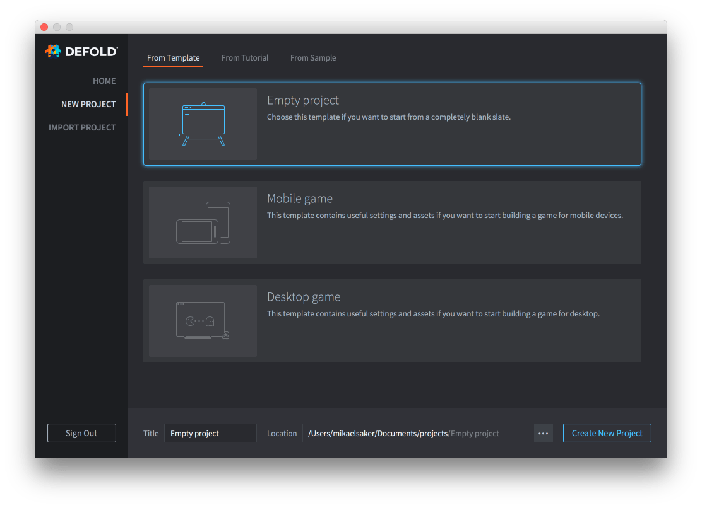
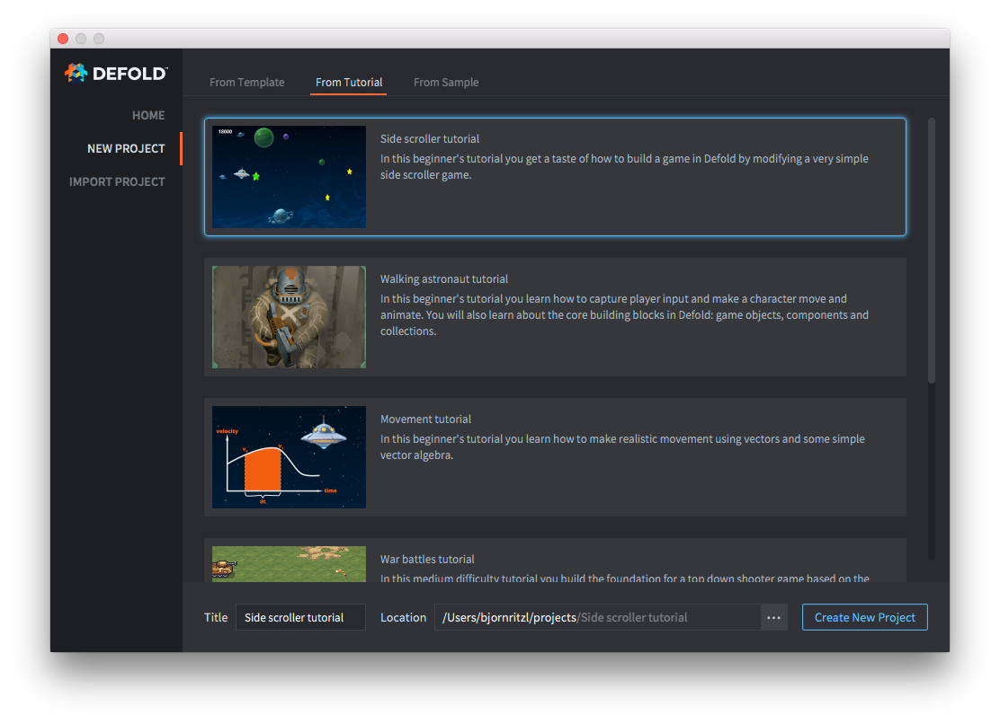
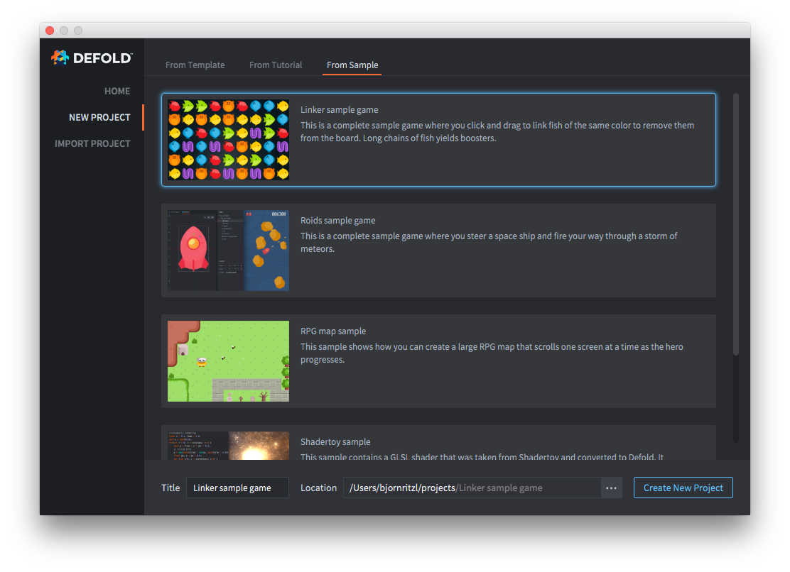

# Подготовка проекта

Создать новый проект из редактора Defold очень просто. Кроме того, можно открыть существующий проект, уже хранящийся на компьютере.

## Создание нового локального проекта

Кликните опцию <kbd>NEW PROJECT</kbd> (в стартовом окне) и выберите тип проекта, который хотите создать. Укажите расположение на жестком диске, где будут храниться файлы проекта. Кликните <kbd>Create New Project</kbd>, чтобы создать проект в выбранном расположении. Новый проект можно создать из шаблона:

Или из учебника с пошаговыми инструкциями:

Или из завершенного примера игры:

### Добавление проекта на GitHub

Локальный проект не имеет интеграции с какой-либо системой контроля версий, и это означает, что файлы хранятся лишь на жестком диске. Любые изменения, внесенные в файлы, являются необратимыми, и нет возможности отменить их или восстановить удаленное. Рекомендуется использовать систему контроля версий, такую как Git, для отслеживания изменений в файлах. Кроме того, это облегчает совместную работу над проектом с другими людьми. Загрузить локальный проект на GitHub можно всего за несколько шагов:

1. Создайте новый или войдите в существующий аккаунт на [GitHub](https://github.com/)
2. Создайте репозиторий используя опцию [New Repository](https://help.github.com/en/articles/creating-a-new-repository)
3. Загрузите все файлы проекта с помощью опции [Upload Files](https://help.github.com/en/articles/adding-a-file-to-a-repository)

Теперь проект находится под контролем версий. Далее следует [клонировать проект](https://help.github.com/en/articles/cloning-a-repository) на локальный жесткий диск и работать с этого нового расположения.

## Открытие существующего проекта

Кликните опцию <kbd>Open From Disk</kbd>, чтобы открыть проект, уже хранящийся на компьютере.

## Открытие последнего проекта

Как только проект однажды будет открыт, он появится в списке последних проектов. В списке отображаются проекты, над которыми вы работали в последнее время, и можно быстро открыть любой из них, выполнив двойной клик на на его названии в списке.