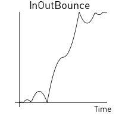
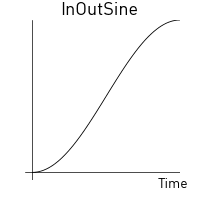
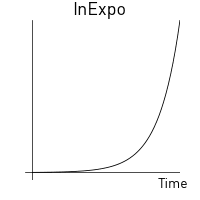
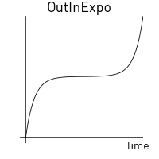
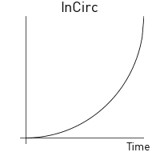
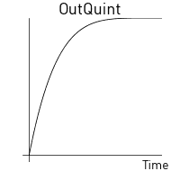

# Анимация свойств

Все свойства выражаемые числовыми типами (числа, vector3, vector4 и кватернионы) и шейдерные константы могут быть анимированы встроенной системой анимации, с помощью функции `go.animate()`. Движок автоматически делает "твининг" свойств за вас согласно переданному режиму воспроизведения и функций плавности (easing functions). Вы также можете задать свои собственные функции плавности. 

  {.inline srcset="images/animation/property_animation@2x.png 2x"}
  {.inline}

## Анимация свойств

Чтобы анимировать игровой объект или свойство компонента, используйте функцию `go.animate()`. Для свойств GUI нод, соответствующей функцией будет `gui.animate()`.

```lua
-- Set the position property y component to 200
go.set(".", "position.y", 200)
-- Then animate it
go.animate(".", "position.y", go.PLAYBACK_LOOP_PINGPONG, 100, go.EASING_OUTBOUNCE, 2)
```

Для остановки всех анимаций заданного свойства, вызовите `go.cancel_animations()`, или в случае с GUI нодами, `gui.cancel_animation()`: 

```lua
-- Stop euler z rotation animation on the current game object
go.cancel_animation(".", "euler.z")
```

Если вы отменяете анимацию составного свойства, такого как например `position`, все анимации его составляющих компонент (`position.x`, `position.y` и `position.z`) будут также отменены.

The [Руководство по свойствам](/manuals/properties) содержит все доступные свойства игровых объектов, компонентов и GUI нод.

## Анимация свойств GUI ноды

Почти все свойства GUI нод можно аниимировать. Например, вы можете сделать ноду невидимой установив её свойство `color` в полную прозрачность а затем заново проявить ноду в видимую анимируя цвет к белому (или другими словами - без оттенка).

```lua
local node = gui.get_node("button")
local color = gui.get_color(node)
-- Animate the color to white
gui.animate(node, gui.PROP_COLOR, vmath.vector4(1, 1, 1, 1), gui.EASING_INOUTQUAD, 0.5)
-- Animate the outline red color component
gui.animate(node, "outline.x", 1, gui.EASING_INOUTQUAD, 0.5)
-- And move to x position 100
gui.animate(node, hash("position.x"), 100, gui.EASING_INOUTQUAD, 0.5)
```

## Функции обратного вызова по завершению

Функции анимирования свойств `go.animate()` и `gui.animate()`. поддерживают опциональные функции обратного вызова в качестве последнего переданного аргумента. Такие переданные функции будут вызваны когда анимация проиграется до конца. Функции никогда не будут вызваны для зацикленных анимаций, а также для анимаций, которые отменили вручную вызовом `go.cancel_animations()` или `gui.cancel_animation()`. Функция обратного вызова может быть использована для активации других событий по завершению анимации или для склеивания нескольких анимаций в одну цепочку.

## Плавность (изинг)

Плавность определяет характер изменения анимируемого значения во времени. Изображения ниже описывают функции по времени применяемые для создания различной плавности. 

Ниже приведены следующие валидные значения для изинга для функции `go.animate()`:

|---|---|
| go.EASING_LINEAR | |
| go.EASING_INBACK | go.EASING_OUTBACK |
| go.EASING_INOUTBACK | go.EASING_OUTINBACK |
| go.EASING_INBOUNCE | go.EASING_OUTBOUNCE |
| go.EASING_INOUTBOUNCE | go.EASING_OUTINBOUNCE |
| go.EASING_INELASTIC | go.EASING_OUTELASTIC |
| go.EASING_INOUTELASTIC | go.EASING_OUTINELASTIC |
| go.EASING_INSINE | go.EASING_OUTSINE |
| go.EASING_INOUTSINE | go.EASING_OUTINSINE |
| go.EASING_INEXPO | go.EASING_OUTEXPO |
| go.EASING_INOUTEXPO | go.EASING_OUTINEXPO |
| go.EASING_INCIRC | go.EASING_OUTCIRC |
| go.EASING_INOUTCIRC | go.EASING_OUTINCIRC |
| go.EASING_INQUAD | go.EASING_OUTQUAD |
| go.EASING_INOUTQUAD | go.EASING_OUTINQUAD |
| go.EASING_INCUBIC | go.EASING_OUTCUBIC |
| go.EASING_INOUTCUBIC | go.EASING_OUTINCUBIC |
| go.EASING_INQUART | go.EASING_OUTQUART |
| go.EASING_INOUTQUART | go.EASING_OUTINQUART |
| go.EASING_INQUINT | go.EASING_OUTQUINT |
| go.EASING_INOUTQUINT | go.EASING_OUTINQUINT |

Ниже приведены следующие валидные значения для изинга для функции `gui.animate()`:

|---|---|
| gui.EASING_LINEAR | |
| gui.EASING_INBACK | gui.EASING_OUTBACK |
| gui.EASING_INOUTBACK | gui.EASING_OUTINBACK |
| gui.EASING_INBOUNCE | gui.EASING_OUTBOUNCE |
| gui.EASING_INOUTBOUNCE | gui.EASING_OUTINBOUNCE |
| gui.EASING_INELASTIC | gui.EASING_OUTELASTIC |
| gui.EASING_INOUTELASTIC | gui.EASING_OUTINELASTIC |
| gui.EASING_INSINE | gui.EASING_OUTSINE |
| gui.EASING_INOUTSINE | gui.EASING_OUTINSINE |
| gui.EASING_INEXPO | gui.EASING_OUTEXPO |
| gui.EASING_INOUTEXPO | gui.EASING_OUTINEXPO |
| gui.EASING_INCIRC | gui.EASING_OUTCIRC |
| gui.EASING_INOUTCIRC | gui.EASING_OUTINCIRC |
| gui.EASING_INQUAD | gui.EASING_OUTQUAD |
| gui.EASING_INOUTQUAD | gui.EASING_OUTINQUAD |
| gui.EASING_INCUBIC | gui.EASING_OUTCUBIC |
| gui.EASING_INOUTCUBIC | gui.EASING_OUTINCUBIC |
| gui.EASING_INQUART | gui.EASING_OUTQUART |
| gui.EASING_INOUTQUART | gui.EASING_OUTINQUART |
| gui.EASING_INQUINT | gui.EASING_OUTQUINT |
| gui.EASING_INOUTQUINT | gui.EASING_OUTINQUINT |

{.inline}
{.inline}
{.inline}
{.inline}
{.inline}
{.inline}
{.inline}
{.inline}
{.inline}
{.inline}
{.inline}
{.inline}
{.inline}
{.inline}
{.inline}
{.inline}
{.inline}
{.inline}
{.inline}
{.inline}
{.inline}
{.inline}
{.inline}
{.inline}
{.inline}
{.inline}
{.inline}
{.inline}
{.inline}
{.inline}
{.inline}
{.inline}
{.inline}
{.inline}
{.inline}
{.inline}
{.inline}
{.inline}
{.inline}
{.inline}
{.inline}

## Пользовательские функции плавности

Вы можете создасть собственные кривые плавности задав `vector` с набором значений и подставив этот вектор вместо одного из предопределенных констант выше. Значений вектора выражают кривую от начального значения (`0`) к целевому конечному (`1`). Среда выполнения семплирует значения из вектора и линейно интерполирует значения между точками кривой плавности, выраженными в векторе.

К примеру, данный вектор:

```lua
local values = { 0, 0.4, 0.2, 0.2, 0.5. 1 }
local my_easing = vmath.vector(values)
```

даёт следующую кривую:


Следующий пример сделает так, что позиция y игрового объекта будет прыгать между текущей позицией и значением 200, согласно кривой квадратной волны:

```lua
local values = { 0, 0, 0, 0, 0, 0, 0, 0,
                 1, 1, 1, 1, 1, 1, 1, 1,
                 0, 0, 0, 0, 0, 0, 0, 0,
                 1, 1, 1, 1, 1, 1, 1, 1,
                 0, 0, 0, 0, 0, 0, 0, 0,
                 1, 1, 1, 1, 1, 1, 1, 1,
                 0, 0, 0, 0, 0, 0, 0, 0,
                 1, 1, 1, 1, 1, 1, 1, 1 }
local square_easing = vmath.vector(values)
go.animate("go", "position.y", go.PLAYBACK_LOOP_PINGPONG, 200, square_easing, 2.0)
```


