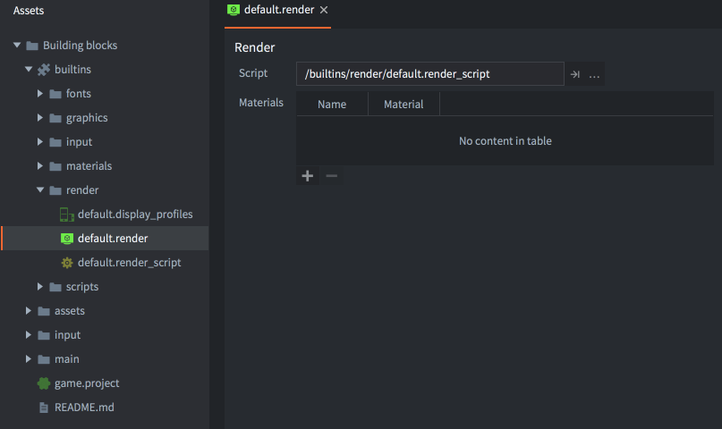
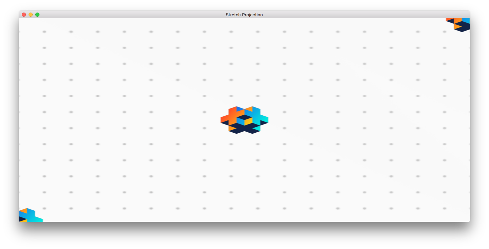
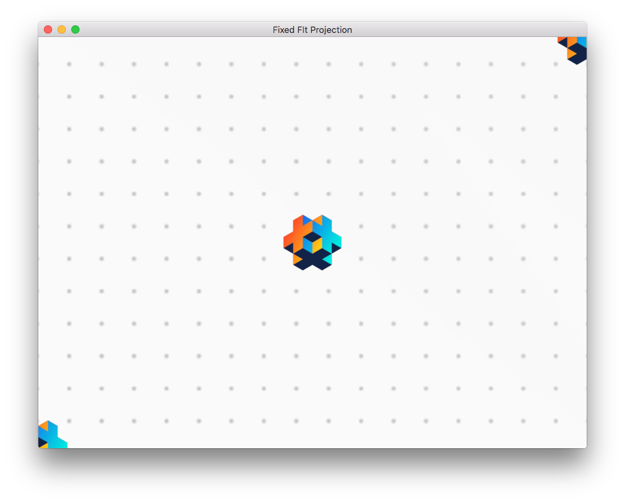
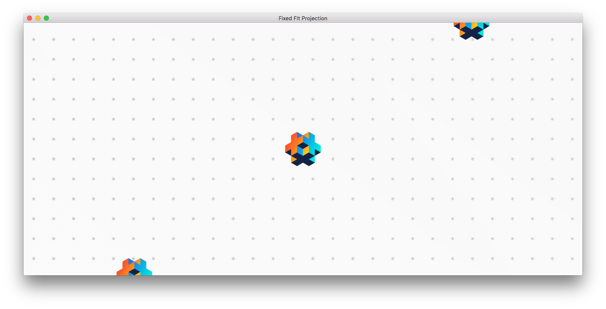
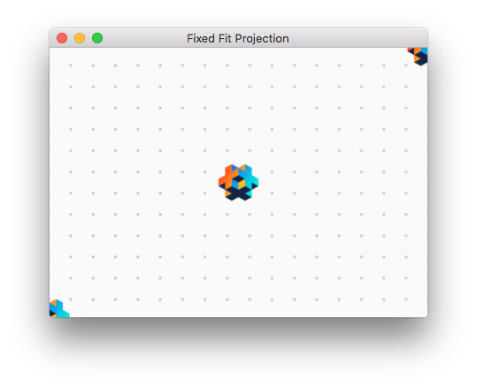
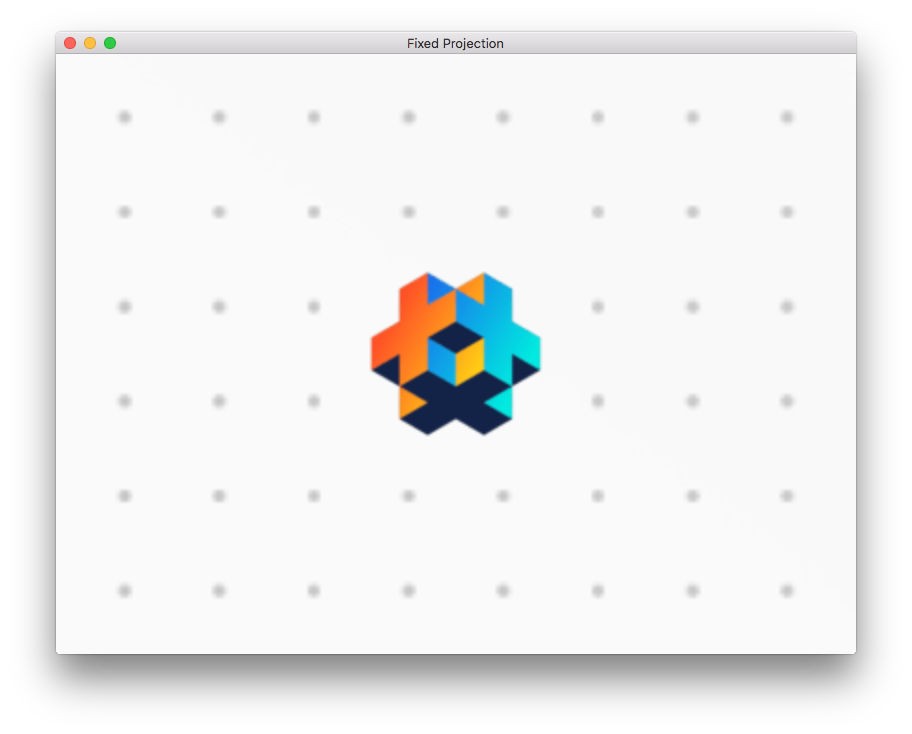
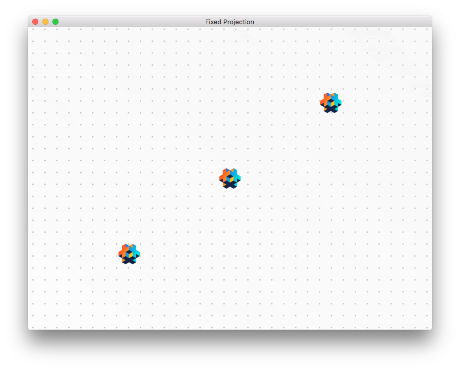
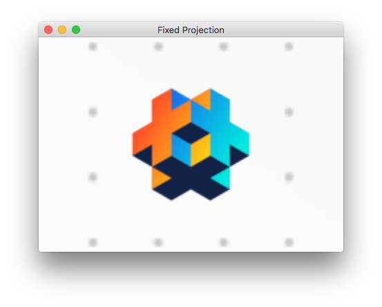

# Рендер пайплайн

Каждый объект, отображаемый на экране движком: спрайты, модели, тайлы, частицы или GUI-ноды, отрисовываются рендерером (визуализатором). Сердцем любого рендерера является рендер-скрипт, который управляет конвейером рендеринга. По-умолчанию, каждый 2D объект отрисовывается с правильной битовой картой с заданным смешиванием и с правильной Z глубиной --- таким образом вам возможно даже не нужно задумываться о рендеринге помимо упорядочивания и простого смешивания. Для большинства 2D игр, конвейер по-умолчанию вполне хорошо работает, но ваша игра может иметь особые требования. Если это ваш случай, Defold позволяет вам писать индивидуальные рендеринг конвейеры.  

### Рендер пайплайн - Что, где и когда?

Конвейер рендеринга диктует что рендерить, когда это рендерить и также где это следует рендерить. Что рендерить задается [рендер предикатами](#рендер-предикаты). Когда рендерить предикат управляется [рендер скриптом](#рендер-скрипт), а где рендерить предикат управляется [проекцией вида](#проекция-вида-по-умолчанию).


## Рендер по-умолчанию

Рендер файл содержит ссылку на текущий рендер скрипт, а также пользовательские материалы, которые должны быть доступны в рендер скрипте (применяется вызов [`render.enable_material()`](/ref/render/#render.enable_material))

Сердцем рендеринг конвейера является _рендер скрипт_. Это Lua скрипт с функциями `init()`, `update()` и `on_message()` и в первую очередь он применяется для взаимодействия с нижележащим OpenGL рендеринг API. Рендер скрипту отводится специальное место в жизненном цикле вашей игры. С деталями можно ознакомиться в [Документации по жизненному циклу приложения](/manuals/application-lifecycle).

В папке "Builtins" вашего проекта вы можете найти рендеринг ресурс по-умолчанию ("default.render"), а также рендер скрипт по-умолчанию ("default.render_script").



Для настройки пользовательского рендерера:

1. Скопируйте файлы "default.render" и "default.render_script" в место в пределах иерархии вашего проекта. Вы, конечно же, можете создать рендер скрипт с нуля, но хорошей идеей будет начать с копии стандартного скрипта, особенно если вы новичок в Defold и/или рендеринге через OpenGL ES. 

2. Отредактируйте вашу копию файла "default.render" и замените свойство *Script*, чтобы оно ссылалось на вашу копию рендер скрипта.

3. Замените свойство *Render* (в *bootstrap*) в файле настроек *game.project* так, чтобы оно ссылалось на вашу копию файла "default.render".


# Рендер предикаты

Чтобы иметь возможность управлять порядком отрисовки объектов, создаются рендер _предикаты_. Предикат задает, что должно быть отрисовано на основе выборки _тегов_ материала.

Каждый объект, который отрисовывается на экран, обладает прикрепленным материалом, который управляет тем, как объект должен быть отрисован на экране. В материале вы задаете один или больше _тегов_, которые должны быть ассоциированы с этим материалом.

В вашем рендер скрипте вы далее можете создать *рендер предикат* и задать, какие теги должны принадлежать этому предикату. Когда вы просите движок отрисовать предикат, каждый объект с материалом, содержащим тег, совпадающий со списком заданным для предиката, будет отрисован.

```
Sprite 1        Sprite 2        Sprite 3        Sprite 4
Material A      Material A      Material B      Material C
  outlined        outlined        greyscale       outlined
  tree            tree            tree            house
```

```lua
-- a predicate matching all sprites with tag "tree"
local trees = render.predicate({"tree"})
-- will draw Sprite 1, 2 and 3
render.draw(trees)

-- a predicate matching all sprites with tag "outlined"
local outlined = render.predicate({"outlined"})
-- will draw Sprite 1, 2 and 4
render.draw(outlined)

-- a predicate matching all sprites with tags "outlined" AND "tree"
local outlined_trees = render.predicate({"outlined", "tree"})
-- will draw Sprite 1 and 2
render.draw(outlined_trees)
```


Детальное описание работы материалов может быть найдено в [Документации по материалам](/manuals/material).


## Проекция вида по умолчанию

Скрипт рендера по умолчанию настроен на использование ортографической проекции, подходящей для 2D-игр. Он предоставляет три различных ортографических проекции: `Stretch` (по умолчанию), `Fixed Fit` и `Fixed`. В качестве альтернативы ортографическим проекциям вы также можете использовать матрицу проекции, предоставляемую компонентом камеры.

### Stretch проекция

Stretch проекция всегда рисует область вашей игры равной заданным в *game.project* размерам, даже когда окно изменяет размер. Если соотношение сторон меняется, это отразится на содержимом игры, которое растянется или вертикально или горизонтально:


*Stretch проекция с исходными размерами окна*



*Stretch проекция с размерами окна растянутыми по горизонтали*

Stretch проекция --- это проекция по-умолчанию, но если вы сменили ее на другую и вам требуется вернуться к ней обратно, вы можете сделать это послав сообщение рендер скрипту:

```lua
msg.post("@render:", "use_stretch_projection", { near = -1, far = 1 })
```

### Fixed fit проекция

Как и stretch проекция, fixed fit проекция всегда отображает область игры равной заданным в *game.project* размерам, но если окно меняет размеры и соотношение сторон меняется, игровое содержимое сохраняет свое изначальное соотношение сторон, а также будет отображено дополнительное содержимое игры, вертикально или горизонтально:



*Fixed fit проекция с исходными размерами окна*



*Fixed fit проекция с окном растянутым горизонтально*



*Fixed fit проекция с окном сжатым до 50% от исходного размера*

Для включения fixed fit проекции, вы посылаете следующее сообщение рендер скрипту:

```lua
msg.post("@render:", "use_fixed_fit_projection", { near = -1, far = 1 })
```

### Fixed проекция

Fixed проекция сохранит исходное соотношение сторон и отрендерит содержимое вашей игры с фиксированным уровнем приближения. Это означает, что если приближение установлено в значение отличное от 100%, проекция покажет либо большую либо меньшую область, чем область игры заданную размерами в *game.project*:



*Fixed проекция с приближением в 2 раза*



*Fixed проекция с приближением в 0.5 раз*



*Fixed проекция с приближением выставленным в 2 раза и окном сжатым до 50% от исходного размера*

Для включения fixed проекции, вы посылаете следующее сообщение рендер скрипту:

```lua
msg.post("@render:", "use_fixed_projection", { near = -1, far = 1, zoom = 2 })
```

### Проекция камеры

Когда используется рендер-скрипт по умолчанию и в проекте есть активированные [компоненты камеры](/manuals/camera), они имеют приоритет над любыми другими настройками вида и проекции, заданными в рендер-скрипте. Подробнее о работе с компонентами камеры в рендер-скриптах читайте в [документации по камере](/manuals/camera).

## Отсечение по усеченному конусу (Frustum culling)

API рендеринга в Defold позволяет разработчикам использовать усечение по усеченному конусу. Когда усечение включено, вся графика, находящаяся вне заданной ограничивающей рамки или пирамиды вида (frustum), будет проигнорирована. В большом игровом мире, где одновременно отображается только часть контента, усечение может значительно сократить объем данных, передаваемых в GPU, тем самым повысив производительность и экономя заряд батареи (на мобильных устройствах). Обычно для создания ограничивающей рамки используется вид и проекция камеры. Рендер-скрипт по умолчанию использует вид и проекцию (от камеры) для расчета frustum.

Усечение реализовано в движке по типу компонента. Текущий статус (Defold 1.9.0):

| Компонент   | Поддержка |
|-------------|-----------|
| Спрайт      | ДА        |
| Модель      | ДА        |
| Меш         | ДА (1)    |
| Текст       | ДА        |
| Spine       | ДА        |
| Particle fx | НЕТ       |
| Tilemap     | ДА        |
| Rive        | НЕТ       |

1 = Ограничивающая рамка для меша должна быть задана вручную. [Подробнее](/manuals/mesh/#frustum-culling).


## Системы координат

Когда компоненты рендерятся, обычно обговаривается, в какой системе координат рендерятся эти компоненты. В большинстве игр у вас имеется часть компонентов рисуемых в пространстве мира игры и часть в пространстве экрана.

GUI компоненты и их ноды обычно отрисовываются в пространстве координат экрана, с координатами нижнего левого угла экрана (0,0) и координатами верхнего правого угла экрана (ширина экрана, высота экрана). Пространство системы координат экрана никогда не смещается или каким-либо другим образом не преобразовывается камерой. Таким образом GUI-ноды всегда отрисовываются на экране вне зависимости от того, как рендерится мир. 

Спрайты, тайловые карты и другие компоненты, используемые игровыми объектами, существующими в мире вашей игры обычно рисуются в системе координат мирового пространства. Если вы не делаете никаких модификаций над своим рендер скриптом и не используете никакой компонент камеры для изменения проекции вида, эта система координат будет такой же как система координат экранного пространства, но как только вы добавляете камеру и либо двигаете ее или меняете проекцию вида, две системы координат отклоняются друг от друга. Когда камера движется, нижний левый угол экрана будет смещен из точки (0,0), так что рендерятся другие части мира. Если меняется проекция, координаты будут одновременно преобразованы (то есть смещены из 0, 0) и изменены масштабирующим коэффициентом.


## Рендер скрипт

Ниже представлен код для пользовательского рендер скрипта, который является слегка измененной версией встроенного. 

init()
: Функция `init()` применяется для установления предикатов, вида и цвета очистки. Эти переменные будут использоваться во время непосредственно рендеринга.

  ```lua
  function init(self)
      -- Задаем рендер предикаты. Каждый предикат отрисовывается сам по себе и
      -- это позволяет нам менять состояние OpenGL между отрисовками.
    self.predicates = create_predicates("tile", "gui", "text", "particle", "model")

    -- Создание и заполнение таблиц которые будут использованы в update()
    local state = create_state()
    self.state = state
    local camera_world = create_camera(state, "camera_world", true)
    init_camera(camera_world, get_stretch_projection)
    local camera_gui = create_camera(state, "camera_gui")
    init_camera(camera_gui, get_gui_projection)
    update_state(state)
  end
  ```

update()
: Функция `update()` вызывается один раз каждый кадр. Ее назначение --- это производить реальную отрисовку вызывая нижележащие API OpenGL ES (OpenGL Embedded Systems API). Чтобы как следует понять, что происходит в функции `update()`, вам нужно понять как работает OpenGL. Есть множество качественных источников по OpenGL ES. Официальный сайт является неплохой стартовой точкой. Он располагается по адресу https://www.khronos.org/opengles/ 

  Данный пример содержит настройки необходимые для отрисовки 3D моделей. В функции `init()` задан предикат `self.predicates.model`. В другом месте был создан материал с тегом "model". В примере присутствуют также компоненты моделей, которые используют этот материал:

  ```lua
  function update(self)
     local state = self.state
     if not state.valid then
        if not update_state(state) then
            return
        end
    end

    local predicates = self.predicates
    -- Очищаем цветовой буффер цветом очистки и устанавливаем буфер глубины.
    --
    render.set_depth_mask(true)
    render.set_stencil_mask(0xff)
    render.clear(state.clear_buffers)

    local camera_world = state.cameras.camera_world
    render.set_viewport(0, 0, state.window_width, state.window_height)
    render.set_view(camera_world.view)
    render.set_projection(camera_world.proj)


    -- Рендерим 3D модели
    --
    render.set_blend_func(render.BLEND_SRC_ALPHA, render.BLEND_ONE_MINUS_SRC_ALPHA)
    render.enable_state(render.STATE_CULL_FACE)
    render.enable_state(render.STATE_DEPTH_TEST)
    render.set_depth_mask(true)
    render.draw(predicates.model_pred)
    render.set_depth_mask(false)
    render.disable_state(render.STATE_DEPTH_TEST)
    render.disable_state(render.STATE_CULL_FACE)

     -- Рендерим 2D пространство(sprites, tilemaps, particles etc)
     --
    render.set_blend_func(render.BLEND_SRC_ALPHA, render.BLEND_ONE_MINUS_SRC_ALPHA)
    render.enable_state(render.STATE_DEPTH_TEST)
    render.enable_state(render.STATE_STENCIL_TEST)
    render.enable_state(render.STATE_BLEND)
    render.draw(predicates.tile)
    render.draw(predicates.particle)
    render.disable_state(render.STATE_STENCIL_TEST)
    render.disable_state(render.STATE_DEPTH_TEST)

    -- debug
    render.draw_debug3d()

    -- -- Рендерим GUI
    --
    local camera_gui = state.cameras.camera_gui
    render.set_view(camera_gui.view)
    render.set_projection(camera_gui.proj)
    render.enable_state(render.STATE_STENCIL_TEST)
    render.draw(predicates.gui, camera_gui.frustum)
    render.draw(predicates.text, camera_gui.frustum)
    render.disable_state(render.STATE_STENCIL_TEST)
  end
  ```

Пока что данный скрипт простой и понятный. Каждый кадр он отрисовывает в одинаковой манере. Однако, иногда хочется иметь возможность внедрить состояние в рендер скрипт и производить разные операции в зависимости от состояния. Так же иногда хочется общаться с рендер скриптом из других частей кода игры. 

on_message()
: Рендер скрипт может определить функцию `on_message()` и получать сообщения из других частей вашей игры. Типовой сценарий, где внешний компонент посылает информацию рендер скрипту --- это _камера_. Компонент камеры, который захватил фокус, будет автоматически в каждом кадре посылать свой вид и проекцию рендер скрипту. Это сообщение называется `"set_view_projection"`:

  ```lua
local MSG_CLEAR_COLOR =         hash("clear_color")
local MSG_WINDOW_RESIZED =      hash("window_resized")
local MSG_SET_VIEW_PROJ =       hash("set_view_projection")

  function on_message(self, message_id, message)
      if message_id == MSG_CLEAR_COLOR then
          -- Ктото послал нам новый цвет очистки для использования.
          self.clear_color = message.color
      elseif message_id == MSG_SET_VIEW_PROJ then
          -- Компонент камеры, получивший фокус, будет посылать
          -- сообщения set_view_projection в сокет @render.
          -- Мы можем использовать эту информацию, чтобы установить вид (и, возможно, проекцию) рендеринга.
          camera.view = message.view
          self.camera_projection = message.projection or vmath.matrix4()
          update_camera(camera, state)
      end
  end
  ```

  Однако, любой скрипт или GUI скрипт может посылать сообщения рендер скрипту через специальный сокет `@render`:

  ```lua
  -- Поменять цвет очистки.
  msg.post("@render:", "clear_color", { color = vmath.vector4(0.3, 0.4, 0.5, 0) })
  ```

## Ресурсы рендеринга
Чтобы передать определенные ресурсы движка в рендер-скрипт, вы можете добавить их в таблицу `Render Resources` в `.render` файле проекта:


Использование этих ресурсов в рендер-скрипте:

```lua
-- "my_material" теперь будет использоваться для всех вызовов отрисовки, связанных с предикатом
render.enable_material("my_material")
-- всё, отрисованное через предикат, окажется в "my_render_target"
render.set_render_target("my_render_target")
render.draw(self.my_full_screen_predicate)
render.set_render_target(render.RENDER_TARGET_DEFAULT)
render.disable_material()

-- привязка текстуры результата рендер-таргета к отрисовываемому через предикат
render.enable_texture(0, "my_render_target", render.BUFFER_COLOR0_BIT)
render.draw(self.my_tile_predicate)
```

::: sidenote
Defold на текущий момент поддерживает только `Materials` и `Render Targets` как подключаемые ресурсы рендеринга, но в будущем поддержка будет расширена.
:::

## Обработчики текстур

Текстуры в Defold представлены внутренне как handle (дескриптор), по сути — это число, которое уникально идентифицирует объект текстуры внутри движка. Это означает, что вы можете связать мир игровых объектов с рендеринговой системой, передав эти дескрипторы между игровыми скриптами и системой рендеринга. Например, скрипт может создать динамическую текстуру в `script`-файле, прикреплённом к игровому объекту, и передать её в рендерер для использования как глобальной текстуры в команде отрисовки.

В `.script` файле:

```lua
local my_texture_resource = resource.create_texture("/my_texture.texture", tparams)
-- примечание: my_texture_resource — это хеш пути к ресурсу, не пригодный как дескриптор!
local my_texture_handle = resource.get_texture_info(my_texture_resource)
-- my_texture_handle содержит информацию о текстуре, включая ширину, высоту и т.д.
-- также он содержит нужный нам дескриптор (handle)
msg.post("@render:", "set_texture", { handle = my_texture_handle.handle })
```

В `.render_script` файле:

```lua
function on_message(self, message_id, message)
    if message_id == hash("set_texture") then
        self.my_texture = message.handle
    end
end

function update(self)
    -- привязываем текстуру к состоянию отрисовки
    render.enable_texture(0, self.my_texture)
    -- выполняем отрисовку..
end
```

::: sidenote
В настоящее время нет способа изменить, на какую текстуру указывает ресурс — вы можете использовать только "сырые" дескрипторы в рендер-скрипте.
:::

## Поддерживаемые графические API

API рендер-скрипта Defold транслирует операции рендеринга в следующие графические API:

:[Graphics API](../shared/graphics-api.md)

## Системные сообщения

`"set_view_projection"`
: Это сообщение посылается компонентами камеры, которые захватили фокусом камеры.

`"window_resized"`
: Движок пошлет это сообщение по изменению размеров окна. Вы можете прослушивать это сообщение для изменения рендеринга когда целевое окно меняет размеры. На десктопе это означает, что реальные размеры игрового окна были изменены, а на мобильных устройствах это сообщение посылается каждый раз, когда происходит смена ориентации.

  ```lua
  local MSG_WINDOW_RESIZED =      hash("window_resized")

  function on_message(self, message_id, message)
    if message_id == MSG_WINDOW_RESIZED then
      -- Были изменены размеры окна. message.width и message.height содержат новые размеры.
      ...
    end
  end
  ```

`"draw_line"`
: Нарисовать отладочную линию. Используется для визуализации проекционных лучей, векторов и много другого. Линии рисуются с помощью вызова `render.draw_debug3d()`.

  ```lua
  -- нарисовать линию
  local p1 = vmath.vector3(0, 0, 0)
  local p2 = vmath.vector3(1000, 1000, 0)
  local col = vmath.vector4(1, 1, 1, 1)
  msg.post("@render:", "draw_line", { start_point = p1, end_point = p2, color = col } )  
  ```

`"draw_text"`
: Отрисовать отладочный текст. Используется для печати отладочной информации. Текст отрисовывается встроенным шрифтом `always_on_top.font`. Системный шрифт имеет материал с тегом `debug_text` и рендерится с другим текстом в рендер скрипте по-умолчанию.

  ```lua
  -- отрисовать текстовое сообщение
  local pos = vmath.vector3(500, 500, 0)
  msg.post("@render:", "draw_text", { text = "Hello world!", position = pos })  
  ```

Визуальный профайлер, доступный через посылку сообщения `"toggle_profile"` в сокет `@system`, не является частью скриптуемого рендерера. Он отрисовывается отдельно от вашего рендер скрипта.  


## Вызовы отрисовки и пакетирование

Вызовы отрисовки (draw call) это термин, применяемый для описания процесса настройки GPU для отрисовки объекта на экран, используя текстуру и материал с опциональными дополнительными настройками. Обычно этот процесс ресурсоемок и рекомендуется обходиться как можно меньшим количеством вызовов отрисовки. Вы можете измерить число вызовов отрисовки и время, которое уходит на их рендеринг используя [встроенный профилировщик](/manuals/profiling/).

Defold попытается собрать операцию рендеринга единым пакетом, чтобы снизить число вызовов отрисовки согласно набору правил определенных ниже. Правила отличаются для GUI компонентов и всех остальных компонентов другого типа.


### Правила пакетирования для не-GUI компонентов

Рендеринг делается на основе z-упорядочивания, от низшего к высшему. Движок начнет с сортировки списка того, что нужно отрисовать и пройдется от низшего к высшему z-значению. Каждый объект в списке будет сгруппирован в общий вызов отрисовки с предыдущим объектом, если будут выполнены следующие условия:

* Принадлежит к той же прокси коллекции
* Имеет такой же тип компонента (спрайт, частица, тайловая карта и т.д.)
* Использует ту же текстуру (атлас или тайловый источник)
* Имеет такой же материал
* Имеет такие же шейдерные константы (например оттенок)

Это означает, что если два спрайтовых компонента в одной и той же прокси коллекции имеют смежные или такие же z-значения (и потому идут один за другим в сортированном списке), используют общую текстуру, материал и константы, они будут сгруппированы в один общий вызов отрисовки.


### Правила пакетирования для GUI компонентов

Рендеринг нод в GUI компоненте производится от верха к низу списка нод. Каждая нода в списке будет сгруппирована в один общий вызов отрисовки с предыдущей нодой, если будут выполнены следующие условия:

* Имеет такой же тип компонента (коробка, текст, круговая диаграмма и т.д.)
* Использует ту же текстуру (атлас или тайловый источник)
* Имеет такой же режим смешивания.
* Имеет такой же шрифт (актуально только для текстовых нод)
* Имеет такие же трафаретные (stencil) настройки

::: sidenote
Рендеринг нод производится покомпонентно. Это означает, что ноды из разных GUI компонентов не будут объединены в пакет отрисовки.
:::

Возможность размещать ноды в иерархии упрощает группировку нод в управляемые единицы. Но иерархии могут весьма эффектно разбить пакетный рендеринг, если вы смешиваете разные типы нод. Есть возможность более эффективно пакетировать GUI-ноды, в то же время поддерживая иерархии, используя GUI слои. Вы можете почитать о GUI слоях и как они влияют на вызовы отрисовки в [руководстве по GUI](/manuals/gui#слои-и-вызовы-отрисовки).
