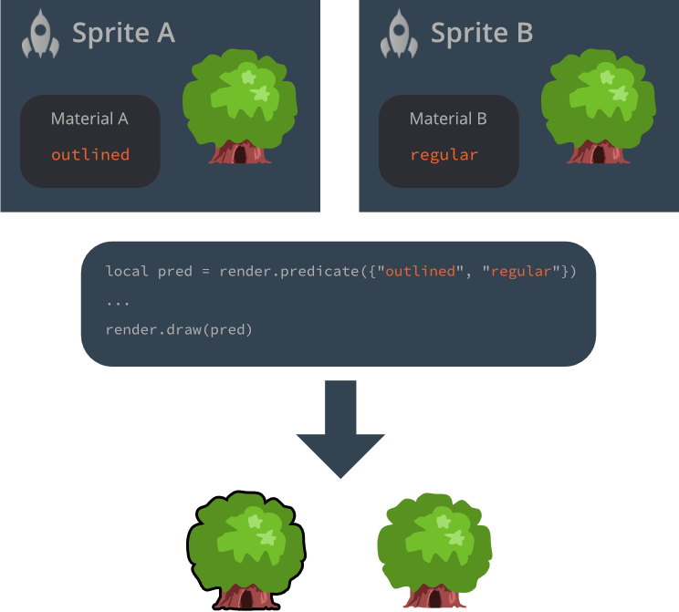

# Рендер пайплайн

Каждый объект, отображаемый на экране движком: спрайты, модели, тайлы, частицы или GUI-ноды, отрисовываются рендерером (визуализатором). Сердцем любого рендерера является рендер-скрипт, который управляет конвейером рендеринга. По-умолчанию, каждый 2D объект отрисовывается с правильной битовой картой с заданным смешиванием и с правильной Z глубиной --- таким образом вам возможно даже не нужно задумываться о рендеринге помимо упорядочивания и простого смешивания. Для большинства 2D игр, конвейер по-умолчанию вполне хорошо работает, но ваша игра может иметь особые требования. Если это ваш случай, Defold позволяет вам писать индивидуальные рендеринг конвейеры.  

### Рендер пайплайн - Что, где и когда?

Конвейер рендеринга диктует что рендерить, когда это рендерить и также где это следует рендерить. Что рендерить задается [рендер предикатами](#render-predicates). Когда рендерить предикат управляется [рендер скриптом](#the-render-script), а где рендерить предикат управляется [проекцией вида](#default-view-projection).

## Рендер по-умолчанию

Рендер файл содержит ссылку на текущий рендер скрипт, а также пользовательские материалы, которые должны быть доступны в рендер скрипте (применяется вызов [`render.enable_material()`](/ref/render/#render.enable_material))

Сердцем рендеринг конвейера является _рендер скрипт_. Это Lua скрипт с функциями `init()`, `update()` и `on_message()` и в первую очередь он применяется для взаимодействия с нижележащим OpenGL рендеринг API. Рендер скрипту отводится специальное место в жизненном цикле вашей игры. С деталями можно ознакомиться в [Документации по жизненному циклу приложения](/manuals/application-lifecycle).

В папке "Builtins" вашего проекта вы можете найти рендеринг ресурс по-умолчанию ("default.render"), а также рендер скрипт по-умолчанию ("default.render_script").

{srcset="images/render/builtin@2x.png 2x"}

Для настройки пользовательского рендерера:

1. Скопируйте файлы "default.render" и "default.render_script" в место в пределах иерархии вашего проекта. Вы, конечно же, можете создать рендер скрипт с нуля, но хорошей идеей будет начать с копии стандартного скрипта, особенно если вы новичок в Defold и/или рендеринге через OpenGL ES. 

2. Отредактируйте вашу копию файла "default.render" и замените свойство *Script*, чтобы оно ссылалось на вашу копию рендер скрипта.

3. Замените свойство *Render* (в *bootstrap*) в файле настроек "game.project" так, чтобы оно ссылалось на вашу копию файла "default.render".


## Рендер предикаты

Чтобы иметь возможность управлять порядком отрисовки объектов, создаются рендер _предикаты_. Предикат задает, что должно быть отрисовано на основе выборки _тегов_ материала.

Каждый объект, который отрисовывается на экран, обладает прикрепленным материалом, который управляет тем, как объект должен быть отрисован на экране. В материале вы задаете один или больше _тегов_, которые должны быть ассоциированы с этим материалом.

В вашем рендер скрипте вы далее можете создать *рендер предикат* и задать, какие теги должны принадлежать этому предикату. Когда вы просите движок отрисовать предикат, каждый объект с материалом, содержащим тег, совпадающий со списком заданным для предиката, будет отрисован.

{srcset="images/render/render_predicate@2x.png 2x"}

Детальное описание работы материалов может быть найдено в [Документации по материалам](/manuals/material).


## Проекция вида по умолчанию

Рендер-скрипт по-умолчанию сконфигурирован использовать ортографическую проекцию подходящую для 2D игр. Он предоставляет 3 разных ортографических проекции: `Stretch` (применяется по-умолчанию), `Fixed Fit` и `Fixed`.

Также вы можете использовать проекцию перспективы, предусмотренную компонентом камеры, подходящую для 3D игр.

Компонент камеры может быть использован как для ортографической, так и перспективной проекций для изменения матрицы вида (по сути, какая часть игрового мира отображается). Узнайте больше о компоненте камеры в [Руководстве по камере](/manuals/camera).

### Stretch проекция

Stretch проекция всегда рисует область вашей игры равной заданным в "game.project" размерам, даже когда окно изменяет размер. Если соотношение сторон меняется, это отразится на содержимом игры, которое растянется или вертикально или горизонтально:


*Stretch проекция с исходными размерами окна*


*Stretch проекция с размерами окна растянутыми по горизонтали*

Stretch проекция --- это проекция по-умолчанию, но если вы сменили ее на другую и вам требуется вернуться к ней обратно, вы можете сделать это послав сообщение рендер скрипту:

```lua
msg.post("@render:", "use_stretch_projection", { near = -1, far = 1 })
```

### Fixed fit проекция

Как и stretch проекция, fixed fit проекция всегда отображает область игры равной заданным в "game.project" размерам, но если окно меняет размеры и соотношение сторон меняется, игровое содержимое сохраняет свое изначальное соотношение сторон, а также будет отображено дополнительное содержимое игры, вертикально или горизонтально:


*Fixed fit проекция с исходными размерами окна*


*Fixed fit проекция с окном растянутым горизонтально*


*Fixed fit проекция с окном сжатым до 50% от исходного размера*

Для включения fixed fit проекции, вы посылаете следующее сообщение рендер скрипту:

```lua
msg.post("@render:", "use_fixed_fit_projection", { near = -1, far = 1 })
```

### Fixed проекция

Fixed проекция сохранит исходное соотношение сторон и отрендерит содержимое вашей игры с фиксированным уровнем приближения. Это означает, что если приближение установлено в значение отличное от 100%, проекция покажет либо большую либо меньшую область, чем область игры заданную размерами в "game.project":


*Fixed проекция с приближением в 2 раза*


*Fixed проекция с приближением в 0.5 раз*


*Fixed проекция с приближением выставленным в 2 раза и окном сжатым до 50% от исходного размера*

Для включения fixed проекции, вы посылаете следующее сообщение рендер скрипту:

```lua
msg.post("@render:", "use_fixed_projection", { near = -1, far = 1, zoom = 2 })
```

### Проекция перспективы

Проекция перспективы подходит для трехмерных игр, где игровые объекты рендерятся в перспективе и где размер объектов варьируется в зависимости от расстояния от положения воображаемого глаза/камеры.

Для включения проекции перспективы, предоставляемой компонентом камеры, вы посылаете следующее сообщение рендер скрипту:

```lua
msg.post("@render:", "use_camera_projection")
```


## Системы координат

Когда компоненты рендерятся, обычно обговаривается, в какой системе координат рендерятся эти компоненты. В большинстве игр у вас имеется часть компонентов рисуемых в пространстве мира игры и часть в пространстве экрана.

GUI компоненты и их ноды обычно отрисовываются в пространстве координат экрана, с координатами нижнего левого угла экрана (0,0) и координатами верхнего правого угла экрана (ширина экрана, высота экрана). Пространство системы координат экрана никогда не смещается или каким-либо другим образом не преобразовывается камерой. Таким образом GUI-ноды всегда отрисовываются на экране вне зависимости от того, как рендерится мир. 

Спрайты, тайловые карты и другие компоненты, используемые игровыми объектами, существующими в мире вашей игры обычно рисуются в системе координат мирового пространства. Если вы не делаете никаких модификаций над своим рендер скриптом и не используете никакой компонент камеры для изменения проекции вида, эта система координат будет такой же как система координат экранного пространства, но как только вы добавляете камеру и либо двигаете ее или меняете проекцию вида, две системы координат отклоняются друг от друга. Когда камера движется, нижний левый угол экрана будет смещен из точки (0,0), так что рендерятся другие части мира. Если меняется проекция, координаты будут одновременно преобразованы (то есть смещены из 0, 0) и изменены масштабирующим коэффициентом.


## Рендер скрипт

Ниже представлен код для пользовательского рендер скрипта, который является слегка измененной версией встроенного. 

init()
: Функция `init()` применяется для установления предикатов, вида и цвета очистки. Эти переменные будут использоваться во время непосредственно рендеринга.

  ```lua
  function init(self)
      -- Задаем рендер предикаты. Каждый предикат отрисовывается сам по себе и
      -- это позволяет нам менять состояние OpenGL между отрисовками.
      self.tile_pred = render.predicate({"tile"})
      self.gui_pred = render.predicate({"gui"})
      self.text_pred = render.predicate({"text"})
      self.particle_pred = render.predicate({"particle"})
      self.model_pred = render.predicate({"model"})

      self.clear_color = vmath.vector4(0, 0, 0, 0)
      self.clear_color.x = sys.get_config("render.clear_color_red", 0)
      self.clear_color.y = sys.get_config("render.clear_color_green", 0)
      self.clear_color.z = sys.get_config("render.clear_color_blue", 0)
      self.clear_color.w = sys.get_config("render.clear_color_alpha", 0)

      -- Задаем какую матрицу вида использовать. Если у нас есть объект камеры, он будет
      -- посылать сообщения "set_view_projection" рендер скрипту и мы
      -- можем обновлять матрицу вида значением предоставляемым камерой.
      self.view = vmath.matrix4()
  end
  ```

update()
: Функция `update()` вызывается один раз каждый кадр. Ее назначение --- это производить реальную отрисовку вызывая нижележащие API OpenGL ES (OpenGL Embedded Systems API). Чтобы как следует понять, что происходит в функции `update()`, вам нужно понять как работает OpenGL. Есть множество качественных источников по OpenGL ES. Официальный сайт является неплохой стартовой точкой. Он располагается по адресу https://www.khronos.org/opengles/ 

  Данный пример содержит настройки необходимые для отрисовки 3D моделей. В функции `init()` задан предикат `self.model_pred`. В другом месте был создан материал с тегом "model". В примере присутствуют также компоненты моделей, которые используют этот материал:

  ```lua
  function update(self)
      -- Устанавливаем маску глубины, которая позволяет нам изменять буфер глубины. 
      render.set_depth_mask(true)

      -- Очищаем цветовой буффер цветом очистки и устанавливаем буфер глубины в 1.0.
      -- Нормальные значения глубины находятся в диапазоне от 0,0 (близко) до 1,0 (далеко), поэтому максимизирование значений 
      -- через буфер означает, что каждый пиксель, которые вы рисуете будет ближе чем 1.0 и поэтому
      -- он будет отрисован должным образом и на его основе будет проводиться тестирование глубины
      render.clear({[render.BUFFER_COLOR_BIT] = self.clear_color, [render.BUFFER_DEPTH_BIT] = 1, [  render.BUFFER_STENCIL_BIT] = 0})  

      -- Выставляем область просмотра в размеры окна.
      render.set_viewport(0, 0, render.get_window_width(), render.get_window_height())

      -- Устанавливаем отображение в сохраненное значение (может быть установлено с помощью объекта камеры) 
      render.set_view(self.view)

      -- Рендерим 2D пространство
      render.set_depth_mask(false)
      render.disable_state(render.STATE_DEPTH_TEST)
      render.disable_state(render.STATE_STENCIL_TEST)
      render.enable_state(render.STATE_BLEND)
      render.set_blend_func(render.BLEND_SRC_ALPHA, render.BLEND_ONE_MINUS_SRC_ALPHA)
      render.disable_state(render.STATE_CULL_FACE)

      -- Выставляем проекцию в ортографическую и рендерим только для Z-глубины в пределах от -200 до 200
      render.set_projection(vmath.matrix4_orthographic(0, render.get_width(), 0,   render.get_height(), -200, 200))  

      render.draw(self.tile_pred)
      render.draw(self.particle_pred)

      -- Рендерим 3D пространство, но по-прежнему ортографически
      -- Должны быть включены отбраковка граней и проверка глубины 
      render.enable_state(render.STATE_CULL_FACE)
      render.enable_state(render.STATE_DEPTH_TEST)
      render.set_depth_mask(true)
      render.draw(self.model_pred)
      render.draw_debug3d()

      -- Последним в очереди рендерим GUI
      render.set_view(vmath.matrix4())
      render.set_projection(vmath.matrix4_orthographic(0, render.get_window_width(), 0,   render.get_window_height(), -1, 1))  

      render.enable_state(render.STATE_STENCIL_TEST)
      render.draw(self.gui_pred)
      render.draw(self.text_pred)
      render.disable_state(render.STATE_STENCIL_TEST)

      render.set_depth_mask(false)
      render.draw_debug2d()
  end
  ```

Пока что данный скрипт простой и понятный. Каждый кадр он отрисовывает в одинаковой манере. Однако, иногда хочется иметь возможность внедрить состояние в рендер скрипт и производить разные операции в зависимости от состояния. Так же иногда хочется общаться с рендер скриптом из других частей кода игры. 

on_message()
: Рендер скрипт может определить функцию `on_message()` и получать сообщения из других частей вашей игры. Типовой сценарий, где внешний компонент посылает информацию рендер скрипту --- это _камера_. Компонент камеры, который захватил фокус, будет автоматически в каждом кадре посылать свой вид и проекцию рендер скрипту. Это сообщение называется `"set_view_projection"`:

  ```lua
  function on_message(self, message_id, message)
      if message_id == hash("clear_color") then
          -- Ктото послал нам новый цвет очистки для использования.
          self.clear_color = message.color
      elseif message_id == hash("set_view_projection") then
          -- Компонент камеры, завладевший фокусом будет посылать сообщения set_view_projection
          -- в сокет @render. Мы можем использовать информацию о камере
          -- для выставления отображения (и возможно проекции) для рендеринга.
          -- Сейчас мы рендерим ортографически, поэтому здесь нет нужды в проекции камеры.
          -- Currently, we're rendering orthogonally so there's
          -- no need for camera
          self.view = message.view
      end
  end
  ```

  Однако, любой скрипт или GUI скрипт может посылать сообщения рендер скрипту через специальный сокет `@render`:

  ```lua
  -- Поменять цвет очистки.
  msg.post("@render:", "clear_color", { color = vmath.vector4(0.3, 0.4, 0.5, 0) })
  ```

## Системные сообщения

`"set_view_projection"`
: Это сообщение посылается компонентами камеры, которые захватили фокусом камеры.

`"window_resized"`
: Движок пошлет это сообщение по изменению размеров окна. Вы можете прослушивать это сообщение для изменения рендеринга когда целевое окно меняет размеры. На десктопе это означает, что реальные размеры игрового окна были изменены, а на мобильных устройствах это сообщение посылается каждый раз, когда происходит смена ориентации.

  ```lua
  function on_message(self, message_id, message)
    if message_id == hash("window_resized") then
      -- Были изменены размеры окна. message.width и message.height содержат новые размеры.
      ...
    end
  end
  ```

`"draw_line"`
: Нарисовать отладочную линию. Используется для визуализации проекционных лучей, векторов и много другого. Линии рисуются с помощью вызова `render.draw_debug3d()`.

  ```lua
  -- нарисовать линию
  local p1 = vmath.vector3(0, 0, 0)
  local p2 = vmath.vector3(1000, 1000, 0)
  local col = vmath.vector4(1, 1, 1, 1)
  msg.post("@render:", "draw_line", { start_point = p1, end_point = p2, color = col } )  
  ```

`"draw_text"`
: Отрисовать отладочный текст. Используется для печати отладочной информации. Текст отрисовывается встроенным шрифтом "system_font". Системный шрифт имеет материал с тегом "text" и рендерится с другим текстом в рендер скрипте по-умолчанию.

  ```lua
  -- отрисовать текстовое сообщение
  local pos = vmath.vector3(500, 500, 0)
  msg.post("@render:", "draw_text", { text = "Hello world!", position = pos })  
  ```

Визуальный профайлер, доступный через посылку сообщения `"toggle_profile"` в сокет `@system`, не является частью скриптуемого рендерера. Он отрисовывается отдельно от вашего рендер скрипта.  


## Вызовы отрисовки и пакетирование

Вызовы отрисовки (draw call) это термин, применяемый для описания процесса настройки GPU для отрисовки объекта на экран, используя текстуру и материал с опциональными дополнительными настройками. Обычно этот процесс ресурсоемок и рекомендуется обходиться как можно меньшим количеством вызовов отрисовки. Вы можете измерить число вызовов отрисовки и время, которое уходит на их рендеринг используя [встроенный профилировщик](/manuals/profiling/).

Defold попытается собрать операцию рендеринга единым пакетом, чтобы снизить число вызовов отрисовки согласно набору правил определенных ниже. Правила отличаются для GUI компонентов и всех остальных компонентов другого типа.


### Правила пакетирования для не-GUI компонентов

Рендеринг делается на основе z-упорядочивания, от низшего к высшему. Движок начнет с сортировки списка того, что нужно отрисовать и пройдется от низшего к высшему z-значению. Каждый объект в списке будет сгруппирован в общий вызов отрисовки с предыдущим объектом, если будут выполнены следующие условия:

* Принадлежит к той же прокси коллекции
* Имеет такой же тип компонента (спрайт, частица, тайловая карта и т.д.)
* Использует ту же текстуру (атлас или тайловый источник)
* Имеет такой же материал
* Имеет такие же шейдерные константы (например оттенок)

Это означает, что если два спрайтовых компонента в одной и той же прокси коллекции имеют смежные или такие же z-значения (и потому идут один за другим в сортированном списке), используют общую текстуру, материал и константы, они будут сгруппированы в один общий вызов отрисовки.


### Правила пакетирования для GUI компонентов

Рендеринг нод в GUI компоненте производится от верха к низу списка нод. Каждая нода в списке будет сгруппирована в один общий вызов отрисовки с предыдущей нодой, если будут выполнены следующие условия:

* Имеет такой же тип компонента (коробка, текст, круговая диаграмма и т.д.)
* Использует ту же текстуру (атлас или тайловый источник)
* Имеет такой же режим смешивания.
* Имеет такой же шрифт (актуально только для текстовых нод)
* Имеет такие же трафаретные (stencil) настройки

::: sidenote
Рендеринг нод производится покомпонентно. Это означает, что ноды из разных GUI компонентов не будут объединены в пакет отрисовки.
:::

Возможность размещать ноды в иерархии упрощает группировку нод в управляемые единицы. Но иерархии могут весьма эффектно разбить пакетный рендеринг, если вы смешиваете разные типы нод. Есть возможность более эффективно пакетировать GUI-ноды, в то же время поддерживая иерархии, используя GUI слои. Вы можете почитать о GUI слоях и как они влияют на вызовы отрисовки в [руководстве по GUI](/manuals/gui#layers-and-draw-calls).
