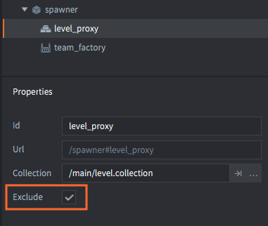

# Управление ресурсами

При разработке небольшой игры ограничения целевой платформы (объем потребляемой памяти, размер бандла, вычислительная мощность и расход батареи), вероятно, не вызовут никаких проблем. Однако при создании больших игр, потребление памяти, скорее всего, будет одним из самых больших ограничений, особенно на портативных устройствах. Опытная команда будет тщательно рассчитывать расход ресурсов с учетом ограничений платформы. Defold предоставляет ряд инструментов, помогающих управлять памятью и размером бандла. В данном руководстве дается обзор этих инструментов.

## Статичное дерево ресурсов

Создавая игру в Defold, вы статически декларируете дерево ресурсов. Каждая отдельная часть игры связана с этим деревом, начиная с коллекции начальной загрузки (обычно называемой "main.collection"). Дерево ресурсов следует за каждой ссылкой и включает все ресурсы, связанные с этими ссылками:

- Данные об игровых объектах и компонентах (атласы, звуки и т.д.).
- Прототипы фабрик (игровые объекты и коллекции).
- Ссылки на компоненты прокси-коллекций (коллекции).
– Пользовательские ресурсы, объявленные в *game.project*.

::: sidenote
В Defold также существует понятие *bundle resources* (ресурсы бандла). Эти ресурсы включаются в приложение при сборке, но не являются частью дерева ресурсов. Ресурсы бандла могут включать в себя, например, платформенно-зависимые вспомогательные файлы или внешние файлы, [загружаемые с файловой системы](/manuals/file-access/#how-to-access-files-bundled-with-the-application) и используемые в игре (например, звуковые банки FMOD).
:::

При сборке игры в *бандл* будет включено только то, что находится в дереве ресурсов. Все, на что нет ссылок в дереве, будет исключено. Нет необходимости вручную выбирать, что включить или исключить из бандла.

Когда игра *запускается*, движок стартует с корня загрузки дерева и извлекает ресурсы в память:

- Любая коллекция на которую есть ссылка и ее содержимое.
- Данные об игровых объектах и компонентах.
- Прототипы фабрик (игровые объекты и коллекции).

Однако движок в процессе выполнения не будет выполнять автоматическую загрузку следующих типов ресурсов, на которые имеются ссылки:

- Коллекции игровых пространств, на которые есть ссылки в прокси коллекциях. Игровые пространства относительно велики, поэтому их загрузка и выгрузка должна выполняться вручную в коде. За подробностями обращайтесь к [руководству по прокси-коллекциям](/manuals/collection-proxy).
- Файлы, добавленные с помощью настройки *Custom Resources* в *game.project*. Эти файлы загружаются вручную с помощью функции [sys.load_resource()](/ref/sys/#sys.load_resource).

Используемый по умолчанию способ, которым Defold собирает и загружает ресурсы, может быть изменен для обеспечения более тонкого контроля над тем, как и когда ресурсы попадают в память.

## Динамическая загрузка ресурсов фабрик

Ресурсы, на которые ссылаются фабрики, обычно загружаются в память при загрузке этого компонента. Ресурсы готовы к порождению в игре, как только фабрика появляется в среде выполнения. Чтобы изменить поведение по умолчанию и отложить загрузку ресурсов фабрики, достаточно отметить флажок *Load Dynamically* в свойствах этой фабрики.

Если эта опция установлена, движок все равно включит в бандл ресурсы по ссылкам, но автоматически загружать ресурсы фабрики не будет. Вместо этого есть два варианта на выбор:

1. Вызвать [`factory.create()`](/ref/factory/#factory.create) или [`collectionfactory.create()`](/ref/collectionfactory/#collectionfactory.create), если необходимо породить объекты. При этом ресурсы будут загружаться синхронно, а затем порождаться новые экземпляры.
2. Вызвать [`factory.load()`](/ref/factory/#factory.load) или[`collectionfactory.load()`](/ref/collectionfactory/#collectionfactory.load) для асинхронной загрузки ресурсов. Когда ресурсы будут готовы к порождению, будет получен обратный вызов.

См. руководства по [фабрикам](/manuals/factory) и [фабрикам коллекций](/manuals/collection-factory) чтобы подробнее узнать о том, как это работает.

## Выгрузка динамически загруженных ресурсов

Defold ведет подсчет ссылок на все ресурсы. Если счетчик ресурсов достигает нуля, это означает, что на него больше ничто не ссылается. После этого ресурс автоматически выгружается из памяти. Например, если удалить все объекты, порожденные фабрикой, а также удалить объект, содержащий фабрику, то ресурсы, на которые ранее ссылалась фабрика, будут выгружены из памяти.

Для фабрик с отмеченной опцией *Load Dynamically* можно вызвать функцию [`factory.unload()`](/ref/factory/#factory.unload) или [`collectionfactory.unload()`](/ref/collectionfactory/#collectionfactory.unload). Этот вызов удаляет ссылку фабрики на ресурс. Если на ресурс больше ничто не ссылается (например, удалены все порожденные объекты), этот ресурс будет выгружен из памяти.

## Исключение ресурсов из бандла

Посредством прокси-коллекций из процесса сборки бандла можно исключить все ресурсы, на которые ссылается компонент. Это целесообразно, если требуется свести размер пакета к минимуму. Например, при запуске веб-игры на платформе HTML5 браузер загружает весь бандл до начала выполнения игры.

Если для прокси-коллекцию отметить опцию *Exclude*, то ресурс, на который ссылается эта прокси-коллекция, будет исключен из бандла. Вместо этого можно хранить исключенные коллекции в выбранном облачном хранилище. [Руководство по Live-обновлению](/manuals/live-update/) описывает особенности работы данной возможности.
