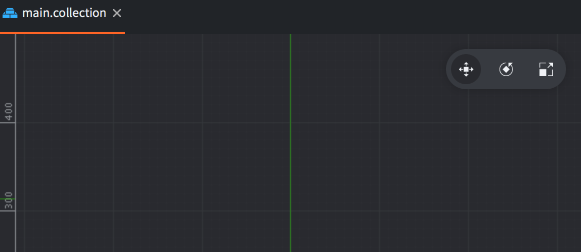

# Редактор сцены Defold

**Редактор сцены** — это визуальный редактор для создания и редактирования сцен, таких как коллекции, игровые объекты и другие визуальные ассеты.

По умолчанию многие визуальные сцены открываются в **2D-ортографическом** виде. Для работы в 3D можно переключиться на 3D-ориентацию, включить 3D-плоскость сетки и использовать **перспективную** камеру.

## Открытие редактора сцены

Чтобы открыть редактор сцены, дважды щёлкните по визуальному ресурсу в панели *Assets*, например:

- **Структура сцены** — коллекции (`.collection`), игровые объекты (`.go`)
- **2D-ассеты** — атласы (`.atlas`), тайлмапы (`.tilemap`), спрайты (`.sprite`), источники тайлов (`.tilesource`)
- **3D-ассеты** — модели (`.model`, `.glb`, `.gltf`)
- **UI** — GUI-сцены (`.gui`)
- **Эффекты** — эффекты частиц (`.particlefx`)
- И другие

## Навигация по виду сцены (управление камерой)

Камерой редактора сцены можно управлять мышью и клавиатурой. Доступные действия зависят от того, используете ли вы стандартную навигацию камеры или **режим свободной камеры**.

### Стандартная навигация (во всех визуальных редакторах)

Эти действия доступны в визуальных редакторах:

- **Панорамирование**
  - <kbd>Alt</kbd>/<kbd>⌥ Option</kbd> + <kbd>левая кнопка мыши</kbd>
- **Масштабирование**
  - <kbd>Колесо мыши</kbd>, или
  - <kbd>Ctrl</kbd>/<kbd>^ Control</kbd> + <kbd>Alt</kbd>/<kbd>⌥ Option</kbd> + <kbd>левая кнопка мыши</kbd>
- **Вращение/орбита вокруг выделения (3D)**
  - <kbd>Ctrl</kbd>/<kbd>^ Control</kbd> + <kbd>левая кнопка мыши</kbd>

Также можно использовать **Frame Selection** (<kbd>F</kbd>), чтобы сфокусировать камеру на текущем выделении.

## 2D- и 3D-ориентация сцены

Вид сцены можно использовать как в 2D-, так и в 3D-процессах работы:

- В **2D** обычно используется ортографический вид с 2D-ориентированной сеткой.
- В **3D** обычно:
  - выравнивают вид в 3D-ориентацию,
  - используют **перспективную** камеру,
  - выбирают подходящую плоскость сетки (часто **Y** для "земли").

Эти функции доступны через панель инструментов и меню **View**.

## Обзор панели инструментов

В правом верхнем углу вида сцены находится панель инструментов с часто используемыми инструментами и настройками вида (слева направо):

- **Инструмент перемещения** (<kbd>W</kbd>)
- **Инструмент вращения** (<kbd>E</kbd>)
- **Инструмент масштабирования** (<kbd>R</kbd>)
- **Настройки сетки** (`▦`)
- **Выровнять/переориентировать камеру 2D/3D** (`2D`) — переключает 2D- и 3D-ориентацию (клавиша <kbd>.</kbd>)
- **Перспективная/ортографическая камера**
- **Фильтры видимости** (`👁`)

## Выделение и манипулирование объектами

### Выделение объектов

Щёлкните <kbd>левой кнопкой мыши</kbd> по объекту в главном окне, чтобы выделить его. Прямоугольник (или кубоид) вокруг объекта в виде редактора подсветится бирюзовым цветом, показывая, какой элемент выбран. Выделенный объект также подсвечивается в панели `Outline`, как на изображении выше.

  Можно также выделять объекты так:

  - <kbd>Левый клик мыши</kbd> и <kbd>перетаскивание</kbd>, чтобы выделить все объекты внутри области выделения.
  - <kbd>Левый клик мыши</kbd> по объектам в `Outline`; удерживайте <kbd>⇧ Shift</kbd>, чтобы расширить выделение, или <kbd>Ctrl</kbd>/<kbd>⌘ Cmd</kbd>, чтобы выделить или снять выделение с нажатого элемента.

#### Инструмент перемещения

{.left}

Чтобы перемещать объекты, используйте *Move Tool*. Его можно выбрать на панели инструментов в правом верхнем углу редактора сцены или включить клавишей <kbd>W</kbd>.

{.inline}{.inline}

Гизмо изменится и покажет набор манипуляторов — квадраты и стрелки (выбранный манипулятор становится оранжевым), которые можно <kbd>перетаскивать</kbd> для перемещения:

- один центральный бирюзовый квадрат перемещает объект только в плоскости экрана;
- 3 красные, зелёные и синие стрелки вдоль осей перемещают объект только вдоль соответствующей оси X, Y или Z;
- 3 красных, зелёных и синих квадратных маркера (с контуром и прозрачной заливкой) перемещают объект только в соответствующей плоскости, например X-Y (синий), а также X-Z (зелёный) и Y-Z (красный), которые видны при вращении камеры в 3D.

#### Инструмент вращения

{.left}

Чтобы вращать объекты, используйте *Rotate Tool*, выбрав его на панели инструментов или нажав <kbd>E</kbd>.

{.inline}{.inline}

Этот инструмент состоит из четырёх круговых манипуляторов (выбранный манипулятор становится оранжевым), которые можно <kbd>перетаскивать</kbd> для вращения:

- один бирюзовый (внешний, самый большой) манипулятор вращает объект в плоскости экрана;
- 3 меньших красных, зелёных и синих круговых манипулятора позволяют вращать объект отдельно вокруг осей X, Y и Z. В 2D-ортографическом виде два из них перпендикулярны осям X и Y, поэтому круги выглядят как две линии, пересекающие объект.

#### Инструмент масштабирования

{.left}

Чтобы масштабировать объекты, используйте *Scale Tool*, выбрав его на панели инструментов или нажав <kbd>R</kbd>.

{.inline}{.inline}

Этот инструмент состоит из набора квадратных/кубических манипуляторов (выбранный манипулятор становится оранжевым), которые можно <kbd>перетаскивать</kbd> для масштабирования:

- один бирюзовый куб в центре равномерно масштабирует объект по всем осям (включая Z);
- 3 красных, синих и зелёных кубических манипулятора масштабируют объект вдоль соответствующих осей X, Y и Z;
- 3 красных, зелёных и синих квадратных манипулятора (с контуром и прозрачной заливкой) масштабируют объект отдельно в плоскостях X-Y, X-Z или Y-Z.

### Фильтры видимости

Нажмите на **значок глаза** (`👁`) на панели инструментов, чтобы переключать видимость различных типов компонентов, а также рамок и направляющих линий (`Component Guides`, сочетание клавиш <kbd>Ctrl</kbd> + <kbd>H</kbd> в Windows/Linux или <kbd>^ Ctrl</kbd> + <kbd>⌘ Cmd</kbd> + <kbd>H</kbd> на Mac).

## Настройки сетки

Сетку можно настроить под свой процесс работы (это особенно полезно в 3D). Нажмите кнопку **Grid Settings** (`▦`), чтобы открыть всплывающее окно настроек сетки.

Доступные настройки:

- **Grid size (X/Y/Z)**
  Задаёт расстояние между линиями сетки вдоль каждой оси. Используйте меньшие значения для точного размещения небольших объектов или большие значения для более общего обзора.
- **Active plane (X/Y/Z)**
  Выбирает плоскость, в которой отображается сетка. В 2D-процессах работы это обычно **Z** (стандартная плоскость X-Y). В 3D-процессах работы часто используется **Y**, чтобы обозначить поверхность земли/пола.
- **Grid color**
  Задаёт цвет линий сетки. Это полезно для контраста с разными фонами сцены.
- **Grid opacity**
  Управляет прозрачностью линий сетки. Меньшие значения делают сетку менее заметной, но она всё равно остаётся ориентиром.
- Кнопка **Reset to Defaults**
  Возвращает все настройки сетки к исходным значениям.

## Тип камеры: перспективная и ортографическая

Редактор сцены поддерживает оба варианта:

- **Ортографическая** камера (часто используется в 2D-процессах работы)
- **Перспективная** камера (часто используется в 3D-процессах работы)

Используйте переключатель камеры на панели инструментов, чтобы сменить тип камеры. В 3D-сценах навигация с перспективной камерой обычно ощущается естественнее.

## Режим свободной камеры

Для быстрой 3D-навигации редактор сцены предоставляет **режим свободной камеры** — камеру от первого лица в стиле FPS.

### Включение режима свободной камеры

- Удерживайте <kbd>правую кнопку мыши</kbd> — режим свободной камеры активен, пока кнопка удерживается
- <kbd>Shift</kbd> + <kbd>`</kbd> (обратный апостроф) — включает режим свободной камеры как переключатель, оставляя его активным после отпускания клавиш

::: sidenote
На некоторых раскладках клавиатуры (например, шведской) клавиша обратного апострофа является "мёртвой" клавишей и может не сработать как ожидается. Вы можете переназначить это сочетание в `File ▸ Preferences ▸ Keys` и задать сочетание для `Scene -> Free Camera -> Activate`
:::

Когда режим свободной камеры активен, вид сцены подсвечивается линией по краям.

### Выход из режима свободной камеры

- Отпустите <kbd>правую кнопку мыши</kbd> (если режим был активирован удержанием), или
- нажмите и отпустите <kbd>левую кнопку мыши</kbd> или <kbd>правую кнопку мыши</kbd>, либо нажмите <kbd>Esc</kbd>, если режим свободной камеры был включён как переключатель.

### Обзор мышью (mouse look)

Пока режим свободной камеры активен, эти действия управляют движением камеры вместо инструментов редактора:

- Перемещайте мышь, чтобы управлять **yaw** (влево/вправо) и **pitch** (вверх/вниз)
- Pitch ограничен, чтобы камера не переворачивалась

Также можно включить инверсию оси Y (см. раздел **Всплывающее окно настроек камеры** ниже).

### Перемещение

Пока режим свободной камеры активен:

- <kbd>W</kbd> — вперёд
- <kbd>S</kbd> — назад
- <kbd>A</kbd> — влево
- <kbd>D</kbd> — вправо
- <kbd>E</kbd> — вверх
- <kbd>Q</kbd> — вниз

::: sidenote
Все клавиши перемещения можно переназначить в `File ▸ Preferences ▸ Keys`. Затем выполните поиск по `Scene -> Free Camera`
:::

Модификаторы скорости:

- Удерживайте <kbd>Shift</kbd> — двигаться быстрее
- Удерживайте <kbd>Alt</kbd>/<kbd>⌥ Option</kbd> — двигаться медленнее / точнее

### Режим ходьбы (необязательно)

Режим свободной камеры поддерживает **режим ходьбы**.

Когда он включён:
- движение вверх/вниз ограничивается так, чтобы оно больше напоминало движение от первого лица по поверхности;
- это полезно при изучении уровня, когда нужно согласованное "заземлённое" движение.

## Всплывающее окно настроек камеры

У кнопки перспективной камеры на панели инструментов есть всплывающее окно с настройками камеры.

Окно содержит:

- **Move Speed**
  Настраивает скорость перемещения свободной камеры.

- **Look Sensitivity**
  Настраивает скорость поворота камеры в ответ на движение мыши.

- **Invert Y**
  Инвертирует вертикальное движение обзора мышью.

- **Walking Mode**
  Ограничивает движение для навигации, похожей на движение по поверхности.

- **Reset to Defaults**
  Восстанавливает настройки камеры по умолчанию.
