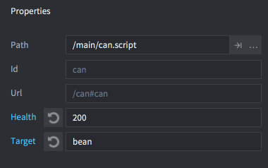
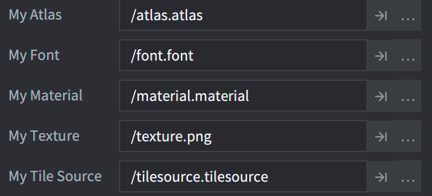

# Script properties

Script properties provide a simple and powerful way of defining and exposing custom properties for a specific game object instance. Script properties can be edited on specific instances directly in the editor and their settings can be used in code to alter the behavior of a game object. There are many cases where script properties are very useful:

* When you want to override values for specific instances in the editor, and thereby increase script re-usability.
* When you want to spawn a game object with initial values.
* When you want to animate the values of a property.
* When you want to access state data in one script from another. (Note that if you access properties frequently between objects, it may be better to move the data to a shared storage.)

Common use cases are to set the health or speed of a specific enemy AI, the tint color of a pickup object, the atlas of a sprite, or what message a button object should send when pressed---and/or where to send it.

## Defining a script property

Script properties are added to a script component by defining them with the `go.property()` special function. The function has to be used at the top level---outside any callback-functions like `init()` and `update()`. The default value provided for the property governs the type of the property: number, boolean, hash, `msg.url`, `vmath.vector3`, `vmath.vector4`, `vmath.quaternion` and `resource` (see below).

```lua
-- Define script properties for health and an attack target
go.property("health", 100)
go.property("target", msg.url())

function init(self)
  -- store initial position of target.
  -- self.target is an url referencing another objects.
  self.target_pos = go.get_position(self.target)
  ...
end

function on_message(self, message_id, message, sender)
  if message_id == hash("take_damage") then
    -- decrease the health property
    self.health = self.health - message.damage
    if self.health <= 0 then
      go.delete()
    end
  end
end
```

Any script component instance created from this script can then set the property values.

{srcset="images/script-properties/component@2x.png 2x"}

 Select the script component in the *Outline* view in the editor and the properties appear in the *Properties* view allowing you to edit them:

{srcset="images/script-properties/properties@2x.png 2x"}

Any property that is overridden with a new instance specific value is marked blue. Click the reset button by the property name to revert the value to the default (as set in the script).

## Accessing script properties

Any defined script property is available as a stored member in `self`, the script instance reference:

```lua
-- my_script.script
go.property("my_property", 1)

function update(self, dt)
  -- Read and write the property
  if self.my_property == 1 then
      self.my_property = 3
  end
end
```

User-defined script properties can also be accessed through the getting, setting and animation functions, the same way as any other property:

```lua
-- another.script

-- increase "my_property" in "myobject#script" by 1
local val = go.get("myobject#my_script", "my_property")
go.set("myobject#my_script", "my_property", val + 1)

-- animate "my_property" in "myobject#my_script"
go.animate("myobject#my_script", "my_property", go.PLAYBACK_LOOP_PINGPONG, 100, go.EASING_LINEAR, 2.0)
```

## Factory created objects

If you use a factory to create the game object, it is possible to set script properties at creation time:

```lua
local props = { health = 50, target = msg.url("player") }
factory.create("#can_factory", nil, nil, props)
```

When spawning a hierarchy of game objects through `collectionfactory.create()` you need to pair object id's with property tables. These are put together in a table and passed to the `create()` function:

```lua
local props = {}
props[hash("/can1")] = { health = 150 }
props[hash("/can2")] = { health = 250, target = msg.url("player") }
props[hash("/can3")] = { health = 200 }

local ids = collectionfactory.create("#cangang_factory", nil, nil, props)
```

The property values provided via `factory.create()` and `collectionfactory.create()` will override any value set in the prototype file as well as the default values in the script.

If several script components attached to a game object defines the same property, each component will get initialized with the value provided to `factory.create()` or `collectionfactory.create()`.


## Resource properties

Resource properties are defined just like the script properties for the basic data types:

```lua
go.property("my_atlas", resource.atlas("/atlas.atlas"))
go.property("my_font", resource.font("/font.font"))
go.property("my_material", resource.material("/material.material"))
go.property("my_texture", resource.texture("/texture.png"))
go.property("my_tile_source", resource.tile_source("/tilesource.tilesource"))
```

When a resource property is defined it shows up in the *Properties* view as any other script property, but as a file/resource browser field:



You access and use the resource properties using `go.get()` or via the `self` script instance reference and using `go.set()`:

```lua
function init(self)
  go.set("#sprite", "image", self.my_atlas)
  go.set("#label", "font", self.my_font)
  go.set("#sprite", "material", self.my_material)
  go.set("#model", "texture0", self.my_texture)
  go.set("#tilemap", "tile_source", self.my_tile_source)
end
```
