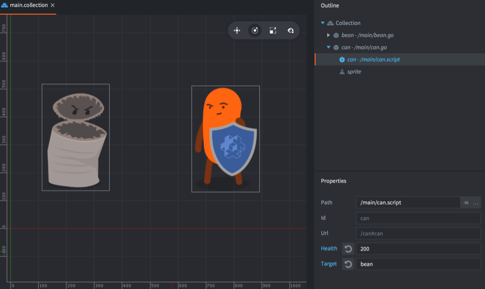

# Свойства компонента Script

Свойства скрипта обеспечивают простой и эффективный способ определения и предоставления пользовательских свойств для конкретного экземпляра игрового объекта. Свойства скрипта можно редактировать для конкретных экземпляров непосредственно в редакторе, а их настройки можно использовать в коде для изменения поведения игрового объекта. Существует множество случаев, когда свойства сценария оказываются крайне полезными:

* Когда необходимо переопределить значения для определенных экземпляров в редакторе и тем самым повысить возможность повторного использования сценария.
* Когда необходимо породить игровой объект с начальными значениями.
* Когда необходимо анимировать значения свойства.
* Когда необходимо получить доступ к данным состояния в одном сценарии из другого. (Следует отметить, что при частом обращении к свойствам между объектами, возможно лучше перенести данные в общее хранилище.)

Распространенными случаями использования являются установка здоровья или скорости определенного вражеского AI, цвета оттенка pickup объекта, атласа спрайта или сообщения, которое объект-кнопка должен отправить при нажатии, и/или куда его отправить.

## Определение свойства скрипта

Свойства скрипта добавляются к компоненту Script путем их определения с помощью специальной функции `go.property()`. Эта функция должна использоваться на верхнем уровне — вне любых функций жизненного цикла, таких как `init()` и `update()`. Значение по умолчанию, указанное для свойства, определяет его тип: `number`, `boolean`, `hash`, `msg.url`, `vmath.vector3`, `vmath.vector4`, `vmath.quaternion` и `resource` (см. ниже).

::: important
Обратите внимание, что разворот значения хеша работает только в отладочной сборке, чтобы облегчить отладку. В релизной сборке строковое значение в обратном виде не существует, поэтому использование `tostring()` для значения `hash` не имеет смысла.
:::


```lua
-- can.script
-- Определить свойства скрипта для здоровья и цели атаки
go.property("health", 100)
go.property("target", msg.url())

function init(self)
  -- Сохранить начальное положение цели.
  -- self.target - это url, ссылающийся на другой объект.
  self.target_pos = go.get_position(self.target)
  ...
end

function on_message(self, message_id, message, sender)
  if message_id == hash("take_damage") then
    -- Уменьшать свойство здоровья
    self.health = self.health - message.damage
    if self.health <= 0 then
      go.delete()
    end
  end
end
```

Любой экземпляр компонента Script, созданный на основе этого скрипта, может затем устанавливать значения свойств.



 Выберите компонент Script в представлении *Outline* в редакторе, и свойства появятся в представлении *Properties*, позволяя вам редактировать их:


Любое свойство, которое переопределяется новым значением для конкретного экземпляра, отмечается синим цветом. Нажмите кнопку сброса рядом с именем свойства, чтобы вернуть значение по умолчанию (установленное в скрипте).


::: important
Свойства скрипта анализируются при сборке проекта. Выражения со значениями не вычисляются. Это означает, что конструкция вроде `go.property("hp", 3+6)` не будет работать, тогда как `go.property("hp", 9)` — будет.
:::

## Доступ к свойствам скрипта

Любое определенное свойство скрипта доступно как сохраненный член в `self` (ссылке на экземпляр скрипта):

```lua
-- my_script.script
go.property("my_property", 1)

function update(self, dt)
  -- Считать и записать свойство
  if self.my_property == 1 then
      self.my_property = 3
  end
end
```

Как и к любому другому свойству, доступ к определяемым пользователем свойствам скрипта можно получить посредством геттеров, сеттеров и функций анимации:

```lua
-- another.script

-- увеличить "my_property" в "myobject#script" на 1
local val = go.get("myobject#my_script", "my_property")
go.set("myobject#my_script", "my_property", val + 1)

-- анимировать "my_property" в "myobject#my_script"
go.animate("myobject#my_script", "my_property", go.PLAYBACK_LOOP_PINGPONG, 100, go.EASING_LINEAR, 2.0)
```

## Объекты, созданные посредством Factory

При использовании фабрики для создания игрового объекта свойства скрипта можно задать во время создания:

```lua
local props = { health = 50, target = msg.url("player") }
local id = factory.create("#can_factory", nil, nil, props)

-- Доступ к свойствам скрипта для объектов созданных с помощью Factory
local url = msg.url(nil, id, "can")
local can_health = go.get(url, "health")
```

При создании иерархии игровых объектов с помощью `collectionfactory.create()` необходимо связать идентификаторы объектов с таблицами свойств. Они собираются в таблицу и передаются в функцию `create()`:

```lua
local props = {}
props[hash("/can1")] = { health = 150 }
props[hash("/can2")] = { health = 250, target = msg.url("player") }
props[hash("/can3")] = { health = 200 }

local ids = collectionfactory.create("#cangang_factory", nil, nil, props)
```

Значения свойств, предоставленные через `factory.create()` и `collectionfactory.create()` будут переопределять любые значения, установленные в файле прототипа, а также значения по умолчанию в скрипте.

Если несколько скриптов, присоединенных к игровому объекту, определяют одно и то же свойство, каждый компонент будет инициализирован значением, предоставленным `factory.create()` или `collectionfactory.create()`.


## Свойства ресурсов

Свойства ресурсов определяются так же, как и свойства скриптов для базовых типов данных:

```lua
go.property("my_atlas", resource.atlas("/atlas.atlas"))
go.property("my_font", resource.font("/font.font"))
go.property("my_material", resource.material("/material.material"))
go.property("my_texture", resource.texture("/texture.png"))
go.property("my_tile_source", resource.tile_source("/tilesource.tilesource"))
```

Когда свойство ресурса определено, оно отображается в представлении *Properties* как любое другое свойство скрипта, но как поле пути файла/ресурса:


Для получения доступа и использования свойств ресурса используется `go.get()` или ссылка на экземпляр скрипта `self` с использованием `go.set()`:

```lua
function init(self)
  go.set("#sprite", "image", self.my_atlas)
  go.set("#label", "font", self.my_font)
  go.set("#sprite", "material", self.my_material)
  go.set("#model", "texture0", self.my_texture)
  go.set("#tilemap", "tile_source", self.my_tile_source)
end
```
