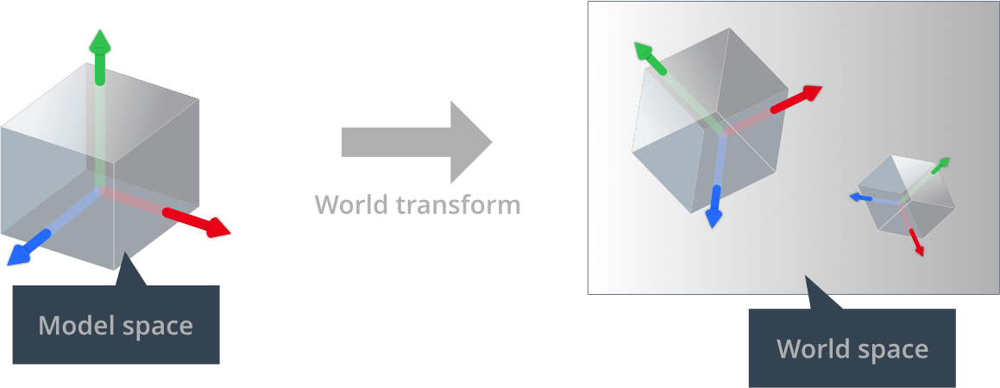
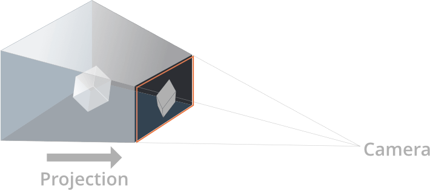
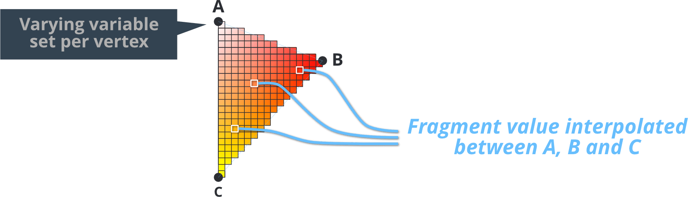
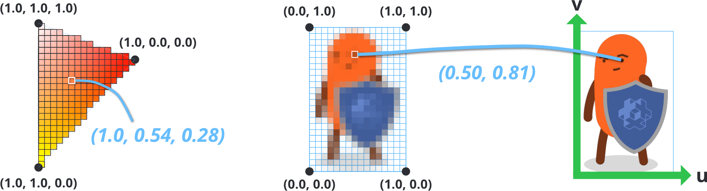
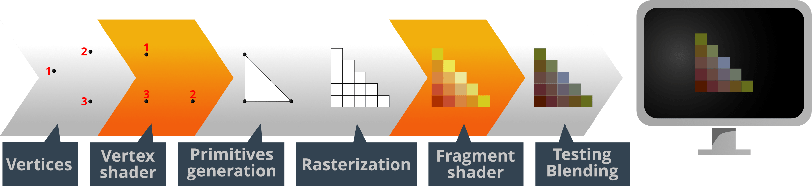
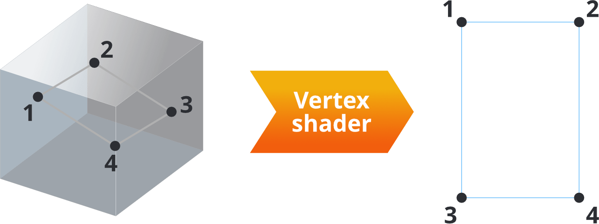
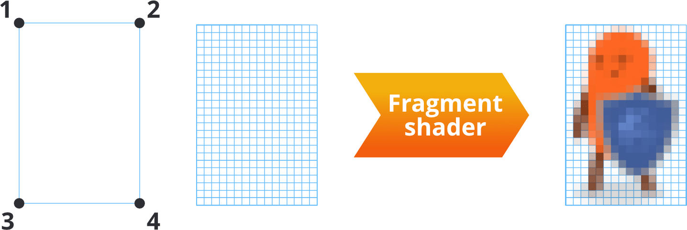

# Шейдеры

Программы шейдеров являются ядром рендеринга графики. Они являются программами написанными на C-подобном языке под названием GLSL (GL Shading Language), которые исполняются аппаратными обеспечением для выполнентя операций либо над 3D данными (вершины) или над пикселями, которые в конечном итоге появляются на экране ("фрагменты"). Шейдеры используются для отрисовки спрайтов, подсветки 3D моделей, создания полноэкранных пост-эффектов и многого другого.

Данное руководство объясняет как рендеринг конвейер Defold-а интерфейсно общается с вершинными и фрагментными шейдерами. Чтобы создать шейдеры для вашего контента, вам также нужно понять концепцию материалов, а также принцип работы рендер конвейера.

* Смотрите [Руководство по рендеру](/manuals/render) с деталями по рендер конвейеру.
* Смотрите [Руководство по материалам](/manuals/material) с деталями по материалам.

Спецификации OpenGL ES 2.0 (OpenGL для встраиваемых систем) и OpenGL ES Shading Language можно найти по адресу  https://www.khronos.org/registry/gles/

Обратите внимание, что на настольных компьютерах можно писать шейдеры задействуя фичи не доступные в OpenGL ES 2.0. Драйвер вашей графической карты может радостно скомпилировать и запустить код шейдера, который не заработает на мобильных устройствах.


## Концепции

Вершинный шейдер
: Вершинный шейдер не может создавать или удалять вершины, только изменять позицию вершины. Вершинные шейдеры по большей части используются для преобразования позиции вершин из 3D пространства мира в 2D пространство экрана.

  Входные данные вершинного шейдера это данные вершин (в форме `attributes`) и константы (`uniforms`). Общие константы это матрицы, необходимые для преобразования и проецирования позиции вершины в экранное пространство.

  Выходные данные вершинного шейдера это вычисленная позиция вершины на экране (`gl_Position`). Также есть возможность передать данные из вершинного шейдера на вход фрагментному шейдеру через `varying` переменные.

Фрагментный шейдер
: После того, как выполнился вершинный шейдер, дальнейшая работа фрагментного шейдера - решить в какой цвет окрасить каждый фрагмент (или пиксель) результирующих примитивов.

  Входные данные фрагментного шейдера это константы (`uniforms`) и также любые `varying` переменные переданные вершинным шейдером.

  Выходные данные фрагментного шейдера это цветовое значение для конкретного фрагмента (`gl_FragColor`).

Матрица мира
: Позиции вершин формы модели хранятся относительно начала координат модели. Это называется "пространство модели". Однако мир игры это "пространство мира", где позиция, ориентация и масштаб каждой вершины выражены относительно начала координат пространства мира. Разделяя их таким образом, игровой движок способен двигать, вращать и масштабировать каждую модель без разрушения изначальных значений вершин, хранимых в компоненте модели.

  Когда модель помещается в игровой мир, локальные координаты вершин модели должны быть переведены в координаты мирового пространства. Этот перевод делается посредством *мировой матрицы преобразования* (*world transform matrix*), которая говорит, какой сдвиг, поворот и масштабирование должны быть применены к вершинам модели, чтобы корректно разместить в системе координат игрового мира. 

  {srcset="images/shader/world_transform@2x.png 2x"}

Матрица вида и проекции
: Чтобы разместить вершины игрового мира на экран, 3D координаты каждой матрицы первым делом переводятся в координаты относительно камеры. Это делается с помощью _матрицы вида_. Затем, вершины проецируются на 2D пространство экрана с помощью _проекционной матрицы_:

  {srcset="images/shader/projection@2x.png 2x"}

Атрибуты
: Значение ассоциированное с отдельной вершиной. Атрибуты передаются шейдеру движком и если вы хотите получить доступ к атрибуту, вы просто объявляете его в программе вашего шейдера. Разные типы компонентов имеют разный набор атрибутов:
  - У спрайта есть `position` и `texcoord0`.
  - У сетки тайлов есть `position` и `texcoord0`.
  - У Spine модели есть `position` и `texcoord0`.
  - У GUI-ноды есть `position`, `textcoord0` и `color`.
  - У ParticleFX есть `position`, `texcoord0` и `color`.
  - У модели есть `position`, `texcoord0` и `normal`.
  - У шрифта есть `position`, `texcoord0`, `face_color`, `outline_color` и `shadow_color`.

Константы
: Константы шейдеров остаются постоянными на протяжении всего вызова отрисовки рендера. Константы добавляются к файлу материала в секции *Constants* и затем объявляются как `uniform` переменные  в программе шейдера. Uniforms Сэмплеры добавляются в секции *Samplers* материала и затем объявляются как `uniform` переменные  в программе шейдера. Матрицы необходимые для выполнения вершинных преобразований в вершинном шейдере доступны в качестве констант:

  - `CONSTANT_TYPE_WORLD` это *матрица мира* которая делает отображение из локальных координат пространства объекта в мировое пространство.
  - `CONSTANT_TYPE_VIEW` это *матрица мира* которая делает отображение из пространства мира в пространство камеры.
  - `CONSTANT_TYPE_PROJECTION`  это *проекционная матрица* которая делает отображение из пространства камеры в пространство экрана.
  - Также доступные пред-умноженные матрицы $world * view$, $view * projection$ и $world * view$.
  - `CONSTANT_TYPE_USER` это константа типа `vec4` которую вы можете использовать по своему усмотрению.

  [Руководство по материалам](/manuals/material) объясняет как задавать константы.

Сэмплеры
: Шейдеры могут объявлять uniform переменные типа *sampler*. Сэмплеры используются для считывания значений из источника изображения:

  - `sampler2D` считывает из изображения двумерной текстуры.
  - `samplerCube` считывает из текстуры кубической развертки, состоящей из 6 изображений.

  Вы можете использовать сэмплер только в функциях поиска текстуры стандартной библиотеки GLSL. [Руководство по материалам](/manuals/material) объясняет как задавать настройки сэмплера.

UV координаты
: 2D-координата соотносится с вершиной и отображается на точку на 2D-текстуре. Таким образом, часть или всю текстуру можно отрисовать на форме, описываемой набором вершин.

  {srcset="images/shader/uv_map@2x.png 2x"}

  UV-карта обычно создается в программе 3D-моделирования и сохраняется в меше. Координаты текстуры для каждой вершины предоставляются вершинному шейдеру в качестве атрибута. Затем varying переменная используется для нахождения UV-координаты для каждого фрагмента, будучи интерполированной на основе значений вершин.

Varying переменные
: Переменные varying типа используются для передачи информации между вершинной и фрагментной фазами.

  1. varying переменная устанавливается в вершинном шейдере для каждой вершины.
  2. Во время растеризации эта переменная интерполируется для каждого фрагмента примитива, который должен будет отрендериться. Расстояние от фрагмента до вершин формы задает интерполированное значение. (?)
  3. Переменная устанавливается для каждого вызова фрагментного шейдера и может быть использована для вычислений по фрагментам. 

  {srcset="images/shader/varying_vertex@2x.png 2x"}

  Например, установка varying переменной в RGB цвет `vec3` типа для каждого угла треугольника приведет к интерполяции цветов по всей форме.  Точно так же установка координат поиска карты текстуры (или * UV-координат *) для каждой вершины в прямоугольнике позволяет фрагментному шейдеру искать значения цвета текстуры для всей области фигуры. (?)

  {srcset="images/shader/varying@2x.png 2x"}


## Процесс рендеринга

Прежде чем оказаться на экране, данные, которые вы создаете для своей игры, проходят ряд шагов: 

{srcset="images/shader/pipeline@2x.png 2x"}

Все визуальные компоненты (спрайты, GUI-ноды, частицы или модели) состоят из вершин, точек в трехмерном мире, которые описывают форму компонента. Хорошая новость здесь в том, что форму можно рассматривать под любым углом и с любого расстояния. Задача программы вершинного шейдера - взять одну вершину и перевести ее в позицию в окне просмотра так, чтобы форма могла появиться на экране. Для фигуры с 4 вершинами программа вершинного шейдера запускается 4 раза, в параллели для всех запусков.

{srcset="images/shader/vertex_shader@2x.png 2x"}

Входными данными программы являются позиция вершины (и другие данные, связанные с вершиной), а выходными данными - новая позиция вершины (`gl_Position`), а также любые `varying` переменные, которые должны быть интерполированы для каждого фрагмента. 

The most simple vertex shader program just sets the position of the output to a zero vertex (which is not very useful):
Самая простая программа вершинного шейдера просто устанавливает позицию на выходе в нулевую вершину (не очень-то и полезный результат): 

```glsl
void main()
{
    gl_Position = vec4(0.0,0.0,0.0,1.0);
}
```

Более сложный пример - встроенный вершинный шейдер спрайтов: 

```glsl
-- sprite.vp
uniform mediump mat4 view_proj;             // [1]

attribute mediump vec4 position;            // [2]
attribute mediump vec2 texcoord0;

varying mediump vec2 var_texcoord0;         // [3]

void main()
{
  gl_Position = view_proj * vec4(position.xyz, 1.0);    // [4]
  var_texcoord0 = texcoord0;                            // [5]
}
```
1. uniform переменная (константа) содержащая умноженные матрицы вида и проекции.
2. Атрибуты вершины спрайта. «позиция» уже трансформирована в мировое пространство. texcoord0 содержит UV-координату вершины.
3. Объявляем выходную varying переменную. Эта переменная будет интерполироваться для каждого фрагмента между значениями, установленными для каждой вершины, и она же будет отправлена во фрагментный шейдер.
4. Выставляем `gl_Position` в выходную позицию текущей вершины в пространстве проекции. Это значение состоит из 4 компонентов: «x», «y», «z» и «w». Компонент `w` используется для вычисления интерполяции с правильной перспективой. Это значение обычно составляет 1,0 для каждой вершины до применения какой-либо матрицы преобразования. 
5. Выставляем varying UV-координату для этой позиции вершины. После растеризации координата будет интерполирована для каждого фрагмента и отправлена во фрагментный шейдер.


После вершинного шейдинга определяется экранная форма компонента: генерируются и растеризуются примитивные формы, что означает, что графическое аппаратное обеспечение разбивает каждую форму на *фрагменты* или пиксели. Затем оно запускает программу фрагментного шейдера, по одному разу для каждого из фрагментов. Для изображения на экране размером 16x24 пикселей программа запускается 384 раза параллельно.

{srcset="images/shader/fragment_shader@2x.png 2x"}

Входные данные программы - это то, что отправляет конвейер рендеринга и вершинный шейдер, обычно это * uv-координаты * фрагмента, цвета оттенка и т. Д. Результатом является окончательный цвет пикселя (`gl_FragColor`).

Самая простая программа фрагментного шейдера просто устанавливает черный цвет для каждого пикселя (опять же, не очень полезная программа) :

```glsl
void main()
{
    gl_FragColor = vec4(0.0,0.0,0.0,1.0);
}
```

Опять же, более сложным примером является встроенный фрагментный шейдер спрайтов:

```glsl
// sprite.fp
varying mediump vec2 var_texcoord0;             // [1]

uniform lowp sampler2D DIFFUSE_TEXTURE;         // [2]
uniform lowp vec4 tint;                         // [3]

void main()
{
  lowp vec4 tint_pm = vec4(tint.xyz * tint.w, tint.w);          // [4]
  lowp vec4 diff = texture2D(DIFFUSE_TEXTURE, var_texcoord0.xy);// [5]
  gl_FragColor = diff * tint_pm;                                // [6]
}
```
1. Объявляем varying переменную координаты текстуры. Значение этой переменной будет интерполировано для каждого фрагмента между значениями установленными для каждой вершины формы.
2. Объявляем uniform `sampler2D` переменную. Сэмплер вместе с интерполированными координатами текстуры используется для поиска текстуры, чтобы спрайт мог быть текстурирован должным образом. Поскольку это спрайт, движок назначит этот сэмплер изображению, заданному в свойстве *Image* спрайта.
3. Константа типа `CONSTANT_TYPE_USER` определена в материале и объявлена типом `uniform`. Её значения используются для задания цветового оттенка спрайту. Значение по-умолчанию - чистый белый цвет.
4. Цветовое значение оттенка пред-умножается со своим значением альфа (прозрачности) поскольку все текстуры во время выполнения уже содержат предварительно умноженную компоненту альфа.
5. "Сэмплируем" (отбираем) текстуру по интерполированной координате и возвращаем сэмплированное значение.
6. `gl_FragColor` выставлен в цвет для фрагмента на вывод: рассеянный свет из текстуры помноженный на значение цвета оттенка.

Полученное значение фрагмента затем проходит тесты. Обычным тестом является *тест глубины*, в котором значение глубины фрагмента сравнивается со значением буфера глубины для тестируемого пикселя. В зависимости от теста, фрагмент может быть отброшен либо в буфер глубины записывается новое значение. Обычно этот тест используется для того, чтобы позволить графике, находящейся ближе к камере, перекрывать графику находящуюся далеко позади. 

Если тест пришел к выводу, что фрагмент должен быть записан в буфер кадра, он будет *смешан* с пиксельными данными, уже присутствующими в буфере. Параметры наложения, которые задаются в рендер скрипте, позволяют различными способами комбинировать исходный цвет (значение, записанное фрагментным шейдером) и целевой цвет (цвет из изображения в буфере кадра). Обычно смешивание используется для включения рендеринга прозрачных объектов.

## Дальнейшее изучение 

- [Shadertoy](https://www.shadertoy.com) содержит огромное количество шейдеров, добавленных пользователями. Это отличный источник вдохновения, где вы можете узнать о различных методах шейдинга. Многие шейдеры, представленные на сайте, могут быть перенесены в Defold с минимальными изменениями. [Туториал по Shadertoy](https://www.defold.com/tutorials/shadertoy/) проходится по этапам преобразования существующего шейдера в Defold. 

- [Grading туториал](https://www.defold.com/tutorials/grading/) показывает, как создать эффект цветокоррекции в полноэкранном режиме, используя текстуры с таблицами поиска цвета для грейдинга (процесса художественной цветокоррекции).

- [The Book of Shaders](https://thebookofshaders.com/00/) научит вас тому, как использовать и встраивать шейдеры в свои проекты, улучшая их производительность и качество графики.
