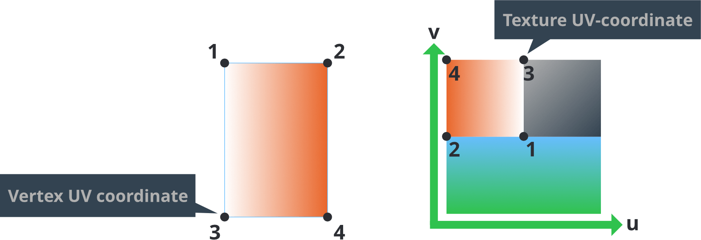

# Шейдеры

Программы шейдеров являются ядром рендеринга графики. Они являются программами написанными на C-подобном языке под названием GLSL (GL Shading Language), которые исполняются аппаратными обеспечением для выполнентя операций либо над 3D данными (вершины) или над пикселями, которые в конечном итоге появляются на экране ("фрагменты"). Шейдеры используются для отрисовки спрайтов, подсветки 3D моделей, создания полноэкранных пост-эффектов и многого другого.

Данное руководство объясняет как рендеринг конвейер Defold-а интерфейсно общается с вершинными и фрагментными шейдерами. Чтобы создать шейдеры для вашего контента, вам также нужно понять концепцию материалов, а также принцип работы рендер конвейера.

* Смотрите [Руководство по рендеру](/manuals/render) с деталями по рендер конвейеру.
* Смотрите [Руководство по материалам](/manuals/material) с деталями по материалам.
* Смотрите [Compute manual](/manuals/compute) с деталями по вычислительным шейдерам.

Спецификации OpenGL ES 2.0 (OpenGL для встраиваемых систем) и OpenGL ES Shading Language можно найти по адресу  https://www.khronos.org/registry/gles/

Обратите внимание, что на настольных компьютерах можно писать шейдеры задействуя фичи не доступные в OpenGL ES 2.0. Драйвер вашей графической карты может радостно скомпилировать и запустить код шейдера, который не заработает на мобильных устройствах.


## Концепции

Вершинный шейдер
: Вершинный шейдер не может создавать или удалять вершины, только изменять позицию вершины. Вершинные шейдеры по большей части используются для преобразования позиции вершин из 3D пространства мира в 2D пространство экрана.

  Входные данные вершинного шейдера это данные вершин (в форме `attributes`) и константы (`uniforms`). Общие константы это матрицы, необходимые для преобразования и проецирования позиции вершины в экранное пространство.

  Выходные данные вершинного шейдера это вычисленная позиция вершины на экране (`gl_Position`). Также есть возможность передать данные из вершинного шейдера на вход фрагментному шейдеру через `varying` переменные.

Фрагментный шейдер
: После того, как выполнился вершинный шейдер, дальнейшая работа фрагментного шейдера --- решить в какой цвет окрасить каждый фрагмент (или пиксель) результирующих примитивов.

  Входные данные фрагментного шейдера это константы (`uniforms`) и также любые `varying` переменные переданные вершинным шейдером.

  Выходные данные фрагментного шейдера это цветовое значение для конкретного фрагмента (`gl_FragColor`).

Вычислительный шейдер
: Вычислительный шейдер — это шейдер общего назначения, который может использоваться для выполнения любых вычислений на GPU. Он не является частью графического конвейера, вычислительные шейдеры выполняются в отдельном контексте исполнения и не зависят от входных данных других шейдеров.

  Входными данными вычислительного шейдера являются буферы констант (`uniforms`), текстурные изображения (`image2D`), сэмплеры (`sampler2D`) и буферы хранения (`buffer`).

  Выход вычислительного шейдера не определяется явно, в отличие от вершинных и фрагментных шейдеров, нет необходимости выдавать конкретный результат. Поскольку вычислительные шейдеры универсальны, программист сам определяет, какой результат должен быть получен.

Матрица мира
: Позиции вершин формы модели хранятся относительно начала координат модели. Это называется "пространство модели". Однако мир игры это "пространство мира", где позиция, ориентация и масштаб каждой вершины выражены относительно начала координат пространства мира. Разделяя их таким образом, игровой движок способен двигать, вращать и масштабировать каждую модель без разрушения изначальных значений вершин, хранимых в компоненте модели.

  Когда модель помещается в игровой мир, локальные координаты вершин модели должны быть переведены в координаты мирового пространства. Этот перевод делается посредством *мировой матрицы преобразования* (*world transform matrix*), которая говорит, какой сдвиг, поворот и масштабирование должны быть применены к вершинам модели, чтобы корректно разместить в системе координат игрового мира. 

  

Матрица вида и проекции
: Чтобы разместить вершины игрового мира на экран, 3D координаты каждой матрицы первым делом переводятся в координаты относительно камеры. Это делается с помощью _матрицы вида_. Затем, вершины проецируются на 2D пространство экрана с помощью _проекционной матрицы_:

  

Атрибуты
: Значение ассоциированное с отдельной вершиной. Атрибуты передаются шейдеру движком и если вы хотите получить доступ к атрибуту, вы просто объявляете его в программе вашего шейдера. Разные типы компонентов имеют разный набор атрибутов:
  - У спрайта есть `position` и `texcoord0`.
  - У сетки тайлов есть `position` и `texcoord0`.
  - У GUI-ноды есть `position`, `textcoord0` и `color`.
  - У ParticleFX есть `position`, `texcoord0` и `color`.
  - У модели есть `position`, `texcoord0` и `normal`.
  - У шрифта есть `position`, `texcoord0`, `face_color`, `outline_color` и `shadow_color`.

Константы
: Константы шейдеров остаются постоянными на протяжении всего вызова отрисовки рендера. Константы добавляются к файлу материала в секции *Constants* и затем объявляются как `uniform` переменные  в программе шейдера. Uniforms Сэмплеры добавляются в секции *Samplers* материала и затем объявляются как `uniform` переменные  в программе шейдера. Матрицы необходимые для выполнения вершинных преобразований в вершинном шейдере доступны в качестве констант:

  - `CONSTANT_TYPE_WORLD` --- это *матрица мира* которая делает отображение из локальных координат пространства объекта в мировое пространство.
  - `CONSTANT_TYPE_VIEW` --- это *матрица мира* которая делает отображение из пространства мира в пространство камеры.
  - `CONSTANT_TYPE_PROJECTION` --- это *проекционная матрица* которая делает отображение из пространства камеры в пространство экрана.
  - Также доступные пред-умноженные матрицы $world * view$, $view * projection$ и $world * view$.
  - `CONSTANT_TYPE_USER` --- это константа типа `vec4` которую вы можете использовать по своему усмотрению.

  [Руководство по материалам](/manuals/material) объясняет как задавать константы.

Сэмплеры
: Шейдеры могут объявлять uniform переменные типа *sampler*. Сэмплеры используются для считывания значений из источника изображения:

  - `sampler2D` --- считывает данные из 2D текстуры изображения.
  - `sampler2DArray` --- считывает данные из массива 2D текстур. В основном используется для атласов с разбиением на страницы.
  - `samplerCube` --- считывает данные из текстуры кубической карты, состоящей из 6 изображений.
  - `image2D` --- загружает (и потенциально сохраняет) данные текстуры в объект изображения. В основном используется в вычислительных шейдерах для хранения данных.

  Вы можете использовать сэмплер только в функциях поиска текстуры стандартной библиотеки GLSL. [Руководство по материалам](/manuals/material) объясняет как задавать настройки сэмплера.

UV координаты
: 2D-координата соотносится с вершиной и отображается на точку на 2D-текстуре. Таким образом, часть или всю текстуру можно отрисовать на форме, описываемой набором вершин.

  

  UV-карта обычно создается в программе 3D-моделирования и сохраняется в меше. Координаты текстуры для каждой вершины предоставляются вершинному шейдеру в качестве атрибута. Затем varying переменная используется для нахождения UV-координаты для каждого фрагмента, будучи интерполированной на основе значений вершин.

Varying переменные
: Переменные varying типа используются для передачи информации между вершинной и фрагментной фазами.

  1. varying переменная устанавливается в вершинном шейдере для каждой вершины.
  2. При растеризации это значение интерполируется для каждого фрагмента визуализируемого примитива. Расстояние от фрагмента до вершин формы определяет интерполируемое значение.
  3. Переменная устанавливается для каждого вызова фрагментного шейдера и может быть использована для вычислений по фрагментам. 

  

  Например, установка varying переменной в RGB цвет `vec3` типа для каждого угла треугольника приведет к интерполяции цветов по всей форме.  Точно так же установка координат поиска текстурной карты (или * UV-координат *) для каждой вершины в прямоугольнике позволяет фрагментному шейдеру искать значения цвета текстуры для всей области фигуры.

  

## Написание современных GLSL шейдеров

Поскольку движок Defold поддерживает несколько платформ и графических API, разработчикам должно быть легко писать шейдеры, работающие везде. Конвейер ассетов реализует это главным образом двумя способами (обозначаемыми как `шейдерные пайплайны`):

1. Устаревший пайплайн, где шейдеры пишутся в формате совместимом с ES2 GLSL.
2. Современный пайплайн, где шейдеры пишутся в формате совместимом с SPIR-v GLSL.

Начиная с Defold 1.9.2 рекомендуется писать шейдеры с использованием нового пайплайна. Для этого большинство шейдеров нужно мигрировать на GLSL версии как минимум 140 (OpenGL 3.1). Чтобы выполнить миграцию, убедитесь, что соблюдены следующие требования:

### Объявление версии
Укажите `#version 140` в начале шейдера:

```glsl
#version 140
```

Именно так шейдерный пайплайн выбирается в процессе сборки, поэтому старые шейдеры всё ещё работают. Если директива версии не указана, Defold использует устаревший пайплайн по умолчанию.

### Атрибуты
В вершинных шейдерах замените ключевое слово `attribute` на `in`:

```glsl
// вместо:
// attribute vec4 position;
// используйте:
in vec4 position;
```

Примечание: фрагментные (и compute) шейдеры не принимают входные значения от вершин.

### Varying переменные
В вершинных шейдерах varying переменные должны быть с префиксом `out`. Во фрагментных шейдерах — с префиксом `in`:

```glsl
// В вершинном шейдере, вместо:
// varying vec4 var_color;
// используйте:
out vec4 var_color;

// Во фрагментном шейдере, вместо:
// varying vec4 var_color;
// используйте:
in vec4 var_color;
```

### Uniform-переменные (в Defold называются константами)

Непрозрачные типы uniforms (sampler, image, atomic, SSBO) не требуют миграции, они могут использоваться как и раньше:

```glsl
uniform sampler2D my_texture;
uniform image2D my_image;
```

Для непрозрачных типов необходимо объединить переменные в `uniform block`. Это просто группа uniform переменных, объявленная с использованием ключевого слова `uniform`:

```glsl
uniform vertex_inputs
{
    mat4 mtx_world;
    mat4 mtx_proj;
    mat4 mtx_view;
    mat4 mtx_normal;
    ...
};

void main()
{
    // Individual members of the uniform block can be used as-is
    gl_Position = mtx_proj * mtx_view * mtx_world * vec4(position, 1.0);
}
```

Все переменные в uniform-блоке становятся доступными для материалов и компонентов как отдельные константы. Миграция для использования render constant buffers или `go.set` и `go.get` не требуется.

### Встроенные переменные

Начиная с версии 140 во фрагментных шейдерах использование `gl_FragColor` устарело. Вместо этого используйте `out`:

```glsl
// вместо:
// gl_FragColor = vec4(1.0, 0.0, 0.0, 1.0);
// используйте:
out vec4 color_out;

void main()
{
    color_out = vec4(1.0, 0.0, 0.0, 1.0);
}
```

### Текстурные функции

Функции вроде `texture2D` и `texture2DArray` больше не поддерживаются. Вместо них используйте `texture`:

```glsl
uniform sampler2D my_texture;
uniform sampler2DArray my_texture_array;

// вместо:
// vec4 sampler_2d = texture2D(my_texture, uv);
// vec4 sampler_2d_array = texture2DArray(my_texture_array, vec3(uv, slice));
// используйте:
vec4 sampler_2d = texture(my_texture, uv);
vec4 sampler_2d_array = texture(my_texture_array, vec3(uv, slice));
```

### Точность

Ранее для соответствия спецификациям OpenGL ES требовалось явно указывать точность переменных, входов, выходов и т. д. В этом больше нет необходимости — теперь точность автоматически назначается для платформ, которые это поддерживают.

### Пример

Ниже приведён пример встроенного вершинного и фрагментного шейдера спрайта, переведённого на современный формат:

```glsl
#version 140

uniform vx_uniforms
{
    mat4 view_proj;
};

// positions are in world space
in vec4 position;
in vec2 texcoord0;

out vec2 var_texcoord0;

void main()
{
    gl_Position = view_proj * vec4(position.xyz, 1.0);
    var_texcoord0 = texcoord0;
}
```

```glsl
#version 140

in vec2 var_texcoord0;

out vec4 color_out;

uniform sampler2D texture_sampler;

uniform fs_uniforms
{
    vec4 tint;
};

void main()
{
    // Premultiply alpha since all runtime textures already are
    vec4 tint_pm = vec4(tint.xyz * tint.w, tint.w);
    color_out = texture(texture_sampler, var_texcoord0.xy) * tint_pm;
}

```

## Вставка сниппетов в шейдеры

В Defold шейдерах поддерживается включение исходного кода из файлов с расширением `.glsl`, находящихся внутри проекта. Чтобы включить GLSL-файл в шейдер, используйте директиву `#include` — либо с двойными кавычками, либо со скобками. Пути в директиве должны быть либо относительными к корню проекта, либо относительными к текущему включающему файлу:

```glsl
// In file /main/my-shader.fp

// Absolute path
#include "/main/my-snippet.glsl"
// The file is in the same folder
#include "my-snippet.glsl"
// The file is in a sub-folder on the same level as 'my-shader'
#include "sub-folder/my-snippet.glsl"
// The file is in a sub-folder on the parent directory, i.e /some-other-folder/my-snippet.glsl
#include "../some-other-folder/my-snippet.glsl"
// The file is on the parent directory, i.e /root-level-snippet.glsl
#include "../root-level-snippet.glsl"
```

Особенности использования:

- Файлы должны быть расположены внутри проекта. Абсолютные пути должны начинаться с символа `/`.
- Вставку кода можно делать в любом месте файла, но нельзя вставлять файл внутри выражения. Например, `const float #include "my-float-name.glsl" = 1.0` не будет работать.

### Защита от повторных включений

Сниппеты могут сами включать другие `.glsl` файлы, что может привести к тому, что итоговый шейдер будет включать один и тот же код несколько раз. В зависимости от содержимого файлов это может привести к ошибкам компиляции из-за повторного определения одних и тех же символов. Чтобы избежать этого, используйте *защиту от повторного включения* (header guards) — это распространённая практика в нескольких языках программирования. Пример:

```glsl
// In my-shader.vs
#include "math-functions.glsl"
#include "pi.glsl"

// In math-functions.glsl
#include "pi.glsl"

// In pi.glsl
const float PI = 3.14159265359;
```

В этом примере константа `PI` будет определена дважды, что приведёт к ошибкам компиляции при запуске проекта. Вместо этого следует защитить содержимое файла с помощью *защиты от повторного включения* (header guards):

```glsl
// In pi.glsl
#ifndef PI_GLSL_H
#define PI_GLSL_H

const float PI = 3.14159265359;

#endif // PI_GLSL_H
```

Код из `pi.glsl` будет вставлен дважды в `my-shader.vs`, но поскольку он обёрнут защитой от повторного включения, символ `PI` будет определён только один раз, и шейдер успешно скомпилируется.

Однако в зависимости от ситуации это не всегда строго необходимо. Если вы, например, хотите повторно использовать код локально внутри функции или в другом месте, где значения не должны быть доступны глобально в коде шейдера, тогда, скорее всего, не стоит использовать защиту от повторного включения. Пример:

```glsl
// В red-color.glsl
vec3 my_red_color = vec3(1.0, 0.0, 0.0);

// In my-shader.fp
vec3 get_red_color()
{
  #include "red-color.glsl"
  return my_red_color;
}

vec3 get_red_color_inverted()
{
  #include "red-color.glsl"
  return 1.0 - my_red_color;
}
```

## Код только для редактора

Когда шейдеры отображаются в окне редактора Defold, доступна препроцессорная директива `EDITOR`. Это позволяет писать код, который ведёт себя по-разному в редакторе и в реальной игре.

Это особенно полезно для:
- Добавления отладочной визуализации, которая должна быть видна только в редакторе.
- Реализации функций, специфичных для редактора, таких как режим каркасной сетки (wireframe) или предварительный просмотр материалов.
- Обеспечения запасного отображения материалов, которые могут не поддерживаться в редакторе.

Используйте директиву препроцессора `#ifdef EDITOR`, чтобы условно компилировать код только для редактора:

```glsl
#ifdef EDITOR
    // Этот код будет выполняться только при отображении шейдера в редакторе Defold
    color_out = vec4(1.0, 0.0, 1.0, 1.0); // Пурпурный цвет для предпросмотра
#else
    // Этот код будет выполняться при запуске в игре
    color_out = texture(texture_sampler, var_texcoord0) * tint_pm;
#endif
```

## Процесс рендеринга

Прежде чем оказаться на экране, данные, которые вы создаете для своей игры, проходят ряд шагов: 


Все визуальные компоненты (спрайты, GUI-ноды, частицы или модели) состоят из вершин, точек в трехмерном мире, которые описывают форму компонента. Хорошая новость здесь в том, что форму можно рассматривать под любым углом и с любого расстояния. Задача программы вершинного шейдера --- взять одну вершину и перевести ее в позицию в окне просмотра так, чтобы форма могла появиться на экране. Для фигуры с 4 вершинами программа вершинного шейдера запускается 4 раза, в параллели для всех запусков.


Входными данными программы являются позиция вершины (и другие данные, связанные с вершиной), а выходными данными --- новая позиция вершины (`gl_Position`), а также любые `varying` переменные, которые должны быть интерполированы для каждого фрагмента. 

Самая простая программа вершинного шейдера просто устанавливает позицию на выходе в нулевую вершину (не очень-то и полезный результат): 

```glsl
void main()
{
    gl_Position = vec4(0.0,0.0,0.0,1.0);
}
```

Более сложный пример --- встроенный вершинный шейдер спрайтов: 

```glsl
-- sprite.vp
uniform mediump mat4 view_proj;             // [1]

attribute mediump vec4 position;            // [2]
attribute mediump vec2 texcoord0;

varying mediump vec2 var_texcoord0;         // [3]

void main()
{
  gl_Position = view_proj * vec4(position.xyz, 1.0);    // [4]
  var_texcoord0 = texcoord0;                            // [5]
}
```
1. uniform переменная (константа) содержащая умноженные матрицы вида и проекции.
2. Атрибуты вершины спрайта. «позиция» уже трансформирована в мировое пространство. texcoord0 содержит UV-координату вершины.
3. Объявляем выходную varying переменную. Эта переменная будет интерполироваться для каждого фрагмента между значениями, установленными для каждой вершины, и она же будет отправлена во фрагментный шейдер.
4. Выставляем `gl_Position` в выходную позицию текущей вершины в пространстве проекции. Это значение состоит из 4 компонентов: «x», «y», «z» и «w». Компонент `w` используется для вычисления интерполяции с правильной перспективой. Это значение обычно составляет 1,0 для каждой вершины до применения какой-либо матрицы преобразования. 
5. Выставляем varying UV-координату для этой позиции вершины. После растеризации координата будет интерполирована для каждого фрагмента и отправлена во фрагментный шейдер.


После вершинного шейдинга определяется экранная форма компонента: генерируются и растеризуются примитивные формы, что означает, что графическое аппаратное обеспечение разбивает каждую форму на *фрагменты* или пиксели. Затем оно запускает программу фрагментного шейдера, по одному разу для каждого из фрагментов. Для изображения на экране размером 16x24 пикселей программа запускается 384 раза параллельно.


Входные данные программы --- это то, что отправляет конвейер рендеринга и вершинный шейдер, обычно это *uv-координаты* фрагмента, цвета оттенка и т. д. Результатом является окончательный цвет пикселя (`gl_FragColor`).

Самая простая программа фрагментного шейдера просто устанавливает черный цвет для каждого пикселя (опять же, не очень полезная программа) :

```glsl
void main()
{
    gl_FragColor = vec4(0.0,0.0,0.0,1.0);
}
```

Опять же, более сложным примером является встроенный фрагментный шейдер спрайтов:

```glsl
// sprite.fp
varying mediump vec2 var_texcoord0;             // [1]

uniform lowp sampler2D DIFFUSE_TEXTURE;         // [2]
uniform lowp vec4 tint;                         // [3]

void main()
{
  lowp vec4 tint_pm = vec4(tint.xyz * tint.w, tint.w);          // [4]
  lowp vec4 diff = texture2D(DIFFUSE_TEXTURE, var_texcoord0.xy);// [5]
  gl_FragColor = diff * tint_pm;                                // [6]
}
```
1. Объявляем varying переменную координаты текстуры. Значение этой переменной будет интерполировано для каждого фрагмента между значениями установленными для каждой вершины формы.
2. Объявляем uniform `sampler2D` переменную. Сэмплер вместе с интерполированными координатами текстуры используется для поиска текстуры, чтобы спрайт мог быть текстурирован должным образом. Поскольку это спрайт, движок назначит этот сэмплер изображению, заданному в свойстве *Image* спрайта.
3. Константа типа `CONSTANT_TYPE_USER` определена в материале и объявлена типом `uniform`. Ее значения используются для задания цветового оттенка спрайту. Значение по-умолчанию --- чистый белый цвет.
4. Цветовое значение оттенка пред-умножается со своим значением альфа (прозрачности) поскольку все текстуры во время выполнения уже содержат предварительно умноженную компоненту альфа.
5. "Сэмплируем" (отбираем) текстуру по интерполированной координате и возвращаем сэмплированное значение.
6. `gl_FragColor` выставлен в цвет для фрагмента на вывод: рассеянный свет из текстуры помноженный на значение цвета оттенка.

Полученное значение фрагмента затем проходит тесты. Обычным тестом является *тест глубины*, в котором значение глубины фрагмента сравнивается со значением буфера глубины для тестируемого пикселя. В зависимости от теста, фрагмент может быть отброшен либо в буфер глубины записывается новое значение. Обычно этот тест используется для того, чтобы позволить графике, находящейся ближе к камере, перекрывать графику находящуюся далеко позади. 

Если тест пришел к выводу, что фрагмент должен быть записан в буфер кадра, он будет *смешан* с пиксельными данными, уже присутствующими в буфере. Параметры наложения, которые задаются в рендер скрипте, позволяют различными способами комбинировать исходный цвет (значение, записанное фрагментным шейдером) и целевой цвет (цвет из изображения в буфере кадра). Обычно смешивание используется для включения рендеринга прозрачных объектов.

## Дальнейшее изучение 

- [Shadertoy](https://www.shadertoy.com) содержит огромное количество шейдеров, добавленных пользователями. Это отличный источник вдохновения, где вы можете узнать о различных методах шейдинга. Многие шейдеры, представленные на сайте, могут быть перенесены в Defold с минимальными изменениями. [Туториал по Shadertoy](https://www.defold.com/tutorials/shadertoy/) проходится по этапам преобразования существующего шейдера в Defold. 

- [Grading туториал](https://www.defold.com/tutorials/grading/) показывает, как создать эффект цветокоррекции в полноэкранном режиме, используя текстуры с таблицами поиска цвета для грейдинга (процесса художественной цветокоррекции).

- [The Book of Shaders](https://thebookofshaders.com/00/) научит вас тому, как использовать и встраивать шейдеры в свои проекты, улучшая их производительность и качество графики.
