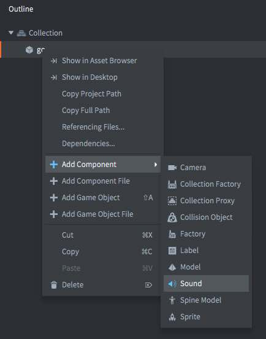
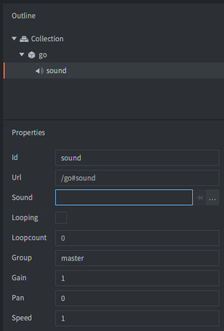
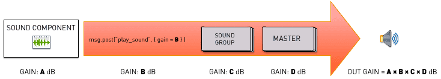
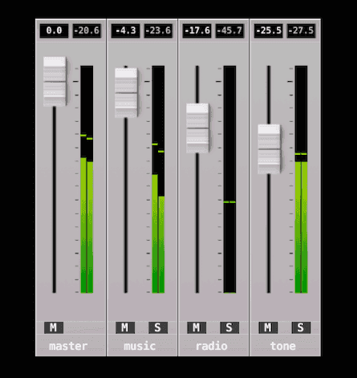
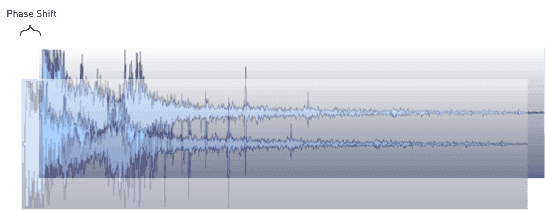

# Компонент Sound

Реализация звука в Defold проста, но мощна. Есть лишь две концепции, о которых необходимо знать:

Компоненты звука
: Эти компоненты содержат фактический звуковой контент и обеспечивают средства его воспроизведения.

Звуковые группы
: Каждый звуковой компонент может быть отнесен к _группе_. Группы предлагают простой и интуитивно понятный способ управления звуками, которые должны сочетаться друг с другом. Например, можно создать группу "sound_fx", тогда любой звук, принадлежащий к этой группе, может быть приглушен простым вызовом функции.

## Создание звукового компонента

Звуковые компоненты могут быть инстанцированы только на месте в игровом объекте. Создайте новый игровой объект, кликните на нем ПКМ и выберите <kbd>Add Component ▸ Sound</kbd>.



Созданный компонент имеет набор свойств, которые должны быть настроены:



*Sound*
: Звуковой файл проекта, в формате _Wave_ или _Ogg Vorbis_. Defold поддерживает звуковые файлы, сохраненные с битовой глубиной 16bit и частотой дискретизации 44100.

*Looping*
: Если опция отмечена, звук будет воспроизводиться _Loopcount_ раз или до явной остановки.

*Loopcount*
: Количество проигрываний зацикленного звука до остановки (0 означает, что звук будет проигрываться до явной остановки).

*Group*
: Имя звуковой группы, к которой должен принадлежать звук. Если оставить это свойство пустым, звук будет назначен встроенной группе "master".

*Gain*
: Задать усиление звука можно непосредственно в компоненте. Это позволяет легко настроить усиление звука, не возвращаясь в звуковую программу и не выполняя повторный экспорт. Подробнее о том, как рассчитывается усиление, см. ниже.

*Pan*
: Задать значение панорамирования для звука можно непосредственно в компоненте. Панорамирование должно быть значением между -1 (-45 градусов влево) и 1 (45 градусов вправо).

*Speed*
: Задать значение скорости звука можно непосредственно в компоненте. Значение 1.0 --- нормальная скорость, 0.5 --- половина скорости и 2.0 --- двойная скорость.


## Воспроизведение звука

При правильной настройке компонента Sound можно заставить его воспроизвести звук, вызвав [`sound.play()`](/ref/sound/#sound.play:url-[play_properties]-[complete_function]):

```lua
sound.play("go#sound", {delay = 1, gain = 0.5, pan = -1.0, speed = 1.25})
```

::: sidenote
Звук будет продолжать воспроизводиться, даже если игровой объект, к которому принадлежал компонент Sound, будет удален. Можно вызвать [`sound.stop()`](/ref/sound/#sound.stop:url), чтобы остановить звук (см. ниже).
:::
Каждое сообщение, отправленное компоненту, заставляет его воспроизводить другой экземпляр звука, пока доступный звуковой буфер не будет заполнен и движок не выведет ошибки в консоль. Рекомендуется реализовать какой-либо механизм фильтрации и группировки звуков.

## Остановка звука

Если необходимо остановить воспроизведение звука, можно вызвать [`sound.stop()`](/ref/sound/#sound.stop:url):

```lua
sound.stop("go#sound")
```

## Усиление



Звуковая система имеет 4 уровня усиления:

- Усиление, установленное для компонента звука.
- Усиление, установленное при запуске звука через вызов `sound.play()` или при изменении усиления голоса через вызов `sound.set_gain()`.
- Усиление, установленное для группы с помощью вызова функции [`sound.set_group_gain()`](/ref/sound#sound.set_group_gain).
- Усиление, установленное в группе "master". Может быть изменено с помощью `sound.set_group_gain(hash("master"))`.

Выходное усиление является результатом перемножения этих 4 усилений. По умолчанию коэффициент усиления везде равен 1.0 (0 dB).

## Звуковые группы

Любой звуковой компонент с указанным именем звуковой группы будет помещен в звуковую группу с этим именем. Если группа не указана, звук будет отнесен к группе "master". Также можно явно задать звуковому компоненту группу "master", что даст тот же эффект.

Имеется несколько функций для получения всех доступных групп, получения строки с именем, получения и установки усиления, среднеквадратичного (RMS, см. http://en.wikipedia.org/wiki/Root_mean_square) и пикового усиления. Также есть функция, позволяющая проверить, запущен ли музыкальный проигрыватель на целевом устройстве:

```lua
-- Если на этом iPhone/Android-устройстве воспроизводится звук, заглушить все
if sound.is_music_playing() then
    for i, group_hash in ipairs(sound.get_groups()) do
        sound.set_group_gain(group_hash, 0)
    end
end
```

Группы идентифицируются с помощью хэш-значения. Строку имени можно получить с помощью [`sound.get_group_name()`](/ref/sound#sound.get_group_name), которую можно использовать для отображения имен групп в инструментах разработки, например, в микшере для тестирования уровней групп.



::: important
Вы не должны писать код, который полагается на строковое значение звуковой группы, поскольку они недоступны в релизных сборках.
:::

Все значения линейны в диапазоне от 0 до 1.0 (0 dB). Для преобразования в децибелы просто используйте стандартную формул:

```math
db = 20 \times \log \left( gain \right)
```

```lua
for i, group_hash in ipairs(sound.get_groups()) do
    -- Строка имени доступна только в отладке. В релизе возвращается "unknown_*".
    local name = sound.get_group_name(group_hash)
    local gain = sound.get_group_gain(group_hash)

    -- Преобразовать в децибелы.
    local db = 20 * math.log10(gain)

    -- Получите RMS (среднеквадратичное значение коэффициента усиления). Левый и правый канал отдельно.
    local left_rms, right_rms = sound.get_rms(group_hash, 2048 / 65536.0)
    left_rmsdb = 20 * math.log10(left_rms)
    right_rmsdb = 20 * math.log10(right_rms)

    -- Получить пик усиления. Левый и правый отдельно.
    left_peak, right_peak = sound.get_peak(group_hash, 2048 * 10 / 65536.0)
    left_peakdb = 20 * math.log10(left_peak)
    right_peakdb = 20 * math.log10(right_peak)
end

-- Группе "master" задать усиление +6 dB (math.pow(10, 6/20)).
sound.set_group_gain("master", 1.995)
```

## Фильтрация звуков

Если игра воспроизводит один и тот же звук по событию, и это событие срабатывает часто, существует риск воспроизведения одного и того же звука два раза или более одновременно. Если это произойдет, звуки будут _сдвинуты по фазе_, что может привести к появлению очень заметных артефактов.



Самый простой способ решить эту проблему --- построить шлюз, который будет фильтровать звуковые сообщения и не позволит воспроизводить один и тот же звук более одного раза в течение заданного интервала времени:

```lua
-- Не допустить воспроизведение одного и того же звука в течение интервала "gate_time".
local gate_time = 0.3

function init(self)
    -- Store played sound timers in a table and count down each frame until they have been
    -- in the table for "gate_time" seconds. Then remove them.
    self.sounds = {}
end

function update(self, dt)
    -- Count down the stored timers
    for k,_ in pairs(self.sounds) do
        self.sounds[k] = self.sounds[k] - dt
        if self.sounds[k] < 0 then
            self.sounds[k] = nil
        end
    end
end

function on_message(self, message_id, message, sender)
    if message_id == hash("play_gated_sound") then
        -- Only play sounds that are not currently in the gating table.
        if self.sounds[message.soundcomponent] == nil then
            -- Store sound timer in table
            self.sounds[message.soundcomponent] = gate_time
            -- Play the sound
            sound.play(message.soundcomponent, { gain = message.gain })
        else
            -- An attempt to play a sound was gated
            print("gated " .. message.soundcomponent)
        end
    end
end
```

Чтобы использовать шлюз, достаточно отправить ему сообщение `play_gated_sound` и указать целевой звуковой компонент и усиление звука. Шлюз вызовет `sound.play()` с целевым звуковым компонентом, если шлюз открыт:

```lua
msg.post("/sound_gate#script", "play_gated_sound", { soundcomponent = "/sounds#explosion1", gain = 1.0 })
```

::: important
Не получится заставить шлюз слушать сообщения `play_sound`, поскольку это имя зарезервировано движком Defold. Вы получите неожиданное поведение, если будете использовать зарезервированные имена сообщений.
:::


## Манипулирование при выполнении
Звуками можно управлять во время выполнения с помощью ряда различных свойств (обращайтесь к [документации по API](/ref/sound/)). Следующими свойствами можно манипулировать с помощью `go.get()` и `go.set()`:

`gain`
: Усиление для звукового компонента (`number`).

`pan`
: Панорамирование звукового компонента (`number`). Панорамирование должно быть значением между -1 (-45 градусов влево) и 1 (45 градусов вправо).

`speed`
: Скорость звукового компонента (`number`). Значение 1.0 --- нормальная скорость, 0.5 --- половина скорости и 2.0 --- двойная скорость.

`sound`
: Путь к звуковому ресурсу (`hash`). Путь к ресурсу может быть использован для изменения звука с помощью `resource.set_sound(path, buffer)`. Пример:

```lua
local boom = sys.load_resource("/sounds/boom.wav")
local path = go.get("#sound", "sound")
resource.set_sound(path, boom)
```


## Конфигурация проекта

В файле *game.project* имеются несколько [настроек проекта](/manuals/project-settings#sound), относящихся к звуковым компонентам.

## Потоковое воспроизведение звука

Также возможно использование [потокового воспроизведения звуков](/manuals/sound-streaming).