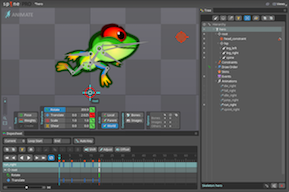
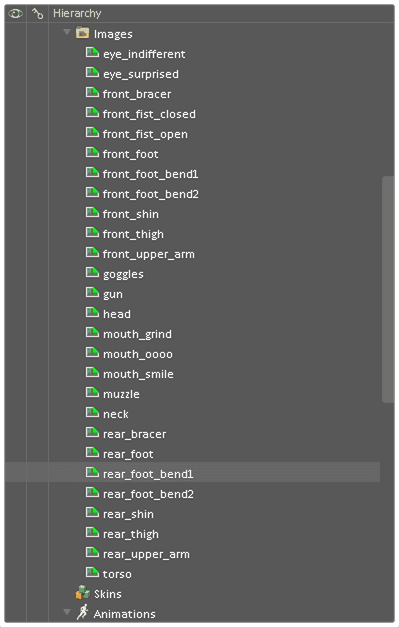

# Spine-анимация

_Spine_ это сторонний пакет анимации от компании Esoteric Software. Spine-анимация предоставляет поддержку двумерной скелетной анимации (смотри https://ru.wikipedia.org/wiki/%D0%A1%D0%BA%D0%B5%D0%BB%D0%B5%D1%82%D0%BD%D0%B0%D1%8F_%D0%B0%D0%BD%D0%B8%D0%BC%D0%B0%D1%86%D0%B8%D1%8F)

Это фундаментально иная техника в отличие от [покадровой анимации](/manuals/flipbook-animation), которая ближе к анимационной технике перекладки. В технике перекладки отдельные части анимируемого объекта (т.е. части тела, глаза, рот и так далее) движутся независимо между кадрами. Spine анимация позволяет вам выстраивать невидимые, виртуальные скелеты, состоящие из иерархии взаимосвязанных _костей_. Такой скелет или по-другому _риг_, далее анмириуется и отдельные изображения прикрепляются к его костям. Defold поддерживает анимации созданные либо экспортированные в [Spine JSON-формате](http://esotericsoftware.com/spine-json-format). Скелетная анимация получается очень плавной поскольку движок интерполирует положение каждой кости для каждого кадра. На практике это весьма удобно для анимирования персонажей и животных, но также отлично работает и для других типов объектов, например, верёвок, машин или листвы.

  {.inline}
  {.inline}

Defold реализует во время выполнения игры вычисление и анимацию выраженную в [Spine JSON-формате](http://esotericsoftware.com/spine-json-format).

Defold поддерживает большинство фич Spine анимаций, включая инверсную кинематику (ИК).

::: important
На данный момент, Defold не поддерживает ключи анимации, которые переворачивают кости относительно осей X или Y. Defold поддерживает Mesh анимацию, но только для костей, имеется в виду, что вы не можете анимировать отдельные вершины. Если нужно аниимировать отдельные вершины, можно сделать это посредством кости, которая на 100% привязана к данной вершине, анимируя эту кость. 
:::

::: important
Среда выполнения Spine реализованная в Defold поддерживает все фичи Spine версий 2.x. Среда выполнения предоставляет лишь ограниченную поддержку фич из Spine 3.x. Старайтесь задействоватья только фичи из Spine 2.x, чтобы быть уверенными в совместимости со средой выполнения в Defold!
:::

## Концепции

*Spine JSON файл данных*
: Данный файл содержит скелет, все имена под слоты изображений, скины и всю актуальную информацию об анимации. В этот файл не встраиваются никакие изображения. Создайте такой файл вашим любимым приложением для анимации.

*Spine сцена*
: Ресурс-файл Defold связывающий вместе Spine JSON файл данных и Defold файл атласа с изображениями, которые используются под заполнение слотов костей графикой.

*Spine модель*
: Комнонент _SpineModel_ вставляется в игровой объект чтобы вывести графику и аниммацию на экран. Компонент состоит из скелета-иерархии игровых объектов, указания, которую из анимаций проигрывать, указания, какой применять скин, а также он задает материал, который будет задействован для рендеринга модели. Смотрите [документацию по SpineModel](/manuals/spinemodel) для подробностей.

*Spine Нода*
: В случае GUI сцены для Spine-анимации, используйте Spine GUI ноды вместо компонентов типа Spine модель. Смотрите [документацию по GUI spine](/manuals/gui-spine) для подробностей.

## Инструменты анимации

Spine JSON файл данных поддерживаемый Defold может быть создан в ПО компании Esoteric Software - _Spine_. Дополнительно, _Dragon Bones_ умеет экспортировать в Spine JSON файл данных.

_Spine_ доступен здесь: http://esotericsoftware.com 


_Dragon Bones_ доступен здесь: http://dragonbones.com 


::: important
Обычно экспорт в Spine JSON файл данных в пакете _Dragon Bones_ работает без каких-либо проблем. Если версия ваших  Spine JSON файлов данных из _Dragon Bones_ не рендерится должным образом в Defold, мы рекомендуем использовать официальное ПО [Spine Skeleton Viewer](http://esotericsoftware.com/spine-skeleton-viewer), чтобы сначала проверить, что данные парсятся корректно. Если возникает проблема с экспортированными данными на этом этапе, Spine Skeleton Viewer может подсветить проблемы в JSON файле данных, например, указав на недостающие или некорректные поля.
:::


## Импортирование Spine персонажа и анимаций

Когда у вас имеется модель и анимации, которые вы создали в Spine, процесс их импорта в Defold достаточно прост:

- Экспортируйте Spine JSON версию данных анимации.
- Расположите экспортированный JSON файл где-нибудь в иерархии вашего проекта.
- Добавьте все изображения связанные с моделью где-нибудь в иерархии вашего проекта.
- Создайте _Atlas_ файл и добавьте туда все изображения. (Смотрите [документацию по 2D графике](/manuals/2dgraphics) чтобы детальнее понять, как создаются атласы, а также смотрите ниже ряд предостережений)


Если вы работаете в _Dragon Bones_, просто выберите *Spine* в качестве выходного типа данных. Также выберете *Images* как тип изображения. Таким образом, экспортируется *.json* файл и все необходимые изображения в одну папку. Добавьте далее содержимое этой папки в Defold как в шагах выше.


Когда у вас есть данные анимации и файлы изображений импортированные и установленные в Defold, вам необходимо создать файл-ресурс _Spine scene_:

- Создайте файл-ресурс _Spine scene_ (Выберите <kbd>New ▸ Spine Scene File</kbd> из главного меню)
- Новый файл откроется в редакторе Spine сцены.
- Установите *Свойства*.

{srcset="images/spine/spinescene@2x.png 2x"}

Spine Json
: Spine JSON файл, который будет использоваться как источник данных анимации и костей

Atlas
: Атлас содержащий изображения именованные соответственно Spine файлу данных.

## Создание компонентов SpineModel

Когда у вас есть все нужные импортированные данные и ваш ресурс-файл _Spine scene_ готов, вы можете создать компонент SpineModel. Смотрите [документацию по SpineModel](/manuals/spinemodel) для подробностей.

## Создание Spine GUI нод

Вы также можете использовать Spine анимации в GUI сценах. Смотрите [документацию по GUI spine](/manuals/gui-spine) для подробностей.

## Проигрывание анимаций

Для запуска анимации вашей модели, просто вызовите функцию [`spine.play_anim()`](/ref/spine#spine.play_anim):

```lua
function init(self)
    -- Проиграть анимацию "walk" для компонента "spinemodel" и смешать её относительно предыдущей
    -- анимации первые 0.1 секунд
    local anim_props = { blend_duration = 0.1 }
    spine.play_anim("#spinemodel", "run", go.PLAYBACK_LOOP_FORWARD, anim_props)
end
```

{srcset="images/animation/spine_ingame@2x.png 2x"}

Если анимация проигрывается с любым режимом вида `go.PLAYBACK_ONCE_*` и вы предоставили фуникцию обратного вызова в метод `spine.play_anim()`, функция сработает по окончании анимации. Смотрите ниже про информацию о функциях обратного вызова.

### Анимация курсором

В дополнении к использованию метода `spine.play_anim()` для более продвинутой анимации модели компоненты типа *Spine Model* предоставляют свойство "cursor" которым можно управлять с помощью вызова `go.animate()` (более подробно в разделе [анимация свойств](/manuals/property-animation)):

```lua
-- Установить анимацию для Spine модели, но не проигрывать её.
spine.play_anim("#spinemodel", "run_right", go.PLAYBACK_NONE)

-- Выставить курсор в 0
go.set("#spinemodel", "cursor", 0)

-- Сделать медленный твининг курсора между 0 и 1 в режиме пинг-понг со смягчением in-out
go.animate("#spinemodel", "cursor", go.PLAYBACK_LOOP_PINGPONG, 1, go.EASING_INOUTQUAD, 6)
```

::: important
При анимировании или установке позиции курсора, события временной шкалы могут срабатывать не так, как ожидается.
:::

### Иерархия костей

Отдельные кости в Spine скелете представлены в виде игровых объектов. В области *Outline* компонента Spine model, видна вся иерархия. Вы можете видеть имя каждой кости и её место в иерархии скелета.

{srcset="images/animation/spine_bones@2x.png 2x"}

Зная имя кости, вы можете получить идентификатор экземпляра кости во время выполнения игры. Функция [`spine.get_go()`](/ref/spine#spine.get_go) возвращает идентификатор заданной кости и вы можете, например, установить другие игровые объекты дочерними для данного анимируемого игрового объекта:

```lua
-- Прикрепить игровой объект пистолета к руке героини
local hand = spine.get_go("heroine#spinemodel", "front_hand")
msg.post("pistol", "set_parent", { parent_id = hand })
```

### События таймлайна

Spine анимации могут активировать временные события, посылая сообщения в определенные моменты. Они весьма удобны для событиый, которые должны произойти синхронно с вашей анимацией, например, проигрывание звука шагов, испускание эффектов частиц, присоединение или отсоединение объектов от иерархии костей или что-либо другое, что вы хотели бы выполнить.

События добавляются в ПО Spine и визуализируются в таймлайне воспроизведения:


Каждое событие имеет ссылку с именем идентификатора (в примере выше - "bump"") и каждый экземпляр события на таймлайне может содержать дополнительную информацию:

Integer
: Числовое значение выраженное типом integer.

Float
: Числовое значение с плавающей точкой.

String
: Строковое значение.

Когда анимация проигрывается и наступают события, сообщение `spine_event` посылаются обратно в компонент того скрипта, что вызвал `spine.play`. Данные сообщения содержат пользовательские числа и строки, встроенные в это событие, а также несколько дополнительных полей, которые также могут быть полезны: 

`t`
: Количество секунд, прошедших после первого кадра анимации.

`animation_id`
: Имя анимации в hash-форме.

`string`
: Переданное строковое значение, в hash-форме.

`float`
: Переданное числовое значение с плавающей точкой.

`integer`
: Предоставленное целочисленное значение.

`event_id`
: Идентификатор события, в хеш-форме.

`blend_weight`
: Указывает, какой процент от анимации будет использован в бленде в текущий момент времени. 0 означает, что ничего из текущей анимации не является частью бленда, 1 означает, что бленд состоит из текущей анимации на 100%.

```lua
-- Spine-анимация содержит события, которые используются для проигрывания звуков синхронно с анимацией.
-- Эти события прибывают сюда в виде сообщений
function on_message(self, message_id, message, sender)
  if message_id == hash("spine_event") and message.event_id == hash("play_sound") then
    -- Проиграть звук анимации. Пользовательские данные события содержат компонент звука и уровень усиления
    local url = msg.url("sounds")
    url.fragment = message.string
    sound.play(url, { gain = message.float })
  end
end
```

## Функции обратного вызова по завершению

Функция Spine-анимации `spine.play_anim()` поддерживают опциональные функции обратного вызова в качестве последнего переданного аргумента. Такие переданные функции будут вызваны когда анимация проиграется до конца. Функции никогда не будут вызваны для зацикленных анимаций, а также для анимаций, которые отменили вручную вызовом `spine.cancel()`.  Функция обратного вызова может быть использована для активации других событий по завершению анимации или для склеивания нескольких анимаций в одну цепочку.

```lua
local function anim_done(self)
    -- анимация проиграна, сделаем что-нибудь полезное...
end

function init(self)
        -- Проиграть анимацию "walk" для компонента "spinemodel" и смешать её относительно предыдущей
        -- анимации первые 0.1 секунд, затем вызовем функцию обратного вызова
    local anim_props = { blend_duration = 0.1 }
    spine.play_anim("#spinemodel", "run", go.PLAYBACK_LOOP_FORWARD, anim_props, anim_done)
end
```

## Методы проигрывания

Анимации могут быть проиграны либо однократно либо зацикленно. Как именно проигрывается анимация определяется режимом проигрывания:

* go.PLAYBACK_NONE
* go.PLAYBACK_ONCE_FORWARD
* go.PLAYBACK_ONCE_BACKWARD
* go.PLAYBACK_ONCE_PINGPONG
* go.PLAYBACK_LOOP_FORWARD
* go.PLAYBACK_LOOP_BACKWARD
* go.PLAYBACK_LOOP_PINGPONG

Режим pingpong проигрывает анимацию сначала вперед, затем в обратном порядке.

## Предостережения по атласам
Данные анимации ссылаются на изображения, задействованные для костей по имени с убранным суффиксом расширения файла. Вы добавляете изображения в ваш Spine проект в ПО Spine и они выстраиваются в иерархию в блоке *Images*:



Данный пример показывает расположение файлов в плоской структуре. Однако, возможно организовать файлы в подпапки и ссылки на файлы отразят таку структуру. Например, файл *head_parts/eyes.ong* на диске будет иметь ссылку на него как *head_parts/eyes* когда вы используете это изображение для слота. Также, это имя будет использовано и в экспортированном JSON файле, поэтому для создаваемого атласа изображений в Defold, все имена должны совмещаться с анимациями атласа. 

При выборе <kbd>Add Images</kbd> Defold автоматически создаст группы анимаций с тем же именем как и добавленные файлы, но с вырезанным суффиксом расширения файла. Поэтому, после добавленного файла *eyes.png* его анимационная группа может быть доступна по ссылке с именем "eyes". Это работает только для имен файлов, но не путей.

Так что следует сделать, если ваша анимация ссылается как "head_parts/eyes"? Легкий способ добиться совпадения - это добавить анимационную группу (правый клик по корневой ноде в области Atlas *Outline* и далее слудет выбрать *Add Animation Group*). Затем вы можете называть группу "head_parts/eyes" (это просто имя, а не путь, так что сиволы `/` вполне легальны) и затем добавить файл "eyes.png" в эту группу.

{srcset="images/spine/atlas_names@2x.png 2x"}

Далее для анимирования вашей Spine модели, пожалуйста прочтите [документацию по анимации](/manuals/animation).
