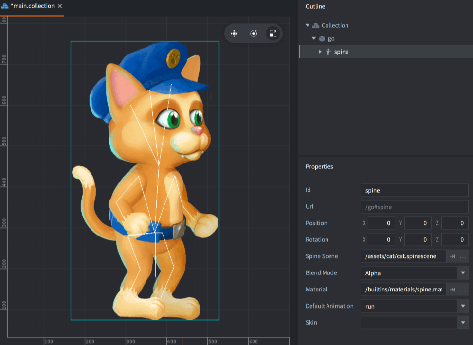

# Компонент Spine Model

Компонент Spine Model используется для оживления скелетной _Spine_-анимации.

## Создание Spine-модели

Выделите игровой объект для размещения в нем нового компонента:

- Либо создайте компонент на месте (<kbd>кликните ПКМ</kbd> на игровом объекте и выберите <kbd>Add Component ▸ Spine Model</kbd>).

- Либо сперва создайте его в файле (<kbd>кликните ПКМ</kbd> в подходящем расположении в браузере *Assets*, затем выберите <kbd>New... ▸ Spine Model</kbd> из контекстного меню), после чего добавьте этот файл к игровому объекту, <kbd>кликнув ПКМ</kbd> по игровому объекту и выбрав <kbd>Add Component File</kbd>).

## Свойства Spine-модели

Помимо свойств *Id*, *Position* и *Rotation* существуют следующие специфичные для компонента свойства:

*Spine scene*
: Укажите в этом свойстве файл Spine Scene, созданный раннее.

*Blend Mode*
: Если необходимо использовать режим наложения, отличный от стандартного `Alpha`, измените это свойство.

*Material*
: Если необходимо визуализировать модель с пользовательским материалом, измените это свойство.

*Default animation*
: Укажите в этом свойстве анимацию в качестве стартовой для этой модели.

*Skin*
: Если модель имеет скины, выберите один в качестве стартового.

Теперь Spine-модель можно просматривать в редакторе:

{srcset="images/spinemodel/spinemodel@2x.png 2x"}

### Режимы наложения
:[blend-modes](../shared/blend-modes.md)

## Манипулирование при выполнении

Манипулировать Spine-моделями во время выполнения можно с помощью ряда различных функций и свойств (обращайтесь к [документации по API](/ref/spine/)).

### Анимация во время выполнения

Defold предоставляет мощную поддержку для управления анимацией во время выполнения. За подробностями обращайтесь к [руководству по анимации Spine-моделей](/manuals/spine).

### Изменение свойств

Spine-модель также имеет ряд различных свойств, которыми можно манипулировать с помощью `go.get()` и `go.set()`:

`animation`
: Текущая анимация модели (`hash`, только для чтения). Анимация изменяется с помощью `spine.play_anim()` (см. [руководство по Spine-анимации](/manuals/spine)).

`cursor`
: Нормализованный курсор анимации (`number`).

`material`
: Материал Spine-модели (`hash`). Это свойство можно изменить с помощью свойства ресурса Material и `go.set()`. За примером обращайтесь к [справочнику по API](/ref/spine/#material).

`playback_rate`
: Скорость воспроизведения анимации (`number`).

`skin`
: Текущий скин компонента (`hash`).

## Константы материала



`tint`
: Цветовой оттенок Spine-модели (`vector4`). Для представления оттенка с компонентами x, y, z и w, соответствующими красному, зеленому, синему и альфа оттенкам, используется тип vector4.

## Конфигурация проекта

В файле *game.project* имеются несколько [настроек проекта](/manuals/project-settings#spine), относящихся к Spine-моделям.
